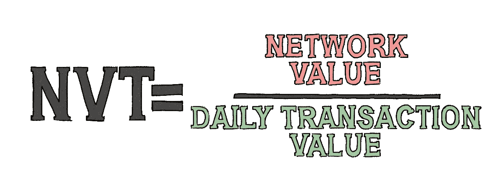
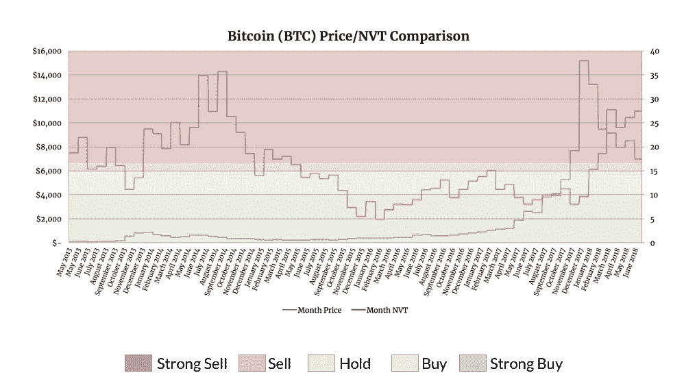
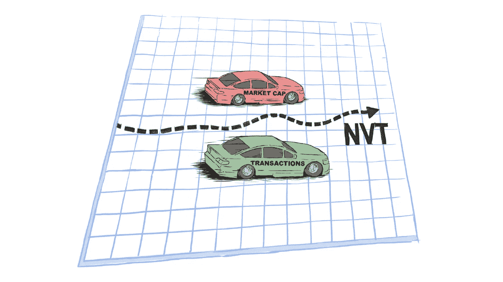

# NVT 比率

> 原文：<https://medium.com/hackernoon/network-value-to-transactions-ratio-cryptocurrencys-answer-to-p-e-c3743e700929>

## 加密货币的市盈率答案

你有没有想过如何实际衡量比特币的真实价值？如果知道以太坊目前的价格偏低，而且有可能会大幅升值，这难道不是有用的信息吗？也许你正在寻找出售比特币的机会，但不知道现在是否是时候。在传统金融中，有现成的工具来提供对传统股票决策的洞察力，但这些工具通常不会涉及或应用于加密。然而，像[Lvl.co](http://lvl.co/?r=CxEGyn1x)这样的算法指数交易平台正在努力将这一有价值的比率落实到他们的指数基金中，以使[加密货币](https://hackernoon.com/tagged/cryptocurrency)交易者获得更好的回报。

## NVT 如何作为一种评估标准

网络价值与交易比率，或“NVT”，为我们提供了如何在一个行业中为硬币分配公平价值的洞察力，在这个行业中这样做可能非常困难，如果不是不可能的话。这是分析师和积极投资者目前用来衡量和适当评估加密资产的关键指标之一。这一颇具洞察力的指标的创造者威利·吴(Willy Woo)在他的 [**网站**](https://woobull.com/nvt-signal-a-new-trading-indicator-to-pick-tops-and-bottoms/) 上，对 NVT 作为加密货币主要遵循比率的重要性有一些令人着迷的见解。他继续说:

> “当比特币的 NVT 很高时，这表明其网络估值超过了其支付网络上传输的价值。当网络高速增长，投资者将其视为高回报投资时，或者当价格处于不可持续的泡沫中时，这种情况就会发生。”

NVT 是一种等价比较加密货币未知内在价值的方法。当我们观察 NVT 线与其正常范围的关系时，我们可以判断比特币何时被高估或低估。在一年前的一次采访中，吴宇森说:

> “在 20 世纪 90 年代，我们不知道如何评估互联网股票的价值。市盈率极高，人们不理解公司的零边际成本。…在比特币中，我们知道交易吞吐量，但我们不知道它的收益，因为它不是一家公司。这是我们拥有的最接近它的代理。真的就是这样。如果比特币是一家支付公司，让我们来衡量一下它的吞吐量和估值。"

大多数成功的传统股票投资者都熟悉市盈率。简而言之，通过将一家公司的当前市场价格除以其当前每股收益，市盈率可以让投资者衡量一只股票的增长潜力。更重要的是，它可以根据一家公司当前的市场地位，洞察该公司是被低估、被合理估值还是被高估。

## 如何计算 NVT

让我们更详细地看看这个公式:

这种计算很简单，只需要两个变量就可以解决，如果我们将它与单个硬币自身的历史价值或同一时间段内其他硬币的价值进行比较，就会得到一个很有说服力的数字。

我们用比特币做一个快速的样本，以 2018 年 6 月 10 日为例。以下是来自 [**共同指标**](https://coinmetrics.io/) 的一些指标:

*   *2018 年 6 月 10 日市值(网络价值):1.28128 亿美元*
*   *2018 年 6 月 10 日交易量(美元):7172614294 美元*
*   ***6/10/18 NVT(市值/成交量):17.86***

我们可以看到，用比特币的市值除以这 24 小时的交易量， ***我们得到的 NVT 值为 17.86。*** 精彩。

现在，让我们给这个数字一些实际的意义。某一天 17.86 的 NVT 与比特币历史平均 NVT 比率相比如何？注意—此数据始于 2013 年 5 月的第一个整月数据:

*   *历史市值中位数(网络价值):732911 万美元*
*   *历史交易量中位数(美元):666，703，284 美元*
*   ***NVT 中值(市值/交易量):13.70****

******* *请注意，为了进行最精确的统计评估，平均 NVT 是作为大约六年的比特币数据的中间值来计算的。*

我们可以看到，CoinMetrics 所有单个比特币每日数据的总体中值 NVT 约为 13.70，这使得我们在 2018 年 6 月 10 日的计算中发现的 17.86 NVT 值比其平均历史利率略高 30.4%。

## 如何解读 NVT

如果我们打算购买，我们希望看到与市值相比更高的交易量，因为这将表明目前世界上有令人信服的大量公用事业(交易)正在使用。

以我们的比特币为例，我们可以看到，6 月 10 日的交易量没有达到我们在当前市值水平下希望看到的水平。因此，该值将是 7，499.55 美元的价格被高估的指标。请记住，这只是一个特定的一天，与每日价格变化相比，这些数字每天都可能发生巨大变化。

值得一提的是，在这里的[级别](http://lvl.co/?r=CxEGyn1x)，我们从 CoinMetrics 获得我们的统计数据，coin metrics 在其网站的[常见问题](https://coinmetrics.io/faq/)上有一个免责声明:

> “……其他对 NVT 的估计仅针对比特币，并使用 blockchain.info 的估计量，而不是非常直接的排除。因此，Blockchain.info 估计在链上传输的美元量比我们的低 5-6 倍，从而导致更高的 NVT。”

值得注意的是这个增量，因为 Woo 的网站通常会有平均三位数的比特币 NVT 值，而 [Level 的](http://lvl.co/?r=CxEGyn1x)计算值要低得多。任何一种数据源都是可以接受的，并且任何一种分析中的线条都应该随着时间的推移而相应地起伏。

让我们来看看 Coinmetrics 的 NVT 月度数据，看看比特币的价格是如何与之相关的:

在为比特币创建这个模型时，我在整合过程中必须考虑很多因素，在完成后我也注意到了很多事情:

*   相应的买入区、持有区和卖出区是根据历史结合一些数学公式制定的。请记住，这些颜色分组仅适用于与图表中右侧 y 轴相对应的橙色 NVT 线。这些区域都是基于比特币历史 NVT 值的中间值，正如我们在上面了解到的，目前大约为 13.7。我知道我想要对称地使保持区在两边以相同的百分比稍微高于和低于这个数字。我也能够通过这个时间尺度注意到趋势，表明每当橙色线落在这个中间值 13.7 上下 7.5%以内时，价格几乎没有变动。这给了我一个范围约 15%的黄色等待区，同样的 15%窗口用于创建其他区域。
*   我最初考虑每天放大图点，但是有太多与价格无关的异常 NVT 峰值。相反，我决定使用每个月的平均值作为绘图点，我们可以看到比特币每月价格(蓝色)与其每月网络价值交易比率(橙色)相比，随着时间的推移出现了一些非常显著且具有统计意义的变化。
*   从整体历史角度来看，我们可以看到我们的橙色 NVT 线有一半不到的时间在“买入”或“强烈买入”区，一半不到的时间在“卖出”或“强烈卖出”区，其余时间在持有区。但是，如果自 2013 年 5 月以来，比特币的价值已经上涨了 60 倍，那么在 NVT 的历史图表中，买入和卖出信号的数量怎么可能相等呢？嗯，这就是比特币和加密货币作为一个仍处于起步阶段的市场的魅力所在。从历史上看，当比特币的 NVT 价值位于买入区时，价格波动的上行空间要比卖出区的下行空间大得多。对 NVT 的怀疑者来说，可以认为这是整个公式的一个缺陷，表明当 NVT 远远高于中值平均水平时，它是不可靠和不可预测的。不可否认的是，当图表处于买入区时，与价格大幅上涨有很强的相关性相比，相关性要差得多。
*   我们可以看到，当比特币的价格在 2013 年中后期爆炸时，这与它的 NVT 首次进入绿色购买区相关。当 NVT 从 2015 年 9 月开始再次进入绿色并一直持续到 2017 年 12 月时，我们可以在更大的范围内再次证实这一点。比特币的 NVT 区间持续了 28 个月，提供了买入信号，其价格从 250 美元以下飙升至 19000 美元以上。

## 使用 NVT 的优势

没有完美的解决方案来准确评估没有真实公司陈述、资产负债表或季度收益报告的加密资产。但是，使用 NVT 作为衡量标准有几个原因:

*   NVT 可以是一个很好的指标，相对价值相比，其他硬币和个别硬币的历史价格的基础上，他们的平均时间。
*   可以计算最受欢迎的交易硬币的 NVT，因为这些硬币有自己的历史市值和记录的交易数量。

## 别忘了——它仍然是加密的

当然，这些年来有几条新闻对比特币价格的月度涨跌起到了历史性的作用。无论我们在这里的[级别](http://lvl.co/?r=CxEGyn1x)多么热爱网络价值与交易比率，它都不是价值的唯一衡量标准。有时候，NVT 完全不能作为一个可靠的硬币价格指标，特别是在短期内。

由于加密货币的价值受人类投机的影响如此之大，依靠数学比率来预测基本上由其投资者独家控制的价格线可能会非常困难。任何人，如果仅仅依靠 NVT 比率、MACD 和 RSI 指标、布林线信号或任何其他单个指标作为价格方向的唯一指标，而不了解所涉及的风险或权衡其他基本面因素，作为交易者最终失败的可能性很大。

我们将 NVT 视为投资时非常有用的辅助研究工具。这个指标不是简单地低买高卖以轻松获利的终极关键，但我们已经看到证据表明，NVT 线已经领先于许多双向的主要市场价格变化。当我们看到一个比率的证据时，它往往与价格有很强的长期相关性，并往往预示着未来价格的方向(在长期基础上)，这是一个不仅值得理解，而且值得认真关注的基本指标。

***我在*** [***水平***](http://lvl.co/?r=CxEGyn1x) ***写了深入的加密货币分析，用于加密的被动投资工具。参见我们在做的***[***Lvl.co***](http://lvl.co/?r=CxEGyn1x)***以及参见我们的其他分析在*** [***我们的杂志***](https://medium...m_content=all) ***。如果你喜欢你所看到的，给这篇文章 50 个掌声！如果你讨厌它，就用 49 表示你的不满。***

*本文及相关内容仅供参考。这不应被视为投资建议，你应该咨询财务顾问，并在进行任何投资之前进行自己的研究和尽职调查。在引用证券或商品时，仅用于说明目的，并不意味着对证券或商品分类的任何立场。就提供或讨论的* [*级*](http://lvl.co/?r=CxEGyn1x) *服务而言，这些服务仅可用于* [*级*](http://lvl.co/?r=CxEGyn1x) *白名单资产。*