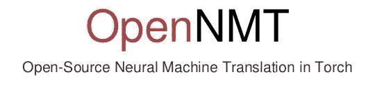
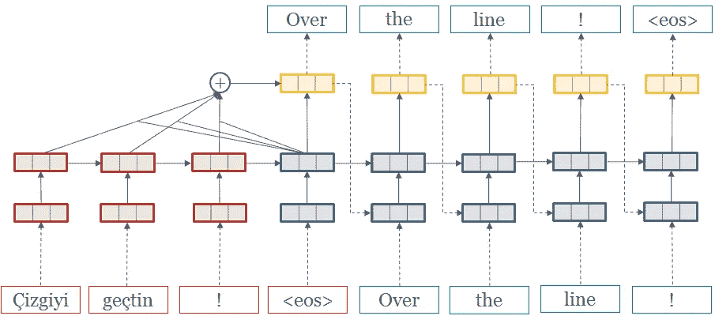
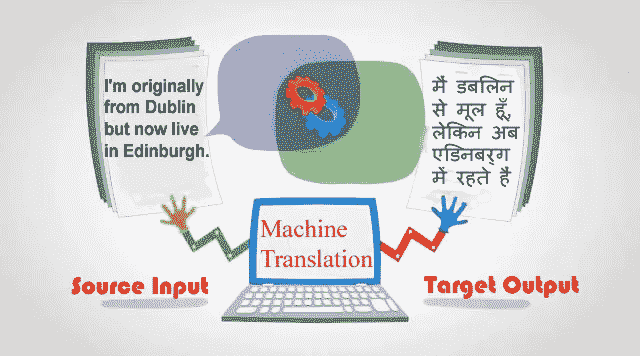

# 神经机器翻译:使用开放 NMT 训练翻译模型

> 原文：<https://medium.com/hackernoon/neural-machine-translation-using-open-nmt-for-training-a-translation-model-1129a3a2a2d3>

## 学习任何语言对之间翻译的完整指南


*无耻插件:我们是一个* [*机器学习数据标注平台*](https://dataturks.com) *让你超级轻松的* [*构建 ML 数据集*](https://dataturks.com) *。只需上传数据，邀请您的团队，快速构建数据集。*

这个博客旨在提供一个循序渐进的教程来学习从一种给定的语言到任何目标语言的翻译。我们为手头的任务使用的方法完全是受开源库的激励，开源库的 pyTorch 实现可以用 python 语言获得，称为开放 NMT(开源神经机器翻译)。它旨在方便深度学习爱好者在机器翻译、摘要、图像到文本转换、形态学等领域实现他们的想法。

虽然 Google Translate、Microsoft 等公司有很多高效的翻译系统，但它们要么不是开源的，要么在限制性许可下是封闭的。其他像 tensorflow-seq2seq 模型这样的库也是为了这个目的而存在的，但是作为研究代码。开放 NMT 不仅是开源的，而且还提供大量文档化、模块化和可读的代码，用于模型的快速训练和高效运行。



我们进一步阐述了建立库和使用工具包训练你自己的定制翻译系统的详细指南。这个博客处理从给定的英语文本生成印地语翻译。

# 开放式 NMT 建筑的简要概述；

开-NMT 是根据纪尧姆·克莱因等人的研究，在这里发现了。



根据该论文，揭示了关于其架构的以下细节:

> OpenNMT 是一个用于训练和部署神经机器翻译模型的完整库。该系统是哈佛大学开发的 seq2seq-attn 的继任者，为了提高效率、可读性和通用性，已经完全重写。它包括普通的 NMT 模型，以及对注意力、门控、堆叠、输入馈送、正则化、波束搜索和所有其他为最先进的性能所必需的选项的支持。
> 
> 主系统在 Lua/Torch 数学框架中实现，并且可以使用 Torch 的内部标准神经网络组件轻松扩展。脸书研究所的 Adam Lerer 也用同样的 API 对它进行了扩展，以支持 Python/PyTorch 框架。

# 所需模块的设置

训练你的自定义翻译系统所需要的主要软件包本质上是 pyTorch，其中实现了开放 NMT 模型。

当然，第一步是克隆 OpenNMT-py 存储库:

```
git clone https://github.com/OpenNMT/OpenNMT-py
cd OpenNMT-py
```

这里有一个 requirements.txt 文件来收集所有需要的包:

```
six
tqdm
torch>=0.4.0
git+[https://github.com/pytorch/text](https://github.com/pytorch/text)
future
```

由于 PyTorch 一直在不断发展，我们建议派生 PyTorch 0.4 版本，以确保代码库的稳定性能。

运行以下命令自动收集先决条件依赖项:

```
pip install -r requirements.txt
```

# 收集数据集

数据集包括源和目标语言文件的并行语料库，每行包含一个句子，使得每个标记由空格分隔。

对于我们的教程，我们使用存储在不同文件中的英语和印地语句子的平行语料库。这些数据是从各种来源收集来的，然后加以综合。然后重新排列数据，以创建一组文件，如下所示:

*   `src-train.txt : Training file containing 10000 English (Source Language) sentences`
*   `tgt-train.txt : Training file containing 10000 Hindi (Target Language) sentences`
*   `src-val.txt : Validation data consisting of 1000 English (Source Language) sentences`
*   `tgt-val.txt : Validation data consisting of 1000 Hindi (Target Language) sentences`
*   `src-test.txt : Test Evaluation data consisting of 1000 English (Source Language) sentences`
*   `tgt-test.txt : Test Evaluation data consisting of 1000 Hindi (Target Language) sentences`

以上所有文件都放在/data 目录中。

注意:在本教程中，我们使用了有限的数据进行解释和实验。然而，建议使用包含数百万个句子的大型语料库，以确保独特单词的大量词汇，从而更好地学习和接近人类的翻译。

验证数据用于评估模型的每一步，以确定收敛点。它通常应该包含最多 5000 个句子。

以下示例显示了文本数据在相应文件中的排列方式:

```
Source Files :
They also bring out a number of Tamil weekly newspapers.
They are a hard — working people and most of them work as labourers.
Tamil films are also shown in the local cinema halls.
There are quite a large number of Malayalees living here.Target Files :तमिल भाषा में वे अनेक समाचार पत्र व पत्रिकाएं भी निकालते हैं .
ये लोग काफी परिश्रमी हैं , अधिकांश लोग मजदूरी करते हैं .
स्थानीय सिनेमा हालों में तमिल चलचित्रों का प्रदर्शन अक्सर किया जाता है .
मलयालम लोगों की बहुत बडी संख्या है .
```

# 预处理文本数据:

执行以下命令来预处理训练和验证数据，提取用于训练的特征，并为模型生成词汇文件。

```
python preprocess.py -train_src data/src-train.txt -train_tgt data/tgt-train.txt -valid_src data/src-val.txt -valid_tgt data/tgt-val.txt -save_data data/demo
```

# 培训翻译模型:

训练的主要命令使用起来非常简单。本质上，它接受一个数据文件和一个保存文件作为输入。

使用的默认模型总结如下:

```
NMTModel(
  (encoder): RNNEncoder(
    (embeddings): Embeddings(
      (make_embedding): Sequential(
        (emb_luts): Elementwise(
          (0): Embedding(20351, 500, padding_idx=1)
        )
      )
    )
    (rnn): LSTM(500, 500, num_layers=2, dropout=0.3)
  )
  (decoder): InputFeedRNNDecoder(
    (embeddings): Embeddings(
      (make_embedding): Sequential(
        (emb_luts): Elementwise(
          (0): Embedding(20570, 500, padding_idx=1)
        )
      )
    )
    (dropout): Dropout(p=0.3)
    (rnn): StackedLSTM(
      (dropout): Dropout(p=0.3)
      (layers): ModuleList(
        (0): LSTMCell(1000, 500)
        (1): LSTMCell(500, 500)
      )
    )
    (attn): GlobalAttention(
      (linear_in): Linear(in_features=500, out_features=500, bias=False)
      (linear_out): Linear(in_features=1000, out_features=500, bias=False)
      (softmax): Softmax()
      (tanh): Tanh()
    )
  )
  (generator): Sequential(
    (0): Linear(in_features=500, out_features=20570, bias=True)
    (1): LogSoftmax()
  )
)
```

```
python train.py -data data/demo -save_model demo-model
```

上面的命令将运行一个默认模型，包括一个两层 LSTM，拥有 500 个隐藏单元，用于编码器和解码器。要指定将 GPU 用于训练，请在上面的命令中指定-gpuid 参数(比如-gpuid 1 用于指定用法 og GPU 1)。

典型地，默认模型持续到 100000 个时期，因此每 5000 个时期后保存一个检查点。所以如果你的模型收敛了，验证精度更早的达到一个稳定点，你就可以停止进一步的训练，使用之前保存的检查点。

# 翻译您自己的数据:



可以执行下面的命令来对源语言(英语)中的看不见的文本执行推断步骤，并生成相应的预测翻译:

```
python translate.py -model demo-model_XYZ.pt -src data/src-test.txt -output pred.txt -replace_unk -verbose
```

这将生成翻译后的输出，并将预测存储到名为`pred.txt`的文件中。

该模型在 NVIDIA GEFORCE 2GB GPU 上训练了 10000 个纪元。在 CPU 上进行训练将需要非常高的计算成本，因此建议使用高端 GPU 以更快的速度训练具有大量数据的模型。

# 模型的预测示例:

下面显示的是在训练模型后为相应的英语句子生成的印地语翻译的几个示例。

```
Trees are capable of absorbing more of carbon dioxide, thus maintaining equilibrium in the air composition .PREDICTED : पेडों में कार्बन डाईआक्साइड के बुरे लोग इस प्रकार पेड - पौधे का प्रयोग करने के लिए मौजूद हैं .

He has hope that the gods will throw good things from the heavens , upon them .PREDICTED :वे उमीद है कि वे घर से कुछ नहीं बची हैं .The Buddhist temple , the Dalai Lama Palace and dispensary of Tibet are tourist attractions here .PREDICTED :यहां का बौद्ध मंदिर दलाई लामा का आवास तथा तिब्बती औषधालय स्थानिय लोगो में मिलता है .He lets the hair grow long.PREDICTED : वह अपने बढा लेता है .
```

如上所述，由于用于任何实时翻译的训练数据较少，预测还不够好。为了执行接近真实世界的翻译，该模型必须在大量词汇和大约一百万个句子上进行训练，这将同时涉及硬件要求和训练时间方面的大量计算成本。

# 评估您训练的模型:

## 双语评估替角分数

双语评估替角分数(BLEU Score)是指通过将生成的句子与参考句子进行比较来评估机器翻译系统的评估指标。

在该比较中完全匹配导致 BLEU 分数为 1.0，而完全不匹配导致 BLEU 分数为 0.0。

BLEU 评分是一个普遍适用的评估翻译模型的标准，因为它独立于语言，易于解释，并且与人工评估高度相关。

BLEU 评分是在 Kishore Papineni 等人进行的一项研究中提出的。 [BLEU:一种自动评估机器翻译的方法](http://www.aclweb.org/anthology/P02-1040.pdf)。

在对与参考文本中的 n 元语法匹配的候选翻译中的 n 元语法进行计数之后，生成 BLEU 分数。在这种比较中不考虑词序。

那么我们如何定义一个 n-gram 呢？假设一个一元单词或一元单词表示每个单独的单词，一个二元单词表示每一对单词。

计算 BLEU 分数的代码，给定你预测的候选文件和 GitHub 资源库中给定的参考文件，博客末尾提供了 whic 的链接。

下面是我们如何运行代码来评估模型:

```
python calculatebleu.py "pred.txt" "tgt-test.txt"
```

其中 pred.txt 是我们的候选预测翻译文件，tgt-test.txt 是包含目标语言的实际翻译的文件。

由于我们用 10k 个句子生成的数据词汇仅包含几千个单词，我们在预测中得到的 BLEU 分数相当差(0.025)。

注意:由于我们的主要目的集中在阐述开放 NMT 的使用，我们只使用了一个小数据集，这就是为什么我们的预测翻译结果的评估是一个糟糕的 BLEU 分数。大约 0.5 的 BLEU 分数意味着相当好的翻译。通过增加几千个例子来增加训练词汇，从而提高分数。

然而，Open-NMT 允许我们在任何一对语言之间训练我们自己的自定义翻译器模型，并且使用起来非常方便。

用于生成 BLEU 分数的代码和用于训练我们的模型的数据集已经在这里提供[。](https://github.com/DataTurks-Engg/Neural_Machine_Translation)

如果您有任何疑问或建议，我很乐意倾听。请在 abhishek.narayanan@dataturks.com 给我写信。

*无耻插件:我们是一个数据注释平台，让你建立 ML 数据集超级容易。只需上传数据，邀请您的团队，快速构建数据集。* [***快来看看吧！***](https://dataturks.com/index.php)