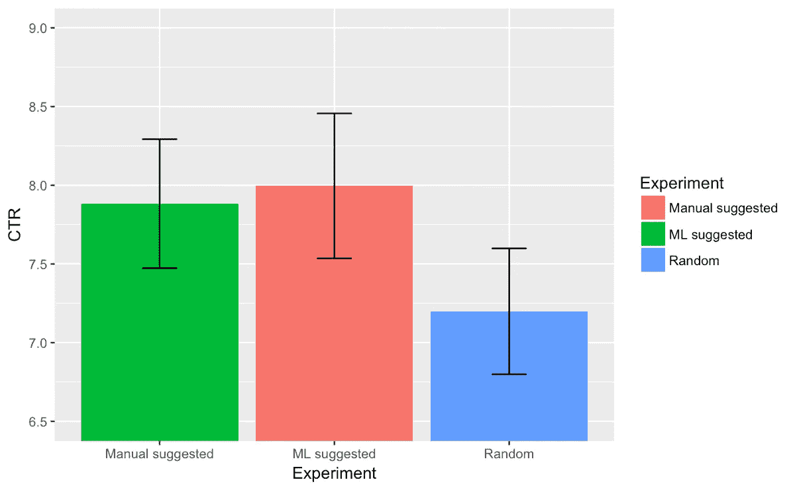

# 用于着陆页面优化的神经网络

> 原文：<https://medium.com/hackernoon/neural-networks-for-landing-page-optimization-564153b4d120>

## 通过强化学习将 A/B 测试提升到一个新的水平。


AI looking for optimal landing page version

# 为什么，什么和如何？

我想分享一些我用神经网络进行登陆页面多参数优化的实验。我已经考虑这个想法半年了，从自动化的角度来看，我觉得这个想法非常有趣。A/B 测试占用了营销专家大量的时间，并且需要大量的流量才能运行良好。当一个小团队管理大量的登录页面时，这就变得很成问题，对于一些项目来说，这也是关于登录页面的“老化”——它们可能会因为促销或优惠的结束而变得过时。

有许多方法可以解决这个问题。老派的 MVTs(多变量测试)在谷歌优化中完成，最终会在所有可能的登陆页面版本之间分割流量。如果你有 3 个变量要测试，这是没问题的。但是想象一下你测试 3 个标题，3 个副标题，2 个按钮颜色，2 个标题图片和一些通用布局的版本。这很容易达到 10k+独特的组合。因为您估计有 50k 的流量，目标是尽可能快地找到最佳或接近最佳的版本。你牺牲了纯粹的统计精度，试图达到尽可能多的转化率。

我知道一些潜在的方法。**首先**是将不同的特性视为独立的实体，想象你正在做一个单独的数字 A/B 测试。通过这种方式，您将很快获得一些结果，但是如果存在任何交叉特征相关性，您将会错过它们，并且您的解决方案将不是最优的。**第二个**是用遗传算法。有一些公司就是这么做的——*[*有情提升*](http://sentient.ai) 比如。从他们的宣传材料来看，似乎他们使用了某种遗传算法。第三是使用**多臂强盗**理论。解决多臂土匪问题的方法之一是使用强化学习和神经网络。*

*让我们从简单的概述开始。*

## *遗传算法*

*遗传算法正在模仿自然选择过程。将不同的网页变化视为生物的特征——有些有助于生存，有些是中性的，有些会有负面影响。遗传算法的基本工作流程是这样的:*

*   *生成一些(比如说 100 个)具有随机特征集的不同后代(100 个具有各种版本特征的登录页面)*
*   *让流量流入其中，并测量转化率(从进化角度来看的存活率)。*
*   *计算所谓的健康分数——每个页面的表现如何*
*   *选取 20 个表现最好的页面，提取它们的特征，并以一种新的方式混合它们。然后，在混合物中加入一些表现最差的 20 个页面的特性。可能会有罕见的“突变”被其他特征隐藏，这对多样性有好处。基于这些特征生成新的 100 页。*
*   *重复 n 次->盈利。*

*虽然这个系统看起来不错，但我发现了一些我不喜欢的地方。*

*   *它仍然需要大量的交通*
*   *在测试过程中，当用户档案/特征发生变化时(出现新的采集通道)，变化缓慢*
*   *它没有考虑用户配置文件(一天中的时间、浏览器、设备等)*
*   *它没有使用神经网络；-)*

*所以，我决定建造一些 NN 驱动的 2018 风格的东西。我和一些做 CPA 营销的见不得人的家伙做了一笔交易:我会建立一个系统，他们会给我流量来测试它。双赢。CPA 是这种系统的完美用例。*

# *研究阶段*

*我需要做的是用神经网络解决所谓的“多臂强盗”问题。据我所知，还有一些关于强化学习的很好的介绍，你可以在底部找到链接。我把这个项目归结为几个阶段，就像多臂强盗问题一样。*

*   *阶段 0。有一个武器不多的赌场强盗。一个多臂强盗，每个臂(网站的不同功能)有一个稍微不同的支付概率(点击率)。你需要建立一个系统，在最少的尝试次数中找到表现最好的手臂，然后坚持一直玩这个手臂(展示这个版本的网站)。请记住，由于这个问题的概率性质，您的解决方案总有可能是错误的。但在现实世界里，多赚钱总是好的。*
*   *第一阶段。用户来了。赌场里住着很多多武装的土匪。不同的用户会玩不同的土匪，系统必须找到什么用户应该玩什么土匪。It 登录页面类比这意味着不同的用户对您的登录页面有不同的反应，因此您必须根据用户特征向每个用户显示不同的页面。*
*   *第二阶段。时机来了。有很多房间有很多手的强盗，你必须通过每个房间和每个房间里的一个强盗。你的支付概率取决于你在每个房间的表现。这是一个完整版本的问题，当你有多步骤的销售过程-预登陆，登陆，电子邮件营销等。*

*我将分享我对实现阶段 0 问题的见解。*

## *为什么只有阶段 0？*

*我的内心对解决每一步所需的流量过于乐观。我的 CPA 伙计们同意在一个登录页面上测试 10-20k 的流量，我认为这足以测试阶段 0 +阶段 1 优化，但数学对我不利。对于阶段 1，IMHO，将需要多一个数量级的流量。在系统调整和研究之后可能会更少。*

# *最近一次运行的结果*

*在这里，我将描述系统在生产中的最新运行结果以及获得的一些见解。下面你会发现一些代码和实现细节，供精通技术的人使用。*

*所以，我们发起了一个 50/50 的分裂测试。50%是去静态登陆页面，50%是去神经引擎驱动的动态登陆页面。在最初的 3-4 天之后，我注意到我的神经解决方案已经达到了变化(局部最小值),它是确定的并且不会改变(基于损失和重量)。这发生在大约 3-4k 的流量之后。*

*我变得好奇，想看看我是否会根据数据的纯统计得出同样的变化。我计算了每个变量的平均 CTR，选择了表现最好的变量，并与 ML 建议的变量进行比较。**让我大吃一惊的是，这些竟然有 80%的不同！** NN 是在暗示完全不同的版本。*有意思……**

*那好吧。我想，神经网络应该比简单的线性代数和我更聪明。为了进一步验证我的发现，我停止学习神经网络，并对 3 个版本进行了面对面的比较:*

*   *100%随机变化*
*   *静态版本，建议使用功能性能的简单比较(获得每个功能的最佳性能，并将它们合并到登录页面中)*
*   *神经网络建议的静态版本*

**

*如你所见，我一直等到随机和非随机选择之间的差异变得有统计学意义。所以，这里是主要的要点:*

*   *基于神经网络的系统执行与简单的基于 P 的统计相同的操作*
*   *统计学和神经网络系统显示的变异有 80%的不同。这可能意味着我没有收集足够的数据来区分两者的表现。*
*   *有可能表现最好的登录页面不仅仅是表现最好的特征的总和，并且确实存在二级相关性。*
*   *我们需要更多的数据。*

# *构建系统*

*经过一番挖掘，我认定我的问题是典型的“AI”强化学习。再次，有一个很大的速成班，我会在底部提到它，我用了很多。我想让我的代码在生产中运行，Tensorflow 是一个可以选择的框架。在我的日常工作中，我更喜欢 MXNet，也看看它。几乎可以生产了。*

## *神经网络*

*我使用了一个简单的两层完全连接的网络，将一个静态变量作为输入，将登陆页面的每个特征的概率作为输出。如果输入不是静态的，而是可变的，根据用户的特征(时间、地理位置、语言等)，为阶段 1 系统修改是很容易的。*

```
*size=[3,2,3,3]
self.DummyState = tf.Variable([[0.1]])

output = slim.fully_connected(self.DummyState,a_size,\
    biases_initializer=None, weights_initializer=tf.ones_initializer())

self.res = [tf.squeeze(slim.fully_connected(output, x, \
                              biases_initializer=None, \
                              activation_fn=tf.nn.sigmoid,
                              weights_initializer=tf.ones_initializer(), 
                              scope='results'+str(i))) 
           for i, x in enumerate(size)]*
```

*这是我用过的一个网络。尺寸变量表示被测试的特征的数量和每个特征的变化的数量。*

## *生产运行*

*为了在生产中运行系统，我使用了 Sanic 后端，Postgres 作为 SQL 存储，Tensorflow 作为推理引擎。系统的学习是在服务器上实时进行的。*

*对于每个网站访问，我们要求后端系统的推理结果和页面的变化显示给这个用户，这是大约 30 毫秒的延迟。转换后，它与用户的页面版本相匹配。*

*我在访问后使用 15 分钟的延迟(典型的转换窗口为 5 分钟)来决定访问是否成功，然后这个访问用于运行神经网络训练的一个步骤。在测试期间，我在衰减探索与剥削因子。最初，登录页面是 100%随机生成的，每天随机与神经网络建议的比例逐渐下降，直到 10 天内达到 0。*

# *一些技巧*

*为了构建系统，我需要某种虚拟测试环境，所以我构建了一个简单的脚本来模拟对网站的访问和转换。这一过程的基石是为每个登录页面的变化生成一个“隐藏”的转化率概率。最初，我假设每个独特的特性组合都有自己的 CTR，并且所有的特性都完全相互依赖。这是一种失败的方法，网络通常无法找到具有有效流量的最佳解决方案。据我所知，这不是一个真实的案例，标题文字和下面 3 个卷轴的颜色之间没有太多的关联。*

```
*self.bandits = [np.random.random(*size)]*
```

*然后我决定简化环境，决定所有的特性都是线性独立的。这是一种过于简化的方法，但它足以调整超参数并确保系统找到正确的解决方案。*

```
*self.bandits = [np.random.random(x)/50+0.95 for x in size]*
```

*在这里，创建正确的“隐藏”环境是一个关键的系统微调，需要一些额外的步骤。*

## *一些代码*

*我把我用来寻找超参数和测试神经网络部分的脚本分享给 playground。*

*感谢您的关注，欢迎提问，联系我，电话:[savsunenko.sasha@gmail.com](mailto:savsunenko.sasha@gmail.com)*

# *参考书目*

*[](/emergent-future/simple-reinforcement-learning-with-tensorflow-part-0-q-learning-with-tables-and-neural-networks-d195264329d0) [## 使用 Tensorflow 的简单强化学习第 0 部分:使用表格和神经网络的 Q 学习

### 在我的强化学习系列教程中，我们将探索一系列的强化学习算法，称为…

medium.com](/emergent-future/simple-reinforcement-learning-with-tensorflow-part-0-q-learning-with-tables-and-neural-networks-d195264329d0) [](https://towardsdatascience.com/solving-the-multi-armed-bandit-problem-b72de40db97c) [## 解决多臂强盗问题

### 多臂土匪问题是一个经典的强化学习的例子，我们给了一个老虎机与 n…

towardsdatascience.com](https://towardsdatascience.com/solving-the-multi-armed-bandit-problem-b72de40db97c) [](https://www.datahubbs.com/multi_armed_bandits_reinforcement_learning_1/) [## 多臂强盗和强化学习 1 -数据中心

### 多臂土匪问题是强化学习的一个很好的介绍。找出它们是关于什么的…

www.datahubbs.com](https://www.datahubbs.com/multi_armed_bandits_reinforcement_learning_1/)*