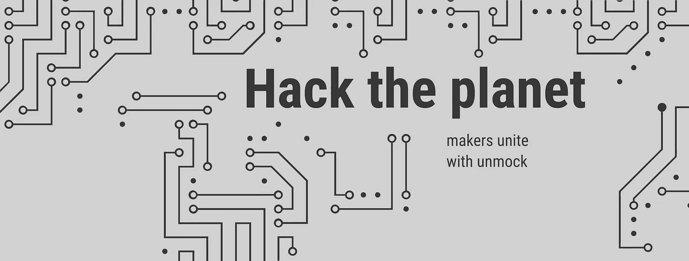

# 再也不要嘲笑 API 了

> 原文：<https://medium.com/hackernoon/never-mock-an-api-again-daac4a15d105>

## 为什么我们对整个堆栈使用 unmock

面对现实吧，嘲讽很烂。每种编程语言和平台都有不同的工具来帮助您模拟 API 调用，但是它们都有一些共同的弱点:

*   没有明确的方法来验证模拟是否是 API 的正确表示。
*   无法避免对你嘲笑的 API 进行逆向工程。
*   没有办法快速模仿内部 API。
*   如果您的测试模拟与您在野外获得的数据相似，那么就无法在生产中进行监控。

结果，团队失去了大量的时间和精力来为他们的单元和集成测试编写模拟，这导致了错误的测试，更少的测试覆盖，并最终导致更不可靠的生产环境。

# 卸下

进入[解锁](https://unmock.io)。Unmock 很棒，因为它基本上为你处理了所有这些事情。YouTube 上有一个关于这项服务的很好的概述(目前处于封闭测试阶段)，但我想我会向你介绍 unmock 如何加快我们在 Meeshkan 的团队的速度。

关于 unmock，要知道的第一件重要的事情是，您编写的测试代码的数量大大减少了，因为您没有滚动自己的模拟。在 Meeshkan 中，我们基本上删除了所有的嘲讽代码，包括将它捆绑在一起的逻辑，并使用 unmock 作为 API 调用的替代。调整模拟响应非常直观，因此，我们已经能够快速编写各种糟糕的 API 调用的极限情况测试——意外的空值、空字符串等。我们还发现了几个关于我们正在使用的 API 的错误假设，当你试图快速构建一个产品时，这是一个真正的救命稻草。

我们特别欣赏的一个特性是 unmock 在同一个测试中处理 API 调用的方式。基本上，通过点击 app.unmock.io 上的“Parent ”,你可以在你的模拟上及时倒退，以真正快速地看到进入你的测试的数据。当然，您可以瞬间修改所有这些，通过您的测试来讲述您想要讲述的故事。

虽然 unmock 提供了一个保存功能来本地下载模拟，但我们实际上发现这是该产品最没用的功能。起初，我们将模拟签入版本控制，但我们很快意识到，由于各种原因，让模拟在 unmock 上运行要好得多。最主要的一点是，当您向测试中添加越来越多的调用时，您不必担心哪些模拟是本地制作的，哪些是从 unmock 中提取的——您有一个单一的模拟源。此外，对于 graphql 模式，unmock 将在模式发布时自动更新模式，这避免了冻结陈旧的模仿。另一个杀手级功能是 unmock 的生产监控:如果您从 unmock API 获得模拟，它会自动跟踪您的 API 调用看到的数据，然后知道在生产中，这些数据是否有任何问题——丢失、扭曲等等。

Unmock 已经迅速成为我们跨多个平台(Android、iOS 和 Web)的测试堆栈的中心，因此我们可以快速构建准确的测试，而不必担心测试中来自逆向工程供应商代码的可怕的 401 错误和 bug。如果可以的话，试着加入测试赛。

