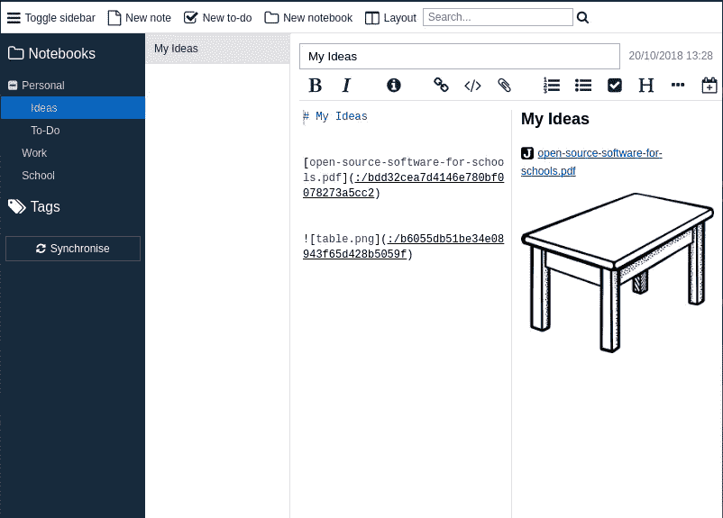
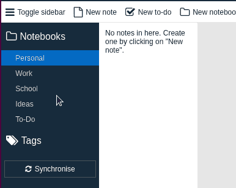
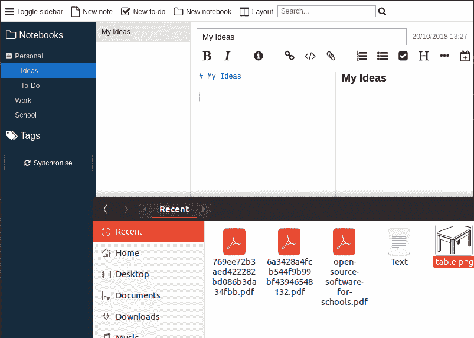
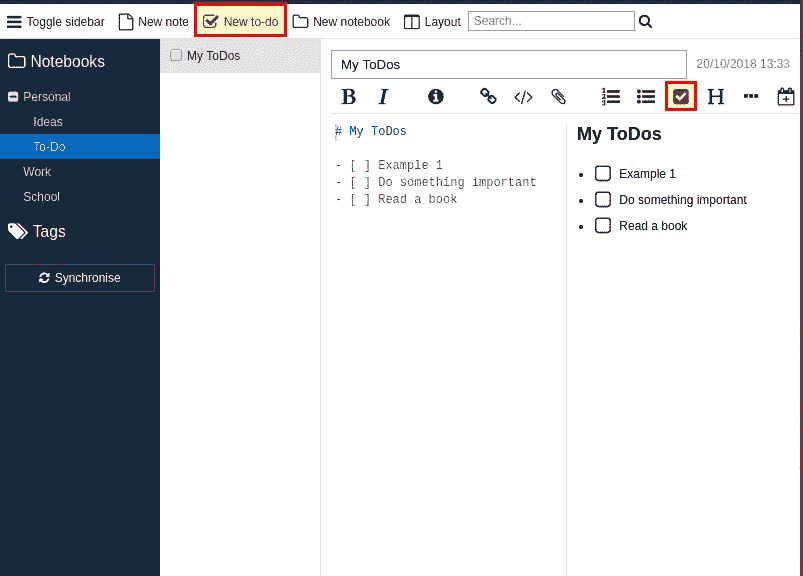

# 我最喜欢乔普林的这个新功能

> 原文：<https://medium.com/hackernoon/new-features-in-joplin-302ec080eca4>

Joplin, one of the best Open Source alternatives for Evernote

我已经使用 Joplin 几个月了，我对它非常满意。对于任何寻找 Evernote 或其他笔记程序替代品的人来说，这个[开源解决方案](https://joplin.cozic.net/)在大多数情况下可能是个不错的选择。在过去的半年中，Joplin 增加了一些新功能，并修复了许多错误。今天我想介绍一下 Joplin 的一些新特性。基本安装，以及加密同步的设置，我已经在[我的上一篇文章](https://openschoolsolutions.org/joplin-open-source-evernote-alternative/)中描述过了。

# 新功能

## 子笔记本

我个人已经等待这个功能很长时间了，很快我就会切换到另一个解决方案。如果你想管理多个笔记，子笔记本是必不可少的。可以非常容易地创建子笔记本。您只需将一个笔记本拖到另一个笔记本上，它就会被设置为子笔记本。

## 附件

任何类型的文件现在都可以插入到笔记中。将文件拖到便笺中就足够了。对于图片，通常会显示预览，对于所有其他文件，会插入一个链接。附件也称为资源，与其他设备同步，然后可以在其他设备上打开。

## 检查框

在 Joplin 中，您可以轻松创建待办事项列表。这是可能的，因为 Joplin 使用 Markdown 作为注释语法(顺便说一下，HTML 也可以)。所以你可以用“- [ ]”创建一个复选框。

对了，不仅复选框是可以的，更复杂的东西比如[数学公式](https://github.com/laurent22/joplin#math-notation)也是可以的。

## 托盘图标

由于某些版本的 Joplin 带有托盘图标，这意味着您可以在不关闭 Joplin 的情况下关闭应用程序窗口。我非常喜欢这个功能，因为我通常只打开我当前使用的应用程序。我不用的东西会被关闭，或者如果可能的话会被送到托盘或上层面板🙂

## 便携式版本

我不需要这个，但是现在也有 Joplin for Windows 的便携版。所以不用安装就可以直接从 u 盘使用。下面是[下载链接](https://github.com/laurent22/joplin#desktop-applications)。

# 结论

从这个学年开始，我就一直在用 Joplin 来备课，还有其他一些东西。我很好奇手机客户端的同步效果如何(尤其是附件)。到目前为止，还没有出现任何问题，让你的笔记随处可见真是太好了。我只能给乔普林最热情的推荐！

你最喜欢乔普林的哪些特点？

*最初发表于*[T5【openschoolsolutions.org】](https://openschoolsolutions.org/new-features-in-joplin/)*。* ***注册*** *订阅我们的时事通讯，获取免费的 PDF 格式，并为您的课堂提供出色的开源应用程序，或者在 Twitter 上关注*[*@ OpenSchoolZ*](https://twitter.com/OpenSchoolZ)*。*