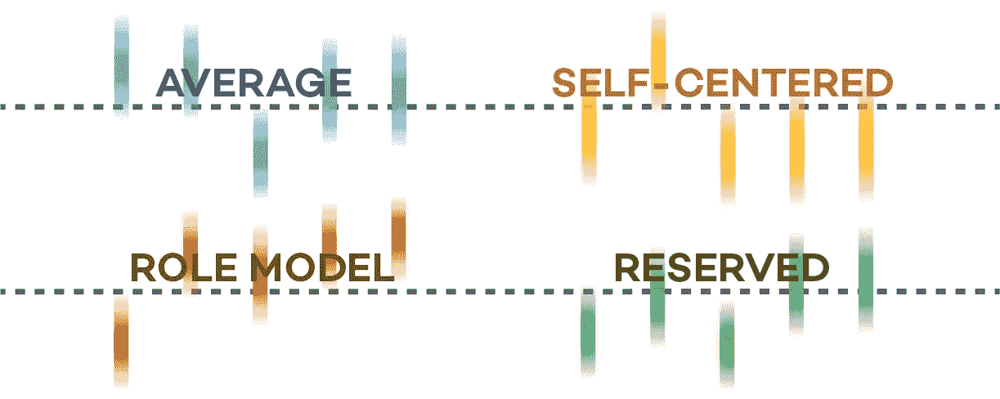
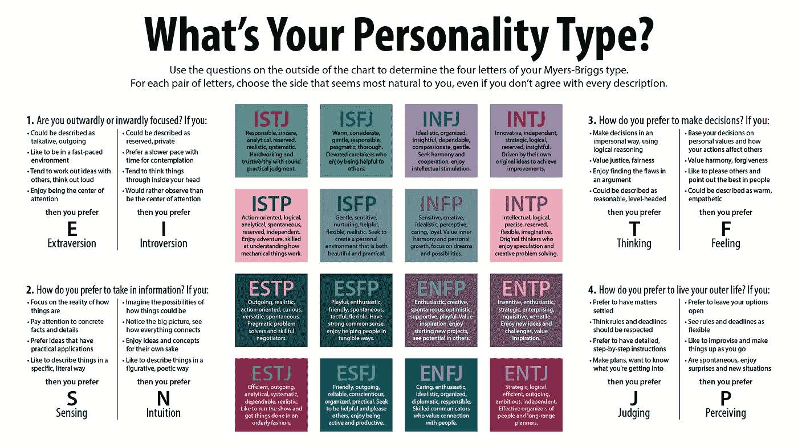
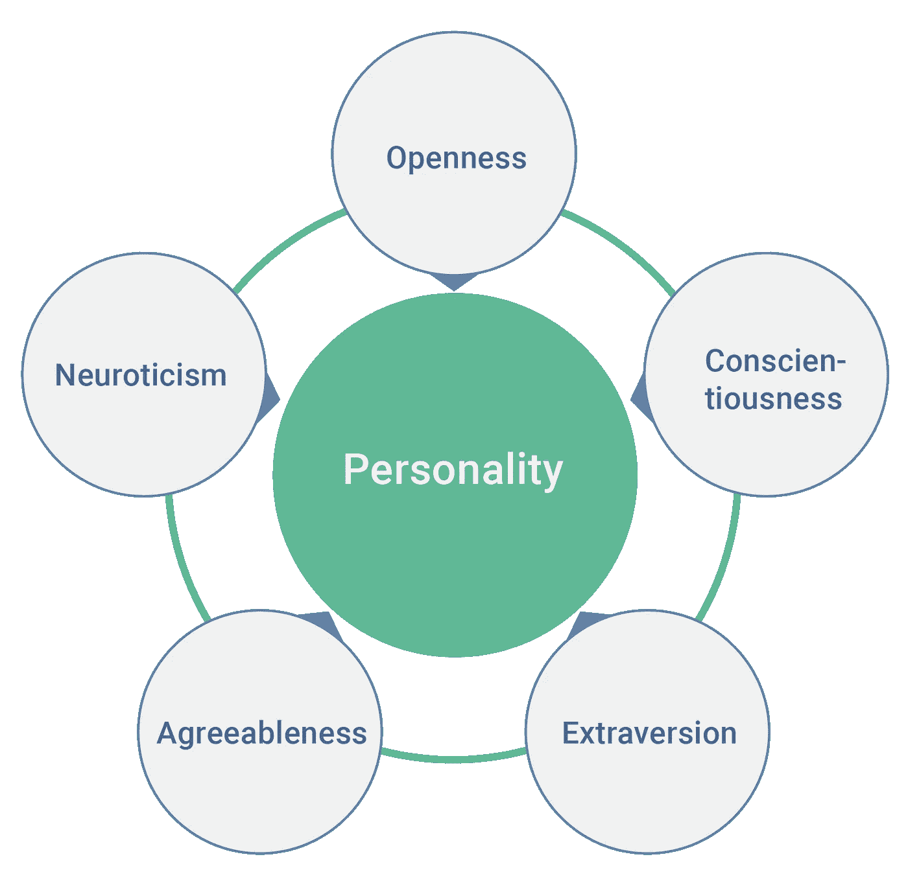
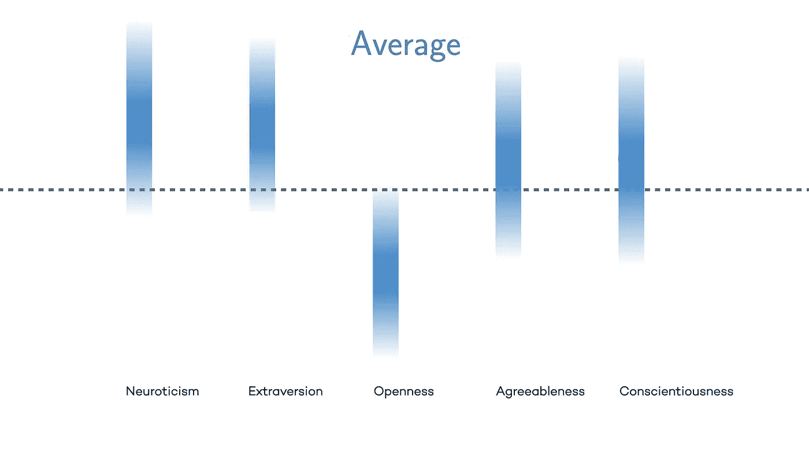
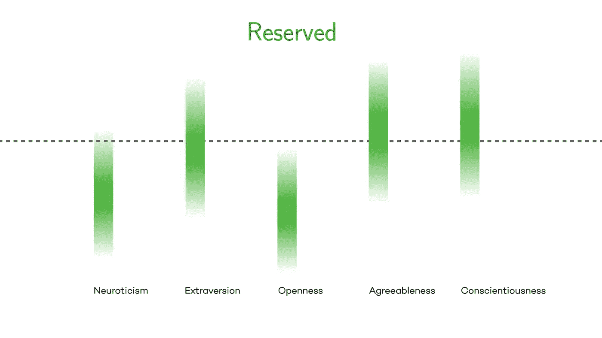
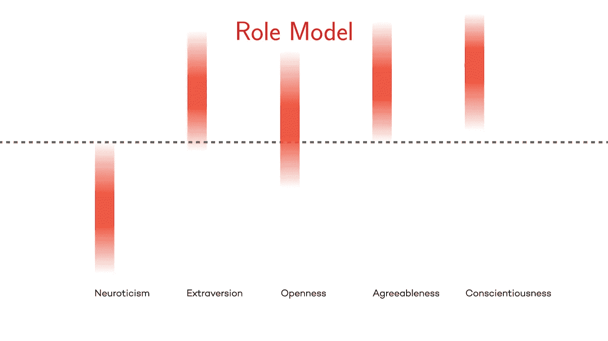
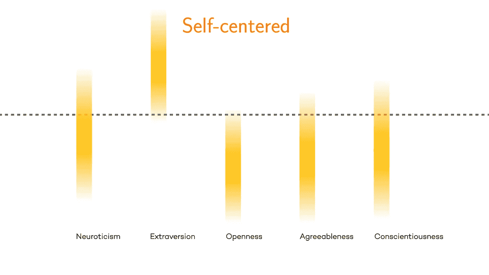

# 新的全球研究定义了 4 种人格类型

> 原文：<https://medium.com/hackernoon/new-global-study-defines-4-personality-types-from-self-centered-to-role-model-4850fdbff073>

## 西北大学领导的一项研究确定了四种不同的性格类型:普通、保守、自我中心和榜样

[Northwestern University — Press Graphics](https://news.northwestern.edu/for-journalists/press-kits/scientists-determine-four-personality-types-based-on-new-data/#Graphics)

人格类型的分类有很多种范式。有人说有四种性格类型。其他 8..12..16.其中最著名的是[迈尔斯-布里格斯](https://en.wikipedia.org/wiki/Myers%E2%80%93Briggs_Type_Indicator)，它将我们的个性分解为一系列认知功能，其中一些功能对其他功能具有支配作用。

然而，一项新的研究挑战了这些现有的范式。

2018 年 10 月，由西北大学的路易斯·阿马拉尔[领导的研究人员发表了他们来自 150 万人](https://news.northwestern.edu/for-journalists/press-kits/scientists-determine-four-personality-types-based-on-new-data/)[全球研究](https://www.nature.com/articles/s41562-018-0419-z)的发现。这项研究综合了来自一份问卷的回答，该问卷提取了全球参与者的个性和特质数据。

# 5 个特征

在心理学领域，有五种被广泛接受的高级人格特质:神经质、外向性、开放性、宜人性和尽责性。研究人员利用这些性格特征来帮助将他们的发现进行归类。

你可以使用[开源心理测量项目](https://openpsychometrics.org/tests/IPIP-BFFM/)做一个测试，看看你对每个特征的评分。

[**神经质**](https://en.wikipedia.org/wiki/Neuroticism)**——神经质得分高的人比一般人更容易情绪化，并经历焦虑、担心、恐惧、愤怒、沮丧、嫉妒、嫉妒、内疚、抑郁和孤独等情绪。**

*   **高分者往往是:笨拙、悲观、恐惧、自我批评、不自信、不安全和过度敏感**
*   **得分低的人倾向于:自信，对自己有把握，勇敢，不受忧虑的困扰**

******——外向性得分高的个体更有可能外向、社交、成为关注的焦点。他们喜欢和人在一起，参加社交聚会，精力充沛。外向性低的人不太外向，独自工作时更自在。******

*   ******高分个人倾向于:善于交际、自信、快乐、精力充沛、善于表达、有爱心和社交自信******
*   ******得分低的人倾向于:害羞、内省、深思熟虑、总体上对自我表达有所保留******

********——开放性得分高的人通常非常好奇，并表现出高情商。开放性包括六个方面，或称维度，包括活跃的想象力(幻想)、审美敏感性、对内心感受的关注、对多样性的偏好和求知欲。********

*   ******高分个人往往是:原创、大胆、聪明、有洞察力、好奇、聪明、复杂/深刻******
*   ******得分低的人倾向于:基于常规，不太抽象，坚持他们所知道的和舒适的******

********——宜人性得分高的人通常脾气好，比起怀疑/愤世嫉俗，他们更倾向于同情和同情。它也是衡量一个人信任和乐于助人的天性，以及一个人是否普遍脾气很好的一个标准。高亲和力通常被视为幼稚或顺从。宜人性低的个体通常是竞争性或挑战性的人，这可以被视为好辩或不可信。********

*   ******高分者往往是:利他的、信任的、耐心的、机智的、敏感的、无私的、受欢迎的和受尊重的******
*   ******得分低的人往往是:冷酷无情、粗鲁无礼、脾气暴躁、爱挖苦人、充满敌意******

******[**责任心**](https://en.wikipedia.org/wiki/Conscientiousness)——责任心得分高的人通常效率很高，也很有条理。他们倾向于可靠，表现出自律，尽职尽责，以成就为目标，更喜欢有计划的而不是自发的行为。高度的责任心通常被认为是固执和专注的。低责任心与灵活性和自发性有关，但也可能表现为马虎和缺乏可靠性。******

*   ****高分个人倾向于:领导者、精力充沛、可靠、雄心勃勃、坚持不懈、努力工作、足智多谋****
*   ****得分低的人倾向于:拖延、冲动、任性、草率/不顾后果地做决定****

# ****4 种性格类型****

****使用上述特征作为定义变量，研究人员绘制了调查结果，揭示了 4 个不同的人格集群。****

## ******平均值******

*   ****最常见的人格类型****
*   ****高度神经质和外向——倾向于更合群、更自信、更悲观和过度敏感****
*   ****开放性低——倾向于更加基于常规，对抽象不那么开放****
*   ****倾向于寻求关注，但不过分好奇****
*   ****更可能是女性，而不是男性****

********

****[Northwestern University — Press Graphics](https://news.northwestern.edu/for-journalists/press-kits/scientists-determine-four-personality-types-based-on-new-data/#Graphics)****

## ******保留******

*   ****更高的宜人性和责任感——倾向于更信任、更敏感、更受欢迎和更可靠****
*   ****较低的开放性和神经质——倾向于自信地坚持到底****
*   ****情绪稳定****
*   ****有点外向，但不过分****

********

****[Northwestern University — Press Graphics](https://news.northwestern.edu/for-journalists/press-kits/scientists-determine-four-personality-types-based-on-new-data/#Graphics)****

## ******榜样******

*   ****外向性、开放性、宜人性和责任心强——倾向于表现出能唤起尊重和令人钦佩的领导力的品质****
*   ****神经质程度低——倾向于更加自信和勇敢，承担有计划的风险****
*   ****可靠并乐于接受新想法****
*   ****强有力的领导者****
*   ****女性多于男性****
*   ****成为榜样的可能性随着年龄的增长而增加****

********

****[Northwestern University — Press Graphics](https://news.northwestern.edu/for-journalists/press-kits/scientists-determine-four-personality-types-based-on-new-data/#Graphics)****

## ****自我中心的****

*   ****高度外向——倾向于在社交上非常自信、精力充沛和外向****
*   ****开放性、宜人性和责任心差——容易冲动、任性、脾气暴躁、冷酷无情、墨守成规****
*   ****典型的损人利己****
*   ****以自我为中心的可能性随着年龄的增长而降低****

********

****[Northwestern University — Press Graphics](https://news.northwestern.edu/for-journalists/press-kits/scientists-determine-four-personality-types-based-on-new-data/#Graphics)****

****你可以在这里查看西北大学的全部结果和分析。****

# ****外卖****

****理解我们自己和我们的同事对培养富有成效的关系至关重要:无论是在家里还是在工作场所。个性是一个光谱，一个聚集的标签不一定能定义我们是谁。****

****最重要的是理解我们每个人看待世界的方式不同。我们感知世界和彼此的方式影响着我们的日常行为。其中一些认知可能比其他的更有帮助——重要的是要认识到哪些特征是有帮助的，哪些是有害的。****

****更重要的是，个性不是一成不变的——它们会随着时间的推移而改变。这表明我们一直在不断学习，我们的生活经历将继续塑造我们对世界的感知和互动。****