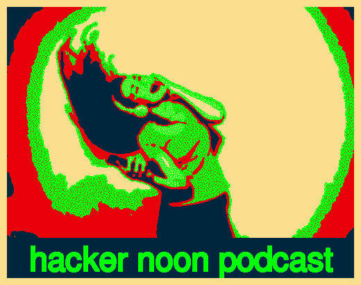

# 新的黑客正午播客剧集和 27 个关于技术播客的基于文本的故事

> 原文：<https://medium.com/hackernoon/new-hacker-noon-podcast-episodes-and-27-text-based-stories-about-tech-podcasting-6d8726a69099>

前两集[黑客正午播客](http://podcast.hackernoon.com)现已发布:

## 第一集:[从 CrazyEgg 的 Hiten Shah 开始](https://podcast.hackernoon.com/e/starting-up-with-hiten-shah-of-crazyegg-and-kissmetrics/)

[**iTunes**](https://itunes.apple.com/us/podcast/starting-up-with-hiten-shah-of-crazyegg-and-kissmetrics/id1436233955?i=1000420954481&mt=2) 和 [**Youtube**](https://www.youtube.com/watch?v=68Qjofn4Bpk)

## 第二集:[格蕾丝·凯利的成熟加密市场](https://podcast.hackernoon.com/e/the-maturing-crypto-market-with-grace%C2%A0rachmany/)

[**iTunes**](https://itunes.apple.com/us/podcast/the-maturing-crypto-market-with-grace-rachmany/id1436233955?i=1000420959064&mt=2) 和 [**Youtube**](https://www.youtube.com/watch?v=Q4tx2P26-Jo)

Hiten 说了这样的话，*“接触顾客比以往任何时候都容易；获得并保持他们的关注比以往任何时候都难。所以你不能只是说这是我新的闪亮的东西——它会解决你所有的问题。你必须真正花时间去了解它将解决什么问题，用真正精确的方式描述它，并从根本上提高水平，这样你才能真正让他们关注你，因为无论你提供什么，他们都会受益。”*

格蕾丝说了类似于*的话，“所以现在这是一个成熟的市场。青少年时代结束了。是时候开始寻找一个成年人了。现在我们有一个叫叉子的东西。就像我们要用叉子叉一样，如果你不喜欢，我们就要用叉子叉你。我们把我们所有的智慧都当成了人性，而不是改善这个世界——获得更好的健康，摆脱贫困，摆脱战争——我们让我们最聪明的程序员去让人们购买他们不需要的东西。”*

我一直在听录音——一些很好的即将播出的剧集，涵盖了区块链如何打击医疗保健的官僚主义，crypo 公关公司的幕后故事，去中心化的云实际上可能是什么样子，以及资金在哪里遇到了未来主义。《黑客正午》播客在[Youtube](https://www.youtube.com/channel/UChu5YILgrOYOfkfRlTB-D-g)&[iTunes](https://itunes.apple.com/us/podcast/the-hacker-noon-podcast/id1436233955?mt=2)上可以看到。

## 如果你想发布你的技术播客，或者你如何制作你的技术播客，或者只是想分享一个非凡的声音，[发电子邮件给 Stories@HackerNoon.com](mailto:stories@hackernoon.com)。一个真正活着的人会读它。

# 关于技术播客的 27 个基于文本的故事

## [开始播客](https://hackernoon.com/all-you-need-to-start-a-podcast-63fa567c2396)所需的一切由[本·惠勒](https://medium.com/u/3c9072e1a53?source=post_page-----6d8726a69099--------------------------------)

## [Anthony aken tiev](https://hackernoon.com/a-real-world-dao-template-for-podcasts-732da0dcb5a4)[的播客](https://medium.com/u/97a9a96776cb?source=post_page-----6d8726a69099--------------------------------)的真实世界 DAO 模板

## [11 个创始人最佳播客](https://hackernoon.com/the-best-podcasts-founders-are-listening-to-in-2018-43be97223d4a)由 [Vikas Jha](https://medium.com/u/bd9dea2cef68?source=post_page-----6d8726a69099--------------------------------)

## [创始人访谈:Transistor.fm 的贾斯廷·杰克逊](https://hackernoon.com/founder-interviews-justin-jackson-of-transistor-fm-1e9003e27cd)作者 [Davis Baer](https://medium.com/u/1d1a20b08c6?source=post_page-----6d8726a69099--------------------------------)

## [黑客的互联网极简主义指南](https://hackernoon.com/hackers-guide-to-internet-minimalism-7aee9c1b566)作者 [AMR](https://medium.com/u/bee33e964a63?source=post_page-----6d8726a69099--------------------------------)

## [我如何建立编程播客](https://hackernoon.com/how-i-built-programming-podcasts-8089a0800a38)作者[乔·列侬](https://medium.com/u/93b4b50da1eb?source=post_page-----6d8726a69099--------------------------------)

## [在 Winds 中整合 Algolia 搜索——Nick Parsons](https://hackernoon.com/integrating-algolia-search-in-winds-a-beautiful-rss-podcast-application-f231e49cdab5)开发的一个漂亮的 RSS &播客应用

## [打造自己的播客平台！](https://hackernoon.com/make-your-own-podcasting-platform-ab833cf16e1c)由[克努特·梅尔瓦尔](https://medium.com/u/a33dd3c196e?source=post_page-----6d8726a69099--------------------------------)

## [Marketplace 在数小时内扩展到数千用户](https://hackernoon.com/sharing-economy-scaled-to-hundreds-of-users-in-hours-70e4b8cc72eb)由 [Mike Williams](https://medium.com/u/50c648b0568c?source=post_page-----6d8726a69099--------------------------------)

## [Osmo-FL2k:15 美元的 DTV 发射机，FM 无线电劫持和 GPS 欺骗设备。](https://hackernoon.com/osmo-fl2k-a-15-dtv-transmitter-fm-radio-hijack-and-gps-spoofing-device-68ac08ba7d76)由[托马斯 C.](https://medium.com/u/de74896f1aa2?source=post_page-----6d8726a69099--------------------------------)

## [🅟🅞🅓🅒🅐🅢🅣🅢&…杰里米·斯特里奇](https://hackernoon.com/the-search-for-sound-492d9bcd00e2)[的《寻找声音](https://medium.com/u/e6b7356bc39e?source=post_page-----6d8726a69099--------------------------------)

## [播客——入门、来源和建议](https://hackernoon.com/podcasts-getting-started-sources-and-recommendations-cdfca08be197)作者 [Tarun Jadhwani](https://medium.com/u/87d2fab6d46b?source=post_page-----6d8726a69099--------------------------------)

## [Podcrypt:自动、公平、点对点的以太播客捐赠](https://hackernoon.com/podcrypt-automatic-fair-peer-to-peer-podcast-donations-with-ether-f0a638111410)由[乔丹最后](https://medium.com/u/ab9ca0b50bb6?source=post_page-----6d8726a69099--------------------------------)

## 【2018 年播客现状:播客运动对货币化、多样性和发现的启示，作者[贾斯汀和奥利维亚·摩尔](https://medium.com/u/70a549618355?source=post_page-----6d8726a69099--------------------------------)

## [流媒体服务可以在 AM/FM 的 1760 亿年收听时间中找到增长](https://hackernoon.com/streaming-services-can-find-growth-in-am-fms-176-billion-annual-listening-hours-7e30e0b3428e)， [Pandora 有三个数字应该对你来说是音乐:4000 万，7600 万，10 亿。](https://hackernoon.com/pandora-has-three-numbers-that-should-be-music-to-your-ears-40-million-76-million-and-1-billion-ab424913a4b5) & [音乐发现失败的那一天](https://hackernoon.com/the-day-music-discovery-failed-me-478bd9d19f00)由[格伦万众](https://medium.com/u/b11674d11fa5?source=post_page-----6d8726a69099--------------------------------)

## [我用来学习 UI/UX 设计的最好的播客、博客和 YouTube 渠道](https://hackernoon.com/the-best-podcasts-blogs-and-youtube-channels-for-learning-ui-ux-design-42890ee2c4c8) & [我从 Spotify、Apple Music 和 Deezer](https://hackernoon.com/5-things-i-learned-from-my-comparative-study-of-spotify-apple-music-and-deezer-fe8512022ae1) 的比较研究中学到的 5 件事 [Brian Tan](https://medium.com/u/51d08cbd58a1?source=post_page-----6d8726a69099--------------------------------)

## [Conet 项目:由](https://hackernoon.com/the-conet-project-recordings-of-shortwave-numbers-stations-5e127d7cb8c6) [Beautyon](https://medium.com/u/e6958b5742d2?source=post_page-----6d8726a69099--------------------------------) 录制短波数字电台

## [给初学者的 5 个最好的比特币播客](https://hackernoon.com/bitcoin-podcasts-83f6d6d02bc4)作者[迈克·菲什拜因](https://medium.com/u/676736bc8f69?source=post_page-----6d8726a69099--------------------------------)

## [用主播](https://hackernoon.com/the-many-ways-to-make-audio-with-anchor-68e74ad8b300)制作音频的多种方式由[主播](https://medium.com/u/644234e0a96d?source=post_page-----6d8726a69099--------------------------------)

## [扩展你思维的五大播客](https://hackernoon.com/top-5-podcasts-to-expand-your-mind-dea1f7cfdc30)作者[约尼·谢赫特尔](https://medium.com/u/9e310f141bf4?source=post_page-----6d8726a69099--------------------------------)

## [排名前五的初创公司&技术、天使投资和风险投资播客，按顺序排列](https://hackernoon.com/the-top-5-startup-technology-angel-investing-and-venture-capital-podcasts-in-order-219caf976987) & [5 个最喜欢的技术/未来主义播客](https://hackernoon.com/our-5-favorite-technology-and-futurism-podcasts-bba1fbb7b949) & [4 个最喜欢的区块链/加密播客](https://hackernoon.com/our-4-favorite-blockchain-and-crypto-focused-podcasts-408782bcd41a)作者[马特沃德](https://medium.com/u/de3bd78f4455?source=post_page-----6d8726a69099--------------------------------)

## [为什么我要开一个播客，我是多么渴望你能帮助塑造它](https://hackernoon.com/why-im-starting-a-podcast-and-how-desperate-i-am-for-you-to-help-shape-it-75e7ad1dc262)作者[克里斯·赫德](https://medium.com/u/da7b665f3cc7?source=post_page-----6d8726a69099--------------------------------)

## 如果你想发布你的技术播客，或者你如何制作你的技术播客，或者只是想分享一个非凡的声音，请发电子邮件给 Stories@HackerNoon.com。一个真正活着的人会读它。

## 附:在[Youtube](https://www.youtube.com/channel/UChu5YILgrOYOfkfRlTB-D-g)&[iTunes](https://itunes.apple.com/us/podcast/the-hacker-noon-podcast/id1436233955?mt=2)上看[黑客午间播客](http://podcast.hackernoon.com)。