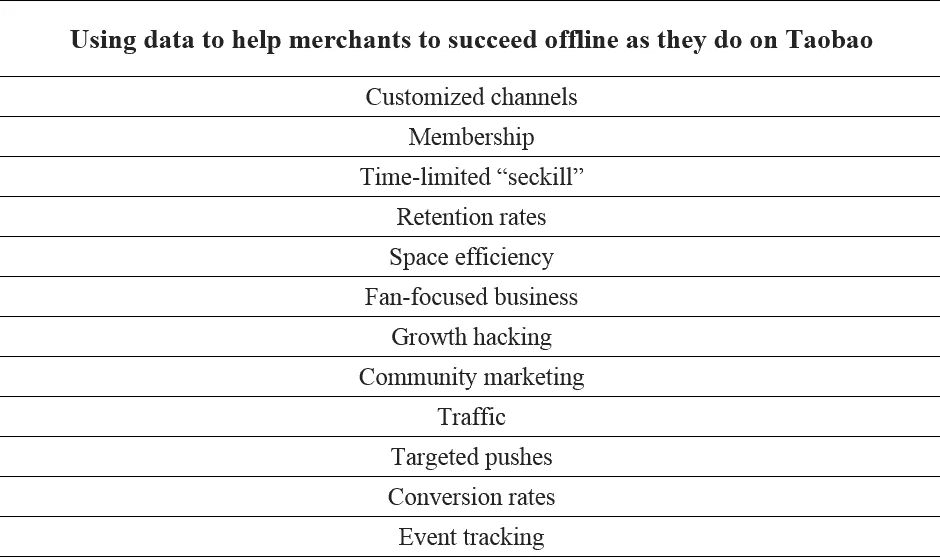

# “拿了就走”的新含义:阿里巴巴推出无人商店

> 原文：<https://medium.com/hackernoon/new-meaning-to-grab-and-go-alibaba-unveils-its-unmanned-store-48b9fce72a89>

*阿里巴巴的天猫未来商店展示了技术如何帮助线下商家在电子商务时代蓬勃发展*

如果你曾经不耐烦地排队购买食品，那么你很有可能希望摆脱我们购物时经常遇到的典型服务体验。虽然送货和电子商务服务为希望避免麻烦的人提供了一种选择，但阿里巴巴最近的一项努力使你有可能很快在商店购物，让你走进商店，拿走你需要的东西，并在走出商店时自动付款，从而简化购物者和商家的零售。

为了展示其进展，阿里巴巴最近在 2018 年云起计算大会上展示了其新的天猫未来商店的一个 80 平方米的实验装置，邀请与会者探索一个没有一名员工的便利店。在里面，他们可以浏览食物、小吃和饮料，同时在需要时从数字 T-guide 助手那里获得帮助，然后只需离开场所就可以结算账单。

*Visitors line up outside Alibaba’s Tmall Future Store at the 2018 Yunqi Computing Conference*

为了进一步强调这种新的购物模式，阿里巴巴淘宝技术部的高级技术专家卫诗在大会上发表了演讲，讲述了新兴的新零售领域迄今为止的发展情况以及下一步的发展方向。在里面，我们来看看他演讲中的亮点，并探索有助于使无人零售成为今天这场变革的关键部分的技术。

# 从新零售到无人零售

虽然天猫的无人未来商店代表了一种全新的购物模式，但这只是通过新技术、商业模式和渠道升级线下购物的更广泛运动的一部分，这种运动被称为“新零售”。

在最基本的层面上，新零售的范围从接受移动支付的自动售货机到许多工作场所现在提供的廉价开放式迷你商店，这要归功于数字化商业模式，这种模式加快了进货速度并减少了开销。在更大的范围内，它还包括像阿里巴巴的 Hema 这样结合了线上和线下商业特点的超市，以及与星巴克等独立零售商的合作企业。新零售的核心是数据，以及在传统零售环境中，如何利用数据来减少消费者和商家的痛点。

市场分析表明，早期将人类工人从零售业中剔除的努力遭到了消费者的不同反应。尽管如此，中国此类企业的产值预计将从 2017 年的 200 亿元人民币上升至 2020 年的 650 亿元人民币，主要受劳动力成本、线下运营成本和消费者需求上升的推动。随着技术现在能够支持天猫未来商店捕捉的真正未来主义的体验，无人零售可以专注于为消费者提供一种全新的购物方式，而不是简单地升级现有的选择。

根据艾瑞咨询对中国市场的研究，该国 8.5%的消费者更喜欢从人类收银员那里购物，而 23.7%的消费者更喜欢在离开商店时扫描代码。除此之外，29.8%的人更喜欢在出口处从智能结算篮中提取商品，而压倒性的 39%的人更喜欢以自动结算的形式带着他们的杂货走出去。在扫清了培养对天猫未来商店等体验的需求的最初障碍后，阿里巴巴已经能够专注于其新模式如何为合作伙伴提升业务，以及更广泛市场的劳动力效率。

例如，将该集团的 Alicool 纪念品商店迁移到完全自动化的框架中，年营业额增加了 75 %,销售额增加了 20 %,比去年多吸引了 56%的消费者。该店只有 120 平方米，现在每天可以接待多达 2，300 名游客，这主要是因为购物者在离开时平均需要 4.5 秒才能完成自动结算。

另一个例子是，阿里巴巴合作翻新了上海的智达书店，实现了基于面部识别的自动结算，大大增加了该店的日营业额。值得注意的是，阿里巴巴能够应用之前工作的成果，在短短 53 天内完成新设施的安装，将商店的日营业额提高了 78.3%。

# 天猫未来店内部一瞥

通过天猫未来商店，阿里巴巴进入了一个被称为“无人零售 2.0”的阶段，大大扩展了阿里酷和知大书店展示的能力。除了技术升级，新阶段还包括重点从打动顾客转移到吸引现有商家的概念。

从技术上来说，天猫未来商店的关键进步是计算机视觉。在第一次进入商店时，顾客用他们的手机扫描一个代码来建立他们在那里的虚拟存在。一旦他们这样做了，一系列大约 100 个屏幕将在他们穿过商店时做出反应，提供个性化建议并提供帮助定位商品的方向。在货架上，该系统使用重力传感器和内置摄像头来识别商品并将其添加到客户的虚拟购物车中。这使得客户可以在准备就绪后离开，因为系统会自动收取他们离开时未归还的任何物品的付款。为了记录这些交易，该系统会生成一个虚拟账单，出现在客户的支付宝或移动淘宝账户上，虚拟账单中的商品还将包括回购链接(如果它们在网上可用的话)。

*A view of customer guidance systems inside the Tmall Future Store*

作为一个整体，这种用户体验跟踪三个核心系统能力的交互作用:全球跟踪、产品识别和用户-项目匹配。最后一个是最关键的，因为任何导致从错误的客户那里扣除付款的混乱都会使自动化可以取代人工服务的想法无效。这种情况可能会发生的一个例子是，参加会议的商店访客偶尔会交叉手臂去拿物品，交换物品，或主动帮助对方归还物品，挑战算法来整理相互冲突的数字印象。

此类问题的最佳解决方案是通过有效的离线行为数字化进行预防，这给开发者带来了持续的挑战，因为他们试图使这些新功能完全市场化。

# 面向未来的持续发展

在目前的状态下，天猫未来商店引入了一个连贯的“6+1”技术架构，其中五个处理端和一个本地网关通过一组连贯的业务优先级(即交易、处理、运营和云中的数据存储)进行交互。虽然任何希望开设商店的人都可以从这种架构开始工作，但为广泛营销做准备仍然需要有针对性地提高算法能力、降低硬件成本和部署成本。

*An overview of Alibaba’s most recent architecture for unmanned retail environments, now undergoing further development*

算法限制的一个当前示例是，在选择商品或完成结算时，客户需要通过静止不动来与传感器合作。理想情况下，扫描仪应该能够处理一定量的运动或其他变化，这是一个复杂的深度学习优化问题。此外，系统的面部识别组件使用每个客户的初始扫描图像作为“一次性”参考点。即使是人类观察者也可能难以分辨从不同角度拍摄的两幅图像是否显示同一个人的脸，因此完善识别算法带来了巨大的挑战。

另一个突出的挑战是使算法更适应各种环境，因为每个新的无人商店都需要部署和训练模型，以在其特定的维度和条件下工作。这样做的关键是将特定参数的调整从模型中分离出来，这可以使用通过在不同环境中重复部署环境传感器收集的信息来完成。

就市场进入壁垒而言，硬件成本仍然是预防性的，不是因为它们必须很高，而是因为开发商目前面临的处理挑战对设备提出了很高的要求。此外，将传统的实体店改造成无人商店需要花费大量时间，因为工程师需要逐个更新设备和系统。

为了降低成本，阿里巴巴正在努力缩小设备的功能范围。因为增加计算能力的成本不是线性的，所以在边缘计算时代，提高中央服务器的能力来覆盖更多的终端功能是不可行的。为了应对这一点，部署在无人商店的摄像头和屏幕需要升级自己的计算能力。

另一个降低成本的方法是设备标准化。通过使所有设备可替换、可修复和一致，开发人员希望部署和维护过程可以简化，标准程序可以启用。这将允许机器人对硬件和人工智能进行非工作时间的维护和检查。

以建立设备管理系统为最终目标，开发人员正在为一种名为 Linkedge 的阿里云产品寻求应用程序，该产品可用于为上传和下载设备信息以进行监控的框架开发热插拔 HAL 层。实际上，这意味着该系统将可以远程升级，部署在不同的设备上，并为添加新功能做好准备——简而言之，完全适合移动时代。

# 展望未来

为了总结天猫未来商店的重要性，阿里巴巴的卫诗将其描述为线下淘宝，旨在像购物者随身携带的手机一样互动。就像伴随着淘宝出现的第一波在线商务一样，它提供了研究人们购物习惯和偏好的新方法，让商店成为理解经济活动的实验室和运用这些知识的场所。

*Some of the many ways data from unmanned retail stores can help merchants thrive*

随着电子商务的兴起，许多人担心淘宝这样的平台最终会淘汰线下零售。通过天猫未来商店，阿里巴巴展示了支持它的技术可能如何被用来改善线下商家的业务，帮助他们做出更明智的选择和更好的投资回报。作为无人零售的第一步，它的完成将为未来的发展提供一个有价值的基础。

# 阿里巴巴科技

关于阿里巴巴最新技术的第一手深度资料→脸书: [**“阿里巴巴科技”**](http://www.facebook.com/AlibabaTechnology) 。推特: [**【阿里巴巴技术】**](https://twitter.com/AliTech2017) 。