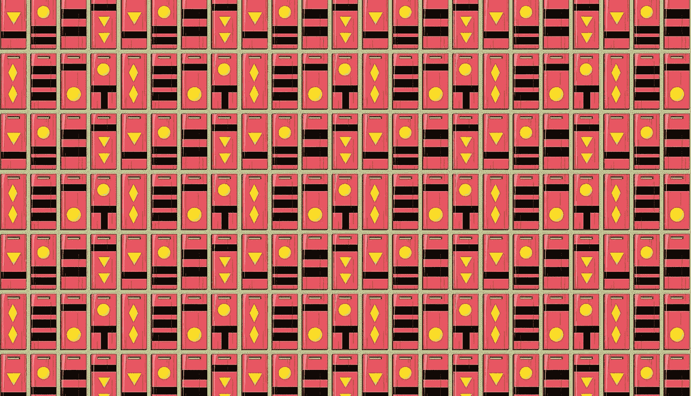

# 旧资产类别的新协议

> 原文：<https://medium.com/hackernoon/new-protocols-for-old-asset-classes-4f1a8a18a0b7>

## 与 Consensys 创始人兼首席执行官 Joe Lubin 和 Consensys CSO Sam Cassatt 的对话

金融资产最终将完全数字化，这似乎是显而易见的。自动化将大大加快今天由办公室职员完成的官僚程序。区块链协议将取代它们的位置，管理一个与今天不太相似的金融系统。Joe Lubin 和 Sam Cassat 谈论了这样一个新的基础设施会是什么样子。

与传统的风险投资相比，首次公开募股(ico)已经成为区块链初创公司不费吹灰之力就获得巨额融资的一种流行方式。公司发行自己的公用事业令牌，投资者购买这些令牌用于未来的服务。然而，在美国证券交易委员会看来，像这样的硬币是有价证券。区块链公司如何改变他们的战略？

**山姆**:今天，我们看到区块链公司将技术和资金结合起来。然后，他们试图将其应用于美国的监管制度。其结果是安全令牌基础设施的增长。比如高盛力挺[圈](https://www.circle.com/de/)买[波洛涅克斯](https://poloniex.com/)。出售的部分动力是他们将收购加密交易所 Poloniex，并将其转变为受监管的证券交易所，ATS。许多团体正沿着这一方向努力，试图创建 ATS，为即将到来的监管制度做好技术和基础设施准备。监管制度和技术基础设施将如何相互作用还有待观察。

**玛琳**:你刚才提到高盛投资了 Circle。到目前为止，它们并不是进入这一领域的唯一机构投资者。公司如何为这一新的投资者阶层做准备？

萨姆:有很多核心金融科技正是为此准备的。我们正在开发一款名为 [Trustology](https://www.trustology.io/) 的产品，这是一款托管产品。几周前，比特币基地推出了他们的托管产品。我们需要严肃的机构级托管人，以确保市场良好运行，并让机构参与者维护其使命、客户和监管机构。

**Joe** :我们开始看到金融业基础设施的到来。这个分散计算机的新世界将会有一些公司，和那些为传统经济提供资源的公司是同一类公司。这些组织将需要同样的金融工具，使旧的组织能够有效地运作。例如，我们将需要衍生品、期货和期权。我们已经看到了很多这样的建筑。

**玛琳**:在未来几年，我们不仅会看到传统的金融产品被令牌化，还会看到所有其他类型的资产。还有什么会变成*区块链*？

Sam :在任何情况下，如果有一种资产类别流动性相对较低，通常难以用纸张管理，比如房地产。流动性和易用性创造了新的流动性池。我们的平台 Meridio 是一个[房产令牌化平台](https://www.nytimes.com/2018/05/25/realestate/a-blockchain-building-in-bushwick.html)。你会开始看到很多这样的事情变得符号化。例如，大多数人买不起一个 1 亿美元的项目

玛琳:但是通过代币化，他们可以买到一小部分。

山姆:没错。

**Marlene** :资产令牌化还有哪些其他好处？

乔:通过符号化，延迟正被挤出经济活动。我们社会的所有元素目前都是以模拟形式实现的。例如，我的驾驶执照或护照是引用政府维护的分类帐的令牌。或者考虑法律，我们有一个主观的，没有保证的系统的执行。如今，企业已经在以数字形式构建这些元素。除了加密货币，我们还建立身份、声誉、法律强制协议和政府证书。全是数字的。有了这些工具，清算和结算只需几秒钟。如果监管者愿意，他们可以增加一些延迟。一旦你做到了这一点，你就可以把你的价值创造事件在时间上更紧密地联系起来。此外，一个社会将受益于有保证的自动信任和有保证的基于规则的系统的执行。

Sam :企业最高层的财务和法律行为与董事会和法院系统的速度一样快。价值生成机制的能力受到人类速度和纸张的限制。通过这些过程的自动化，我们最终得到了能够以更快的速度表达自己的实体。例如，我们之所以有钱，是因为这是一种在经济互动中减少摩擦的粗糙方式。我不想带着我的十头牛到处跑，所以人类在它上面建立了一个抽象。它是一个物理上缓慢的、人类大小的、人类速度的抽象。当我们拥有数字速度时会发生什么？

**玛琳**:那么监管者对这一切怎么说？

**乔**:我们很幸运被监管机构召集来分享我们对这项新技术的理解。我们帮助这些机构中不同的、非常聪明的人理解，区块链可能会带来一个全新的结构，也许可以使用现有的规则来评估它，但它可能需要一种新的方式来组织集体行动。美国证券交易委员会公司金融部主任希曼说，他觉得乙醚并不安全。他也认为，那些新的网络、商业模式、基于协议的平台不一定是安全的。

Sam**:我认为 Hinman 董事所说的真正令人鼓舞的，不仅仅是他认识到有不同类型的商业模式，或者不同类型的分散化可能会影响他们对证券的理解。但是，辛曼同时认识到，一种新的商业模式正在出现。他们不想扼杀这一点。事实上，他们正在将这一点深入整合到他们看待自己管理我们的经济和证券框架的方式中，这确实令人鼓舞。**

Marlene :看起来这里的关键是数字化和自动化，而不是去中心化。为什么我们在这些过程中需要区块链？

**Joe** :世界上有许多不同的用例，许多用例最好以集中的方式进行架构。一些人将受益于部分权力下放。如果你在一个网状网络中有一个企业联盟，如果每个人在那个网络中都有一个节点，那么建立共享的可信基础设施是有意义的。对于财团来说，这是一个可行的架构。

Sam :我想你可以把这比作本地服务器和云。首席信息官们花了很长时间才适应了云计算。他们必须理解为什么让他们的系统对互联网开放是有价值的，就像一个有围墙的花园。就区块链而言，动机与隐私和安全有关。

我们现在正在以太网区块链之上提升抽象级别，它具有更高的信任度、更高的安全性，可能比其他一些架构要慢一些。我们现在转移到人们所说的第二层，它有更高的抽象层次。

**玛琳**:所以这取决于使用案例。

**萨姆**:是的，所以我们现在看到的是一堆东西出现在抽象的第二层。就像 plasma 或 Lumen Networks，其目标是社交网络和游戏，它们有不同的信任模型、不同的共识模型，可以实现极高的吞吐量。

隐私和可伸缩性的权衡将更倾向于使用内部化的联盟系统，而更倾向于公共系统。你可以通过网络效应来证明这一点。我认为我们也看到了这方面的趋势。最后一部分，安全部分，是人们真正变得足够舒适的时候——在 90 年代，信用卡公司甚至不让你在网上交易，现在我们在黑色星期五每秒钟有 10 万笔交易。

Joe :有很多很好的理由让系统实现部分去中心化。但是，当我们走向一个把一切都令牌化的世界时，大量深度非流动性资产将会出现。老练的交易者被这些市场所吸引，他们将寻找操纵这些市场的方法。在这种情况下，你不想要一个每个人都互相认识的 21 个节点的网络。参与者可以被贿赂或审查。但不是在完全分散的信任架构中。我认为，彻底的去中心化将及时服务于更多的用例。

玛琳:但是这不会让整个过程更复杂吗？人们将如何消费、储存和交易所有这些不同的代币？

Joe :目前，我们有所有这些独立的、封闭的市场，来交易股票和货币。我们将无法交易所有这些不同的资产。在这个世界上，从千瓦小时到债券，再到碧昂斯的门票，一切都在被代币化，一个很自然的问题是:我们如何有效地处理这些代币？我们可以有一个乔治·克斯坦萨钱包，你可以随身携带不同的代币和硬币。

玛琳:这让事情变得复杂了

**乔**:没错。我认为，我们将转向钱包和销售点，这使我们能够按照我们想要摆脱代币的顺序对代币进行优先排序。作为供应商，您可以优先考虑您希望接受令牌的顺序。山姆可以经营他的兑换服务，这样，如果我想从你那里买东西，而我的代理人无法通过你的代理人完成交易，他可以做一点小小的让步，用正确的代币促进交易。所以它又变成了，只是一个简单的买卖行为。

**我**:在一天结束的时候，普通用户可能甚至不会意识到他们在那里做什么。

乔:一整天。

喜欢这本书吗？关注我的[*Twitter*](https://twitter.com/ronstedt)*和 Medium，或者查看我的* [*博客*](https://marleneronstedt.wordpress.com/) *。* ✌️