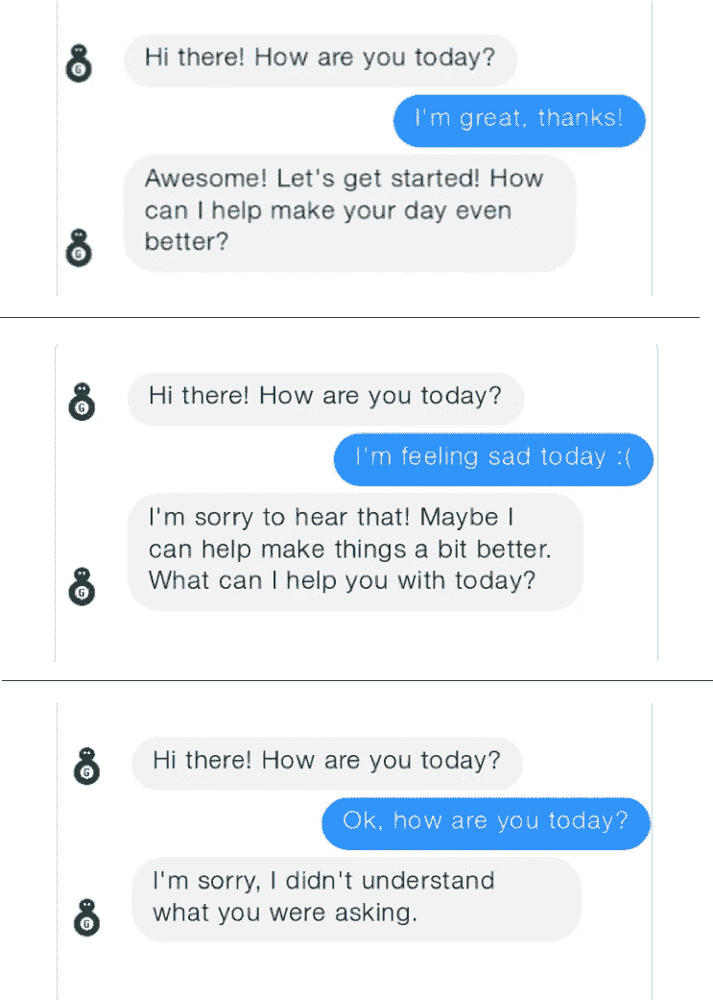

# 对话式设计新手？从这里开始。

> 原文：<https://medium.com/hackernoon/new-to-conversational-design-start-here-7f2f3a1b81bb>

给那些刚接触聊天机器人的人一些建议。

从网页设计转向对话式设计可能有点吓人，但在开始之前，你不需要花几个月的时间来发展语言和脚本写作技能。我总结了一些我从学习语言和会话中学到的关键东西，你可以在开始构建聊天机器人时使用它们。

## 1.理解良好对话的“规则”

好吧，一段对话其实并没有成文的规则或法律，但有一些准则是大多数人在没有意识到的情况下遵循的。一位名叫[保罗·格莱斯](https://en.wikipedia.org/wiki/Paul_Grice)的哲学家对这些指导方针做了一个很好的总结。不要惊慌，我不是送你去读一本哲学书，我已经在这里为你总结了大部分要点。他的原则被称为会话准则，我在这里对它们进行了解释:

*   **切题**
    大多数聊天机器人对这个没有问题，它们经常不能处理除了它们被设计用来做的以外的任何事情！
*   **准确诚实**
    光诚实是不够的。确保你也是准确的。如果你的意思是“我找不到任何关于那方面的信息”，不要说“没有任何关于那方面的信息”。
*   **要清楚**
    始终确保你使用的是你的用户能理解的单词和短语。此外，确保在不清楚的地方说出重要的细节。
*   **不要说得比需要的多(或少)**
    这在语音界面中尤其重要，但对所有人来说都是关键。不要把重要信息隐藏在其他不重要的信息中。

对照这四条准则评估你写的对话的每一部分，你将有一个良好的开端。

## 2.了解正常的对话是什么样的

我经常听到人们说“你的用户可以说任何事情”，虽然这在技术上是正确的，但大多数人并不只是说任何事情。

虽然您不能要求您的用户遵循上一节的指导方针，但是人们通常会自然而然地这样做。同样的逻辑也适用于构建机器人。除非你的用户故意混淆视听，否则大多数人会保持他们的对话是相关的。然而，要做到这一点，人们需要理解什么是相关。你的聊天机器人应该非常清楚它期望进行什么样的对话(并且能够处理)。这对你也有好处，因为如果聊天机器人不总是说它不明白，它会减少用户的挫折感。

> 大多数用户不会随便说些什么——他们会努力抓住谈话中有意义的话题。

此外，对话有一个模式。每个人轮流。问候要用问候回应，问题要有答案。你为聊天机器人写的对话应该试着遵循和尊重这些模式。它应该能够回应简单的社交短语，如“你好”、“再见”和“谢谢”。更重要的是，它永远不应该问一个它不能接受或理解答案的问题。

谈话也很有社会性。我们调整自己的说话方式，以适应和我们说话的人，并使用和他们一样的词语。如果你的聊天机器人使用某些单词或短语，确保用户理解它们。

下面我们来看一个例子。当有人问你怎么样时，一个正常的反应是通过重复这个问题来回应并回报你——这是一个正常的模式，也是有人对你所说的话进行反思的一个例子。如果你的聊天机器人要问某人怎么样，它需要能够回答同样的问题。

如果你在谈话中确实发现了这样的事情，后退一步，考虑一下这部分谈话是否有必要。有时候，我能给某人的关于部分对话的最佳建议是删除它。记住第一点——保持相关性。如果对话不是你聊天机器人的目的的一部分，那么不要把你所有的注意力都放在试图修复它上。

最后，记住事情可能会出错，当用户出错时，你需要善待他们。即使你的用户说了一些意想不到的话，你也应该让你的聊天机器人承担责任。你的用户没有说错话——你只是没有理解。

> 不管怎样，在对话中用户总是对的。

当你开始设计的时候，你应该确保你的聊天机器人在不理解的时候道歉。随着你开始获得更多的经验并改进你的聊天机器人，你可以使用更多的高级策略。你可以在这篇[博客文章](https://chatbotsmagazine.com/helping-your-baby-bot-learn-to-chat-like-a-grown-up-bot-99f5170f1c55)中获得更多细节。

这里有一个简短的总结:

*   确保你的用户清楚你的聊天机器人能做什么。
*   使用你希望用户使用的相同的单词和短语。
*   不要让谈话变得不必要的复杂。
*   不要让你的用户感到尴尬——承担任何出错的责任。

## 3.计划和实践，实践，实践

和所有事情一样，在开始之前，你必须把事情想清楚，并在过程中不断学习和完善。

**为你的谈话流程制定一个计划**

在过程的早期为你的谈话制定一个计划是很重要的。你应该把它画出来——无论是在纸上、白板上、电子表格中还是使用工具。

**扮演你的机器人**

一个快速了解你们对话的方法是抓住另一个人，让你们中的一个扮演机器人，另一个扮演用户。玩机器人的人只能用你事先计划好的回答来回应。

> 设身处地为你的聊天机器人着想——成为机器人

如果你的机器人使用语音界面，坐在你们看不到对方的地方，以消除任何视觉反馈。如果你的机器人在一个消息应用程序中，你可能想在那里进行对话。我发现这是一个很神奇的方法，可以很快看出对话哪里听起来奇怪。这也有助于强调你是否忘记了加入某些场景。

**获得大量反馈**

在你发布之前，试着和尽可能多的人展示和测试你的机器人对话。有很多工具可以用来做这件事。例如，Alexa 允许你邀请预览用户，或者你可以在你真正使用模型和工具如[机器人社会](https://botsociety.io/?utm_source=blog&utm_medium=tutorial&utm_campaign=beginnerdesign)构建之前测试你的机器人。
不管你用什么方法，反馈都会帮助你了解聊天机器人的良好对话是什么样子的。这不仅仅在你刚开始的时候很重要，这将是一个持续的过程，让你的聊天机器人变得越来越好。我知道我一直都在学习新的东西！

## 4.寻求帮助是可以的

你可能会经历所有这些步骤，并发现你仍然很难写出一篇好的对话。没关系。如果你想继续学习，还有很多其他资源，但也可以让其他人帮助你构建一个机器人。不是每个人都擅长所有的事情。如果你的背景不是创意写作或用户体验，你可能想找一个有这些技能的人。组建一个拥有多种技能的团队——你不必一个人做所有的事情。

*如果您觉得这篇文章有用或有趣，请👏下面还是分享给别人吧。你也可以在这里关注我，或者在 Twitter*[*@ virtual gill*](https://twitter.com/virtualgill)*。*

*最初发表于* [*僵尸网络博客*](https://botsociety.io/blog/2018/04/conversational-design/) *。*