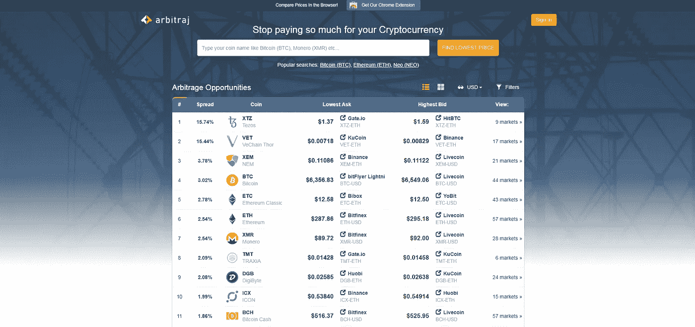

# 在熊市(或横盘)加密货币市场中寻找利润

> 原文：<https://medium.com/hackernoon/new-tools-enable-profit-in-a-bear-or-sideways-cryptocurrency-market-43bda281d6a5>

随着[加密货币](https://hackernoon.com/tagged/cryptocurrency)市场经历一个我(和[其他人](https://coloringcrypto.com/index.php/2018/07/22/48-part-3-the-great-gestation-consensus-currencies-and-the-stone-age-with-miko-matsumura/))称之为“[大加密孕育](/blockstreethq/summer-2018-the-great-gestation-3789e7e6f4f8)”的增长阶段，主要加密货币市场价格已经下降或横盘整理，我越来越多地被问到这样一个问题:“当市场如此时，一个人如何赚钱？”

对于大多数人来说，答案很简单:*什么都不要做*。如果基本的基本面没有改变——你买入的原因和其他重要因素——并且你有能力这样做，等待横盘行情结束。坚持你的信念。

但是如果你对更积极的策略感兴趣，我有一些新工具你可以考虑。

*快速提示:我不是任何形式的财务顾问或律师。这不是任何形式的财务或法律建议。做你自己的努力，决定这些方法或工具是否适合你和你的风险状况。*

## 交易差价:套利

新推出的 [Arbitraj.io](https://www.arbitraj.io/) 简化了加密货币套利交易。Arbitraj 主页会提醒你价格差异，你可以利用多个加密货币交易所的账户。

在这张截图中，你可以看到一个明显的强劲交易机会:你可以在 KuCoin 上以 0.00718 美元的价格购买 VET，在币安上以 0.00829 美元的价格出售，快速获得 15%以上的利润。

Arbitraj.io 扫描了 20 多个交易所，寻找这样的机会——只要你愿意开立(并跟踪)几十个交易所账户，这是快速交易想法的绝佳资源。

链接: [Arbitraj 主页](http://arbitraj.io)、[谷歌 Chrome 扩展](https://l.facebook.com/l.php?u=https%3A%2F%2Fchrome.google.com%2Fwebstore%2Fdetail%2Farbitraj-crypto-price-com%2Fkannkflplphkpabjoibccfgjkdhhcbmg&h=AT1BORXAAIoYoPj9PEU9E_Z-YWfnD1PPeXWWHpN4w38OEujbNnnPwIy6sWW00iFpGM_t_2mcAIBKa8s7kMMBQhtE6dMd1kq294WguWUojO1TrGd8uufkldBRCJDBzj2DbyExmRSX)、[产品搜索列表](https://www.producthunt.com/upcoming/arbitraj-io)

## 交换对子

在加密货币中，“交易对”描述了一种加密货币与另一种加密货币的交易。这与大多数人对加密货币定价的看法不同——“比特币今天是 5000 美元”，只考虑了 BTC/美元对。

这是一个很好的日常操作方法，但是考虑一下这个假设:你购买 1 BTC(价值 5000 美元)，持有 5000 美元，想要收购 10 ETH(以 500 美元/ETH 的价格)。

第二天，BTC 的价值增加了 10%——现在价值 5500 美元/BTC——而 ETH 保持不变(500 美元/ETH)。你现在可以用第一天的 1 BTC 买 11 个 ETH，而你的美元只能买 10 个 ETH。

*真正的*盈利交易策略更加复杂——我建议寻找一些外汇交易书籍或资源——但任何时候一种主要加密货币的走势与另一种不同，都有机会。

## 提供贷款

如果你是 Poloniex 这样的交易所的主要加密软件的忠实持有者，你可以将你的股份用于贷款并赚取利息。

我看到利率变化很大，所以你的收益可能不同，但这些被认为是低风险贷款，因为 Poloniex 确保杠杆保证金交易者在偿还贷款的水平上清算。(我只在 Poloniex 上这样做过，不能为其他任何交流体验代言。)

## 考虑一个短

如果你看着你的 BTC 失去价值或踩水，而 CoinX 暴涨，你可能要考虑建立一个空头头寸，打赌资产(在这种情况下 CoinX)的价格会下降。

你实际上是在以 1.00 美元的价格卖出 CoinX，然后**和**希望在未来以 0.75 美元的价格买入 CoinX，这样你就可以保持 0.25 美元/CoinX 的利润。许多主要的交易所都允许这种交易。

重要提示:在这里很容易用美元来思考，但是在开始做空之前理解交易对是很重要的。如果你做空 BTC/CoinX 货币对，CoinX 的美元价值走向并不重要，重要的是 BTC 相对于 CoinX 的表现。

**记住:“牛赚钱，熊赚钱，猪被宰。”**

祝你好运。

*Andrew J. Chapin 是* [*Benja*](http://benja.co) *的联合创始人& CEO，Benja*[*Benja Coin*](http://benjacoin.com)*token 项目的负责人，以及《最初的硬币发行艺术* *的作者。今年 11 月，安德鲁正在为* [*运动员跑纽约市马拉松，以结束老年痴呆症*](https://give.caringkindnyc.org/index.cfm?fuseaction=donate.participant&participantID=33993) *。*