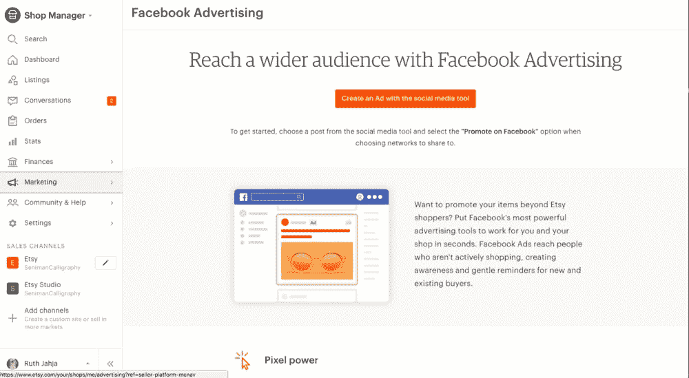

# 新的一年，新的项目

> 原文：<https://medium.com/hackernoon/new-year-new-side-project-b8c29dfb1788>

去年上半年，我制造了我的第一个 [SaaS](https://hackernoon.com/tagged/saas) 产品。事情进展得很顺利。我能够在一些著名的出版物上得到特写，并有一个适度的出道。虽然很小，但轨迹正朝着正确的方向前进。我在这一年的最后几个月花了全部时间在[新奇](http://getnovelty.com/)上，使我的流量翻了一番。直到事情出了岔子……嗯，我可能会被迫再次转向或快速迭代开发。

这是我的第一个兼职项目，也是我第一次失败。事后看来，这个项目失败的原因是有道理的。我老婆甚至称之为！

新奇是 Etsy 卖家的一个[营销](https://hackernoon.com/tagged/marketing)平台。它与 Etsy 的 API 挂钩，允许你使用你的产品制作脸书广告。它最初是作为一个副业项目开始的。我想建立一个 web 应用程序，连接 Stripe，然后把它放到 AWS 上。任务成功！我没有意识到的是主要功能(广告创意和分析)很容易复制。像 Etsy 这样的大型科技公司可以在几周内实现。他们做到了。上个月，Etsy 在其商店经理中发布了脸书广告功能。

这是一个明显的迹象，表明我应该立即转向别的事情。我现在唯一能竞争的方式就是大力迭代开发，从本质上提供一种更好的方式来运行脸书广告…作为一名 bootstrap 工程师/创始人，我的机会看起来很渺茫…

我已经考虑过了，最好的办法是让它自动运行。我不介意支付服务器费用，但我会停止运行所有广告。我也停止了编写新功能的代码。我将继续推销我的产品，作为 Etsy 和脸书广告经理的更好选择，但我计划兼职做这项工作。与此同时，我已经开始从事自由职业，以帮助补充这个为期 7 个月的实验的费用。

我肯定要开始一个新的副业了！这个实验告诉我，SaaS 很难，但更重要的是，制造产品很有趣！我对建造坚固的东西有多难有了新的认识。

那么我对下一个副业有什么想法呢？嗯，我拥有 built.withetsy.com，所以可能会为 Etsy 企业家建立一个基于社区的网站。一个让他们分享故事的地方。这可能会解决我的留人问题。这也可能是一个交叉推广新奇事物的好地方。我对区块链和域名套利也很感兴趣。因此，我很可能会开始测试围绕这两个主题的不同想法，看看我感兴趣的是什么。我喜欢不断涉猎边缘，这只是一种跟上现代科技的方式。

# 失败了，但学到了

Adtech 很难！推出好的营销软件需要大量的开发时间。我还遇到了大多数科技产品的所有常见陷阱……例如，入职和留任都很难。用户会到达网站，却不知道他们到底应该做什么。我已经修复了这些问题，但是有无数次我不知疲倦地推销我的产品，却发现由于代码中的错误，用户越来越少。对于 SaaS/广告技术公司来说，有太多的不稳定因素，在你启动之前尽可能多的稳定下来是非常必要的。

# 这个故事的寓意

*   尽可能让你的产品易于使用。
*   在你开始测试之前，测试，测试！
*   多花点时间销售，少花点时间开发。
*   当你失败时，快速转向

# 你怎么想呢?

我是不是应该辞职去做别的？继续战斗。通过评论或给我发电子邮件让我知道！alex@getnovelty.com

*原载于 2018 年 1 月 4 日*[*【www.alexdaro.com】*](https://www.alexdaro.com/writing/new-year-new-side-project)*。*