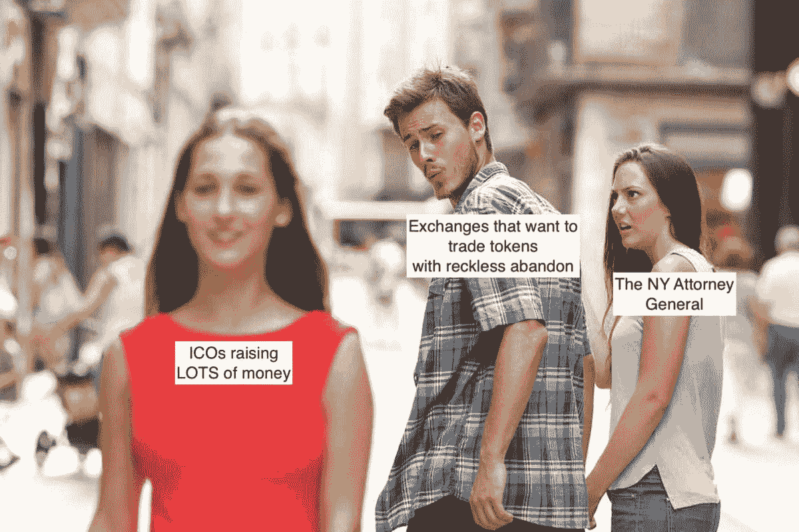

# 纽约通知所有交易所

> 原文：<https://medium.com/hackernoon/new-york-puts-all-exchanges-on-notice-52de9b666646>

就在我为几天后即将召开的公司峰会疯狂工作时，我收到了一位律师朋友的 ping，他说纽约司法部长 Schneiderman 已经向大多数美国加密交易所发出了信息请求。该请求包括一份非常详细的问题清单。从本质上讲，这是一种简单的传票形式，要求所有公司详细说明他们是如何操作他们的“交易所”的。

收到这张传票的公司是这个行业的名人录:Gdax(比特币基地)、Gemini、bigFlyer、币安、Bitfinex、Bitstamp、Bittrex、itBit、Gate.io、Huobi。Pro、北海巨妖、Tidex 和 Poloniex(圆形)。

那么这对这些交易所和加密货币市场的其他部分意味着什么呢？毕竟，SEC 已经在他们关于加密货币交易的[公告](https://www.sec.gov/news/public-statement/enforcement-tm-statement-potentially-unlawful-online-platforms-trading)中明确指出，大多数交易所需要注册为交易所或寻求豁免，例如注册为经纪交易商，然后获得 ATS 的批准。到目前为止，这个通知被置若罔闻。这些公司都没有遵守 SEC 的要求。纽约司法部长似乎已经决定用他自己的方法让这些公司遵守法律规则。

你们中的一些人可能知道，纽约州是第一个为加密货币创建监管许可证的州，名为 BitLicense，于 2015 年 8 月 8 日上线。自那以后，只有少数公司获得了批准。该列表包括圆形、波纹和比特币基地。

然而，包括 Bitpay 在内的许多其他行业参与者不得不将任何纽约居民从他们的客户名单中删除。这也意味着许多 ico 远离纽约居民，因为汇款人的定义非常模糊，可能还包括向纽约居民出售公用事业代币。

随着 Schneiderman 今天宣布的新的[虚拟市场诚信倡议](https://ag.ny.gov/sites/default/files/virtual_markets_integrity_initiative_questionnaire.pdf)，纽约州为其他各州进行同样的调查铺平了道路。司法部长也可能正在为 SEC 做这项工作，因为 SEC 最近向通过 ICO 发行公用事业令牌的公司发出了一船传票。

这一行动显然符合美国证券交易委员会一段时间以来一直在说的话:要么遵守规则，要么停止你正在做的任何事情。说到交易所，事实证明，证券交易的规则再清楚不过了。你必须是一个经纪自营商或注册交易所。句号。对于许多大玩家来说，这将是一次突然的觉醒。有传言称，有些人一天的交易额就超过了 5 亿美元！

我在之前的一篇文章 [4 种替代硬币交易所促进欺诈的方式](https://hackernoon.com/4-ways-altcoin-exchanges-promote-fraud-611648ecb86c)中写过一些加密交易所的困境和明显的欺诈行为。看起来纽约可能已经阅读了它，并决定推进该倡议；)

但我不这么认为。可能是纽约居民的抱怨引起了《纽约律师杂志》的注意，他们在一些公共抽水和倾倒计划、内幕交易和抢先计划中损失了钱。让庞兹或麦道夫看起来像天使的骗局。

然而好消息来了。许多公司已经向美国证券交易委员会提交了注册申请或修正案，以便能够合法经营替代交易系统(ATS)。像 tZERO、Templum 和 StartEngine(声明:我是首席执行官)这样的公司正在不知疲倦地工作。显然，如果纽约和其他州要求交易所停止运营，那么投资者的需求将会出现巨大的真空。这些新公司将能够填补这一空白。

ATS 对投资者的主要好处在于，ATS 是由一家经纪交易商运营的，该经纪交易商在美国证券交易委员会注册，并接受 FINRA 的监督。此外，FINRA 还制定了一系列规则来帮助投资者，使 ATS 成为一个透明、公平的证券交易平台。此外，FINRA 的年度审计以及监管机构暂停交易的能力也是一个因素。

所有这些都为投资者提供了一个更好的交易场所。然而，这些好处也是有代价的，而且并不便宜。实施监管需要成本，而这种成本将会转嫁给投资者。重要的是，所有向投资者提供交易服务的公司都要遵守同样的规定，因此支付同样的费用。

随着首次公开募股(ICO)市场转变为受监管的 ICO 或 ICO 2.0s，投资者可以购买首次公开募股，如安全令牌，并能够做出明智的决定，因为监管机构确保公司公开所有必需的信息。现在，人们也期待交易所进行同样的转变。

该市场的一个大想法是创建一个 ATS 平台网络，这些平台将协同工作，为投资者提供最佳执行。对于现有的金融服务市场来说，这不是一个新想法，但对于加密货币市场来说，这是一个新想法。想象一下，如果所有的交易所都连接在一起，并能够扩大他们交易的加密货币的流动性，会是什么样？

这对于经纪自营商来说是可能的，因为他们可以分享佣金，更好地匹配买家和卖家。这并不是 ATS 运营商的唯一优势。这也将允许与外国投资者进行交易，外国投资者可以将其受监管的交易所与受监管的美国交易所联系起来。