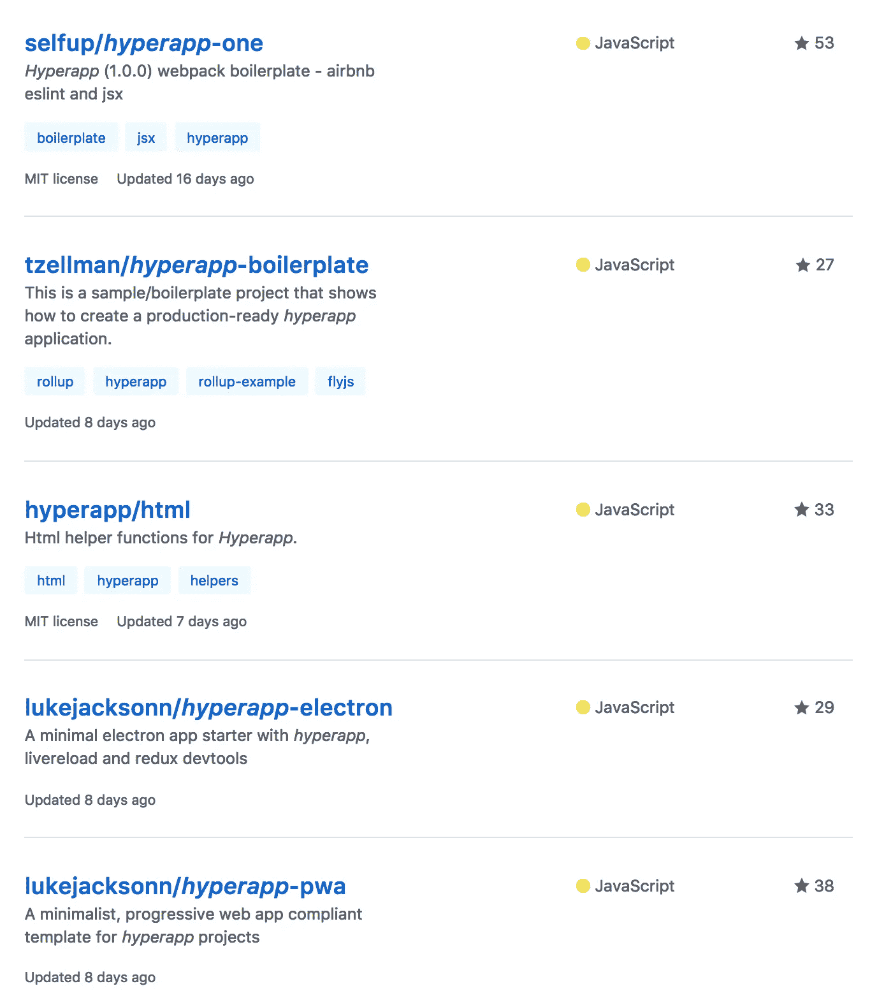

# Next.js，Razzle，CRA。为什么你应该在下一个项目中使用它们。

> 原文：<https://medium.com/hackernoon/next-js-razzle-cra-why-you-should-use-them-for-a-next-project-a78d320de97f>

# TL；DR:不要编写和使用定制的启动器。

CRA core + universality = Razzle

**亲爱的开发者们，请不要再写和使用“启动器”了。**

启动器( ***React-starter-kit、*React-redux-universal-hot-example、** *等* **)。**):

*   臃肿，有大量不必要的功能
*   没有版本化，只能通过新的分支/重拉进行更新
*   作为一个存储库，而不是一个[模块](https://hackernoon.com/tagged/module)
*   没有得到适当的维护，大多数初学者都有许多未解决的问题
*   代码[不可读](https://hackernoon.com/tagged/unreadable)，指南和常见问题解答没有帮助
*   是非模块化的，用户不能轻易地从样板文件中移植或扩展它

工具箱([***【CRA】***](https://github.com/facebookincubator/create-react-app)***，***[***razzle***](https://github.com/jaredpalmer/razzle)***，nwb*** )和框架( [***下一个***](https://github.com/zeit/next.js) ***，***[***Nuxt***](https://nuxtjs.org/)

*   只包含最基本的功能
*   作为国家预防机制模块存在
*   由专业社区进行版本化和维护
*   有很棒的文档和指南
*   是模块化的，用户可以轻松地迁移和扩展自己的设置

记住**你的小车启动器**，*不管是全功能的还是轻量级的*，都会被**真实生产项目**中的一些人使用。此外，您需要**维护**您的启动器，解决问题并添加新功能。即使在你存档了你的回购之后，你的代码仍然会在某人的服务器和浏览器上运行。

> 不要浪费其他开发者的时间。不要试图抗拒未来。如果你不能带来新的想法，最好做一个贡献者。

像 **CRA 和 Next.js** 这样的工具创建了一个**版本化的、标准的、统一的**开发环境和方法，如果需要的话，它可以被**轻松扩展**。

 [## Facebook incubator/创建-反应-应用

### 创建没有构建配置的 react 应用程序。

github.com](https://github.com/facebookincubator/create-react-app)  [## zeit/next.js

### next.js -服务器渲染或静态导出 React 应用的框架

github.com](https://github.com/zeit/next.js/)  [## jaredpalmer/razzle

### razzle - ✨创建服务器渲染的通用 JavaScript 应用程序，无需任何配置

github.com](https://github.com/jaredpalmer/razzle)  [## Nuxt.js -通用 Vue.js 应用程序

### js 是创建 Vue.js 应用程序的最小框架，具有服务器端渲染、代码分割、热…

nuxtjs.org](https://nuxtjs.org/)  [## 纽约时报/kyt

### 开始一个新的 JS 应用？使用 kyt 构建、测试和运行高级应用🔥

github.com](https://github.com/NYTimes/kyt)  [## 📦包裹

### 极快的零配置 web 应用捆绑器

parceljs.org](https://parceljs.org/) 

UPD:我已经收到几十条关于这篇文章负面语气的评论。我来澄清几件事:

*   如果你确定除了你之外没有人会使用这段代码，你可以使用任何样板文件。
*   初始项目设置可以成为一个标准，就像代码风格约定(styleguide)。
*   “复制-粘贴”项目可能会永远继续下去，直到带有可扩展 webpack 配置的统一初始设置出现。
*   我不会让人们忽视内在。甚至反之亦然——尽可能多地学习。但是不能保证这是一个“好”的样板文件。
*   初始项目设置可能会成为一种标准，就像代码风格约定一样。使用这样的工具创建一个项目就像遵循一个样式指南。

## 为什么启动器会存在？

每次有新的东西出版，大多数人都开始寻找样板文件。没错；他们想尝试一种新的解放运动。如果没有样板文件——你可以试着写出来，让它流行起来(*然后修改这个 sh#t，直到你的 repo* 中没有 400 多个问题。

# 首发到底出现在哪里？

我认为“样板时代”从**约曼**开始——样板生成器。让我澄清一下:约曼在出现的时候是一个非常进步的想法。

由于当时文件处理的复杂性和糟糕的开发环境，Yeoman 生成器非常有用。项目由 Gulp 脚本的子集提供支持，这些脚本集成了非常不同的工具:****browser sync****，****livereload****，****browser ify****等。**

> *例如，AngularJS 在 1.3 版中不支持延迟加载和缩小。StackExchange 上没有任何关于 AngularJS 的 LL + minify + es6 的有用信息，所以克隆一个具有这些特性的启动器是开始开发的唯一方法。那是 2014 年。*

# *今天的首发*

*现在，我们有很棒的 Webpack 来解决文件处理和延迟加载的所有问题，有 Angular 和 Vue 中的 SSR 插件，有像 CRA/razzle/Next.js/nwb 这样的解决方案。有什么理由要造首发？*

## *神话——启动程序可以加速发展*

*那基本上是个神话。你必须花更多的时间开始和初学者一起工作。启动程序的哪一部分加速了开发？最明显的答案——代码组织+ Webpack 配置。如果代码组织可能是一个开放的问题，显然**是 90%的初学者的成功。***

***razzle/Next.js** 已经预定义了你的 webpack 配置，但最重要的是:**他们正在以统一的方式做这件事，并允许单独存储自定义配置。或者甚至将其区分为 npm 模块。***

*当你使用 CRA/razzle/等的时候。，您总是知道您的同事或其他开发人员将使用您的代码，而不必花费时间研究不可读的错误设置。*

## *神话——如果 starter 有<libname>，它已经如你所愿集成了</libname>*

*大多数初学者拥有从 GraphQL 到很少见到的 Redux 插件的所有功能。这导致了一个臃肿，不可读，但最重要的是，不可用的启动器。特别是对于那些寻找不太复杂和轻量级的东西的开发人员。*

> *这也解释了为什么人们无限地编写新的“轻量级”首发。*

## *拜托，停下来！*

*只要数一数 [*牛逼-反应*](https://github.com/enaqx/awesome-react) 列表— **31** 中有多少样板文件就知道了。 **31 个完全不同的样板文件**，其中一些有 **400 多个问题。这是最好的列表之一。***

*几个月前我写了这个“清单”,但直到今天才发表。
今天我在搜索 **hyperapp** 的路由时，意外看到了这个:*

**

*Just search “hyperapp” on Github*

*当你阅读这篇文章的时候，已经有人用错误的启动程序启动了 spam Github。没有维护者支持的完全无用的“牛逼列表”将很快出现。*

> *不要为⭐️.写软件
> 写软件带来新东西。*

*我们需要**规范**至少样板和构建工具，让**真正牛逼的列表**、**不要炒作。***

## *不要炒作*

*你还记得[反应过来的](https://github.com/reactide/reactide)吗？这是一个好主意(7.5k ⭐)️，但… [任何真正的产品仍然不存在。](https://github.com/reactide/reactide/issues/126)*

## *标准化之我见*

*   *为特定的生态系统(即`really-awesome-react`)制作一个**维护的**“真正牛逼的清单”。[此外，还有很棒的工具包列表。](https://github.com/reyronald/awesome-toolkits)*
*   *在 awesome 列表中突出维护级别和受欢迎程度。*
*   *忽略任何构建“Bootstrap 与 React 的又一次集成”的尝试。*

> *我研究了许多流行的样板文件，甚至[还制作了一个流行的](https://github.com/Metnew/suicrux)，我确信我们应该应对这个“老式的启动者时代”。*

> *此外，一些首发也很棒。并不是所有的首发都像上面描述的那么差。*

***感谢阅读，希望真的能有所改变。转贴这篇文章——让人们停止为明星写软件，开始在真正进步的项目上合作。** Github:[@ met new](https://github.com/Metnew)
Twitter:[@ Vladimir _ met new](https://twitter.com/vladimir_metnew)*