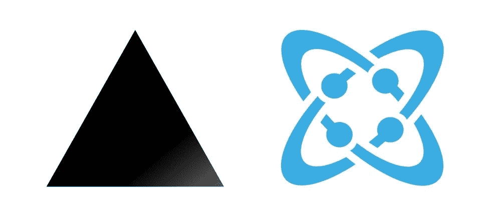
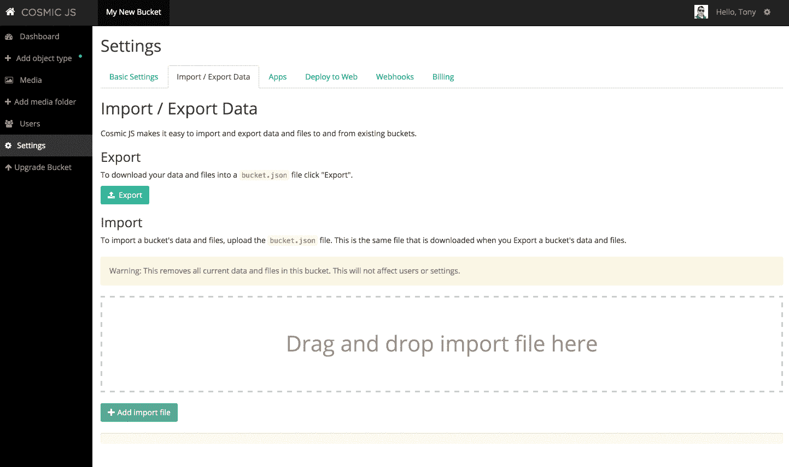

# Next.js 网站样板文件

> 原文：<https://medium.com/hackernoon/next-js-website-boilerplate-5134f560423e>



看看这个建立在 [Next.js](https://github.com/zeit/next.js/) 和 [Cosmic JS](https://cosmicjs.com/) 上的[网站样本](https://github.com/cosmicjs/nextjs-website-boilerplate)。它满足了一些常见的网站需求，包括动态页面、博客文章、作者管理、SEO 能力、联系形式和网站搜索。

# TL；速度三角形定位法(dead reckoning)

[下载 Next.js 网站样板 GitHub repo](https://github.com/cosmicjs/nextjs-website-boilerplate) 。
[查看演示。](https://cosmicjs.com/apps/nextjs-website-boilerplate)

# 特征

1.完全响应移动 w/ [引导程序](http://getbootstrap.com/)前端
2。SEO 就绪
3。一个联系表格，发送一封电子邮件到你选择的邮箱和 [Cosmic JS](https://cosmicjs.com/) 以便参考
4。全站搜索功能
5。所有内容都可以在 [Cosmic JS](https://cosmicjs.com/) 中轻松管理，包括页面、博客和联系信息。注册[宇宙 JS](https://cosmicjs.com/) 来安装演示内容和部署这个网站。

# 开始

```
git clone [https://github.com/cosmicjs/nextjs-website-boilerplate](https://github.com/cosmicjs/nextjs-website-boilerplate)
cd medical-professional-next-js  
npm install
```

将 **bucket.json** 文件导入到你的 Cosmic JS Bucket 中。为此，请转到您的存储区>设置>导入/导出数据。或者通过 [Next.js 网站 app 页面](https://cosmicjs.com/apps/nextjs-website-boilerplate)安装 App。



# 投入生产

```
COSMIC_BUCKET=your-bucket-slug npm start
```

转到 [http://localhost:3000](http://localhost:3000/)

# 在开发中运行

```
npm run dev
```

转到 [http://localhost:5000](http://localhost:5000/) 。

# 安装ˌ使成形

联系邮件因为 Next.js 没有邮件服务器，所以联系表单使用 mailgun 发送邮件。因此，在配置文件中添加以下常量。