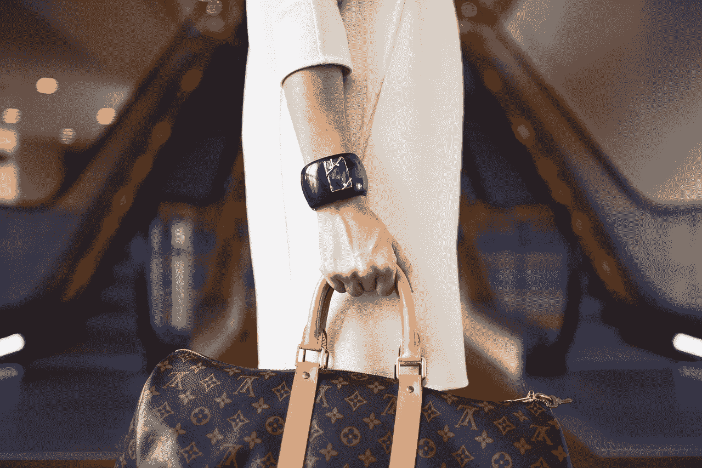

# 下一级验证和个人奢侈品行业的未来

> 原文：<https://medium.com/hackernoon/next-level-verification-and-the-future-of-the-personal-luxury-goods-industry-236f5cfbd020>

时尚和奢侈品行业发展的主要威胁之一是假冒商品的盛行。价值 4500 亿美元的假冒奢侈品市场使得奢侈品牌和零售连锁店越来越难以获得全球消费者的信任。在更早的时候，人们可以在街头市场或附近的小贩那里找到假冒商品，如假冒的名牌手袋、手表和皮带。但今天，市场已经变得先进，已经到达各种社交媒体平台，甚至流行的电子商务网站。假冒商品的销售变得越来越普遍，越来越难被发现，这一事实也无助于形势。

流行的社交媒体平台，例如脸书，已经成为这些假冒商品卖家接触大众受众的理想渠道。 [Business Insider 进行了一项调查](http://www.businessinsider.com/facebook-marketplace-fake-designer-scammers-2018-3),调查显示以 70 美元或更低的价格购买假劳力士手表、古驰包和蒂芙尼手镯非常容易。没有一件商品在网上被标为假货。

虽然这些社交媒体平台上存在反对销售或宣传假冒商品的政策，但如果没有人举报违规方，这些政策就无法完全生效。亚马逊和易贝等主要电子商务平台也在努力打击假货销售，但他们投入了更多的时间和精力来执行他们的打假计划。

另一个令人担忧的问题是，假冒商品的生产商开始变得越来越老练。设计师仿冒品过去很容易识别。但最近一段时间，假冒奢侈品在外观上变得更加逼真。据报道，[这些被称为“超级假货”或“3a 假货”的商品在奢侈品市场引起了轩然大波。购物者抱怨从零售连锁店购买所谓的正品，却发现产品实际上是假货。](https://fashionista.com/2018/03/counterfeit-knockoff-handbags-authenticity)

奢侈品市场缺乏透明度和真实性，使得该行业难以向前推进。二手奢侈品市场更是如此。人们不愿意相信卖家——不管是通过正式还是非正式渠道——因为害怕上当。在过去的 20 年里，全球售出了价值超过 3 万亿美元的奢侈品。在这 3 万亿美元中，至少有 810 亿美元的商品闲置在人们的家中。假冒奢侈品市场正在阻碍二手奢侈品市场，这需要改变。

幸运的是，区块链科技和 LUXCHAIN 等公司已经奋起迎接挑战，克服奢侈品市场的障碍。LUXCHAIN 拥有一个商业智能门户，采用由人工智能和区块链驱动的[奢侈品全球价格指数技术](https://www.forbes.com/sites/outofasia/2017/09/14/why-we-need-to-recycle-reinvent-and-revive-the-luxury-goods-market/)。它跟踪 20 个国家 600 多家商家的实时产品数据和价格。

LUXCHAIN 的分散验证解决方案将解决个人奢侈品行业的三个关键问题:不可靠的产品真实性、透明的数据和估价。假冒商品仍然是全球奢侈品行业的最大威胁之一，尤其是在时尚领域，此类商品销量增长的主要原因可以追溯到缺乏高质量产品验证和信息的手段。

为了使这一解决方案成为现实，LUXCHAIN 正在整合数字身份(数字 ID)和数字资产——这一技术将无限期地遏制假冒问题。

简单地说，数字身份将允许用户完全控制他们的身份。这意味着他们对自己的个人信息拥有完全的自主权。这消除了中央党识别任何人的身份的需要。用户仍然需要首先通过 KYC(了解你的客户)来识别自己的身份，但关键是一旦用户的数据得到验证，他们就可以完全控制它。这些数据与数字资产相关联，历史被永久记录，这样欺诈者就不会再骗人了——因为我们可以通过 KYC 追踪他们。

数字资产简单地定义为物理项目的数字表示，其中包含有关实际产品的详细信息和数据。该信息存储在区块链上，并将附加到数字身份证上。这是为了在发生恶意行为时能够追踪到物主。

LUXCHAIN 创建的这一解决方案将允许奢侈品市场发生必要的变化。消费者将能够放心地购买他们想要的产品，而不必担心卖方的真实性或可靠性。假冒奢侈品市场也将随着这些先进的验证方法而逐渐停止，从而提高奢侈品市场的整体声誉。区块链技术继续向我们展示其在各个行业的必要性，证明其实施无疑是在正确的时间到来了。

大家分享一下自己的想法吧！