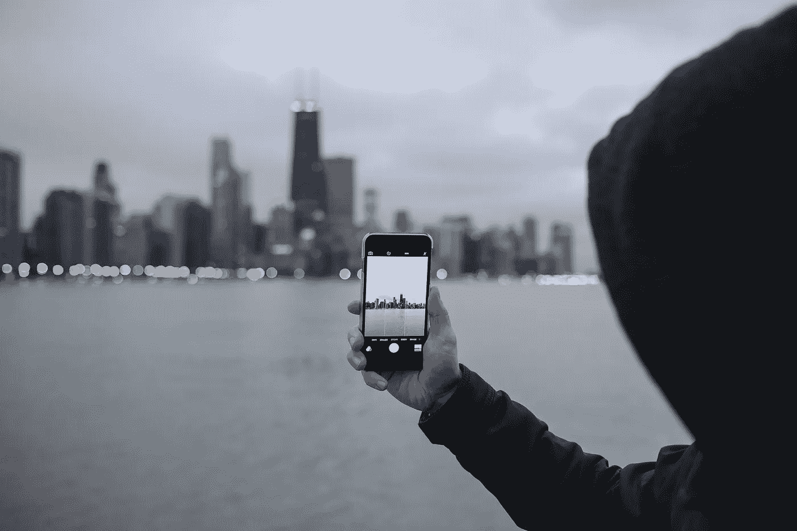
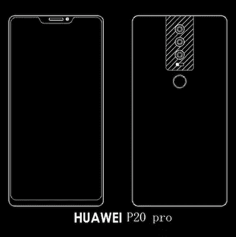

# 下个月，华为将在你的口袋里放 4 个摄像头。

> 原文：<https://medium.com/hackernoon/next-month-huawei-is-putting-4-cameras-in-your-pocket-37a1f5c893d6>

Smartphone cameras are about to kill DSLRs, starting with a new rumoured triple-lens Huawei P20.

我最近写了我对 2018 年摄影趋势的预测，我写的第一件事是**我仍然是计算摄影的坚定信徒**。

 [## 2018 年需要关注的 5 个照片行业趋势

### 每年，突破性的技术都会改变我们对摄影的看法。为了理解这些变化，我写道…

medium.com](/@tchebotarev/5-photo-industry-trends-to-keep-an-eye-on-in-2018-70284be8999d) 

然而，我没想到我的预测会发生得太快。这很快就会改变，因为据传华为[将发布世界上第一款背面有三个镜头的智能手机。预计这样的设置可能会产生 4000 万像素的图像，显然是由两个或更多的相机计算出来的。](https://www.gsmarena.com/so_thats_what_3_cameras_on_the_back_of_a_phone_look_like__alleged_huawei_p20_renders_are_here-news-29458.php)

虽然细节很少，但更重要的是趋势——我们将看到更多智能手机制造商采用多摄像头设置。

Rumoured design for Huawei’s upcoming P20.

对于华为即将推出的 P20，有几种布局选择:

1.  一个摄像头(在中间)是一个单色广角传感器，用于细节和对比度，而外面的两个摄像头是广角和长焦镜头。它们被分离得足够远，以产生“肖像”模式以及立体和其他计算照片效果。
2.  这三款相机可能都有颜色传感器，并且都有不同的焦距镜头，即 28 毫米(相当于 35 毫米相机)，56 毫米和 28 毫米。这种设置中的所有三个镜头都可以采用[光](https://medium.com/u/ec8d9d55952e?source=post_page-----37a1f5c893d6--------------------------------)方法，并且同一个聚焦镜头可以用于产生体内移动，以形成最终的计算图像。
3.  所有三个镜头可能采用不同的镜头，以实现独特的变焦功能，使手机更接近无反光镜或 DSLR 的领地。在这种情况下，24/28 毫米、56 毫米和 105 毫米的镜头可能会提供 1 倍、2 倍和 4 倍的光学变焦。再加上稳定性，这款手机可能会让摄影师羡慕不已。

不管设置如何，第一款三背相机手机的发布就是一个声明。华为[与苹果](https://www.androidauthority.com/huawei-largest-smartphone-maker-world-799630/)并列第二，成为世界上最大的智能手机制造商*，所以你可以肯定，库比蒂诺的人们正以极大的热情关注着这一中国威胁。*

*叶夫根尼·切博塔列夫创立了 [*500px*](https://medium.com/u/5075e6960d1?source=post_page-----37a1f5c893d6--------------------------------) *，一个拥有 1300 万摄影爱好者的强大社区，背靠* [*安德森·霍洛维茨*](https://medium.com/u/df45fd4a749d?source=post_page-----37a1f5c893d6--------------------------------) *。* *他是《福布斯》***的客座作家，《创业研磨台北》的联合导演，并帮助其他公司* [*解锁 10x 潜力*](http://e15v.com/) *。他在台湾台北工作。***