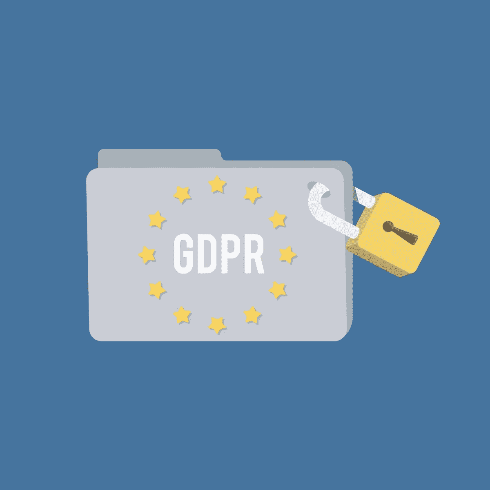

# GDPR 的下一步:2019 年将会发生什么？

> 原文：<https://medium.com/hackernoon/next-steps-in-gdpr-whats-to-come-in-2019-2137999a4607>

当通用数据保护条例(GDPR)于 2018 年 5 月对在欧盟运营或针对其公民的实体生效时，大多数人认为事情会立即发生变化。

但是，像大多数新的影响深远的规则一样，这一监管的效果并不完全明显。

以下是 2019 年一些与 GDPR 相关的变化。

# GDPR 合规将变得更加一致

所有行业的企业都在努力为 2018 年 5 月的最后期限做好准备。现在，研究表明，大多数组织仍然难以遵守其中的一个关键部分，特别是消费者可以要求公司提供其数据副本的部分。

GDPR 生效后进行的一项研究显示，大多数企业无法在规定的一个月时间内满足这一要求。此外，超过四分之三的零售部门实体没有完全回复。

分析师也参与进来，阐明企业不仅需要关注他们可能收到的罚款，还需要关注 GDPR 合规如何成为增强客户信任和整体业务增长的[驱动因素。因此，2019 年可能是各行业公司遵守 GDPR 的方式更加统一的一年，这将对客户的观点产生积极影响。](https://go.forrester.com/blogs/gdpr-fines-are-coming-but-they-wont-be-your-biggest-loss/)

此外，[在许多国家，与 GDPR 相关的投诉数量也大幅上升。一些受影响的实体仅仅收到了警告。一旦他们遵从了，监管者就认为问题得到了解决。然而，如果企业不表明他们与 GDPR 保持一致，他们就不应该指望这种宽大处理。](https://martechtoday.com/gdpr-complaints-stack-up-across-the-eu-as-regulators-prepare-to-issue-fines-226421)

# GDPR 将影响大数据伦理

GDPR 有七个关键组成部分，但每一个都详细说明了企业不能做什么，而不是实现目标的过程。因此，GDPR 可能会影响大数据伦理，因为公司参与数据治理和数据映射，以更加了解数据使用、数据存储和其他要素。

此外，数据科学家必须以不同于 GDPR 开始之前的方式对待信息。除非识别信息对数据的价值至关重要，否则分析该信息的人必须首先匿名。这只是 GDPR 将如何在 2019 年及以后对数据伦理产生广泛和具体影响的一个例子。

# 公司必须为其他隐私法做好准备

一些人谈论 GDPR，好像它是隐私法规的唯一发展。但还有其他一些企业很快需要遵守。2018 年加州消费者隐私法(CCPA) [在几个方面与 GDPR 不同](https://blog.treasuredata.com/blog/2018/07/17/gdpr-is-just-the-beginning-get-ready-for-ccpa/)，于 2020 年第一天生效。

首先，客户必须建立专门的渠道，供客户在请求企业提供的数据信息时使用。此外，CCPA 和 GDPR 的数据删除准则也不相同。

此外，欧盟将很快更新其电子隐私条例，部分涉及同意使用 cookie。但是，最新版本也将解决电子通信的 T4 处理。目前的电子隐私规则仅适用于传统电信提供商，这意味着 WhatsApp 和 Messenger 等应用背后的公司是清白的。

然而，对规则的拟议修改将使该规定适用于基于互联网的语音和消息应用程序。

# 监管者将开始更有信心地对具体因素进行裁决

各国对 GDPR 的罚款不一致，相关程序缓慢，其中一个可能的原因是，那些负责做出法律决定的人没有法律先例来指导他们的行动。然而，在 2019 年，人们应该期待监管机构对法律的解释变得更加简洁。

在 2019 年 11 月发生的一起涉及《华盛顿邮报》的案件中，英国监管机构决定，欧盟的一个人[不能自由同意](https://www.natlawreview.com/article/ico-warns-prominent-us-company-to-change-business-model-paid-subscription-versus)一家公司使用 cookie——这是 GDPR 的一项要求——如果该实体也提供不使用 cookie 的高级版本服务。

这一决定影响了 20 年来一直是美国标准的广告做法。

# 数据泄露的风险可能会上升

GDPR 打算让消费者的数据更安全，但这会导致全公司数据泄露的风险上升吗？

近四分之一的企业对这个话题进行了调查。他们指出，合规的需要造成了内部的分心，并占用了原本可能专门用于[网络安全](https://hackernoon.com/tagged/cybersecurity)的资源。调查受访者认为，与 GDPR 之前相比，现在的违规风险已经更高了。

# GDPR 可能会永远改变公司的运营方式

这篇报道只是 GDPR 事件可能发生的一个样本。

现在，是时候跟上发展的步伐了，看看有多少预测的事件发生了。

*所有图片通过* [*Rawpixel*](https://www.rawpixel.com)