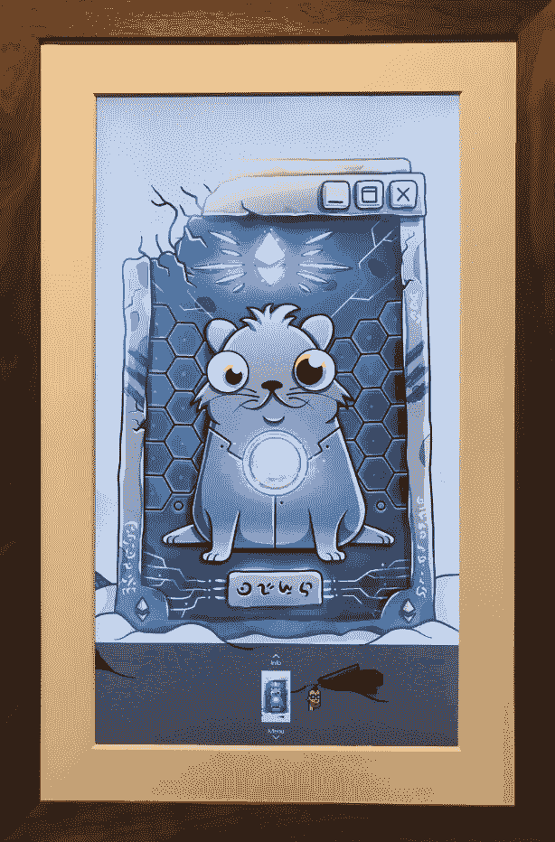

# NFTs 和数字纪念品的未来

> 原文：<https://medium.com/hackernoon/nfts-and-the-future-of-digital-memorabilia-ad39dad6b7f3>

Celestial Cyber Dimension by Guile Gaspar

我对电子竞技和不可替代代币(NFT)的交叉创造新的加密商品和数字纪念品的[数字](https://hackernoon.com/tagged/digital)经济的潜力感到兴奋，这可能成为加密资产的首批主流用途之一。在这篇文章中，我通过概述 NFT 游戏的三个阶段来探索采用的潜在阶段，我们正在通过在每个阶段接触更多的消费者和更大的市场价值来快速前进。

如果你不熟悉 NFTs，从这里的[开始](https://hackernoon.com/an-overview-of-non-fungible-tokens-5f140c32a70a)

**第一阶段:新数字收藏品的非功能性交易(数字豆豆娃)**

*例子:Cryptokitties*

*粗略估计的潜在市场规模:5000 万至 1 亿美元*

*粗略估计潜在用户:25k+*

NFT 游戏的第一个时代始于围绕具有基本效用的本地数字收藏品的游戏。 [Cryptokitties 开创了这种](https://www.nytimes.com/2017/12/28/style/cryptokitties-want-a-blockchain-snuggle.html)方式，人们购买数码猫来收集和玩游戏，通过繁殖它们来创造更多独特和稀有的猫。Cryptokitties 还展示了互操作性的价值，能够将这些资产带到其他游戏中，创建一个[生态系统](/@CryptoKitties/welcome-to-the-kittyverse-1e7fb65c8c55)，独立开发者在此基础上构建新的体验。这使得更多的消费者和开发者通过一个全新的视角来研究加密技术，这种视角超越了纯粹的金融应用，具有创造性和趣味性。与此同时，这些类型的游戏允许创意人员通过像 [Ethmoji](https://ethmoji.io/) 这样的项目赚取进入 crypto 的途径，这些项目为使用大型作品中的项目在 ETH 支付版税。然而，这些用户中的大多数可能是技术进步的早期采用者，或者已经对加密有所了解。

**第二阶段:体育收藏品的非功能性交易(数字棒球卡)**

例如:MLB 加密棒球

*粗略估计的潜在市场规模:5 亿美元——1B*

*粗略估计潜在用户:25M+(职业体育迷人数)*

宣布 [MLB 加密棒球](https://finance.yahoo.com/news/exclusive-major-league-baseball-going-crypto-134033104.html)表明，这将是第一个利用授权体育知识产权的加密收藏游戏，有可能创造“数字棒球卡”。下一个时代将传统运动与本地数字产品融合在一起，开辟了一系列连接线下和线上体验的有趣可能性。例如，他们可以让玩家的表现对数字产品的实地影响属性产生影响，就像像[不可阻挡](https://techcrunch.com/2018/06/28/unblockable/)这样的新游戏公司建议的那样。他们还可以利用互操作性，在自己或其他幻想或模拟体育游戏中为这些 NFT 增加实用性，并拥有从免费优惠到季票的良好解锁新体验的所有权。这些游戏利用了数以亿计的传统体育爱好者，他们中的许多人玩梦幻体育或拥有实物收藏品，可能对这种新体验感兴趣，以与他们喜欢的球队和球员互动。

**第三阶段:电子竞技收藏品的 NFTs(数字纪念品)**

*举例:被解放的神，堡垒之夜+ NFTs*

*粗略估计的潜在市场规模:50 亿美元到 100 亿美元以上*

*粗略估计潜在用户:2.5 亿+(电竞粉丝数)*

我们在未来几年可能进入的第三阶段将包括新的或现有的病毒式多人游戏，如堡垒之夜，用 NFT 版本取代传统的数字物品，如武器和皮肤。在 Ebay 和 Poshmark 等传统市场上，已经有了一个转售堡垒之夜皮肤和账户的小市场。然而，利用 NFT 将允许他们向这些物品引入可证明的稀缺性，从而创造增加的价值，使玩家能够访问开放的基础设施，以轻松地用这些物品换取真钱，并允许用户将这些物品带到其他游戏中，从而为他们创造体验。我们开始看到这一点的开始，新的基于回合的免费游戏，如[被解放的神](https://godsunchained.com/)，其中每张扑克牌都是一个 NFT。

这将推动电子竞技，为玩家增加新的激励和收入来源，以培养人才，并通过他们将获得的项目将其货币化。想象一下，赢得了一场战斗，并获得了对手的数字物品，这些物品可以在公开市场上以数千美元的价格出售。与 NBA 总决赛等传统运动相比，电子竞技已经在重大赛事中获得了更多观众的快速接受。由于 Twitch 和 YouTube 等免费平台的可用性，它在全球范围内的覆盖面也要广得多。想象一下，如果这几亿粉丝有机会拥有一件独家角色皮肤，那是泰勒“忍者”布莱文斯在一场历史性的堡垒之夜战役中穿的，那场战役为他赢得了一项世界赛事。也玩这些游戏的传统名人可以利用他们的影响力赚钱，让粉丝购买德雷克创造或扮演的角色。

在传统体育运动中，当棒球作为世界职业棒球大赛的全垒打出现在看台上或由超级明星运动员签名时，像棒球这样普通而丰富的商品会立即变成无价的纪念品。与此同时，这些收藏品的货币价值是有限的，因为它们在收藏家之间出售时很难证明其真实性。在数字领域，当在一个受欢迎的游戏或受欢迎的玩家的关键时刻使用时，已经稀缺的 NFT 可以变成数字纪念品。在这种情况下，物品上的数字签名证明了其真实性，允许其通过二次销售继续升值，而不用担心该物品是假冒的。

**基础设施**

在进入第二阶段和第三阶段之前，为了完全实现第一阶段，需要开发的基础设施有很多。这包括基础层区块链可扩展性和第二层链外解决方案，如[等离子](/loom-network/plasma-cash-initial-release-plasma-backed-nfts-now-available-on-loom-network-sidechains-37976d0cfccd)和状态通道。还需要对用户友好的钱包、像 [Rarebits](https://rarebits.io/) 这样的市场，以及像 [0x](https://blog.0xproject.com/sneak-peek-0x-trade-widget-cbd13305407d) 这样的分散化交易所，以便于购买、使用和交易这些资产。Xbox、PlayStation 和任天堂等主机游戏平台可以将钱包和交易所整合到其核心操作系统中，以加速这一过程。

**显示器的新硬件**

虽然在利用 NFTs 来创建在生态系统中有用的可编程数字商品方面取得了重大进展，但还需要做更多的工作来接受可收集性的元素。我认为最好的方法是专注于更好地向你的朋友展示(或炫耀)NFT。如果你唯一可以炫耀的方式是把它放在像手机上的 [Toshi](https://blog.toshi.org/toshi-wallet-now-supports-erc20-tokens-and-erc721-collectibles-e718775895aa) 这样的移动钱包里，那你买 14 万美元的 Cryptokitty 还有什么意义呢？

让我们将它与实物艺术品或纪念品进行比较。一些富人可能会购买昂贵的艺术品或收藏品作为非货币价值储存手段，并将它们存放在安全的仓库中。然而，许多人购买这些物品是为了能够在家里或办公室展示，引发思考并围绕有趣的物品展开对话。

我们已经看到用户[建造画廊](https://twitter.com/acl_crypto/status/997224290566144001)在分散的土地上展示他们的虚拟现实中的密码猫。你现在可以从 [Cryptogoods](https://cryptogoods.co/) 购买像咖啡杯这样的实物，并附上你的 Cryptokitty 的照片，需要购买数字资产的所有权。现在需要有更好的方法在现实世界中展示你的 NFT。

这就需要新型的实体盒子或相框与加密钱包相结合来展示这些数字纪念品。对于中低价值的 NFT，这可以包括一个简单的 PlayStation 屏保应用程序，它位于 PS4 [future](https://hackernoon.com/tagged/future) hot wallet 之上，使用您的电视作为框架来展示您的收藏品。对于更高价值的物品，可能会有现代的独立数字相框，如 [Meural](https://meural.com/) 连接到利用 multisig 安全性的硬件钱包。

在家里、办公室和公共场所展示 NFT 和数字纪念品将迅速提高人们对其背后的资产类别和技术的认识和兴趣。五年后，我希望走进一家加密公司的办公室或企业家的家里，看到 NFT 的数字艺术或纪念品在显眼的地方展示。

**采用障碍**

除了现有的技术和基础设施限制之外，NFTs 还需要克服其他几个挑战才能被广泛采用。首先是游戏公司担心用 NFTs 取代现有的集中式数字产品会侵蚀他们的收入。如果用户可以在公开市场上互相购买物品，他们就不需要直接从开发者那里购买所有东西。

我认为，如果用户知道他们可以轻松地交易或出售他们的物品，他们可能更有可能在最初花更多的钱来购买它们，这增加了一个强大的投机动机，而不是像今天一般购买集中的物品那样只是为了个人的快乐。游戏开发商也可以将二次销售所得的百分比写入 NFT。同时，受欢迎的游戏将有机会建立完整的经济，将它们的游戏进一步扩展到玩家的生活中，带来更大的游戏曝光率，从而增加增长和参与度。

第二个挑战是教育用户如何安全地存储和保护这些数字资产。为了让 NFTs 提供互操作性和可交易性的好处，它们需要非保管钱包，以便用户直接拥有和持有这些数字无记名资产。如果用户负责保管，并且这些 NFT 具有很高的市场价值，将会有大量的黑客和盗窃企图。用户需要学习如何识别和避免这些企图，或者需要信任保管钱包，这将限制 NFTs 提供的好处。

**对游戏和加密的长期影响**

最终，随着我们经历这些阶段，NFTs 有可能在未来几年内成为一个价值数十亿美元的市场，随着“[声音数字产品](https://www.tonysheng.com/sound-digital-goods)”的出现，这可能会成为一个价值数万亿美元的机会，正如 Tony Sheng 和 John Pfeffer 所说。

虽然今天有越来越多的专业视频游戏玩家，但只有精英中的精英才能通过奖金、赞助和 Twitch 观众货币化来将游戏作为他们的职业生涯。NFTs +电子竞技可以通过大幅增加可以通过玩视频游戏谋生的人数来创造“杀手用例”。与此同时，这可能会导致数亿用户创建基于以太坊的钱包，让他们能够访问加密资产和 dapps 的世界。

*感谢* [*约翰·普费弗*](https://twitter.com/jlppfeffer?lang=en) *，* [*布莱恩·弗林*](https://twitter.com/Flynnjamm?lang=en) *，* [*托尼·盛*](https://twitter.com/tonysheng) *，* [*布雷克·亨德森*](https://twitter.com/HendoVentures?lang=en) *为本贴提供反馈。*

要了解 NFTs 的最新消息，请查看布莱恩·弗林的 [*NFTY 的*](/@brianubiquik/nfty-news-13-donations-are-the-killer-use-case-for-nfts-592cda30d515) *每周简讯*

*有关 NFTs、Dapps、安全令牌和支付的更多评论，请关注我的* [*Twitter*](https://twitter.com/csheffield3)