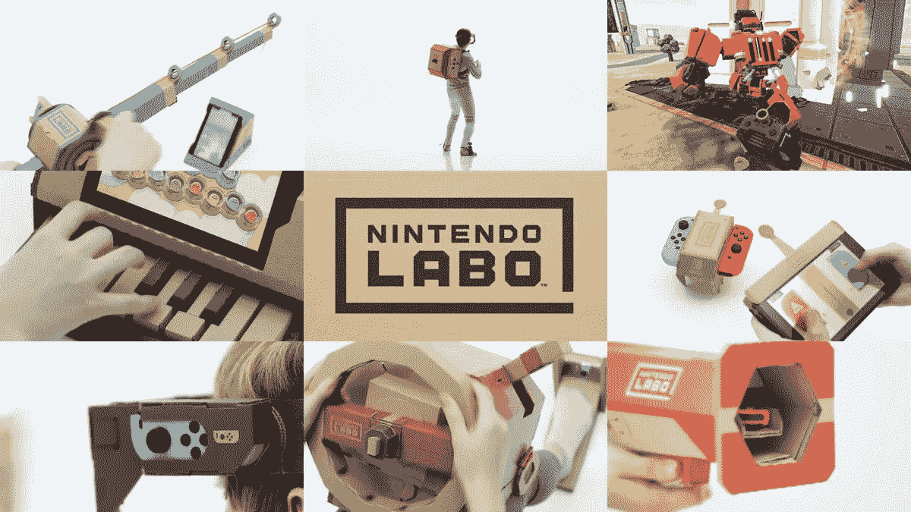
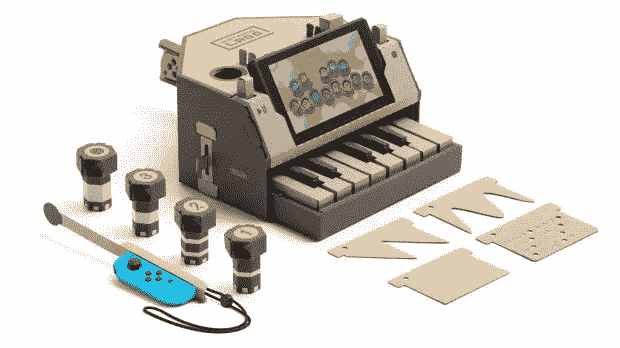
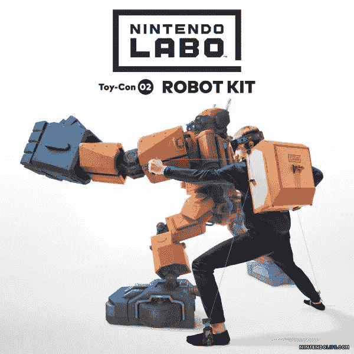

# 任天堂 Labo:跳出框框思考(还是用框框？)

> 原文：<https://medium.com/hackernoon/nintendo-labo-thinking-outside-the-box-or-with-the-box-6ea946d260ed>

当任天堂去年发布 Switch 时，我对他们所取得的成就感到非常惊讶,(再次)带动了游戏行业的发展。他们再一次证明了他们可以在一个拥挤的空间里与财大气粗的对手进行创新。他们能够实现有趣、灵活、符合我们新生活方式的东西，不是通过考虑规格，而是考虑用例。他们知道人们仍然想玩，但他们不只是在客厅里玩，所以他们会通过提供游戏灵活性来满足他们。现在，他们和 [Labo](https://labo.nintendo.com/) 一起做了一些我认为是无价的事情:通过连接物理世界和数字世界，让孩子们能够想象、玩耍和做梦。

我必须诚实，我没有马上买开关，当我买了，我玩了它，然后返回。有时候创新是有代价的。对我来说，这个开关有两个大缺点。首先是缺乏游戏。我不在乎塞尔达(是的，是的，恨我)，其他一些游戏只是“哼”。然而，最终让我如愿以偿的还是《马里奥奥德赛》的上映。我喜欢它，它很有趣，我可以在家玩，还可以带着它。我在假期旅行前买了我的开关，并把它带在身上。这意味着玩插入的欢乐游戏来制作一个巨大的游戏机。我是个大块头，打球的时候我很紧张，到处跑。旅行快结束时，我的开关开始坏了。我的游戏每分钟都会停止，因为它们会断开连接(我猜我在玩的时候不会那么兴奋)。事实证明，硬件灵活性的代价是耐用性。因此，当该回到商店时，我可以更换或退回开关，并因缺乏游戏而决定选择前者。

我以为这将是我的转换之旅的结束，但本周任天堂宣布了 Labo。任天堂一直非常善于跳出框框思考。这些产品中有些能用(Wii、Amiibos ),有些不能用(VirtualBoy、Wii U ),这是尝试新事物时要付出的代价。让我感到惊讶的是，任天堂不懈地追求不去想他们能做的下一个重大技术推动是什么，而是如何实现新的方式，将娱乐带入我们的生活。

电子游戏直到 10 岁左右才走进我的生活(这里约会我自己)。在电子游戏之前，我必须依靠我的想象力来玩。我会做一些东西，或者玩一些动作玩偶和其他实物玩具。我非常清楚地记得电视上的一个节目: *Espacio de Cositas* (翻译过来就是不好，所以不要尝试:P)。这个展览是关于用任何墨西哥孩子都能得到的材料(纸板、纸、颜色等)来建造东西。).虽然有点俗气，但它确实帮助孩子们获得触觉，并将手工艺和想象力带入他们的生活。

时光倒流 30 年，现在我们生活在一个科技已经悄悄进入我们生活的世界。这项技术让我们沉浸在一个为我们精心打造的奇妙世界中。不幸的是，这不会让我们感到疑惑，只会让我们想要更多。有一些像《《我的世界》》这样的游戏非常有助于我们思考、梦想和建设，但它们都是在数字世界中。数字，那里的东西不是真实的。技术一直专注于如何将东西从数字变为实物(2D/3D 打印，虚拟现实触觉)，但这些技术非常昂贵，对大多数人来说遥不可及。任天堂正在扭转局面，提供一种将真实事物带入我们数字世界的方式。它们始于 Amiibos 的发布，但你不能像玩你的动作玩偶一样玩它们。任天堂 Labo 以一种很棒的方式改变了这一切。

首先，它让你建立你的游戏。我相信他们受到了谷歌 Cardbox 的很大启发，但是提升了它。这个概念很简单:拿一个卡片盒子，建造一个结构，用你的设备创造一种新的交互方式。Labo(比 Google Cardbox)的伟大之处在于，这是一个你与之互动的游戏。对于一个孩子来说，这带来了好奇和兴奋。你可以亲自动手(就像我孩子的表演一样！)然后梦想你能用它做什么的可能性。

其次，它以新的方式使用现有设备的功能。创新不仅仅是创造新事物，而是为现有事物寻找新用途。这需要极大的创造力，并不断地问“*,我们如何在其他方面使用它？*”。这看起来很容易，但这是难以置信的困难，尤其是要做好它。例如，Labo 的钢琴游戏非常棒:你可以建造钢琴并按下实际的键，当你敲击它们时，Joy-Con 相机会识别这些键。谁知道欢乐合唱团能做到这一点！

最后，它以一种容易理解的方式将现实生活数字化。当你接触和玩耍的时候，你连接了两个世界。你做梦。Labo 的价格并不昂贵(69.99 美元和 79.99 美元)，可以让孩子们有身临其境的体验。例如，他们的机器人套件很棒，你变成了一个机器人(就像你在虚拟现实中一样)，但以一种你看得见、摸得着的方式。孩子们将从两个世界中得到最好的东西。

我希望这个项目在商业上是成功的，它像广告宣传的那样起作用。任天堂继续用他们的思维方式和策略让我吃惊。很明显，他们正在赢得胜利，给数百万人带来乐趣(不仅仅是游戏)。

最后一点，作为一名产品经理，我喜欢后退一步，思考如何建立一个应用于我日常工作的框架。以下是我从任天堂学到的关键方面:

*   当处于劣势时，不要迎头痛击；找到你的竞争对手的弱点，并建立你的优势来攻击这个弱点。索尼和微软深陷于“游戏玩家”之中，财大气粗，任天堂则是为了我们所有人的玩家。
*   在别人身上找灵感是可以的。Labo 从别人那里拿东西，然后把它装满。通过观察别人做的事情来激发伟大的想法并将其应用到你的世界中是可以的。
*   不要只考虑新的和再利用，建造新的东西和以新的方式再利用现有的东西都有很大的价值。任天堂重复利用技术，并不断为其寻找新的应用。
*   了解你的用户(他们需要什么)和他们的行为(他们如何需要)——如果你不知道你的用户想要什么，你就不能给他们所需要的。重要的是要理解行为会改变，尤其是当技术改变的时候。因此，在客户所在的地方与他们见面。任天堂知道人们的习惯变了(他们是移动的)，但他们仍然想要一样的东西:玩。
*   花时间去玩耍和梦想——这一点被低估了，尤其是在处理截止日期和现实世界的时候。然而，花时间去玩是很重要的，因为它打开了思维，并提供了在安全的环境中做梦(或获得新想法)的能力。这就是 Labo 带给孩子(还有大人？)生活和它的伟大！

你喜欢这篇文章吗？ [**订阅**](https://geekonrecord.com/subscribe/) **每月一篇新帖。**

*任天堂和 Nintendolife.com 的图片*

*原载于 2018 年 1 月 20 日 geekonrecord.com***。**