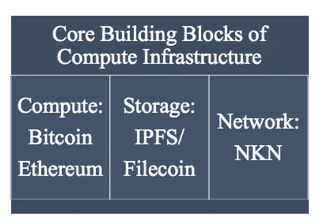
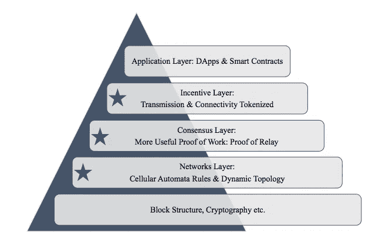
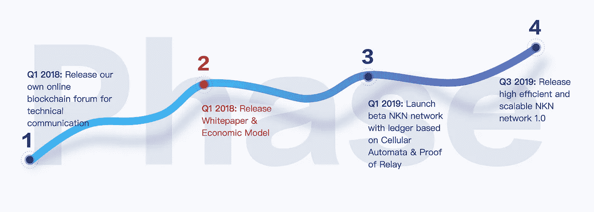
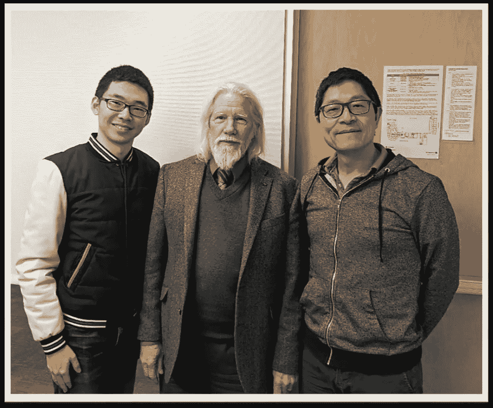

# NKN(新型网络)

> 原文：<https://medium.com/hackernoon/nkn-new-kind-of-network-7ddd6e35db12>

***免责声明*** *:我与 NKN 团队没有任何关系。我既不是财务顾问，也不是财务建议。无论接下来发生什么，都只是反映了我对这个项目的理解，以及我对其未来前景的个人看法。*

这篇文章描述了 NKN 的动机、目标和工作方式。NKN 的目标是通过创建自己的区块链来创建去中心化的互联网。

# 动机

当今的互联网存在以下一些问题:

*   隐私——能够保护 PII(个人身份信息，如姓名、地址等)以及用户访问网站时的行为。
*   [网络碎片化](https://hackernoon.com/tagged/network-fragmentation)——互联网将被分割成小部分，每个部分将彼此断开，从而威胁到整个万维网的概念。
*   网络中立性——互联网服务提供商(ISP)不应基于位置、内容、应用程序等阻止或限制互联网上的任何数据。
*   网络使用不足——浪费可用带宽进行数据传输。
*   选择性传播——只允许部分数据在网络上传输，而其余数据则经过审查。

# 介绍 NKN

NKN(新型网络)旨在应对上述所有挑战以及更多挑战。它在 tcp/ip 堆栈[之上使用安全隧道来传输数据，而不改变互联网连接的底层机制。](https://en.wikipedia.org/wiki/OSI_model)

它本身就是一款区块链，但它的设计方式使得它也可以取代任何现有区块链的网络堆栈。它使用细胞自动机来达成共识。

## NKN 的愿景

NKN 试图利用互联网基础设施的第三维度，即网络。如您所见，截至今天，我们已经看到了基于计算和存储维度的创新和区块链。

NKN Using the network dimension of internet infrastruture

## 积木

以下是 NKN 区块链的积木。

Building blocks

*网络层* : NKN 网络层覆盖 OSI 模型的 IP 层，在对等体之间创建安全/不安全隧道。基于元胞自动机的规则，建立一个动态的网络拓扑来传输数据。

*共识层* : NKN 使用细胞自动机驱动的共识，称为中继证明。这需要考虑您的节点带宽和传输数据的连接程度。

*奖励层*:您将获得代币奖励，作为上线的奖励，并提供连接和传输能力。

*应用层*:包含来自应用开发者的分布式应用(dApps ),使用 NKN 发布的网络工具包，通过使用网络层使应用非常快速和可扩展。

# 细胞自动机

CA 被用作 NKN 的基础。CA 是一个状态机，其中节点定义了仅依赖于相邻节点的本地规则。他们仅仅基于此改变他们的状态。这将反过来影响全局网络拓扑。

看看下面的视频，它展示了在 [*生命游戏*](https://en.wikipedia.org/wiki/Conway%27s_Game_of_Life) 中细胞按照预先定义的规则进化。

将上述原理应用于区块链，区块链系统中的细胞自动机网络(CAoN ),在该系统中产生方块。

每次接收到一个块，节点更新它的状态，然后用数字签名把这个块发送给邻居。邻居将根据他们的状态决定是否转发消息。它可以接收处于有效状态或冲突状态的块。决策过程发生，它影响整个网络的拓扑结构，而不改变网络的物理层或底层协议。

# 共识机制

如你所知，目前区块链正在实施各种共识算法，如 PoW(工作证明)、PoS(利益证明)、DPoS(委托利益证明)、PoA(授权证明)等等，这篇文章[和](https://hackernoon.com/a-hitchhikers-guide-to-consensus-algorithms-d81aae3eb0e3)对此进行了简要说明。

然而，NKN 使用了鼓励参与者的共识机制，该机制鼓励参与者通过共享他们的连接和带宽来为区块链网络做出贡献，以获得回报，增强网络连接和数据传输能力。PoR 是一种有用的工作证明(PoW ),它不通过让参与者解决散列计算来浪费计算资源。

# 与现有解决方案的比较

讨论和比较现有的“类似”解决方案超出了本文的范围，但是我将引用 NKN 团队成员的话。

> 人们经常问我们，NKN 与 BlockMesh 和 RightMesh 相比有什么不同。后两者完全专注于手机，使用 Wi-Fi、蓝牙和 Wi-Fi Direct。NKN 打算改变整个互联网，包括固定和移动、电话、笔记本电脑、边缘和核心网络。NKN 是一个独立于底层物理通信介质的协议覆盖层，对应用程序是透明的。
> 
> 此外，BlockMesh 和 RightMesh 都基于以太坊、ERC-20 令牌和智能合约。NKN 将拥有自己的区块链技术，该技术将拥有全新的中继证明和新的共识算法，这些算法是专门为表征网络传输能力而新开发的。我们的核心开发人员在这里变得有点怪怪的。如果你注重技术细节，欢迎你阅读细胞自动机和康威的生命游戏。🙂
> 
> 第二个区别也适用于兰花协议，这是一个与以太坊进化的 TOR。NKN 认为，我们有一个更广阔的领域:我们希望像 IPFS 对存储所做的那样，将网络令牌化。我们的目标是 1 万亿美元的通信业务，以及我们如何通过鼓励共享未使用的网络资源、扩展和升级共享网络来为每个人提供更好的连接。

# 路标

# 顾问和团队

如果细胞自动机是 NKN 的关键特征和创新之一，那么另一个突出的是他们的明星团队和顾问。

*创始成员*:

**李彦波**:开源大师，onchain 的联合创始人。更多关于 onchain 和 neo 的信息可以在[这里](https://hackernoon.com/neo-onchain-and-its-ultimate-plan-dna-4c33e9b6bfaa)找到。

Linux 内核网络子系统代码贡献者。

他创建并领导了 Onchain 北京办公室，开发了开源区块链平台 DNA(分布式网络架构)。

他曾就读于斯坦福大学，在密码学方面有着出色的背景。

他在高通诺基亚拥有超过 10 年的 R&D 经验，专门从事分布式网络系统的软件架构设计和网状网络协议的实施。

Bruce Z. Li: 他是一位具有创新远见和商业头脑的技术专家。

他是诺基亚和谷歌的连续创业者:在移动无线和软件领域创立并领导了数百万美元的创业项目；管理美国、欧盟和中国的大型 R&D 团队。

他拥有上海交通大学和澳大利亚国立大学的硕士学位。

他已经发表了 4 项专利、2 篇论文和 1 本书。

他在旧金山湾区工作。

**Justin Wang** :他是杰出的技术专家、多产的发明家和行业影响者，在无线通信、物联网、云计算和区块链领域拥有 45 项国际专利(已授权和待授权)。

他在诺基亚、微软和爱立信的技术创新和开发领域拥有超过 10 年的经验。

他是 Artech House 出版的两本全球技术教科书的唯一作者。

他曾于 2014 年获得诺基亚 R&D 创新奖，2015 年获得微软，2017 年获得爱立信。

**张一伦:**他拥有加州大学圣地亚哥分校物理学博士学位，北京大学物理学学士学位。

他是领域专家，对使用物理学中的 Ising 模型、计算机科学中的 Hopfield 网络和神经科学中的递归神经网络作为数学工具的细胞自动机有着深刻的理解和广泛的研究，研究计算神经科学。

他在旧金山湾区工作。

NKN 有一个很大的团队，有 8 个以上的团队成员，他们过去的经历在他们的团队页面上有详细介绍。对于一个项目来说，在 ICO(初始硬币发行)阶段之前拥有如此庞大的团队令人印象深刻。

现在这个大了。他们的顾问委员会中有**惠特菲尔德·迪菲**，公钥密码专家本人。更多关于他的信息可以在[这里](https://en.wikipedia.org/wiki/Whitfield_Diffie)找到。

[https://twitter.com/NKN_ORG/status/966339564582260736](https://twitter.com/NKN_ORG/status/966339564582260736) **Founding members and advisors**

**媒体:**

NKN 最近接受了不少采访，也做了不少报告。因此，请查看他们的 twitter 流中这些视频和演示的链接。

网址:[https://www.nkn.org/](https://www.nkn.org/)

电报:[https://t.me/nknorg](https://t.me/nknorg)

推特:[https://twitter.com/NKN_ORG](https://twitter.com/NKN_ORG)