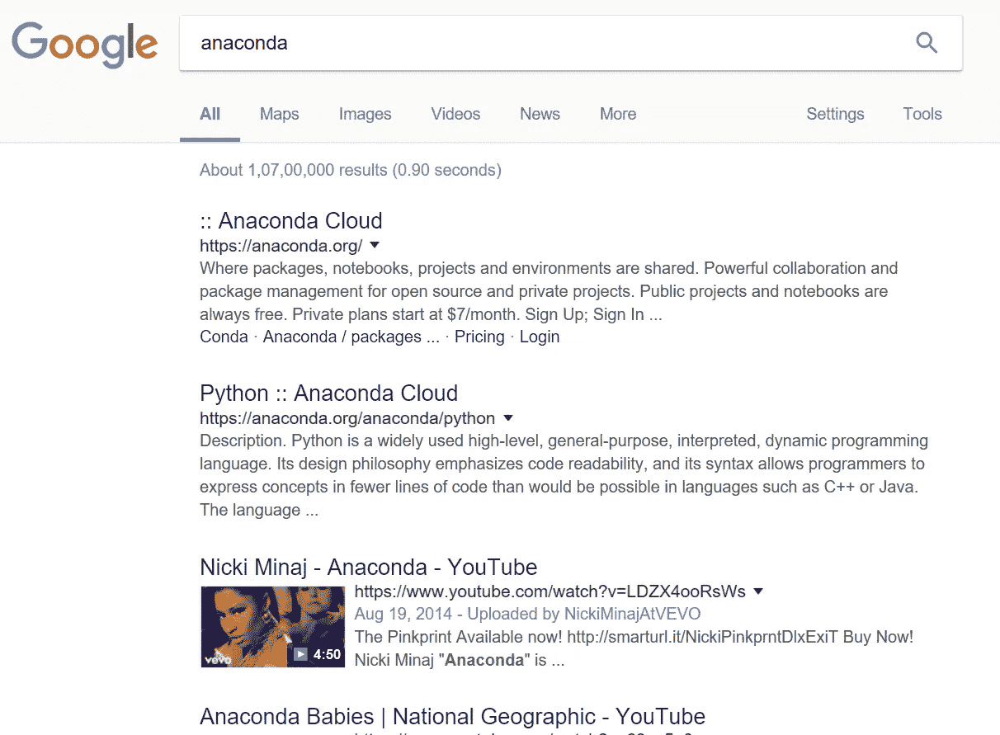
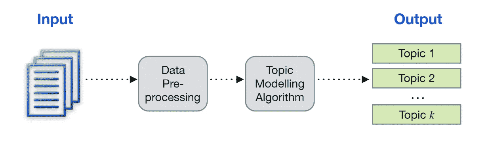
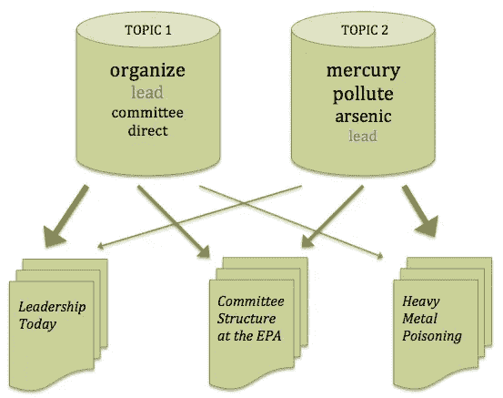
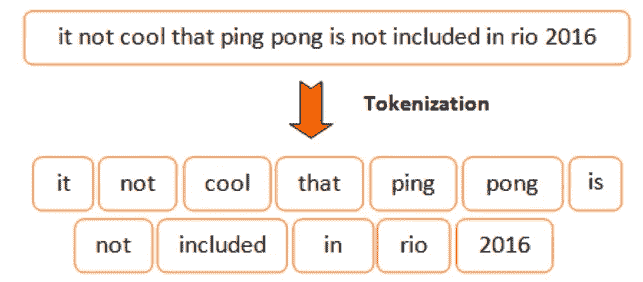
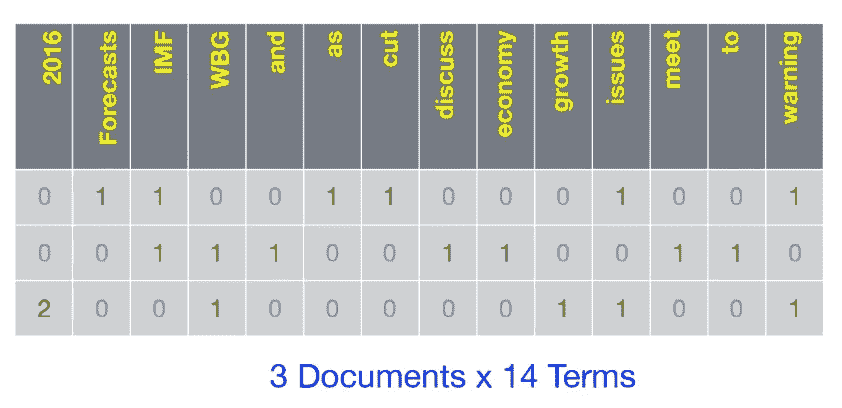
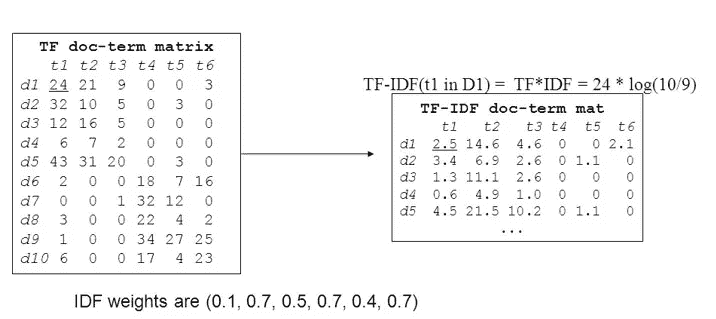

# NLP 101:人类主题建模—第一部分

> 原文：<https://medium.com/hackernoon/nlp-101-topic-modeling-for-humans-part-1-a030e8155584>

什么是主题建模？？网上有很多定义，但我对这两个词的理解是，主题+建模——创建/收集/建模主题。这些主题是什么，为什么我们需要对它们建模？想象一下，当你和你的朋友交谈时，不知何故你有点心不在焉，只听到一些事情，当被问及你的意见时，你试图记住他们在交谈中说的话题或主要事情——这被称为建立主题。让我们举另一个例子，我相信你们中的许多人已经进行了考试(谁没有)，在大多数英语(或任何语言)考试中，我们总是得到看不见的段落，并要求找到给定问题的答案。在一个或两个小时的考试中，阅读整个段落是非常困难的，因为你可能还有其他问题要做。我总是在这里使用一个技巧——阅读问题，在文章中寻找与该问题相关的具体和有意义的主题，并最终回答它。

> 主题建模是在查询时从大量的文档集合中发现数据的主题结构。

# **使用主题建模**

当我们在谷歌上搜索 anaconda，我们可能会看到 anaconda 软件，Nicki 的 Anaconda 歌曲和 Anaconda 蛇的图片

这些都是完全不同的话题。这是怎么发生的？你只期待一种结果吗？相当令人沮丧不是吗？？

这里最大的问题是-

对于一个成功的搜索结果或有意义的结果，第一步是主题建模。

# **表演话题造型**

主题建模过程是一种文本挖掘方法。大多数情况下，我们获得的是非结构化数据，例如文章、报纸、书籍、在线帖子等，在执行主题建模算法后，我们可以获得一组主题。

Courtesy — GitHub

每个主题都包含排名靠前的术语以及对相关文档的引用。

***从文本预处理开始，*** 跨 web 和不同数据库的文档多为非结构化格式。写作风格、语言、文本质量和词汇等可以有所不同。

现在，问题是我们将如何识别这些文档的主题。文档以书面形式存储，并以文本格式存储。文档中的每个术语对文档都有自己的意义。我们将创建一个字典，包含文档中的所有单词和出现术语的文档。它类似于一本书的索引页，您可以在其中找到特定主题的页码。

首先，我们需要将输入文档的文本分割成单独的标记，每个标记对应于文档的一个术语。这种处理被称为“**标记化**”。

一旦完成了标记化，我们将需要一些出现这些术语的文档的引用。这个过程叫做创造“**袋单词**”。在单词包中，每个文档都被表示为术语向量以及某个术语在该文档中出现的次数。

Courtesy — GitHub

此外，在文本预处理中，我们还执行几个步骤，如— **停用词过滤**(删除对主题没有任何意义的术语，例如——at、the、as、an 等)、**删除具有最小或最大频率的单词**(因为它们不会给主题添加任何值)和**词干**(从单词中删除时态或复数，因为同一单词可以与不同的时态/复数一起使用，例如 computer、computing、compute)。

# **术语权重**

既然我们有文档和出现在这些文档中的术语，我们将需要决定这些术语是否足够重要，这将提高文档-术语矩阵的有用性。其中一种常见的方法是 **TF-IDF** 。它是两个加权部分的组合— **TF** (术语频率)，一个术语在给定文档中出现的次数和 **IDF** (逆文档频率)，处理出现在几乎每个文档中的术语，并试图找到包含一个术语的不同文档的总数。

Document-term matrix

由于我们有了文档术语矩阵，我们现在可以应用任何机器学习算法并探索数据，例如搜索查询的特定答案，就像我们在谷歌搜索中所做的一样。

希望您现在已经对主题建模有了一些基本的了解。关于算法的更多细节将在下一篇文章中介绍。订阅，敬请关注！[#数据科学](https://www.linkedin.com/search/results/content/?keywords=%23DataScience&origin=HASH_TAG_FROM_MESSAGING)[#机器学习](https://www.linkedin.com/search/results/content/?keywords=%23MachineLearning&origin=HASH_TAG_FROM_MESSAGING)[#文本分析](https://www.linkedin.com/search/results/content/?keywords=%23TextAnalytics&origin=HASH_TAG_FROM_MESSAGING)[# NLP](https://www.linkedin.com/search/results/content/?keywords=%23NLP&origin=HASH_TAG_FROM_MESSAGING)[#主题建模](https://www.linkedin.com/search/results/content/?keywords=%23TopicModelling&origin=HASH_TAG_FROM_MESSAGING)

**参考文献**

1.  [媒体博客](/mlreview/topic-modeling-with-scikit-learn-e80d33668730)
2.  [维基百科——主题建模](https://en.wikipedia.org/wiki/Topic_model)
3.  [UCD 讲座](https://github.com/derekgreene/topic-model-tutorial)