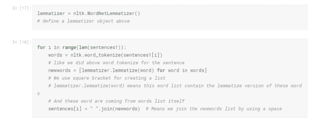
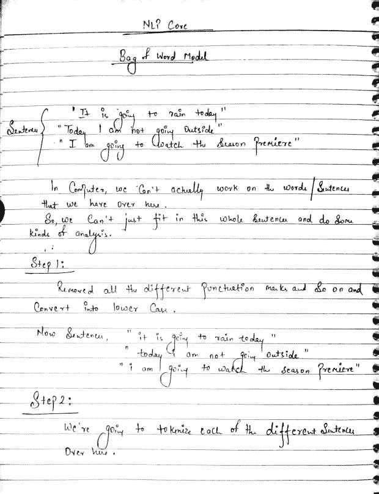
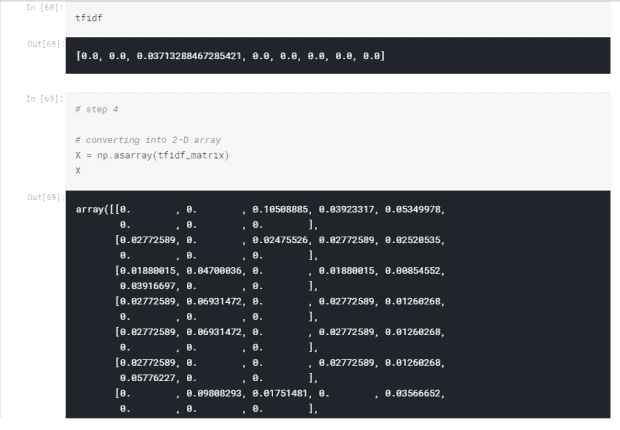
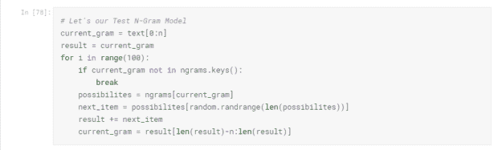

# NLP 核心

> 原文：<https://medium.com/hackernoon/nlp-core-4c16f379ced0>


NLP Core Tutorial

> **欢迎来到我的 NLP 核心教程**

今天，我们将关注 NLTK。

在继续之前，我强烈建议您去熟悉一下

*   [正则表达式](https://www.kaggle.com/themenyouwanttobe/regular-expression-tutorial)
*   [Python 完整教程](https://github.com/mohitsharma44official/Complete-Python-Tutorial)
*   [Numpy 教程](https://github.com/mohitsharma44official/Numpy)
*   [熊猫入门教程](https://github.com/mohitsharma44official/Pandas-for-Beginner)
*   [Python 数据科学手册](https://github.com/mohitsharma44official/PythonDataScienceHandbook)

> **你将学到什么**

# Kaggle 脚本:

*   [在 Python 中安装 NLTK](https://www.kaggleusercontent.com/kf/5521903/eyJhbGciOiJkaXIiLCJlbmMiOiJBMTI4Q0JDLUhTMjU2In0..weZ5EIdzsqWJAWPoGkGg4g.FDjwLH7_3-R5bwB4j9KnyynwAvJ6TRniHCog58AWWE33FxChSrFYr6vaws6AWuojrDAx4VTGezWG9nsJzRTwd-UwjIxS34pVeMxUh_ksyo0FSsRKE0W3otQvzmVefkc09cgnHZkqME0nGiscqhWGqw.cyjyYV2ip0Ju3m_d0X2OtQ/__results__.html#Installing-NLTK-in-Python)
*   [分词造句](https://www.kaggleusercontent.com/kf/5521903/eyJhbGciOiJkaXIiLCJlbmMiOiJBMTI4Q0JDLUhTMjU2In0..weZ5EIdzsqWJAWPoGkGg4g.FDjwLH7_3-R5bwB4j9KnyynwAvJ6TRniHCog58AWWE33FxChSrFYr6vaws6AWuojrDAx4VTGezWG9nsJzRTwd-UwjIxS34pVeMxUh_ksyo0FSsRKE0W3otQvzmVefkc09cgnHZkqME0nGiscqhWGqw.cyjyYV2ip0Ju3m_d0X2OtQ/__results__.html#Tokenizing-Words-and-Sentences)
*   [标记化是如何工作的？—文本](https://www.kaggleusercontent.com/kf/5521903/eyJhbGciOiJkaXIiLCJlbmMiOiJBMTI4Q0JDLUhTMjU2In0..weZ5EIdzsqWJAWPoGkGg4g.FDjwLH7_3-R5bwB4j9KnyynwAvJ6TRniHCog58AWWE33FxChSrFYr6vaws6AWuojrDAx4VTGezWG9nsJzRTwd-UwjIxS34pVeMxUh_ksyo0FSsRKE0W3otQvzmVefkc09cgnHZkqME0nGiscqhWGqw.cyjyYV2ip0Ju3m_d0X2OtQ/__results__.html#How-tokenization-works?---Text)
*   [词干化和词汇化简介](https://www.kaggleusercontent.com/kf/5521903/eyJhbGciOiJkaXIiLCJlbmMiOiJBMTI4Q0JDLUhTMjU2In0..weZ5EIdzsqWJAWPoGkGg4g.FDjwLH7_3-R5bwB4j9KnyynwAvJ6TRniHCog58AWWE33FxChSrFYr6vaws6AWuojrDAx4VTGezWG9nsJzRTwd-UwjIxS34pVeMxUh_ksyo0FSsRKE0W3otQvzmVefkc09cgnHZkqME0nGiscqhWGqw.cyjyYV2ip0Ju3m_d0X2OtQ/__results__.html#Introduction-to-Stemming-and-Lemmatization)
*   [使用 NLTK 进行词干分析](https://www.kaggleusercontent.com/kf/5521903/eyJhbGciOiJkaXIiLCJlbmMiOiJBMTI4Q0JDLUhTMjU2In0..weZ5EIdzsqWJAWPoGkGg4g.FDjwLH7_3-R5bwB4j9KnyynwAvJ6TRniHCog58AWWE33FxChSrFYr6vaws6AWuojrDAx4VTGezWG9nsJzRTwd-UwjIxS34pVeMxUh_ksyo0FSsRKE0W3otQvzmVefkc09cgnHZkqME0nGiscqhWGqw.cyjyYV2ip0Ju3m_d0X2OtQ/__results__.html#Stemming-using-NLTK)
*   [使用 NLTK 的词汇化](https://www.kaggleusercontent.com/kf/5521903/eyJhbGciOiJkaXIiLCJlbmMiOiJBMTI4Q0JDLUhTMjU2In0..weZ5EIdzsqWJAWPoGkGg4g.FDjwLH7_3-R5bwB4j9KnyynwAvJ6TRniHCog58AWWE33FxChSrFYr6vaws6AWuojrDAx4VTGezWG9nsJzRTwd-UwjIxS34pVeMxUh_ksyo0FSsRKE0W3otQvzmVefkc09cgnHZkqME0nGiscqhWGqw.cyjyYV2ip0Ju3m_d0X2OtQ/__results__.html#Lemmatization-using-NLTK)
*   [使用 NLTK 停止单词删除](https://www.kaggleusercontent.com/kf/5521903/eyJhbGciOiJkaXIiLCJlbmMiOiJBMTI4Q0JDLUhTMjU2In0..weZ5EIdzsqWJAWPoGkGg4g.FDjwLH7_3-R5bwB4j9KnyynwAvJ6TRniHCog58AWWE33FxChSrFYr6vaws6AWuojrDAx4VTGezWG9nsJzRTwd-UwjIxS34pVeMxUh_ksyo0FSsRKE0W3otQvzmVefkc09cgnHZkqME0nGiscqhWGqw.cyjyYV2ip0Ju3m_d0X2OtQ/__results__.html#Stop-word-removal-using-NLTK)
*   [词性标注](https://www.kaggleusercontent.com/kf/5521903/eyJhbGciOiJkaXIiLCJlbmMiOiJBMTI4Q0JDLUhTMjU2In0..weZ5EIdzsqWJAWPoGkGg4g.FDjwLH7_3-R5bwB4j9KnyynwAvJ6TRniHCog58AWWE33FxChSrFYr6vaws6AWuojrDAx4VTGezWG9nsJzRTwd-UwjIxS34pVeMxUh_ksyo0FSsRKE0W3otQvzmVefkc09cgnHZkqME0nGiscqhWGqw.cyjyYV2ip0Ju3m_d0X2OtQ/__results__.html#Parts-Of-Speech-Tagging)
*   [POS 标签含义](https://www.kaggleusercontent.com/kf/5521903/eyJhbGciOiJkaXIiLCJlbmMiOiJBMTI4Q0JDLUhTMjU2In0..weZ5EIdzsqWJAWPoGkGg4g.FDjwLH7_3-R5bwB4j9KnyynwAvJ6TRniHCog58AWWE33FxChSrFYr6vaws6AWuojrDAx4VTGezWG9nsJzRTwd-UwjIxS34pVeMxUh_ksyo0FSsRKE0W3otQvzmVefkc09cgnHZkqME0nGiscqhWGqw.cyjyYV2ip0Ju3m_d0X2OtQ/__results__.html#POS-Tag-Meanings)
*   [命名实体识别](https://www.kaggleusercontent.com/kf/5521903/eyJhbGciOiJkaXIiLCJlbmMiOiJBMTI4Q0JDLUhTMjU2In0..weZ5EIdzsqWJAWPoGkGg4g.FDjwLH7_3-R5bwB4j9KnyynwAvJ6TRniHCog58AWWE33FxChSrFYr6vaws6AWuojrDAx4VTGezWG9nsJzRTwd-UwjIxS34pVeMxUh_ksyo0FSsRKE0W3otQvzmVefkc09cgnHZkqME0nGiscqhWGqw.cyjyYV2ip0Ju3m_d0X2OtQ/__results__.html#Named-Entity-Recognition)
*   [使用单词袋模型的文本建模](https://www.kaggleusercontent.com/kf/5521903/eyJhbGciOiJkaXIiLCJlbmMiOiJBMTI4Q0JDLUhTMjU2In0..weZ5EIdzsqWJAWPoGkGg4g.FDjwLH7_3-R5bwB4j9KnyynwAvJ6TRniHCog58AWWE33FxChSrFYr6vaws6AWuojrDAx4VTGezWG9nsJzRTwd-UwjIxS34pVeMxUh_ksyo0FSsRKE0W3otQvzmVefkc09cgnHZkqME0nGiscqhWGqw.cyjyYV2ip0Ju3m_d0X2OtQ/__results__.html#Text-Modelling-using-Bag-of-Words-Model)
*   [使用 TF-IDF 模型的文本建模](https://www.kaggleusercontent.com/kf/5521903/eyJhbGciOiJkaXIiLCJlbmMiOiJBMTI4Q0JDLUhTMjU2In0..weZ5EIdzsqWJAWPoGkGg4g.FDjwLH7_3-R5bwB4j9KnyynwAvJ6TRniHCog58AWWE33FxChSrFYr6vaws6AWuojrDAx4VTGezWG9nsJzRTwd-UwjIxS34pVeMxUh_ksyo0FSsRKE0W3otQvzmVefkc09cgnHZkqME0nGiscqhWGqw.cyjyYV2ip0Ju3m_d0X2OtQ/__results__.html#Text-Modelling-using-TF-IDF-Model)
*   [理解 N-Gram 模型](https://www.kaggleusercontent.com/kf/5521903/eyJhbGciOiJkaXIiLCJlbmMiOiJBMTI4Q0JDLUhTMjU2In0..weZ5EIdzsqWJAWPoGkGg4g.FDjwLH7_3-R5bwB4j9KnyynwAvJ6TRniHCog58AWWE33FxChSrFYr6vaws6AWuojrDAx4VTGezWG9nsJzRTwd-UwjIxS34pVeMxUh_ksyo0FSsRKE0W3otQvzmVefkc09cgnHZkqME0nGiscqhWGqw.cyjyYV2ip0Ju3m_d0X2OtQ/__results__.html#Understanding-the-N-Gram-Model)
*   [理解潜在语义分析](https://www.kaggleusercontent.com/kf/5521903/eyJhbGciOiJkaXIiLCJlbmMiOiJBMTI4Q0JDLUhTMjU2In0..weZ5EIdzsqWJAWPoGkGg4g.FDjwLH7_3-R5bwB4j9KnyynwAvJ6TRniHCog58AWWE33FxChSrFYr6vaws6AWuojrDAx4VTGezWG9nsJzRTwd-UwjIxS34pVeMxUh_ksyo0FSsRKE0W3otQvzmVefkc09cgnHZkqME0nGiscqhWGqw.cyjyYV2ip0Ju3m_d0X2OtQ/__results__.html#Understanding-Latent-Semantic-Analysis)

**什么是 NLP？**

**自然语言处理** ( **NLP** )是[计算机科学](https://en.wikipedia.org/wiki/Computer_science)和[人工智能](https://en.wikipedia.org/wiki/Artificial_intelligence)的一个领域，涉及计算机和人类(自然)语言之间的交互，特别是如何给计算机编程以处理和分析大量的[自然语言](https://en.wikipedia.org/wiki/Natural_language)数据。参考[维基百科](https://en.wikipedia.org/wiki/Natural_language_processing)

> **在 Python 中安装 NLTK**

## 自然语言工具包

NLTK 是构建 Python 程序来处理人类语言数据的领先平台。它提供了 50 多个语料库和词汇资源(如 WordNet)的易用接口，以及一套用于分类、标记化、词干化、标记、解析和语义推理的文本处理库，以及工业级 NLP 库的包装器。

# 安装 NLTK

NLTK 需要 Python 版本 2.7、3.4、3.5 或 3.6

## Mac/Unix

安装 NLTK:运行 sudo pip install -U nltk

Install Numpy(可选):运行 sudo pip install -U numpy

测试安装:运行 python，然后键入 import nltk

对于旧版本的 Python，可能需要安装 setuptools

(参见[http://pypi.python.org/pypi/setuptools](http://pypi.python.org/pypi/setuptools))并安装 pip (sudo easy_install pip)。

## Windows 操作系统

这些说明假设您的机器上还没有安装 Python。

32 位二进制安装

1.  安装 Python 3.6:【http://www.python.org/downloads/】T2(避开 64 位版本)
2.  安装 Numpy(可选):【http://sourceforge.net/projects/numpy/files/NumPy/】T4(指定 python3.5 的版本)
3.  安装 NLTK:[http://pypi.python.org/pypi/nltk](http://pypi.python.org/pypi/nltk)
4.  测试安装:开始> Python35，然后输入 import nltk

## 安装第三方软件

请看:[https://github . com/nltk/nltk/wiki/Installing-Third-Party-Software](https://github.com/nltk/nltk/wiki/Installing-Third-Party-Software)


这是莱昂纳多·迪卡普里奥的演讲，摘自[这里](http://oscar.go.com/news/winners/watch-leonardo-dicaprios-acceptance-speech-for-best-actor-2016)


> **分词造句**

现在，我们将使用 NLTK 函数，它用于将这个大段分解成一个小句子，另一个函数用于计算句子中的不同单词。

1.  **sent_tokenize()**
2.  **word_tokenize()**


> **标记化是如何工作的？—文本**

标记化是将一个序列分解成单词、句子、短语等片段的过程。就在上面，你已经学会了如何将一个段落标记成句子或单词。这些标记化的工作方式解释如下。

*   **词语标记化:**

在这个过程中，一个像句子或段落这样的序列被分解成单词。这些标记化是基于分隔符“空格”(“”)执行的。说，我们有一句话，“天是蓝的”。那么这个句子由四个单词组成，单词之间有空格。单词标记化跟踪这些空格并返回句子中的单词列表。["天空"，"是"，"蓝色"]

*   **句子标记化:**

在这个过程中，我们不是根据“空格”来标记段落，而是根据“.”来标记段落还有“，”。因此，我们得到了组成段落的所有不同的句子。

即使不使用 nltk 库，我们也可以执行这些标记化。我们可以像下面这样使用 split()函数，

str = "我爱 NLP " words = str . split(" ")print(words)

Out: ["I "，" love "，" NLP"]对于句子标记化，只需将 str.split(")替换为 str.split(" . ") .

> **词干和词汇化介绍**

**那么什么是词干化和词汇化呢？**

所以让我们开始吧！！

文集(指书面文本的集合，尤其是特定作者的全部作品或关于特定主题的写作主体)

**句子—**

“普特里聪明地做着他的工作”

“腐败是一个聪明的人”

“腐烂总是在工作”

我们要做的是从句子中生成单词作为特征，为此，我们需要对不同的单词进行词干分析

我将首先标记这些句子中的每一个


你可以注意到句子 1 和句子 2 有一个共同的单词“intelligent”和“intelligent ”,但是它们有不同的形式。

同样，发生在句子 1 和句子 3 中的案例有一个共同的词，那就是“工作”。

所以，

# 词干化是将屈折(或有时派生)的单词缩减为其词干、词根或词根形式(通常是书面单词形式)的过程。

智力— -|

智能的

智能地— -|

所有这些单词都被简化为中间词根形式，称为“智能根”

所以我们要用 intelligen 来转换这些单词，例如“Putrid 做他的工作”

# 词干问题

这个词产生的中间表象可能没有任何意义。为

示例— intelligen

# 解决方案:词汇化

词汇化与词干化相同，但是表示/词根形式有一个含义

智力— -|

智能的

智能地— -|

所有这些单词都被简化为中间词根形式，称为“智能的”

# 词干化和词汇化的区别


> **使用 NLTK 进行词干分析**


> 使用 NLTK 的词汇化



> **使用 NLTK 停止单词删除**


现在，看看这一段，你会发现有些单词很常见，比如 to，of，in 等。

在计算机搜索引擎中，停用词是搜索引擎已经被编程忽略的常用词(例如“the”)，无论是在索引用于搜索的条目时还是在作为搜索查询的结果检索它们时。


> 词性标注


我们将学习如何找出与单词表或单词相关的不同词类。

你可以看到上面的段落，它包含了很多单词。每个不同的单词都有特定的词性，因为有些单词是名词、动词、形容词等。


你可以在某处看到输出，thank 是一个专有名词，在某处它充当动词。

所以我们可以很容易地得到词性，但有一个问题是我们得到的输出是一个元组

我们真的不能用它们来制定模型，所以我们现在要做的是，我们将生成一个全新的段落，每个单词都将被附加上相应的词性。


> POS 标签含义

# 下面是 NLTK 中使用的词性标签的含义

CC —并列连词

CD —基数

DT —限定词

EX——在那里存在

FW —外来词

介词或从属连词

JJ——形容词

JJR——形容词，比较级

JJS——形容词，最高级

LS —列表项标记

MD —模态

NN——名词，单数或复数

NNS——名词，复数

NNP —专有名词，单数

NNPS——专有名词，复数

PDT —预定者

词性——所有格结尾

PRP——人称代词

PRP$ —所有格代词

RB —副词

RBR——副词，比较级

RBS —副词，最高级

RP —粒子

SYM——象征

到—到

呃——感叹词

VB —动词，基本形式

VBD——动词，过去式

VBG —动词、动名词或现在分词

VBN——动词，过去分词

VBP——动词，非第三人称单数现在时

VBZ——动词，第三人称单数现在时

WDT——疑问词限定词

疑问代词

WP$ —所有格 wh-代词

WRB —疑问副词

> 命名实体识别

现在，我们将从句子中提取实体

```
sentence3 = "The Taj Mahal was built by Emperor Shah Jahan"
```

这是我们的句子，从这个句子中，我们会发现不同的实体

步骤 1:使用 word_tokenize()将句子分解成单词

步骤 2:我们需要进行词性标注，因为要进行命名实体识别，您需要进行词性标注

步骤 3:使用 ne_chunk()函数并传递参数

```
# step 1
words2 =  nltk.word_tokenize(sentence3)words2['The', 'Taj', 'Mahal', 'was', 'built', 'by', 'Emperor', 'Shah', 'Jahan']# step 2
tagged_words2 =  nltk.pos_tag(words2)tagged_words2[('The', 'DT'),
 ('Taj', 'NNP'),
 ('Mahal', 'NNP'),
 ('was', 'VBD'),
 ('built', 'VBN'),
 ('by', 'IN'),
 ('Emperor', 'NNP'),
 ('Shah', 'NNP'),
 ('Jahan', 'NNP')]# step 3
named_entity = nltk.ne_chunk(tagged_words2)named_entity.draw
#to see the graph you can use named_entity.draw() in your local Machine and the below output occurOutput :<bound method Tree.draw of Tree('S', [('The', 'DT'), Tree('ORGANIZATION', [('Taj', 'NNP'), ('Mahal', 'NNP')]), ('was', 'VBD'), ('built', 'VBN'), ('by', 'IN'), Tree('PERSON', [('Emperor', 'NNP'), ('Shah', 'NNP'), ('Jahan', 'NNP')])])>
```

> 使用单词袋模型的文本建模

什么是单词袋模型？

词袋模型是自然语言处理和信息检索中使用的一种简化表示。也称为向量空间模型。在这个模型中，一个文本(比如一个句子或一个文档)被表示为它的单词的包(多集合)，不考虑语法甚至词序，但是保持多样性。单词袋模型也被用于计算机视觉。参考[维基百科](http://https//en.wikipedia.org/wiki/Bag-of-words_model)



我们将删除所有的标点符号，错误以及分解成句子


> 使用 TF-IDF 模型的文本建模

# 单词袋问题

1.  所有的单词都同样重要
2.  不保留语义信息

# 解决方案:TF-IDF 模型

# TF =术语频率

# IDF =逆文档频率

# TF-IDF = TF*IDF

# 公式 TF =单词在句子中出现的次数/该单词在文档中的数量

例如:“我知道，好吧，我不知道”

I 的 TF = 2/6，know 的 TF = 2/6 等等。

# IDF = log(文档数/包含 word 的文档数)的公式

一定要以 e 为底

示例:

句子 1 =“生存还是毁灭”
句子 2 =“我必须生存”
句子 3 =“你必须生存”

IDF for to = log(3/3)log with base e
IDF for be = log(3/3)
IDF for or = log(3/1)等。

# TFIDF (Word) = TF(文档，Word) * IDF ( Word)


我将为您手动演示这个输出是如何产生的

我已经给你提供了上面的公式

公式 TF =单词在句子中出现的次数/该单词在文档中的数量

例如:“我知道，好吧，我不知道”

I 的 TF = 2/6，know 的 TF = 2/6 等等。

让我们来看第一句话(摘自数据集 1)

芭芭拉·雷伊·文特尔对家谱的敏锐洞察力激发了其他人去帮助执法部门解决未解决的案件以及伦理和隐私的争论

“the”的 TF = 0/8 = 0

现在你想知道 0.10285714285714 值是怎么来的

实际上，我们在上面得到的所有 8 个句子中都检查了“the”的 Tf 值

看一下第三句

heather Murphy 2018 年 8 月 29 日让她骄傲的儿子感到非常沮丧的是，这位基因系谱学家在调查的早期就决定不愿意透露她的名字，他曾帮助破解金州杀手的悬案

计算句子 3 中“the”的 Tf 值，即= 6/56 = 0.1071428571



> 理解 N-Gram 模型

**什么是 N-Gram 模型？**

n 元语法是来自给定文本或语音样本的 n 个项目的连续序列。根据应用，这些项目可以是音素、音节、字母、单词或碱基对。n 元语法通常是从文本或语音语料库中收集的。当项目是单词时，n 元语法也可以被称为带状疱疹。

例如，在手机中使用——当你在手机中键入任何关键词，手机会自动告诉你，你是认真的吗…

例子-当你输入智能它显示你的智能，智能，智能等。



> 理解潜在语义分析

潜在语义分析是一种通过产生一组与文档和术语相关的概念来分析一组文档和它们包含的术语之间的关系的技术。


这就是 NLP 核心教程的全部内容。如果你对这篇文章有任何反馈，或者对上述任何概念有任何疑问，请在下面的评论区与我联系。

[**叉上本笔记本**](https://www.kaggle.com/themenyouwanttobe/nlp-core-tutorial)

> **请分享，喜欢，订阅吧我的**[**themenyouwanttobe**](https://themenyouwanttobe.wordpress.com/)**！**
> 
> **分享一些太❤的爱**