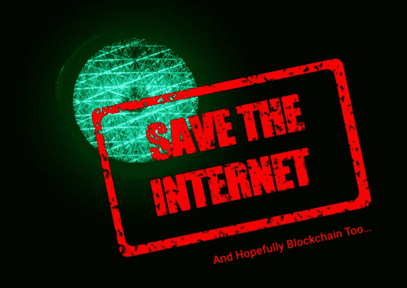

# 不，区块链不是网络中立的银弹:第二部分

> 原文：<https://medium.com/hackernoon/no-blockchain-isnt-net-neutrality-s-silver-bullet-part-two-e7e92d8b8cc1>

## 但是也许网状网络可以有所帮助。

如果你还没有看过[第一部分](/mimir-blockchain/no-blockchain-isnt-net-neutrality-s-silver-bullet-part-one-b63cf83ee244)，一定要看看。

# 随之而来的是区块链吧？没那么快

在经历了所有的厄运和黑暗之后，是时候问大家最喜欢的问题了:“你能在上面放一个[区块链](https://hackernoon.com/tagged/blockchain)吗？”

分解成更小、更抽象的问题，听起来可能像下面的问题:区块链能帮助免费互联网项目吗？它能被用来追究互联网服务提供商的责任吗？在未来的互联网日常运作中，它将在哪里得到最好的应用？在区块链上存储私人信息不是一个好主意，但是可以利用区块链来使存储在其他地方的私人信息更加安全吗？如果我把“网状网络”说得够多了，给其中一些拍个区块链会拯救我们吗？(可能吧。可能吧。谁知道呢。大概吧。)

正如我在这两篇博客的第一篇中提到的，我认为区块链将会是网络中立斗争中的救世主，但是现在看起来它将只是另一个受害者。如果 ISP 控制带宽和对某些网站和服务器的访问，区块链[技术](https://hackernoon.com/tagged/technology)可能很难在美国立足。与为访问网飞和 Hulu 支付更多费用的担忧不同，区块链认为电信提供商会完全切断对外部系统的访问，转而支持自己的区块链或基于令牌的平台，这并不荒谬。这就是我们可能会看到加密空间变得相当暗淡的地方。当我说摆脱网络中立有可能摧毁区块链的增长，至少在美国国内，我不认为我是夸张的。

Substratum Network 首席执行官兼联合创始人贾斯汀·塔布告诉《国际商业时报》记者一些影响深远的问题。“取消网络中立保护可能会对比特币矿工和交易商构成威胁，其形式是遏制甚至阻止对比特币和加密货币网站的访问，包括交易所，”塔布说。但这并不是他所担心的全部:“互联网服务提供商可能有能力控制对交易所的访问、交易速度，甚至创建和优先访问他们自己的加密货币……当你想到这个国家的所有地方都被一家互联网服务提供商垄断时，这并不是一个疯狂的想法。”

这些担忧也并非没有先例。在由诺姆·莱文森(Noam Levenson)和尼尔·卡贝萨(Nir Kabessa)合著的文章[“网络中立和区块链”](/theblock1/net-neutrality-and-blockchain-trouble-for-potential-growth-a28b012729f9)中，我们被提醒说，“2005 年，康卡斯特降低了某些文件共享和种子网站的速度(节流)。2014 年，威瑞森屏蔽了谷歌钱包的访问，以鼓励用户使用威瑞森自己的 Isis 钱包。”当然，你可以争辩说，在康卡斯特的情况下，他们在法律之外阻碍服务的提供，而在威瑞森的情况下，他们在保护他们的产品。但从我们在开放互联网的斗争中已经看到的一切来看，这些例子可能只是为电信提供商采取更加令人震惊的措施创造条件，如果他们让国会和 FCC 站在他们一边的话。

# 我们噩梦般的未来？

当然，我们还有很多工作要做。在争取开放互联网的斗争中，网状网络显然是区块链可以提供帮助的一种方式。然而，在大规模创建网状网络时会遇到一些挫折。这些挑战只是围绕区块链扩散和美国争取开放互联网的复杂因素的一部分。区块链有可能彻底改变我们存储和访问数据的方式，以及我们访问互联网的方式。如果我们能设法挽救美国的网络中立性，当我们走向下一个十年甚至更远的时候，看到我们能把区块链带向何方将是令人兴奋的。然而，如果网络中立失败了，我们不能把区块链作为解药。如果网络中立在美国失败，区块链可能会在美国失败。但是，正如我们看到的网状网络等技术，区块链可能有一个在我们国家的开放互联网方面反击的途径。

截至 6 月 11 日，废除联邦通信委员会关于网络中立的规则已经生效。这并没有结束争取免费互联网的斗争，但它确实大大提高了我们正在经历的倾斜。因此，虽然我个人可能认为天要塌下来了，但更准确的说法可能是天的某些部分正在塌下来，如果我们不小心，整个东西都会塌下来。联邦通信委员会监察长最近的发现证实了一些担忧，但我认为这些发现最终不会有什么影响。当我们发现国会想和派先生谈话时，我的希望瞬间被点燃了。不幸的是，我们甚至看到一个听证会，让联邦通信委员会负责相当于 Pai 微笑着通过低球的问题。那场听证会就像一群人在嘲笑美国开放互联网的想法。对于与他的议程不一致的观点，Pai 有着如此公开的敌意，令人恐惧的乐观态度，以至于我认为这份报告和随后的听证会不会给 FCC 带来任何影响，也不会影响他们目前对我国开放互联网的立场。更麻烦的是，Pai 得到了白宫和国会两院的支持，很快，最高法院，应该卡瓦诺进入法官席。

由于 ISP 与平台提供商合作，让客户为服务买单，网状网络面临着一场艰难的战斗。如果我们看到互联网服务提供商限制服务，网状网络要么也需要进行这些交易，要么可能只不过成为一种信息服务。为基本连接而颠覆 ISP 是一回事，试图通过这种连接获得服务则完全是另一回事。但是，不要试图告诉像 Karl Floersch 这样的人网状网络不是未来的潜力。在为 CoinDesk 撰写的一篇[文章中，迈克尔·德尔·卡斯蒂略称以太坊开发者兼 Casper 研究员弗罗施“描述了一个基于以太坊的系统，它可以在任何移动设备的“后台”运行。使用一系列互联的智能合同，移动设备理论上可以变成一个支持 Wi-Fi 的“节点”，有助于扩大网状网络的覆盖范围。现在，许多已经存在的网状网络都是由当地支持、捐助者支持或通过他们自己的基金会建立的。如果未来几年资金和社区支持增加，这些网络的未来可能是光明的。](https://www.coindesk.com/plan-b-ethereum-innovators-reviving-fight-net-neutrality/)

然而，正如你现在可能已经猜到的那样，并非一切都是简单的肉汁。在同一篇 CoinDesk 文章的后面，“软件工程师布莱恩·霍尔……认为所有这些项目[混合网状网络和区块链]未能充分理解两件事——首先，网状节点必须在地理上彼此靠近，不像区块链节点，其次，发展这些网络需要大量的社会资本来获得采纳者。”虽然这可能令人难以接受，但我们至少意识到了这些缺点。正如我们从拨号连接转向宽带互联网一样，我们可以肯定网状网络空间以及区块链作为一个行业将会有大量的进步。

我们应该以积极的方式结束，对吗？就像我们看到的试图将互联网带到被 ISP 忽视的社区一样，小团体正在小城镇和大城市的社区进行反击。我们看到他们为开放互联网而战，我们也看到一些人利用区块链来帮助实现这一目标。我们是美国人，我们是战士。我们只需要将这种战斗精神引向让我们国家的所有人都能使用我们的互联网。如果网络中立性的废除和我们的领导人对开放互联网的指责引发了网状网络的兴起，会怎么样？显然还有问题，只有时间能告诉我们，但我们可能不会完全完蛋。

**本文由 MIMIR Blockchain Solutions 的作者 Michael Putnam 撰写。**

## 请通过以下方式联系我们:

[推特](https://twitter.com/MimirBlockchain) || [脸书](https://www.facebook.com/MimirBlockchain/) || [电报](https://t.me/mimirblockchain) || [网站](https://mimirblockchain.solutions)

免责声明:本网站提供的内容是关于区块链世界相关主题的观点和评论。出于任何原因，您不打算也不应该依赖它，它是按“原样”提供的，没有任何类型的保证。您对自己的决定负责，并对任何内容进行正确的分析和验证。