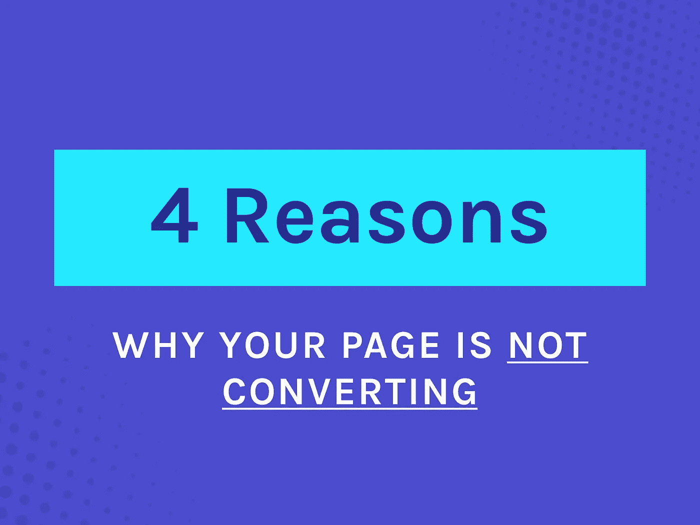
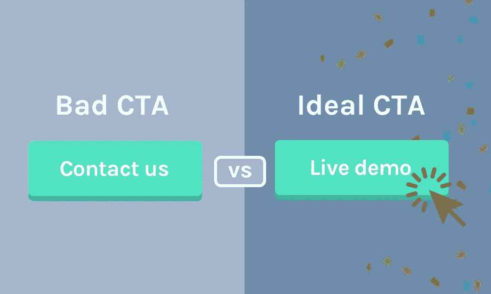

# 没有转换？以下是您的登录页面无法转换的 4 个原因

> 原文：<https://medium.com/hackernoon/no-conversions-here-are-4-reasons-why-your-landing-page-is-not-converting-8668f9528717>

所以…你花了这么多时间和金钱来获得更多的流量，却没有转化 99%的流量？

那很糟糕…但是！

根据我的经验，我可以告诉你大多数页面转换不好的原因至少可以归结为本文中提到的四个问题中的一个。

你需要经常检查你的[转换率](https://hackernoon.com/tagged/conversion)，以确保你正在做的所有工作没有被浪费，并得到你想要的结果。

听起来复杂吗？

嗯……真的不是！

不幸的是，即使只有其中一个问题也会成为你当前收入的一大瓶颈(本文稍后将详细介绍如何解决这个问题)

# 阻碍人们转化为顾客的四个问题

1.  不回答异议
2.  不会说“正确的语言”
3.  没有提供正确的行动号召
4.  不提供替代方案

这一切都是为了了解你的客户，他们为什么购买，并一次又一次地重复这一信息！

我来给你分解一下:)

> ***同样，我在我的免费视频课程*** *，* [*的第二步深入探讨了这一点，你可以在这里报名*](http://www.cortes.design/course) *。*

# 问题 1——不回应异议

如果有一件事最能提高你的转化率，那就是回答异议。

**什么是异议？**

人们在准备购买甚至尝试你的产品之前，需要回答一些简单的问题。

明白为什么它们如此重要了吗？如果你在你的网站上不回答这些问题，人们根本不会愿意改变，最好的情况是，只有那些“渴望”解决他们的问题的人会去尝试…

# 问题 2——不会说“正确的语言”

这是一个非常有影响力但经常被忽视的点…这是理解你的产品为什么有价值或让潜在客户问自己“这是为什么？”

你的网页是否用你的潜在客户使用的确切术语进行交流？

同样的话？同样的问题？同样的措辞？

没有吗？你怎么能指望人们理解你的网页呢？

如果他们不理解，他们就不会想注册

这是一种更复杂的产品或页面的趋势，这些产品或页面是由技术创始人设计/编写的，他们经常出于某种原因说他们自己的语言(我仍然爱你，尽管……)

## 这里有一个例子:

Optimizely.com (has since been updated)

这是非常模糊的，对于不熟悉他们公司的人来说，这个网站毫无意义，事实上，它可能毫无意义…

# 如何找到“合适的语言来使用”

根据您理想的客户概况，简单回答以下问题，并列出清单。

*   他们用什么术语来描述他们的问题？
*   他们用什么术语来描述解决方案？
*   谁决定签约？它也说他们的语言吗？否则，你无法说服做出购买决定的人，也不会转化该客户(尤其是高接触 b2b)
*   你的成功竞争对手使用什么术语？
*   你目前的客户如何描述你的产品？简化信息，这样你就可以复制它来吸引类似的客户。

你可以回顾你的 FAQ，你的客户访谈和调查来找到所有这些问题的答案。

# 问题#3 —没有提供正确的 CTA

这可能是最不常见的问题，但仍然是一个重要的问题(您将在下一个问题中发现)。

从本质上讲，你的页面上的行动号召是向你的潜在客户展示的正确号召吗？

我说的不仅仅是按钮里面的文字…

我说的是…免费试用 vs 现场演示？免费试用 vs 与销售对话？免费增值模式 vs 免费试用？现场演示 vs 联系形式？

## 这里有几个问题可以帮你弄清楚:

*   这是你的访客应该采取的正确行动吗？
*   这是他们所期望的，因此也更容易接受吗？
*   这是你的成功竞争对手要求他们做的吗？
*   **哪一种方式最容易让你的客户看到你提供的价值？**

同样，你可以回到你的客户访谈，调查和常见问题，找出什么是最好的，只是测试出来。

但是……别忘了问问自己，是想要低摸，高摸，甚至是混动车型。

根据我的经验，你可以期待更长期的增长，从更高接触度的模式开始(尽可能获得更多关于产品市场适合度的反馈)，然后尝试混合模式或尽可能低接触模式，以帮助你的[初创公司](https://hackernoon.com/tagged/startup)扩大规模。

# 问题# 4——没有提供替代方案

让我们面对 70%(甚至更多)不准备从你这里购买任何东西，甚至是免费试用，因为客户变得越来越难说服。

您是否让人们能够与不需要太多承诺的 CTA 互动？

这使您仍然能够从潜在客户那里获得线索，并继续跟踪他们，直到他们准备好购买，例如，通过电子邮件序列、广告或您的销售团队重新定位他们。

## 以下是几个可供选择的 CTA 示例:

*   博客帖子
*   铅磁体
*   现场演示
*   与团队交流(联系表格、聊天气泡等……)
*   免费试用

## 什么是一个伟大的替代 CTA？

*   必须比您的主要 CTA 承诺更低(也就是更容易转化)。
*   必须进一步了解您的产品和解决方案，同时向他们提供某种价值。
*   最成功的方法是至少获得潜在客户的电子邮件地址或任何形式的联系方式，这样你就可以在以后向他们推销。

# 最后的想法

我们倾向于认为我们页面的问题是非常独特和复杂的，但是如果我们回到基础，我们可以清楚地看到几乎所有的问题都来自你页面的这 4 个问题。

> ***你想优化你的页面产生更多的收益吗？*** [*预定免费攻略环节*](http://www.cortes.design/consultation) *这里讨论一下。*

## 📺【免费视频分解】

# 我用来帮助 SaaS 初创公司将访客转化为客户的漏斗

[**这里是视频的链接**](http://bit.ly/2Na6Of6)

*原载于*[*www . cortes . design*](https://www.cortes.design/post/some-traffic-but-no-conversions-here-are-4-reasons-your-page-is-not-converting-any-why)*。*