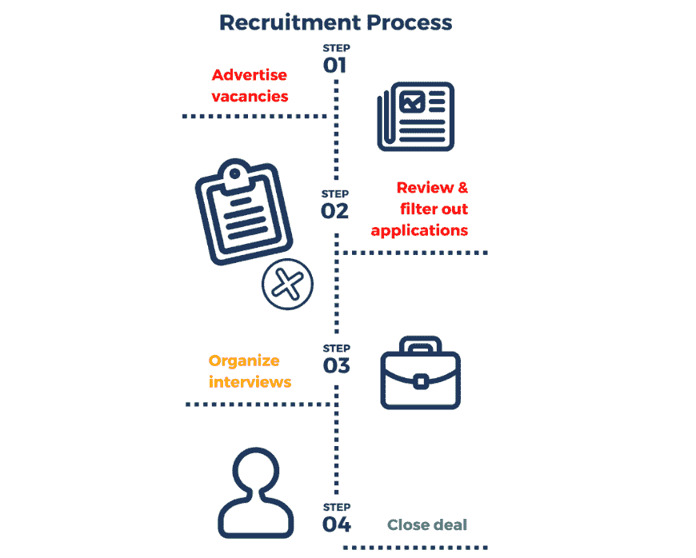

# 不再需要中间人了

> 原文：<https://medium.com/hackernoon/no-middlemen-is-needed-anymore-85e4c2f73130>

众所周知，自由职业者、兼职工作者或从事无保障轮班工作的“组合工作者”人数增长非常快。这就产生了一个合乎逻辑的问题，即把作为中间人的招聘机构的权力直接转移给求职者。

随着下一代技术千禧一代数量的增加，那些很快就要进入职场并了解所有网络知识的人不会信任一些人的职业选择。招聘机构的目标是尽快填补职位空缺，但他们不知道谁最适合这份工作。

图片来源:Oddup

但这只是最好的情况。例如，2011 年，一家医疗领域的招聘机构打电话给 NHS 的医生，谎报职位，提供顾问工作，并承诺如果他们同意成为“临时替代者”而不是普通工人，工资将增加三倍。资金从国民保健服务预算中支出，而国民保健服务预算并没有准备好支付这笔费用。没人直接和公司谈这个。招聘机构仍然利用这一计划，通过公司向员工支付高薪来中饱私囊，因为他们得到了承诺。

随着区块链等新技术的出现，招聘机构的时代将不可避免地结束。任何人都可以成为一名招聘人员，他真诚地希望向适合公司的合适人选推荐一个职位。

对于那些想要改变它的人，我们创建了[一个工作人员](https://hackernoon.com/tagged/aworker)——[平台](https://hackernoon.com/tagged/platform)，它可以根据你的心理类型、专业技能和成就帮助你找到最合适的公司和工作岗位。员工不再局限于一份工作、一家公司、一个城市甚至一个洲。这里的问题是，你必须通过附上证书或其他证明文件来证明你所写的数据。

权力下放为创造新的职业生态系统提供了最好的机会。为人们在工作平台上的活动付费变得更加容易:借助智能合约的力量，为熟人推荐或自己来参加工作面试付费是自动的。此外，每个人只需点击几下鼠标，就能展示他/她是多么合格，并建立一个可靠员工的声誉。

此外，如果你不准备换工作，你仍然可以通过推荐一个朋友或熟人获得空缺职位来获得奖励(即使他们在面试后没有找到工作，也会获得奖励)。我们相信，现在是招聘行业采用新技术、投资未来的最好时机。要了解更多关于该项目的信息，请访问[本页](https://aworker.io/)。

让我知道你对招聘机构的看法，如果你有和他们一起工作的经历，请写在下面的评论里。