# 不要再在街区里跑来跑去:拉姆达-S3 钉书人，被斯拉普佛格·适马钉上了！

> 原文：<https://medium.com/hackernoon/no-more-running-around-the-block-lambda-s3-thumbnailer-nailed-by-slappforge-sigma-591622538c65>

如果你还没有注意到，我最近一直在喋喋不休地谈论我在试图开始使用[官方 AWS lambda-S3 示例](https://docs.aws.amazon.com/lambda/latest/dg/with-s3-example.html)时遇到的 T2 陷阱。虽然大多数这些愚蠢的错误都归咎于我自己的懒惰、过度自信和缺乏对细节的关注，但我个人认为，与一家领先的无服务器提供商合作不应该那么困难。

[(https://previews.123rf.com/images/inspirestock/inspirestock1402/inspirestock140202784/26145257-businessman-banging-his-head-against-the-wall.jpg](https://previews.123rf.com/images/inspirestock/inspirestock1402/inspirestock140202784/26145257-businessman-banging-his-head-against-the-wall.jpg))

我在 [SLAppForge](https://slappforge.com/) 的团队也是如此。我们建造了[适马](https://sigma.slappforge.com/)让它成为现实。

Sigma

让我们看看适马能做什么，让你的无服务器生活变得简单。

适马已经有了 S3 图钉样本的现成版本。根据[自述文件](https://github.com/slappforge/s3-thumbnail-generator/blob/master/README.md)，如果你敢的话，部署它应该只需要几分钟。

在这次讨论中，让我们采取一种更实际的方法:从最初的[缩略图样本](https://docs.aws.amazon.com/lambda/latest/dg/with-s3-example-deployment-pkg.html#Node.js)中抓取代码，将其粘贴到适马，然后[将其部署到 AWS](https://docs.slappforge.com/first_project.html)——上次我尝试的时候，正是这种方法让我[在模块](https://dzone.com/articles/running-around-the-block-a-dummys-first-encounter)中跑来跑去。

[正如你可能知道的](/@janaka_bandara/sigma-the-new-kid-on-the-serverless-block-48b0fa02ad2b)，适马代表你管理许多关于你的应用的“幕后”事务——包括功能许可、[触发配置](https://docs.slappforge.com/concepts/triggers.html)和相关的[资源](https://docs.slappforge.com/concepts/resources.html)。这依赖于代码中遵循的特定语法准则，幸运的是，这些准则非常简单和普通。所以我们所要做的就是抓取原始源代码，粘贴到适马，做一些调整和[拖放配置](https://docs.slappforge.com/concepts/operations.html)之类的东西——适马会理解并处理剩下的。

如果你还没有，现在是注册适马 T10 的好时机，这样我们就可以开始用无服务器的美妙来激励你。(撇开恭维不谈，你真的需要一个适马账户才能访问 ide。)看看[这个小指南](https://docs.slappforge.com/getting_started.html)就能上手了。

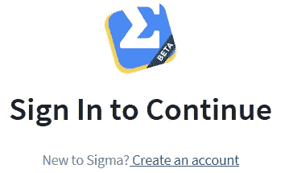

Sigma: create an account

一旦你进入，只要从 AWS docs 复制 [S3 的缩略图样本代码，然后把它塞给适马。](https://docs.aws.amazon.com/lambda/latest/dg/with-s3-example-deployment-pkg.html#Node.js)

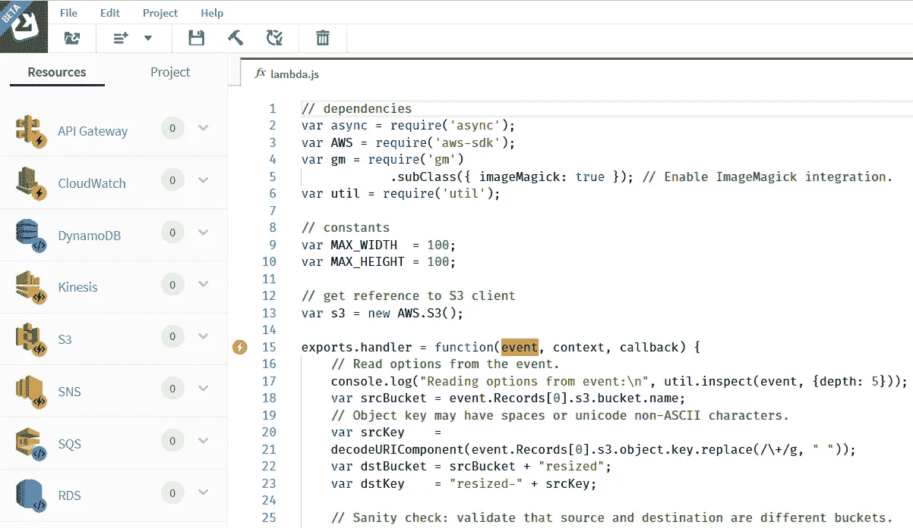

S3 thumbnail sample code from AWS docs, pasted into Sigma

原本会相当平淡乏味的编辑器，现在会开始显示一些有趣的东西；尤其是在[编辑区](https://docs.slappforge.com/basic_functionalities.html#Editor)的左边界。

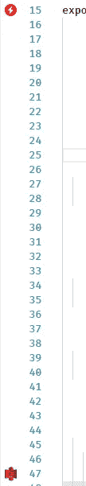

Code comes to life: operation and trigger indicators on left border

顶部的闪电符号(对着突出显示`event`变量的函数头)表示一个 [*触发器*](https://docs.slappforge.com/concepts/triggers.html)；函数的调用(入口)点。虽然这不是函数本身的一部分，但它仍然应该正确配置，具有必要的源(S3 桶)、目的地(lambda 函数)和权限。

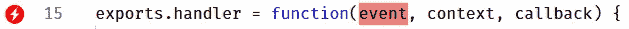

Trigger indicator: still red (unconfigured)

好的一点是，有了适马，你只需要注明[来源(S3 桶)配置](https://docs.slappforge.com/components/aws/s3.html#s3-as-a-trigger)；适马会处理剩下的事情。

此时闪电标志为红色，表示 [a 触发器尚未配置](https://docs.slappforge.com/concepts/triggers.html#define-trigger)。只需将一个[*【S3】*条目](https://docs.slappforge.com/components/aws/s3.html)从左窗格拖到上面的行(函数头)上，向适马表明这个 lambda 应该由一个 [S3 事件](https://docs.aws.amazon.com/AmazonS3/latest/dev/notification-content-structure.html)触发。

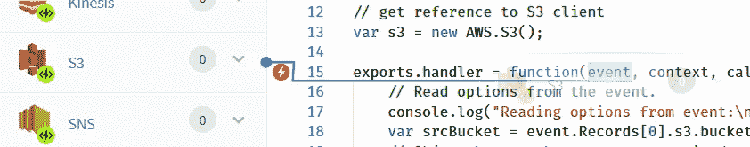

Dragging a S3 entry

只要你做了拖放操作，适马就会问你关于拼图中缺失的部分:即应该是 lambda 的触发点的 [S3 桶，以及应该触发它的操作的性质；在我们的例子中，它是图像文件的](https://docs.slappforge.com/components/aws/s3.html#set-bucket)[“对象创建”事件](https://docs.aws.amazon.com/AmazonS3/latest/dev/NotificationHowTo.html#supported-notification-event-types)。

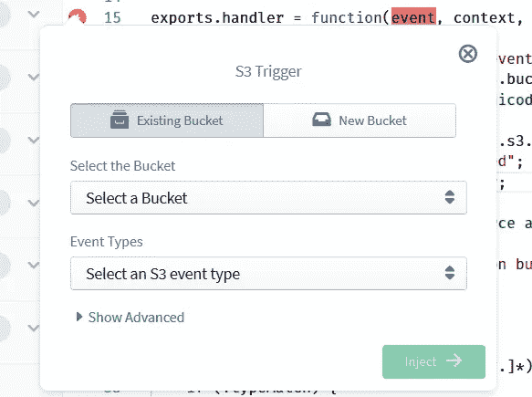

S3 trigger pop-up

在指定源时段时，适马为您提供了两种选择:您可以

*   通过下拉列表(*现有桶*选项卡)选择一个现有桶，或
*   通过 *New bucket* 选项卡定义一个新的 Bucket 名称，这样适马将重新创建它作为项目部署的一部分。

由于“图像文件”类别涉及几种文件类型，我们需要为 lambda 定义多个触发器，每个触发器对应一种不同的文件类型。(不幸的是，S3 触发器[还不支持文件名前缀/后缀的模式](https://stackoverflow.com/questions/33107809/using-a-wildcard-on-s3-event-notification-prefix)；如果他们这样做了，我们只需要一个扳机就能逃脱！)因此，让我们首先为 JPG 文件定义一个触发器，方法是选择“对象已创建”作为事件并输入。png "作为后缀，并拖放和配置另一个触发器与"。jpg”作为后缀——你猜对了，是 JPG 文件。

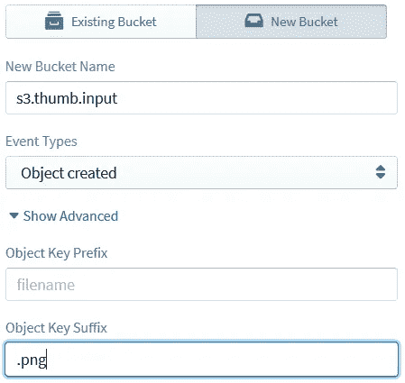

S3 trigger for PNG files

当您为第二个触发器选择 bucket 时，有一件小事需要记住:即使您为第一个触发器输入了一个新的 bucket 名称，您也必须为第二个触发器从“Existing bucket”选项卡中选择相同的、已经定义的 Bucket，而不是再次提供 Bucket 名称作为“new”Bucket。原因是适马跟踪每个新定义的资源(因为它必须在部署时创建存储桶),如果您定义一个新的存储桶两次，适马会感到“困惑”,部署可能不会按计划进行。为了减少歧义，当我们在现有的存储桶列表下显示新定义的存储桶时，我们将新定义的存储桶标记为“(New)”(比如用`my-new-bucket (New)`表示新添加的`my-new-bucket`)——至少现在是这样，直到我们找到更好的选择；如果你有一个很酷的想法，请随时加入[！](https://github.com/slappforge/sigma/issues)。

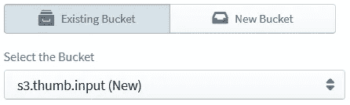

Selecting our new S3 bucket, from the existing buckets list

现在两个触发器都准备好了，我们可以继续进行 [*操作*](https://docs.slappforge.com/concepts/operations.html) 。

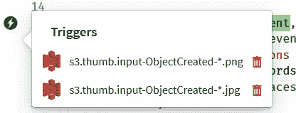

S3 trigger list pop-up with both triggers configured

你可能已经注意到了编辑器左窗格上的两个 S3 图标，在触发指示器的下方，正对着`s3.getObject`和`s3.putObject`调用。两个操作的参数块也将突出显示。这表明适马已经识别了 API 调用，并且可以通过自动生成必要的附加功能来帮助你(比如执行权限)。

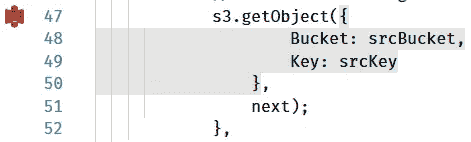

A S3 operation, highlighted

点击第一个图标(对着`s3.getObject`，打开操作编辑弹出窗口。我们在这里所要做的就是为**桶**参数选择正确的桶名(同样，确保您在“现有”选项卡上选择“(新)”前缀的桶，而不是在“新”选项卡上重新输入桶名)并点击**更新**。

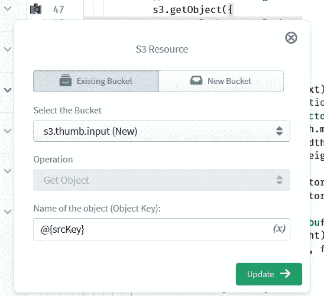

S3 getObject operation pop-up

同样，使用第二个图标(`s3.putObject`)，选择一个目的地存储桶。因为我们还没有添加或使用目的地存储桶定义，这里您将向适马添加一个新的存储桶定义；因此，您可以选择一个现有的存储桶或命名一个新的存储桶，就像第一个触发器的情况一样。

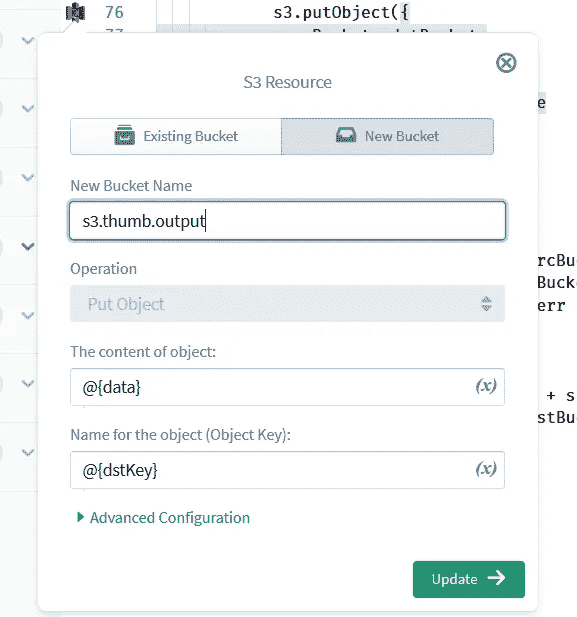

S3 putObject operation pop-up

还有一步:添加依赖项。

虽然适马为您提供了向项目添加第三方依赖项的超酷功能，但它确实需要在构建时知道依赖项的名称和版本。由于我们复制并粘贴了一个外来的代码块到编辑器中，我们应该单独告诉适马代码中使用的依赖项，这样它就可以将它们与我们的项目源代码捆绑在一起。只需点击工具栏上的“添加依赖关系”按钮，搜索依赖关系并点击“添加”，所有添加的依赖关系(以及两个默认设置，`aws-sdk`和`@slappforge/slappforge-sdk`)都会出现在**添加依赖关系**按钮下的依赖关系下拉列表中。

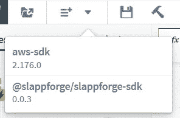

“Add Dependency” button with dependencies drop-down

在我们的例子中，保持[原始 AWS 示例指南](https://docs.aws.amazon.com/lambda/latest/dg/with-s3-example-deployment-pkg.html#Node.js)，我们必须添加`[async](https://www.npmjs.com/package/async)`(用于瀑布式执行流)和`[gm](https://www.npmjs.com/package/gm)`(用于 [GraphicsMagick](http://www.graphicsmagick.org/) )依赖项。

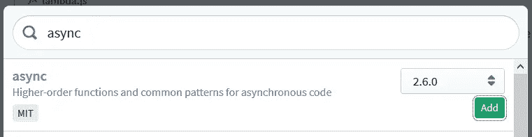

Adding async dependency

搞定了。

现在剩下的就是点击 IDE 工具栏上的**部署**按钮，让轮子开始运动！

首先，适马会将应用程序源代码保存(提交)到你的 GitHub repo 中。因此，当适马向你索要提交信息时，一定要提供一条漂亮的提交信息:)你也可以选择自己最喜欢的回购协议名称，如果它不存在，适马将会创建一个。(然而，当遇到“空”回购(即没有主分支的回购)时，适马有一个已知的故障，所以如果你有一个全新的回购，请确保你在主分支上至少有一个提交；最简单的方法是创建一个自述文件，只需在回购创建时点击即可[轻松完成。)](https://developer.github.com/changes/2012-09-28-auto-init-for-repositories/)

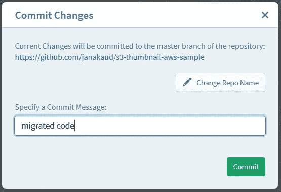

Committing your code

保存完成后，适马将自动构建您的项目，并打开一个部署摘要弹出窗口，显示它将部署到您的 AWS 帐户的关于您的全新 S3 缩略图生成器的所有内容。有些名称看起来有些混乱，但是它们通常反映了部署资源的类型和名称(例如，`s3MyAwesomeBucket`可能代表一个名为`my-awesome-bucket`的新 S3 存储桶)。

Build in progress!

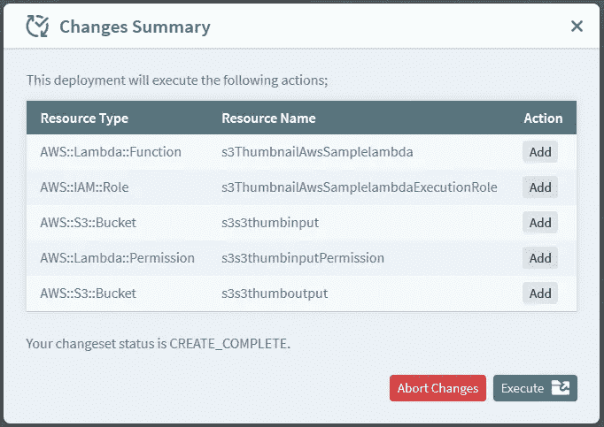

Deployment changes summary

查看列表(如果你敢)并点击**执行**。部署机制将启动，显示一个实时的进度条(以及一个日志视图，显示项目的底层 [CloudFormation 栈](https://docs.aws.amazon.com/AWSCloudFormation/latest/UserGuide/stacks.html)中发生的变化)。

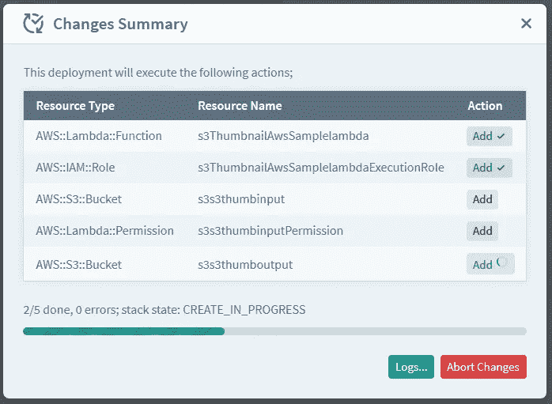

Deployment in progress!

一旦部署完成，您期待已久的缩略图生成器 lambda 就可以进行测试了！只需上传一个 JPG 或 PNG 文件到你选择的源桶中(通过 [S3 控制台](https://s3.console.aws.amazon.com/s3/home)，或者通过`[aws s3 cp](https://docs.aws.amazon.com/cli/latest/reference/s3/cp.html)`，如果你更像我的话)，你会惊奇地发现在几秒钟内你的目标桶中会弹出缩略图！

如果您在目的地桶中没有看到任何有趣的东西(在短暂的等待之后)，您将能够通过检查 lambda 的[执行日志](https://console.aws.amazon.com/cloudwatch/home#logs:)来检查出了什么问题，就像在任何其他 lambda 的情况下一样；我们知道回到 AWS 控制台来做这件事是很痛苦的，我们希望很快找到一个更酷的替代品。

如果你想把生成的缩略图公开(就像我上一篇文章说的，私有缩略图有什么用？)，你不用跑来跑去看 IAM 文档，更新 IAM 角色，揪头发；只需点击`s3.putObject`调用对应的 S3 操作编辑图标，从下拉列表中选择要应用到对象参数的 **ACL 作为`public-read`，然后点击**部署**以经历另一个保存-构建-部署循环。(我们已经在努力加快这些“小变化”的部署，所以现在请耐心等待:)**

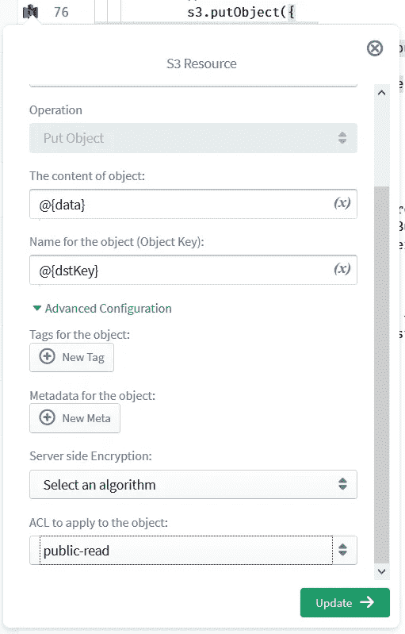

Making thumbnails public: S3 putObject operation edit pop-up

一旦新的部署完成，为了查看任何新生成的缩略图，您只需将 URL `http://<bucketname>.s3.amazonaws.com/resized-<original image name>`输入您最喜欢的网络浏览器，然后按 enter 键！

哦，如果你遇到任何不寻常的事情——提交/构建/部署失败、不寻常的错误或适马本身的错误——别忘了通过 Slack 通知我们——或者在我们的[公共问题追踪器](https://github.com/slappforge/sigma/issues)上发布问题；您可以在 IDE 中使用“帮助”→“报告问题”菜单项来完成此操作。同样的道理也适用于你希望在未来的适马中看到的任何改进或很酷的特性:更快的构建和部署，下载构建/部署工件的能力，一套闪亮的新主题，等等。请告诉我们，我们会将它添加到我们的待办事项中，并在不久的将来尝试一下！

好了，伙计们，是时候回去了，[开始和适马](https://sigma.slappforge.com/#/project)玩了，我要写下一篇博文了！

请继续关注 SLAppForge 的更多内容！

*原载于 2018 年 3 月 9 日*[*randomizd.blogspot.com*](http://randomizd.blogspot.com/2018/03/no-more-running-around-block-lambda-s3.html)*。*