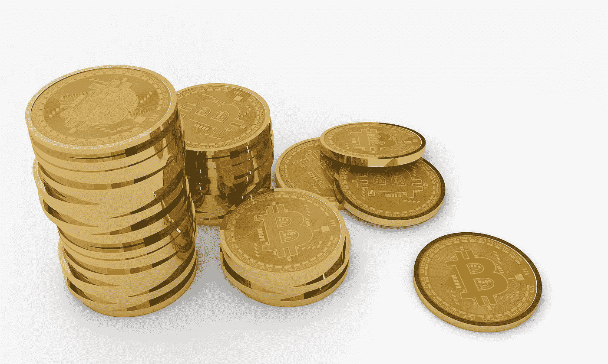

# 无峰无谷:XRP/美元快速预测

> 原文：<https://medium.com/hackernoon/no-peaks-without-troughs-a-quick-xrp-usd-forecast-62590d07aec1>

在市值排名前十的加密货币中，Ripple 是一个异类。Ripple 目前以超过 190 亿美元的资产排名第三，它既不是像领跑者比特币那样的纯加密货币，也不是像亚军以太坊那样的无限平台。它是一枚相当集中的硬币，有着非常明确和狭窄的用途:促进外币从一家银行到另一家银行的流动。然而，Ripple 无懈可击的协议和看似极高的市场份额潜力吸引了大量投资者。这些投资者在 2018 年 6 月 [XRP 对美元](https://cex.io/xrp-usd)的价格仅为 0.50 美元时，将一枚总供应量为 1000 亿的硬币推入了前三名。

加密投资者仍在从 2017 年 12 月的创纪录高位下跌的所谓的漫长一月中挣扎，Ripple 尚未完全复苏。然而，可以看看 Ripple 的[历史图表](https://coinmarketcap.com/currencies/ripple/historical-data/?start=20130428&end=20180703)，对未来几个月硬币相对于美元的价格做出一些有根据的猜测。

现在，任何声称在加密货币定价方面拥有水晶球的人很可能要么在撒谎，要么真的来自未来，但加密货币和其他任何市场一样，都是一个市场，因此他们应该遵循基本的市场规则。我们将会看到:

Ripple 的过去能告诉我们它的未来。

●整个市场的发展趋势。

Ripple 的支持者和反对者对未来 XRP/美元利差的看法。

# 史前波纹

在快节奏的加密世界中，价格可以在几个小时内以两位数的百分比波动，长达一年的图表代表了相当古老的历史数据。出于这个原因，我们将只研究过去一年左右里 Ripple 的价格。如果不考虑 2012 年或随后几年 Ripple 协议首次发布时的额外噪音，这个市场已经足够疯狂了。

2017 年 6 月，Ripple 的市值为 105 亿美元，每枚硬币的价格为 0.27 美元。XRP 兑美元的价格出人意料地保持平稳，直到 12 月中旬，Ripple——以及大多数其他加密货币——开始飙升。1 月初，Ripple 的市值达到了 3.51 美元，达到了 1350 亿美元的高点。然而，到 2 月初，股价已经跌至 0.74 美元，市值为 290 亿美元。这已经慢慢下降到目前 190 亿美元的市值，价格为 0.50 美元。

乍一看，这些数字似乎令人难以置信。仅市值就增长了 6 倍。然而，放在上下文中，Ripple 通常跟随加密市场。比特币也在 12 月创下历史新高，由于大多数交易所依赖 BTC/美元配对作为其替代硬币配对的基础，比特币往往会拖累一切——包括上涨和下跌。

# 当前的市场

这直接导致了目前的市场状况。尽管比特币有望在 5 月初复苏，但自 12 月/1 月的疯狂以来，价格一直相当低迷。增加和减少都是短暂的，没有特别的意义。也就是说，他们对外部市场力量做出反应，比如美国证券调查或高调的黑客攻击。

换句话说，加密货币目前处于漂浮状态。没有大的内在驱动因素来证明价格的合理性，也没有大的内在负面因素来从价格中减去。所有的价格变动都跟随比特币，对替代货币市场(包括 Ripple)的独立性相对较小。

人们的想法是，这将随着时间的推移而改变。目前，包括 Ripple 在内的大多数替代硬币都处于被采用的初级阶段。对于外行人来说，“加密货币”就是“比特币”的代名词。随着像 Ripple [这样的硬币发展自己的](https://stocksgazette.com/2018/06/06/how-decoupling-from-bitcoin-btc-will-benefit-ripple-xrp/)独立市场动态，它们很可能会从比特币的束缚中挣脱出来，开始展示自己独特的市场特征。

然而，短期来看，比特币。比特币走到哪里，Ripple 和其他替代货币就可能跟到哪里。在替代货币完全或部分脱离比特币之前，情况将一直如此。这可能是由于比特币的广泛失败，这是不太可能的，或者是更主流的使用和采用个人替代硬币。

# 人们在说什么

在 [Reddit 的 Ripple 论坛](https://www.reddit.com/r/Ripple/comments/8ukpdn/does_anyone_remember_when_people_were_cutting/)上，绝大多数用户预测，随着比特币走出长期熊市，未来几个月的市场将缓慢但稳定。论坛用户表示，尚未与比特币脱钩的 Ripple 可能会紧随其后。

“大多数长期投资者甚至没有听说过 Ripple，更不用说 XRP 了，”一位 Ripple 的支持者表示。“接下来的三个月可能会非常无聊；我们可以把价格定在 1 美元以下。但我真的相信，在某个时候，它会达到我们任何人都无法想象的价格。”

用户的预测基于新的交易所交易基金和美国证券交易委员会对监管的进一步澄清。

“现在是积累的时候了，”用户补充道。“这是聪明的资金进入的地方。不要 FOMO(害怕错过)以后的抄底价格。”

Ripple 也有相当一部分网上批评者。在 Reddit 上的一个普通加密货币论坛中，一位持怀疑态度的用户承认，Ripple 的银行支付协议可能会被广泛采用。然而，该用户指出，XRP 并不一定与支付协议挂钩，它的集中化本质意味着一个巨大的长期风险。

“事实仍然是，超过 60%的货币由一家机构持有，”这位用户说。“鉴于加密货币的交易量如此之低(与股票相比)，这是一个重大风险。”

# 预测

那么，对 XRP 的年终价格预测是什么？完全不令人满意的答案是“视情况而定”。这主要取决于今年市场如何对待比特币，而这在很大程度上取决于市场无法直接控制的外部力量。

很少有观察人士预计，到今年年底，油价将再次跃升至历史高点。因此，显而易见的是，除非 crypto 整体上取得一些重大外部胜利或以涟漪为中心的大新闻，否则涟漪在 2018 年可能不会回到历史高点。1 美元或略低于 1 美元的 XRP 似乎是最安全的赌注。