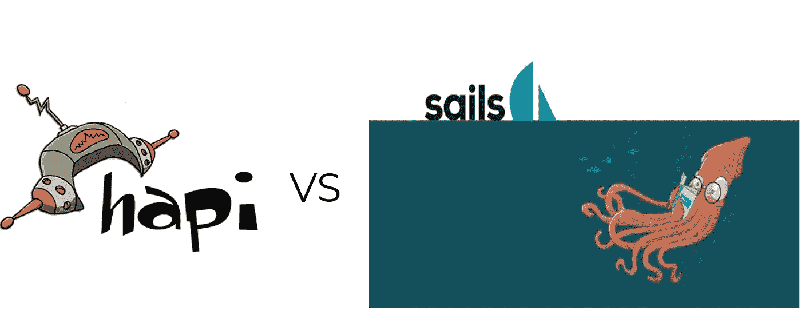

# Node.js 框架对比:Hapi.js 和 Sails.js

> 原文：<https://medium.com/hackernoon/node-js-framework-comparison-hapi-js-and-sails-js-e31f05cc1da>



## 在 web 开发的时代，node.js 是使用最广泛的服务器端框架，Node.js 是一个基于 V8 JavaScript 引擎的事件驱动 I/O 框架，它允许 JavaScript 在服务器端执行，并使用了 Google 为 Chrome 浏览器开发的快速 V8 引擎。

node.js 的基本理念是:-

*   **非阻塞 I/O** —每个 I/O 调用都必须接受回调，无论是从磁盘、网络还是另一个进程检索信息，只要响应到达，回调就会立即执行
*   **内置支持最重要的协议** — HTTP、DNS、TLS
*   **低级** —不删除 POSIX 层的功能。例如，支持半封闭的 TCP 连接
*   **传输所有内容** —从不强制缓冲数据

[Node.js](https://hackernoon.com/tagged/nodejs) 与客户端 [Javascript](https://hackernoon.com/tagged/javascript) 的不同之处在于，它删除了某些东西，如 DOM 操作，并添加了对事件 I/O、进程、流、HTTP、SSL、DNS、字符串和缓冲区处理以及 C/C++插件的支持

让我们跳过无聊的通用术语 bingo 介绍，直接进入实质——两个流行的 Node.js 框架之间的比较？

判断框架是非常主观的。在构建企业级应用程序时，我们需要考虑以下几点:

*   最佳实践和模式:框架是自己动手还是提供清晰的模式来使用。
*   配置:配置框架有多容易。
*   惯例:如果这是首选路线，是否有惯例可循？
*   水平扩展:扩展用这个框架构建的应用程序有多容易。
*   测试:如何测试应用程序。
*   脚手架:开发人员手动编码的工作量与使用内置代码生成器相比。
*   监控:如何监控应用程序
*   跟踪记录:一个框架是如何被证明的，例如，谁支持它，它维护得如何。
*   集成:插件/连接器的生态系统有多丰富。
*   ORM/ODM:有对象关系/文档映射器吗？

虽然性能很重要，但它会随着特定项目的需求和业务逻辑而变化。运行有意义的基准测试并不简单。

那么，使用极简的 Node.js 框架有什么好处呢？代价是时间的增加和更难的可维护性，因为当团队选择开源项目时，他们可以利用其他贡献者进行维护。当同一个团队选择了一个仅由该公司支持的闭源内部系统时，情况就不一样了。

最后，你需要自己思考，自己做决定。您的目标应用程序可能关注和/或需要不同的东西。这篇文章只能突出某些事实。即使是这样，也很可能是以一种主观的方式，就像一个人写的或说的几乎任何事情一样。😉

# 哈皮网

哈比神(用于 **HTTP API 服务器**)由**沃尔玛实验室**支持，因此它显然有着在生产中服务大量流量的良好记录(#nodebf- Node 黑色星期五)。

哈比神内置了对输入验证、缓存、身份验证和其他功能的支持。它没有提供开箱即用的 ORM/ODM，但是有一个第三方插件的广泛列表。

哈比神的强大之处在于，您可以对请求处理进行很大程度的控制。这在企业应用程序中很方便，因为它们需要处理大量的逻辑。

其他优势包括:

*   基于插件的架构:挑选模块来扩展你的应用
*   缓存:提高性能
*   以配置为中心:使用配置文件
*   丰富的 web 服务器功能:加速您的开发
*   详细的 API 文档:快速学习框架
*   可靠的跟踪记录和支持:从社区和贡献者那里获得支持
*   支持微服务:通过 Seneca 和 chairo 插件获得更好的业务逻辑分离和可伸缩性。

哈比神的一些缺点包括:

*   开发人员需要自己找出代码结构
*   “锁定”开发者使用特定于 hapi 的模块和插件，如 catbox、joi、boom、tv、good、travelogue 和 yar 并且与 Express/Connect 不兼容
*   端点是手工创建的
*   重构是手动的
*   手动测试端点

没有内置的 ORM/ODM 本身并不是一个缺点，因为并不是所有的企业应用程序都需要数据库。例如，从遗留 SOAP 服务中提取数据的编排层不需要带有模型和模式的 MongoDB 驱动程序，因为它从服务中获取数据，并可能将数据缓存在 Redis 中。

就代码而言，哈比神不同于本文中的其他框架，因为它不是构建在 Express 之上的。这个架构需要熟悉 Express 的开发人员额外学习(我们大多数人都是)，因为他们可以将自己的 Express.js 技能应用到哈比神。

具有两条路由 GET /和 GET /name 的简单哈比神服务器如下所示:

```
'use strict';const Hapi = require('hapi');// Create a server with a host and portconst server = Hapi.server({ host:'localhost', port:8000 });// Add the routeserver.route({ 
  method:'GET', 
  path:'/hello', 
  handler: (request,h) => { 
    return 'hello world'; 
  }});// Start the serverasync function start() { 
  try { 
    await server.start(); 
  } catch (err) { 
   console.log(err); 
   process.exit(1); 
}console.log('Server running at:', server.info.uri);};start();
```

要开始使用 npm，只需像安装任何其他依赖项一样安装哈比神:

`npm install hapi --save`

在撰写本文的最后一个月(2018 年 3 月)，哈比神的社交证明有 9207 个 GitHub 明星和 722014 次 npm 下载。

网址:[http://hapijs.com](http://hapijs.com/)

GitHub:[http://github.com/hapijs/hapi](http://github.com/hapijs/hapi)

NPM:[https://www.npmjs.org/package/hapi](https://www.npmjs.org/package/hapi)

# 帆. js

Sails.js 建立在 Express.js 之上；因此，对于已经熟悉 Express.js 的人来说，学习起来更容易。

Sails.js 有丰富的脚手架。想想 Ruby on Rails(因此得名“sails”)。这使得开发人员无需编写任何代码就可以创建 RESTful API 端点。自动生成的代码可以在以后进行定制，以满足特定的业务需求。
Sails.js 是 MVC 框架，自带数据库 ORM/ODM Waterline，支持各种数据库。

Sails.js 还通过 Socket.io 和一个资产工具(Grunt)内置了对 WebSockets 的支持。然而，Sails.js 让你决定前端层，这通常是用 Angular.js、Backbone.js 或任何其他前端框架实现的。

Sails.js 的好见解:

*   提供良好的代码组织和蓝图
*   对 WebSockets 的内置支持
*   支持各种数据库
*   数据有效性
*   控制器、模型和路线的自动生成代码
*   许多现成的安全功能，例如 CSRF 和与张亿嘟嘟的兼容性
*   内置文件上传库
*   良好的文档
*   带有挂钩和插件的灵活模块化架构

一些缺点，如:

*   陡峭的学习曲线
*   固执己见的

以下是在 Sails.js 项目的 config/routes.js 文件中定义路线的示例:

```
module.exports.routes = { 
 'get /signup': { view: 'conversion/signup' }, 
 'post /signup': 'AuthController.processSignup', 
 'get /login': { view: 'portal/login' }, 
 'post /login': 'AuthController.processLogin', 
 '/logout': 'AuthController.logout', 
 'get /me': 'UserController.profile' 
}
```

如您所见，抽象——意味着路由的逻辑在其他地方——保持 routes.js 文件简洁明了。这在大型企业级应用程序中非常重要，因为它提供了控制和良好的代码组织。

要开始使用 Sails.js，请将其作为命令行工具安装到 npm 中，并运行生成器:

`npm -g install sails`
`Sails.js new sails-test`
`cd sails-test`

生成的框架项目将包含以下文件夹:

`/api`:控制器、模型、策略、响应(请求处理程序)、服务(可重用组件)等所有服务器端逻辑
`/assets`:静态资产，如图片、前端 JavaScript、样式等。
`/config`:环境、地区、中间件
`/tasks`等配置设置:人工构建任务
`/views`:服务器端模板

在撰写本文的最后一个月(2018 年 3 月)，Social proof，Sails.js 在**18553**GitHub stars 和**79352**NPM 下载量。

网址:[http://sailsjs.org](http://sailsjs.org/)

GitHub:[https://github.com/balderdashy/sails/](https://github.com/balderdashy/sails/)

https://www.npmjs.org/package/sails

# 裁决

我有意省略了构建 Node.js/Io.js 应用程序的默认选择 Express.js，因为它缺乏代码生成器、组织和内置数据库支持，这太容易被人发现了。然而，你不应该低估 Express.js。对于快速原型或高度定制的项目，它可能是一个更好的选择。Express.js/Connect 中间件模块的数量是巨大的。这就是你可能想要选择 Sails.js 的原因，它们与 Express.js 中间件兼容。

目前(2018 年 3 月)在 Node.js-framework 领域绝对是重量级的。他们带来了内置的 ORM/ODM 和丰富的脚手架，这将节省开发人员的时间。

Sails.js 的弊端显而易见。与任何全面的框架一样，特别是那些使用约定而不是配置的框架，它们对开发人员来说很神奇，需要一定的学习。

哈比神独树一帜，因为它的架构在设计上与 Express.js 不同。这允许对请求和响应生命周期进行更细粒度的控制。

尽管我将 GitHub stars 和上个月的 npm 下载量作为趋势的代表，但对社会证据还是要有所保留。这并不总是准确的，因为一个框架存在的时间越长，推广得越好，统计数据就越大。相反，一个高级库的统计数据可能会更低，只是因为这个模块更新。

我不打算支持任何特定的框架。在大多数情况下，它们明显优于编写和维护自己的库或使用基本的 Express.js。我的建议是根据它们的优缺点来使用它们，因为它适合您的特定项目。

如果您认为这是一篇值得一读的文章，请不要犹豫，继续关注 medium([Shailesh shek hawat](https://medium.com/u/19d365322daa?source=post_page-----e31f05cc1da--------------------------------))获取更多的 javascript 文章！

*原载于*[*101 node . io*](https://101node.io)*。*