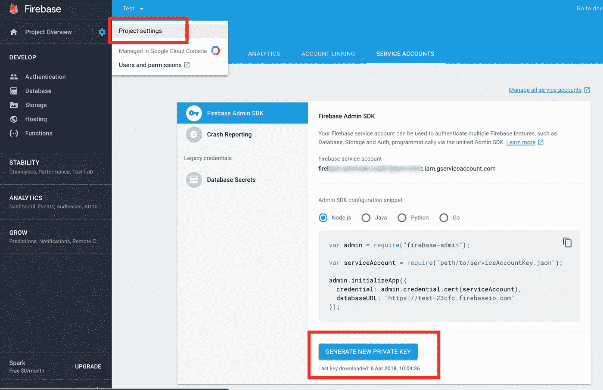

# [Nodejs]分 4 步设置 Firebase

> 原文：<https://medium.com/hackernoon/nodejs-setup-firebase-in-4-step-tutorial-example-easy-beginner-service-account-key-json-node-server-d61e803d6cc8>

> **Firebase** 提供实时数据库和后端服务。

> 对我这个懒惰的程序员来说，这听起来是个好计划

该服务为应用程序开发者提供了一个 API，允许应用程序数据跨客户端同步，并存储在 **Firebase 的**云上。

# 1-创建 Firebase 应用程序

点击[https://console.firebase.google.com/](https://console.firebase.google.com/)创建一个 Firebase 应用程序


# 2-获取服务帐户密钥

点击**生成新私钥**按钮后，将会下载一个包含您的服务帐户凭证的 JSON 文件。在下一步中，您将需要它来初始化 SDK。

[阅读更多:](https://firebase.google.com/docs/admin/setup)https://firebase.google.com/docs/admin/setup



# 3-设置 Node.js 项目

为 Firebase 项目设置 Node.js 应用程序很容易，只需安装 `firebase-admin`并将服务密钥 `.json`放在正确的路径上，就完成了。

***Github 示例***:[https://github.com/wahengchang/nodejs-firebase-example](https://github.com/wahengchang/nodejs-firebase-example)

***阅读更多*【https://firebase.google.com/docs/admin/setup】:**


# 额外:为项目创建新数据

首先，创建一个对用户数据的数据库引用。然后使用 set() / setValue()将一个用户对象保存到数据库中，其中包含用户的用户名、全名和生日。

阅读更多:[https://firebase.google.com/docs/database/admin/save-data](https://firebase.google.com/docs/database/admin/save-data)

```
$ node app.js
```


# 参考:

——[https://github.com/wahengchang/nodejs-firebase-example](https://github.com/wahengchang/nodejs-firebase-example)

[—https://firebase.google.com/docs/admin/setup](https://firebase.google.com/docs/admin/setup)

—[https://firebase.google.com/docs/database/admin/save-data](https://firebase.google.com/docs/database/admin/save-data)