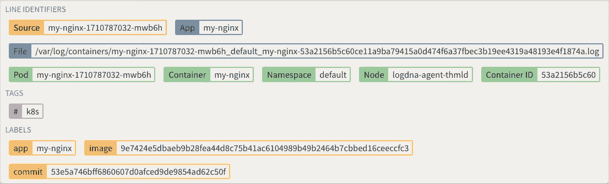

# 节点、豆荚和容器天啊…(K8 伐木的基本原理)

> 原文：<https://medium.com/hackernoon/nodes-and-pods-and-containers-oh-my-the-fundamentals-of-k8s-logging-6267b7fec50d>

> *披露:* [Manifold](https://goo.gl/Sm26zK) ，独立开发者服务市场*，之前赞助过黑客正午。* [使用 code HACKERNOON2018 获得任何服务 10 美元优惠。](https://goo.gl/Sm26zK)

毫不奇怪，Kubernetes 在 DevOps 的土地上迅速成为明星。Kubernetes 负责管理大量容器的复杂性，以及容器组(称为 pod)和节点组(称为集群)所需的更改和配置。这样，您就可以专注于对您来说最重要的东西——关键应用程序的核心代码和数据。由于这些优势，Kubernetes 已经成为当今的主流容器编排工具。

Kubernetes 使大规模管理容器变得容易，但它也可能伴随着陡峭的学习曲线。这就是管理 Kubernetes 服务的众多产品的原因，例如 Platform9、Kismatic、OpenShift 和 CoreOS structural(现在是 Redhat 的一部分)。

无论您采取哪种方式来管理您的 Kubernetes 集群，一个基本要求是当事情发生逆转时有效的**日志分析**。传统的应用程序基础架构利用日志数据逐个服务器地排查性能问题、系统故障、错误和攻击。像 Kubernetes 这样的现代基础设施成倍地增加了虚拟系统(容器)的数量，在这些虚拟系统中，需要对日志进行聚合和标记，以便进行有效的分析。

# 放弃

本文总结了在构建我们的 Kubernetes 对 [LogDNA](https://www.logdna.com/?utm_source=manifold&utm_medium=hackernoon-medium) 的支持时的见解和想法。为我们的客户创造良好的体验很重要，但当我们将大部分自己的服务转移到 Kubernetes 上时，我们也自私地需要这种体验。我们专注于构建一个漂亮的日志记录平台，它可以神奇地处理您所有系统的日志收集、解析、索引、标记、搜索、分析、警报和存储。

# Kubernetes 中日志数据的重要性

日志数据对 Kubernetes 管理至关重要。Kubernetes 是一个非常动态的平台，每时每刻都在发生大量的变化。随着容器的启动和停止，IP 地址和负载会发生变化——Kubernetes 会进行更改，以确保服务得到正确扩展且性能不受影响。不可避免地，当出现故障或性能下降时，您需要只有日志数据才能提供的详细信息。在 Kubernetes 的世界中，容器不断地被部署/终止，在您进行调查时，为您所寻找的内容生成日志的容器很可能已经被终止了。追溯的唯一方法是确保日志是可用的，这样您就可以追溯您的步骤来描述发生了什么。除了性能和故障排除之外，需要法规遵从性的行业还需要日志数据，以确保您满足 HIPAA 或 PCI DSS 等要求。在数据泄露的恶劣情况下，您需要及时追溯以确定攻击的来源及其在整个系统中的发展。对于所有这些用例，日志数据是必不可少的。

有许多方法可以访问和分析 Kubernetes 日志数据，从简单到高级。让我们从最简单的选项开始，沿着链条向上移动。

# 在 Pod 内记录

容器是 Kubernetes 中最底层的元素，但是 Pod 级日志记录是查看 Kubernetes 日志的最基本形式。Kubectl 命令用于单独获取每个 pod 的日志数据。这些日志存储在 pod 中，当 pod 死亡时，日志也随之死亡。当你只有几个豆荚时，它们是有用和有效的。您可以立即检查 pods 的健康状况，而不需要为大型集群设置健壮的日志记录。

# 节点内的日志记录

为每个节点收集的日志存储在一个 JSON 文件中。这个文件可能会变得非常大，为了处理这种情况，您可以每天使用 logrotate 函数将日志数据拆分为多个文件，或者在数据达到特定的大小配额时使用。节点级日志比 pod 级日志更持久。即使 pod 重新启动，它以前的日志也会保留在节点中。但是，如果一个 pod 被逐出一个节点，它的日志数据就会被删除。

虽然 pod 级和节点级日志记录是 Kubernetes 中的重要概念，但它们并不意味着是真正的日志记录解决方案。相反，它们是真正的解决方案——集群级日志记录——的构建块。

# 记录整个集群

Kubernetes 没有为整个集群提供默认的日志记录机制，而是让用户和第三方工具来解决这个问题。一种方法是构建节点级日志记录。这样，您可以分配一个代理来记录每个节点并组合它们的输出。

默认选项是 [Stackdriver](https://kubernetes.io/docs/tasks/debug-application-cluster/logging-stackdriver/) ，它使用一个 [Fluentd](https://github.com/fluent/fluentd) 代理，并将日志输出写入本地文件。但是，您也可以将其设置为将相同的数据发送到 Google Cloud。从这里你可以使用[谷歌云的 CLI](https://cloud.google.com/logging/docs/reference/tools/gcloud-logging) 来查询日志数据。然而，这并不是分析日志数据最有效的方法，如果你还没有使用 GCP，这可能会很麻烦。这让我们开始讨论目前存在的潜在解决方案。

# DIY Kubernetes 测井与弹性搜索

实现集群级日志记录的一种更流行的方法是使用 Fluentd 代理从节点收集日志，并将它们传递到外部的 Elasticsearch 集群。使用 Elasticsearch 存储和处理日志数据，并可以使用 Kibana 等工具进行可视化。ELK stack (Elasticsearch，Logstash，Kibana)或我们这里指的 EFK (Elasticsearch，Fluentd，Kibana)是当今最流行的开源日志解决方案，其组件通常构成许多其他现代搜索解决方案的基础。ELK 堆栈提供了强大的日志功能，并且比 Stackdriver / Google Cloud 选项具有更大的可扩展性。虽然最初构建 ELK 堆栈并不困难，但为每个输入源配置 Logstash 或 Fluentd 可能会很困难，而且为您即将获得的日志数据量扩展您自己的 ELK 堆栈可能会比您想象的需要更多的时间和精力。

# 使用边车容器收集日志

收集日志的另一种流行方法是在每个 pod 内部署收集器作为 sidecar 容器，以在 pod 级别上提取日志。每个边车容器都包含一个代理，用于收集原木并将其运输到目的地。大多数 sidecar 容器实现都是轻量级的，但是对于节点/集群中的每个 pod 都需要额外的资源。对于大规模应用程序，这意味着您需要配置每一个 podspec，这可能很麻烦，并且在大规模上不是一个好的实践。

# 使用 DaemonSet 收集日志

我们发现的最有效的日志收集方法是简单地将收集器部署为 [DaemonSet](https://kubernetes.io/docs/concepts/workloads/controllers/daemonset/) 。这在节点级而不是单元级部署了资源，并且保持了边车实现的相同能力，而不需要为每个单元部署额外的过程/容器。作为 DaemonSet 部署还允许您使用最少的 kubectl 命令集在整个集群中自动进行部署。设置好了就算了！

# 丰富的上下文日志元数据

Screenshot of Kubernetes logs metadata captured in dropdown (Nginx running Kubernetes).

虽然将日志收集到一个可搜索的集中式数据存储中可能是最重要的功能概念，但是如果您找不到您要找的东西，日志是没有用的。Kubernetes 中日志记录最漂亮的一面是单一编排系统带来的框架和组织。Kubernetes 存储日志的方式为日志解决方案提供了丰富的上下文信息，可以用丰富的元数据自动标记每个日志。诸如哪个节点、pod、容器甚至标签之类的信息可以附加到日志，以便在需要时更容易地进行日志分析和聚合。一个合适的日志记录解决方案应该利用并允许有趣的用例直接标记特定容器的提交散列，并根据该标记过滤和搜索日志。

# TLDR；&摘要

Kubernetes 是当今领先的容器编排平台。然而，运行 Kubernetes 的生产集群需要对系统和健壮的工具非常熟悉。当涉及到应用程序日志和日志分析时，Kubernetes 提出了一种新的复杂程度，Kubernetes 为 pod、节点和集群提供了基本的日志收集，但对于生产集群，您需要在集群级别进行统一的日志记录。与在更传统的部署中跟踪应用程序和服务器相比，构建和设计一个能够利用 Kubernetes 优势的解决方案最终会更加优雅和可伸缩。

构建自己的 ELK 或 EFK 堆栈是访问和管理 Kubernetes 日志的一种常见方式，但由于需要设置和维护大量工具，这可能会非常复杂。理想情况下，您希望您的日志工具不碍事，让您专注于日志数据和 Kubernetes 集群。

一个深度定制的 Kubernetes 日志记录解决方案应该能够自动识别 Kubernetes 集群的所有元数据，包括 pod、节点、容器和名称空间。它允许您实时分析 Kubernetes 集群，并提供强大的自然语言搜索、过滤器、解析、快捷方式和警报。

点击此处了解更多关于 Kubernetes 的 LogDNA 信息。