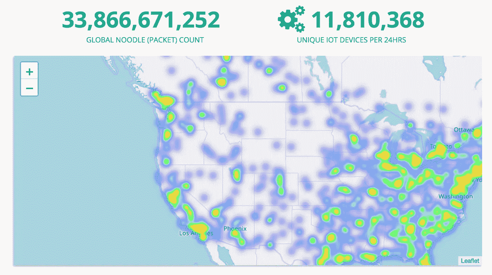

# Nodle 为节日发布说唱视频，庆祝每天 100 万个节点

> 原文：<https://medium.com/hackernoon/nodle-releases-rap-video-for-the-holiday-and-celebrates-1-million-daily-nodes-bb53ad6b31d3>

*“连接世界的物联网
让你我之间变得轻松
我们使用蓝牙，这是其卓越连接性的关键”*

Nodle.io 是物联网的第一个低功耗网络，今天宣布发布我们的假期说唱单曲，并连接了 100 万个日常节点。

我们通过众包智能手机和其他物联网设备的网络，为物联网设备提供互联网连接。我们大大降低了设备对设备通信的成本，并致力于使互联网对任何地方的任何人都是可访问的。Nodle 网络被称为公民网络，由成千上万的“众包”设备组成，这些设备共同工作以提供互联网接入。

Nodle 的网络是迄今为止部署的最大的专用物联网网络。

The Nodle Dashboard tracks daily unique IoT devices connected to our global network.

传统上，很难将远程设备连接到互联网。在 Nodle，我们利用远程蓝牙和软件的力量来提供一个简单而廉价的“即插即用”解决方案。运行我们的全球网络不需要额外的硬件。

最终，我们相信“连接应该是免费的，简单的，全球性的，”Nodle 的首席执行官，FireChat 的前创始人 Micha 说。因为 Nodle 为远程位置的物联网部署提供了机会，所以没有人需要断开连接。当分布式时，Nodle 系统将为物联网带来一个全新的生态系统。

目前，我们与财富 500 强公司、城市和消费者跟踪品牌合作。这包括食品和饮料品牌，他们与 Nodle 合作，跟踪全国各地的数百个展示；巴黎市(Le Grand Paris)利用 Nodle 技术跟踪户外公园设施，如长椅和亭子，兼作灯塔，帮助该市进行公园质量调查；和需要供应链跟踪的硬件公司。

Nodle 网络现已上线运行，覆盖范围超出了蜂窝网络。我们愿意与赚取 NODL 硬币以换取连通性的应用程序开发人员合作。要加入这场运动，或者了解更多，请点击这里联系我们[。](http://thecitizennetwork.com/)