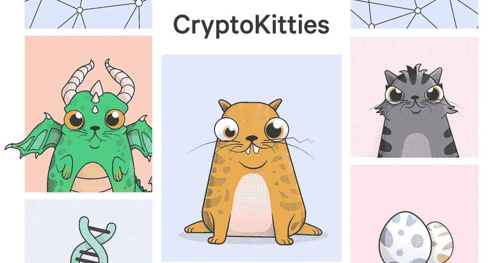

# 不可替换的令牌用 Blastoise 和 Charizard 解释

> 原文：<https://medium.com/hackernoon/non-fungible-tokens-explained-with-blastoise-and-charizard-2ee391fb2991>

“非可替代物”——不要让你自己被这个令人联想起蘑菇的名字所迷惑，可替代性是一个古老的概念，如今正在重新流行。目前主要是收藏品和视频游戏，但它很快就会超越这些行业。事实上，不可替代令牌的潜力要比这重要得多:从官方文档到所有权，它们的用例多种多样。

这篇法语文章是原文。

在我们深入研究神奇宝贝卡的潜在用例以及底层技术的[未来](https://hackernoon.com/tagged/future)发展之前，让我们从建立不可替代令牌(从现在开始)的基础开始。

## 代币？智能合约？

在我们探讨 NFT 和讨论神奇宝贝之前，让我们重申一下理解本文其余部分所必需的两个定义:

*   **智能合同**:智能合同是一种计算机协议，旨在以数字方式促进、验证或执行合同的协商或履行。
*   **代币**:代币代表一种特定的可交易资产或公用事业，通常出现在[区块链](https://hackernoon.com/tagged/blockchain)上。每个令牌都有与其用途相匹配的特定属性。

# 那么，可替代性到底意味着什么呢？

可替代商品是根据其所属类型定义的商品:不同单位的可替代商品可以互换。“可替代性”，作为一个概念，在几个不同的学科中使用；我们只讨论经济定义。

让我们跳到那些使这个概念更容易理解的例子。我们的现代货币，比如美元，是可以互换的:一张 5 美元的钞票可以和另一张兑换。黄金也是一种可替代的商品:1 盎司(纯)黄金价值 1 盎司。

**可替代商品是标准化的:这种商品的每个单元都没有唯一性，这就是为什么我们可以相互交换它们。**

## 那么不可替代的商品呢？我们还能吃吗？

有些商品是不可替代的。它们是具有共同属性的商品，但也有其独特性:每种商品都有一套独特的价值，这些价值与整个商品类型相同。

不可替代商品的最好例子是…当然是口袋妖怪卡！既然说到这里，让我们选一个曾经足以让你加冕游乐场之王的人:查里扎自己。

神奇宝贝卡片由以下材料制成:

1.  一个名字(和一个等级):Charizard，76 级，
2.  生命值(HP): 150，
3.  一种类型:火，
4.  一种能力:能量燃烧，
5.  一次攻击及其费用:火焰旋转(4 点火焰能量)，
6.  虚弱和抵抗:水和战斗，
7.  一次撤退费用:3。

每张神奇宝贝卡片都是独一无二的，但都遵循这种类型。

让我们考虑一下，例如:他也有我们已经描述过的 7 个属性，但是他对每一个都有不同的价值观，这使得他不同于 Charizard，是独一无二的。

它是所有属性的值的组合，使得卡片具有独特性。因此，一张描述 150HP 火系神奇宝贝的牌并不是一张喷火怪——它仅仅是一张 7 点属性中有 2 点与喷火怪相同的牌。

神奇宝贝卡片很有用，因为它们让大多数不可替代性的概念很容易掌握。**NFT 是一类具有共同属性的令牌**。但是每个令牌都有一组用于这些属性的唯一值，这使得令牌本身是唯一的。

如果你对于神奇宝贝卡片来说太年轻了，或者太老了，这对于其他卡片游戏来说也是同样的原则:魔法，游戏王！、魔兽世界(卡牌游戏)等。

# 加密货币的可替代性

大多数你已经知道的加密货币，如比特币或以太坊，都可以被认为是可替代的(见下文⬇️).一个 BTC 抵得上另一个，两个 BTC 可以互换。你可以在 Coinmarketcap 上找到的所有加密货币都是一样的。

*由于大多数加密货币的交易历史可以在 block explorers 上查看，一些参与非法活动的代币在交易所被标记和阻止。因此，具有公开交易历史的加密货币不是真正可替代的。目前，Monero 等注重隐私的硬币实现了完全的可替代性，因为交易历史不会公开披露。*

我们今天不会讨论这些，因为我们关注的是不可替换的令牌。早在 2013 年，就有过几次创建 NFT 的尝试，但大多不成功。与众不同的是一个新的以太坊标准，ERC-721，它极大地促进了“加密收藏品”的创造它们是独特的商品，有着共同的属性——相当于区块链的神奇宝贝卡片。

# 由 ERC-721 驱动的不起眼的开端

[Cryptokitties](https://www.cryptokitties.co/) 让 NFT 为大众所知——它们是虚拟的小猫，是 ERC-721 的前身。

该项目于 10 月上线，并在几个月后于去年 12 月达到病毒式传播的顶峰。Cryptokitties 如此成功，以至于整个以太坊网络被交易的洪流阻塞了好几天。

在 12 月初的几天里，最受欢迎的特定小猫的价格达到了 5 位数(美元)，并进行了几次转手。考虑到 CryptoKitties 的成功，ERC-721 通过了尽职调查，于去年 6 月获得批准并最终确定。

# 日常生活中不可替代的代币

> 当谈到推动和改进新技术时，你会经常发现色情和视频游戏共享前线。

现在，收藏品和视频游戏处于创新的前沿。事实上，当谈到推动和改进新技术时，你经常会发现色情和视频游戏共享前线。

然而，NFT 的实际应用非常多样，数量众多，而且比我们想象的要紧密得多。由于它们的特性，NFT 可以很好地支持现实生活中商品的符号化。

令牌化意味着创建一个代表商品的令牌。令牌本身没有价值；它从它所代表的善中汲取价值。

# 令牌化一切！

令牌化允许像令牌一样处理商品，这提供了广泛的可能性:交换、P2P 转移、部分所有权(0.x)等。除此之外，还可以根据标记化的商品添加其他功能:以前所有者的列表、商品价值的历史、商品特征的详尽列表、所有权的限制…

一旦理解了标记化的好处，我们就会意识到标记化真实的商品会让我们**不再需要贪婪的中介，同时获得许多令人兴奋的新特性**。

*   房地产令牌化= >谁需要公证员？
*   艺术品的象征化= >拍卖商和其他一些工作会发现它们的效用甚至它们的存在受到了挑战。
*   官方文件的标记化(例如 IDs >对目前参与其发布的行为者和机构以及负责检测和防止欺诈的人员进行实质性清理。

在上面详述的三个场景中，检查这些商品的真实性以及确保它们的所有者确实是商品的真正所有者将比现在容易得多。

## 令牌化带来的非中介化的好处

令牌化比创建一个令牌来表示真实世界的商品要大得多。让我们回到我们提出的非商品贸易的定义上来:“具有共同属性的独特商品。”

因此，标记化同样适用于证书。id、护照、成绩单甚至软件许可证都可以进行令牌化。这不仅将极大地促进发布和分享这些信息的进程；它还将提供可追溯性，这与我们迄今所知的任何东西都不一样。这反过来将使 99.9%的欺诈检测和防范目标成为现实。

如果我们继续推进这一逻辑，我们可以回到数字世界，想象 NFTs 来存储我们的数字身份。我们的社交网络档案可以是开源的，很容易从一个网络导出到另一个网络。此外，它将给予我们自己的数据完全的控制权和所有权，并防止恶意的第三方窃取它们。

在我们到达那里之前，我们需要**克服以太坊网络和不可替代令牌的当前限制**:如前所述，CryptoKitties 足以阻塞整个以太坊网络几天。这项技术目前的状态(或至少 12 月的状态)显然不足以大规模使用。

# ERCs——以太网的新标准

关于以太坊网络，几个团队已经在进行网络的技术优化。其中，我们可以提到 Omisego/Plasma 或即将到来的以太坊更新(Casper)。查看文章末尾的资源，获取关于这些问题的资源；今天我们谈论非功能性测试，所以让我们回到它。

ERC-721 是一个良好的开端，但它面临着许多问题，而去规模化。在我们到达这里之前，让我们放大 ERCs。ERC(以太坊征求意见稿)是以太坊开发者提交的提案。它介绍了可用于改进网络功能的方法、行为、创新或研究。一旦被接受，ERC 就可以成为一个标准——这是一个相当长的过程。一个例子让这个概念更加清晰:以太坊最著名的标准是 ERC-20。它描述了一个可替换的和简单的令牌。

【there 的主要兴趣在于它们允许在生态系统内平滑地集成令牌:不需要知道每个令牌的细节，因为它们遵循一组与其他人共享的方法(由 ERC 定义)。这就是为什么支持 ERC-20 代币的钱包支持所有代币，而不需要为每个新代币进行特别开发。

## ERC-1155，不可替代代币的未来？

ERC-1155 是由[恩金币](https://enjincoin.io/)的创始人威泰克·拉多姆斯基提出的一种新的 NFTs 标准，恩金币是一个平台，旨在促进以太坊网络上带有令牌化商品的游戏的开发。

ERC-1155 解决了在大规模使用基于 ERC-721 的 NFTs 时出现的许多问题，还带来了许多新功能。关于技术优化，ERC-1155 允许在几个不同的令牌或不可替换令牌的集合之间共享给定的一段代码。它将支持以太坊网络上相同负载的更大交易量(与 ERC-721 相比)。

A transaction involving several fungible and non-fungible goods thanks to ERC-1155

使用 ERC-1155，也可以在一次交易中交换几个项目。对于 ERC-721，如果鲍勃想要用它的 crypto kitty # 1、#2、#3 和#4 交换爱丽丝的 Cryptokitty #5，这将需要 5 次不同的交易，而使用 ERC-1155 一次就足够了。

ERC-1155 还支持在线游戏中大量存在的可替代物品:想想所有的硬币、药水、箭和其他消耗品。只使用一个标准，ERC-1155，而不是混合使用(ERC-721 代表不可替代商品，ERC-20 代表可替代商品)，这对于开发者来说要容易得多。

最后，ERC-1155 可以治疗一组非功能性甲状腺肿，让他们保留一些可替代性。它将允许玩家区分同一个公共对象的不同迭代，它的第一个所有者可以证明他确实是第一个拥有它的人。

# 结论

不可替代的商品正在起飞，以太坊是创新的前沿。为了更好地理解这个概念的分支，最好去检查一下它当前的用法。让我们来看看一些正在开发/已经有预发布版本的游戏:

Gods Unchained

*   [被解放的神](https://godsunchained.com/):我们用纸牌游戏来引入这个概念，在这里找到一个是合乎逻辑的。《被解放的神》是其中最著名的一部，使用 ERC-721 标准。与常规卡牌游戏(如炉石)相比，它的优势有很多:发行后卡牌的不变性(不再有惊喜 nerfs)，每种类型卡牌的稀有性完全透明，给定卡牌的前所有者的可追溯性……该团队专注于电子竞技，第一届世界锦标赛将于 2019 年初举行。
*   [分散化](https://decentraland.org/):以《我的世界》为例，在虚拟现实中用基于区块链的机制来处理所有权:欢迎来到今天的明日世界！一旦他们拥有了一块虚拟土地，用户就可以创建/开发他们选择的体验(感谢 SDK)；然后，他们将能够控制对他们土地的使用权，并让其他用户付费。分权是世界范围的人类和社会实验。会很认真很有见地！

A creature of Augmentors

*   [Augmentors](https://www.augmentorsgame.com/) :既然我们之前谈到了神奇宝贝，那么《神奇宝贝 GO》呢？Augmentors 将增强现实与区块链结合起来，提供了一款游戏，其中 NFT 允许每个用户真正拥有他们的增强现实生物，并根据他们的需要进行交易。

对非功能性测试不屑一顾可能很有诱惑力，因为目前它可能看起来像是为孩子和书呆子准备的。然而，恰恰相反:正如 CryptoKitties 所证明的那样，NFT 是推动加密货币和基于去中心化的机制主流化的最佳特洛伊木马之一。

对于新技术来说，技术发展只是预热阶段。真正的挑战在于社会和法律对这项技术的接受程度:在这方面，CryptoKitties 和其他收藏品是先驱。

如果你喜欢这篇文章，请告诉我，并查看我的维基以获得更多类似的内容。 **别忘了拍拍它** **帮它传播:**可以一直按👏高达 50 次鼓掌。

本文是[一个原创(法语)EcoCrypto.fr 故事的翻译。](https://ecocrypto.fr/vulgarisation/tokens-non-fongibles-expliques-par-tortank-et-dracaufeu/)

## 来源/深潜

*   [*映射新兴的不可替代的代币景观*](/point-nine-news/mapping-the-emerging-non-fungible-token-landscape-ee56f0d1079f)—Pawel Chudzinski on Medium，06/15/2018。
*   [*ERC-721 以太坊标准确认并定稿！*](/0xcert/erc-721-ethereum-standard-confirmed-and-finalized-73b78f7ea315) —介质上的 0xcert，2018 年 6 月 24 日。
*   [*色情再次推动科技创新，这一次是在虚拟现实*](https://www.huffingtonpost.com/entry/porn-drives-technological-innovation-again-this_us_59f8085de4b094db8e76f834)——Jarone Ashkenazi 在《赫芬顿邮报》上，2017 年 10 月 31 日。
*   [*解释:以太血浆*](/@argongroup/ethereum-plasma-explained-608720d3c60e)*—Lukas Schor on Medium/argon group，05/28/2018。*
*   *[*以太坊 Casper 101*](/@jonchoi/ethereum-casper-101-7a851a4f1eb0)—Jon Choi on Medium，le 10/22/2017。*
*   *一个撼动以太坊的提议——一个即将出现的新标准？绘制新兴的不可替代的令牌景观—Ermos Kyriakides on hacker noon，2018 年 6 月 27 日。*