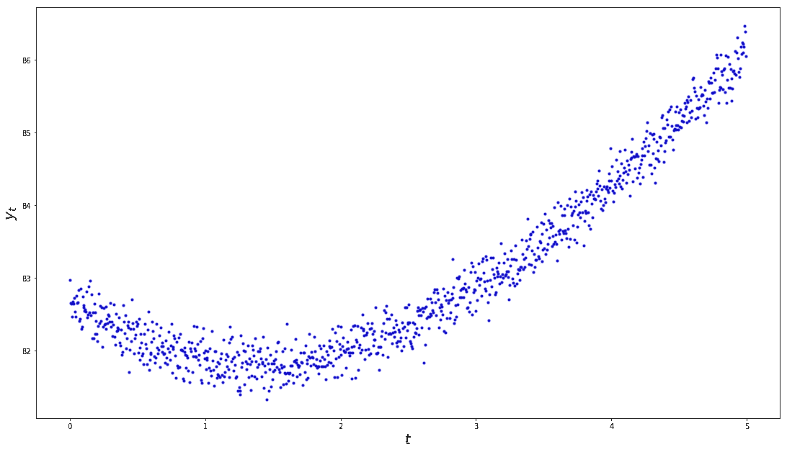
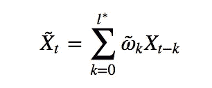
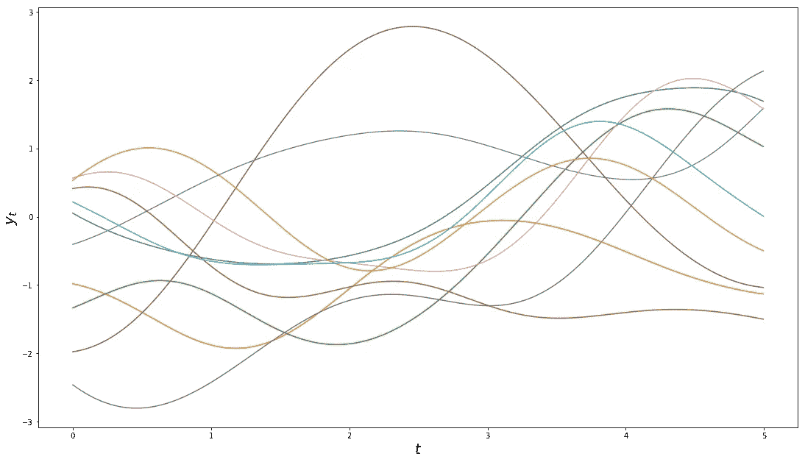

# 金融市场的平稳性和记忆性

> 原文：<https://medium.com/hackernoon/non-stationarity-and-memory-in-financial-markets-e5c43145b036>


Artistic impression of a multiverse. Credit: Jaime Salcido / EAGLE Collaboration

平稳性和时间序列的可预测性是时间序列记忆的一个特例，是量化投资过程的基本概念。然而，这些经常被从业者和研究人员误解，正如新书[金融机器学习的进展](https://www.amazon.com/Advances-Financial-Machine-Learning-Marcos/dp/1119482089)的第五章所证明的。上周在耶鲁大学的会议结束后，我很高兴地与一些出席[资产管理中机器学习的兴起](https://som.yale.edu/event/2018/10/the-rise-of-machine-learning-in-asset-management)的人阐明了这些误解，但我开始认为这个问题如此普遍，值得进行公开讨论。

在这篇文章中，我就金融市场的非平稳性和记忆性提出了一些缺乏文献证明的观点，有些观点违背了计量经济学的正统观点。所有的论点都有逻辑、数学、反例和/或最后用 python 代码做的实验作为支持。

这里提出的论点可以分为实用论点和技术论点:

**技术要点:**

*   *不可能用在有限时间间隔内观察到的单一路径来检验一个时间序列是否是非平稳的——不管时间间隔有多长。平稳性的每一个统计测试都对潜在过程所属的扩散家族做了额外的假设。因此，零假设拒绝可以表示扩散假设不正确的经验证据，或者扩散假设是正确的但是零假设(例如，单位根的存在)是假的。统计测试本身并不能确定哪种情况成立。*
*   *与[金融机器学习进展](https://www.amazon.com/Advances-Financial-Machine-Learning-Marcos/dp/1119482089)中声称的相反，不存在“平稳性与记忆困境”(一个与另一个无关)，记忆并不意味着偏度或过度峰度。*
*   *时间序列的迭代微分并没有使时间序列更加平稳，而是使时间序列更加无记忆；时间序列可以是无记忆的，也可以是非平稳的。*
*   *至关重要的是，非平稳但无记忆的时间序列很容易欺骗(单位根)平稳性测试。*

*记忆的概念和时间序列的可预测性紧密相关，我们在黄皮书中讨论了后者。我将借此机会分享我们在时间序列中量化记忆的方法。*

***实用要点:***

*   *市场(尤其是金融时间序列)是非平稳的，这有着直观的意义，但任何试图从统计学上证明这一点的努力都注定是有缺陷的。*
*   *量化投资管理需要平稳性，但 ***不是*** 金融时间序列的平稳性、可交易模式的“平稳性”或持续性或*alpha*在(足够长的)时间(地平线)上。*

> *平稳性*

*简单来说，平稳性就是事物不随时间变化的属性。*

> *定量投资经理需要平稳性*

*每一项量化投资管理努力的核心都是假设市场中存在过去盛行、将来也会盛行的模式，人们可以利用这些模式在金融市场中赚钱。*

*在部署资本之前，通常需要成功地寻找这些模式，通常被称为*alpha*，并预期它们会随着时间的推移而持续存在。因此，平稳性是量化投资管理固有的一厢情愿的假设。*

> ***金融市场的平稳性是自我毁灭的***

*然而，阿尔法往往是他们自己成功的受害者。阿尔法越好，随着时间的推移越有可能被竞争对手复制，因此也就越有可能随着时间的推移而消失。因此，每一个预测模式必然是一个暂时的或短暂的制度。该政权将持续多久取决于阿尔法搜索的严格程度，以及对其开发的保密程度。*

*阿尔法的短暂是有据可查的；例如，我强烈推荐 Igor Tulchinsky 的新书《Unrules: Man，Machines and The Quest to Master Markets》。*

*关于金融市场高度非平稳的普遍看法，非平稳性通常是指数学意义上的，通常是指金融时间序列。*

> ***时间序列平稳性不能用一个有限样本来反证***

*在时间序列(又名随机过程)的情况下，平稳性有一个精确的含义(如预期的)；事实上是两个。*

*当一个时间序列的所有属性不因时间原点的改变或时间平移而改变时，称其为*强平稳*。当时间序列的均值和自协方差函数不随时间原点或时间平移的变化而变化时，称该时间序列为*二阶平稳*或*弱平稳*。*

*直观地说，平稳时间序列是其局部属性随时间保持不变的时间序列。因此，毫不奇怪，在过去几十年中，它一直是计量经济学中的一个关键假设，以至于人们经常认为，从业者应该在进行任何建模之前首先使时间序列平稳，至少在 Box-Jenkins 学派中是这样。*

*这是荒谬的，原因很简单，(二阶)平稳性，作为一个属性，不能从一个单一的有限样本路径被推翻。是的，你没看错！请继续阅读，了解原因。*

*但是在深入探讨一个近乎哲学的论点之前，我们先来举一个具体的例子。*

**

*Draw of a time series on a uniform grid of 1000 times between t=0 and t=1.*

*我们来考虑一下上面的情节。这是平稳时间序列的图吗？如果你简单地根据这个情节来回答，你可能会得出结论，它不是。但我相信你已经看出了其中的诀窍，所以你可能想要进行一个所谓的“平稳性测试”，这可能是最广泛使用的测试之一，即 [Augmented-Dickey-Fuller 测试](https://en.wikipedia.org/wiki/Augmented_Dickey%E2%80%93Fuller_test)。如果你这样做，你会得到以下结果(最后是源代码):*

```
*ADF Statistic: 4.264155
p-Value: 1.000000
Critical Values:
	1%: -3.4370
	5%: -2.8645
	10%: -2.5683*
```

*正如你所看到的，ADF 测试不能拒绝零假设，即时间序列是一个有单位根的 AR，这(某种程度上)证实了你最初的直觉。*

*现在，如果我告诉你，上面的图是从均值为 100 的高斯过程和自协方差函数中提取的*

**

*那么我肯定你会同意这确实是从(强)平稳时间序列中得出的结论。毕竟，它的均值和自协方差函数在时间平移下是不变的。*

*如果你仍然感到困惑，这里有一个更长时间范围内的相同结论:*

**

*Same draw as above but zoomed-out.*

*我敢肯定你一定在想，它看起来更像你对一个平稳时间序列的期望(例如，它在视觉上是均值回复的)。让我们通过 ADF 测试来确认这一点:*

```
*ADF Statistic: -4.2702
p-Value: 0.0005
Critical Values:
	1%: -3.4440
	5%: -2.8676
	10%: -2.5700*
```

*事实上，我们可以拒绝零假设，即时间序列在 0.05%的 p 值是非平稳的，这给了我们很大的信心。*

*然而，这两个实验之间的过程并没有改变。事实上，即使使用的随机路径是相同的，两个实验都有足够的点数(至少一千)。那到底怎么了？*

*直觉上，虽然第一个实验有足够大的*样本量*，但它没有足够长的*时间间隔*来表征底层过程，而且我们不可能事先知道这一点！*

****要点是，如果不做任何额外的假设，从在有限时间间隔内观察到的单一路径来看，根本不可能测试一个时间序列是否是平稳的。****

*有两个假设经常被实践者和研究者忽略，以至于导致错误的结论；一个隐式假设和一个显式假设。*

1.  ***隐含假设***

*平稳性是随机过程的特性，而不是路径的特性。试图从单一路径测试平稳性应该隐含地依赖于这样一个假设，即手边的路径对潜在过程的性质提供了足够的信息。正如我们在上面看到的，情况可能不是这样，更重要的是，我们没有办法排除这个假设。因为路径看起来不像均值回复并不意味着底层过程不是静止的。你可能没有观察到足够的数据来描述整个过程。*

*沿着这条思路，任何金融时间序列，无论是否通过 ADF 检验，总是可以扩展为通过 ADF 检验的时间序列(提示:存在平稳随机过程，其路径空间是普适的)。因为我们不知道未来会发生什么，严格地说，说金融时间序列是非平稳的有点滥用，至少和说金融时间序列是平稳的一样。*

*在缺乏平稳性证据的情况下，时间序列不应该被假设为非平稳的——我们不能简单地在统计上偏向一个属性而不是另一个。这类似于任何关于二元命题 A 的逻辑推理:没有 A 成立的证据永远不是 A 不成立的证据。*

*假设金融市场是非平稳的，作为一条*公理，可能比假设市场由于结构原因是平稳的更有*实际意义。例如，预期生产率、全球人口和全球产出(所有这些都与股票市场相关)会随着时间的推移而增长，这并不遥远。然而，不会做出更多的 ***统计意义上的*** ，这是一个工作假设，我们根本无法根据数据使其无效(在日照下)。***

**2.**显式假设****

**平稳性的每一个统计检验都依赖于一个假设，即潜在过程的扩散必须位于扩散的类别中。没有这一点，我们就无法构建用于测试的统计数据。**

**常用的(单位根)检验通常假设真实的扩散是自回归或 AR 过程，并检验单位根的不存在作为平稳性的代理。**

*****言外之意是，这种检验并没有把底层过程是非平稳的作为零假设，而是认为底层过程是非平稳的 AR 过程！*****

**因此，导致拒绝零假设的经验证据可能指向一个事实，即潜在的过程不是 AR，或者它不是静态的，或者两者都是！单元根测试本身不足以排除底层流程可能不是 AR 流程的可能性。**

**这同样适用于对潜在扩散进行不同假设的其他平稳性测试。没有模型就没有统计假设检验，也没有统计假设检验能够验证它所基于的模型假设。**

> ****求平稳阿尔法，不求平稳时间序列****

**鉴于我们无法在不对时间序列的扩散进行假设的情况下测试时间序列是否平稳，我们面临两种选择:**

*   **假设扩散并测试平稳性**
*   **学习预测模型，假设或不假设平稳性**

**由于 Box-Jenkins 方法的影响，前一种方法是计量经济学文献中最常用的方法，而后一种方法更符合机器学习的精神，即从观察值灵活地学习数据生成分布。**

**为金融市场建模是困难的，非常困难，因为市场是复杂的，几乎是混沌的系统，信噪比非常低。任何正确描述市场动态的尝试——例如试图构建静态转换——作为构建阿尔法的要求，都是勇敢的、违反直觉的、低效的。**

**阿尔法是市场特征的函数，可以预测绝对或相对的市场变动。要被信任，alpha 应该被期望随着时间的推移而保持不变(即，在宽松的意义上是静止的)。然而，底层过程本身是否是静态的(在数学意义上)完全无关紧要。价值、规模、动量和套利是几十年来有据可查的交易理念的例子，与价格或收益序列的平稳性无关。**

**但是平稳性已经足够了，让我们继续讨论市场记忆的本质。**

> **记忆**

**直观上，当一个时间序列的过去值与其未来值相关时，它应该被认为具有记忆性。**

**为了说明一个关于记忆的常见误解，让我们考虑一个简单但有代表性的例子。在[金融机器学习的进展](https://www.amazon.com/Advances-Financial-Machine-Learning-Marcos/dp/1119482089)中，作者认为**

**“大多数经济分析遵循两种范式之一:**

*   **Box-Jenkins:回报是固定的，但是没有记忆**
*   **Engle-Ganger:对数价格具有记忆性，但是它们是非平稳的，协整是使回归在非平稳时间序列上起作用的技巧[…]”**

**为了充分利用这两个词，作者建议构建加权移动平均过程**

****

**其系数基于具有固定窗口的分数微分的概念来确定，作为对数收益的替代(对数价格的一阶微分)。作者建议选择移动平均时间序列通过 ADF 平稳性检验的最小分数微分度 0 < d < 1(在给定的 p 值下)。**

**整个方法回避了几个问题:**

*   **平稳性和记忆之间真的存在两难吗？**
*   **我们如何量化时间序列中的记忆，从而确认它们是否是无记忆的？**
*   **假设我们可以找到一个具有大量内存的平稳移动平均变换，这将如何帮助我们生成更好的阿尔法？**

> ****量化记忆****

**直观上，很容易看出移动平均过程通过构造表现出记忆性(移动平均的连续观察值必然是相关的，因为它们部分是使用输入时间序列的相同观察值计算的)。然而，并不是每个有记忆的时间序列都是移动平均线。要确定平稳时间序列是否有记忆，应该有一个量化任何时间序列记忆的框架。我们已经在我们的[黄皮书](http://bit.ly/2Muld5o)中解决了这个问题，下面是一个简要的总结。**

**指导任何测量时间序列记忆方法的定性问题如下。了解过去能让我们了解未来吗？换句话说，知道到现在为止的所有过去的值是否减少了我们对时间序列的下一个值的不确定性？**

**随机变量中不确定性的标准度量是它的*熵*，当它存在的时候。**

****

**The entropy of a probability distribution with density function **p** with respect to a base measure **dμ.** The entropy of a random variable is that of its probability distribution.**

**类似地，在观察另一个随机变量后，一个随机变量中留下的不确定性通常由*条件熵*来度量。**

****

**Conditional entropy of y given x.**

**因此，时间序列中记忆的一个候选度量是关于时间序列的未来值的不确定性减少，这可以通过观察所有过去的值来实现，在无限数量的这种过去的值的极限情况下。我们称之为时间序列自动可预测性的*。***

******

***Measure of memory or auto-predictability of a time series.***

***当它存在时，自动可预测性的度量总是非负的，并且当且仅当时间序列的所有样本在时间上相互独立时为零(即，过去与未来无关，或者时间序列是无记忆的)。***

***在平稳时间序列的情况下，PR({X})总是存在的，并且由任何观测的熵与时间序列的熵率之差给出。***

******

***Measure of auto-predictability of a stationary time series.***

***在我们的黄皮书中，我们提出了一种基于最大熵的方法来估计 PR({X})。下面这个图说明了股票、期货、货币的内存有多大。***

******

***Memory in daily returns of currencies, U.S. futures and U.S. stocks.***

> *****记忆与平稳性无关*****

***上述讨论的一个直接结果是，时间序列既可以是静态的，也可以有大量的记忆。一个并不排斥另一个，事实上，一个仅仅是与另一个相关的 ***而不是*** 。***

**事实上，在平稳高斯过程的情况下，可以表明自动可预测性的测量结果为**

****

**Measure of auto-predictability of a stationary Gaussian time series with power spectrum g.**

**值得注意的是，PR({X})=0 当且仅当功率谱为常数，即时间序列为平稳高斯[白噪声](https://en.wikipedia.org/wiki/White_noise#Mathematical_definitions)，否则 PR({X}) > 0。平稳的白噪声不会因为它是平稳的而缺乏记忆，它缺乏记忆是因为它是，嗯……一个白噪声！**

**功率谱越不均匀，时间序列内存越多。自协方差函数越平坦，功率谱越陡峭，因此自可预测性的度量就越高，时间序列的记忆性就越强。这种平坦自协方差函数的一个例子是平方指数协方差函数**

****

**在输入长度标度参数 *l* 趋于无穷大的极限内。**

****

**Independent random draws from the same stochastic process, a mean-zero Gaussian process with Squared-Exponential covariance function, with output and input scale 1.**

**简而言之，不存在平稳性 vs .内存困境。正如 Box-Jenkins 方法所提倡的，实践者头脑中的混乱来自于对迭代微分过程中发生的事情的误解。下一节将详细介绍这一点。**

> ****记忆与偏度/峰度无关****

**关于记忆的另一个误解是“记忆会带来偏斜度和过度峰度”。这也是不对的。如前所述，有可能产生高斯型(因此既不是偏斜的也不是薄态的)、平稳的、具有任意长记忆的时间序列。**

> **迭代微分、平稳性和记忆**

> ****迭代微分不会使时间序列更加平稳，它会使时间序列更加无记忆！****

**在[后移运算符](https://en.wikipedia.org/wiki/Lag_operator)的意义上,(离散时间)时间序列的微分非常类似于高中所学的曲线微分。**

**我们对一条曲线微分得越多，这条曲线就越有可能经历不连续/突变(当然，除非它是无限可微的)。**

**直觉上，同样地，时间序列在后移算子意义上的微分越多，时间序列将经历越多的冲击(在随机意义上)，因此其样本将越接近相互独立， ***但不一定是相同分布的*** ！**

**一旦一个时间序列被微分了足够多的次数，以至于它变得无记忆(即它有相互独立的样本)，它本质上就是一个随机游走， ***虽然不一定是一个平稳的*** 。我们总是可以构造一个非平稳的时间序列，无论它被微分多少次，永远不会变成平稳的。这里有一个例子:**

****

**Example time series that cannot be made stationary by iterative differentiation. {W} is the standard Wiener process.**

**它的一阶微分是完全无记忆的，因为 Wiener 过程的增量是独立的。**

****

**它的方差函数 g(t)是时变的，因此{y}是非平稳的。**

**类似地，对于每个 d>0，{y}的阶-(d+1)微分既是无记忆的，也是非平稳的。具体来说，后续的迭代微分读取**

****

**并且它们的时间相关方差函数读作**

****

**这个表达式对于每个 *d* 都在 *t* 中展开，对于任何*t*都不在 *d* 中收敛。换句话说，连续微分不会使方差函数均匀，因此不会使这个时间序列更加平稳！**

> ****一次随机漫步，无论是否平稳，通常都能通过大多数单位根测试！****

**从业者对迭代微分和平稳性的困惑源于这样一个事实，即大多数单位根检验会得出无记忆时间序列是平稳的结论，尽管事实不一定如此。**

**让我们以 ADF 测试为例。**

****

**Regression model underpinning the Augmented Dickey-Fuller test.**

**如果一个时间序列{ *y* }是无记忆的但不是平稳的，支持 ADF 检验的普通最小二乘(OLS)拟合不能产生完美的拟合。OLS 如何用足够大的样本来解释这种偏离？由于时间序列是无记忆的，OLS 通常会找到γ接近 1 的证据，因此 ADF 检验应该拒绝γ=0 的零假设，从而得出时间序列没有单位根(即，是一个平稳的 AR)的结论。{ *y* }的时变方差通常将通过平稳噪声项{ *e* }来观察。**

**为了说明这一点，我们在 0 和 1 之间均匀地随机产生 1000 个随机抽取，并且我们使用这些抽取作为 1000 个独立产生的零均值高斯分布的标准偏差。结果如下图所示。**

****

**A non-stationary memoryless time series (left) and its time-varying standard deviation (right).**

**对该样本进行的 ADF 测试清楚地拒绝了零假设，即该时间序列是从具有单位根的 AR 中提取的，这可以从下面的统计数据中看出。**

```
**ADF Statistic: -34.0381
p-Value: 0.0000
Critical Values:
	1%: -3.4369
	5%: -2.8644
	10%: -2.5683**
```

**在这一点上，从业者经常得出结论，时间序列应该是平稳的，这是不正确的。**

**如前所述，不是非平稳 AR 的时间序列不一定是平稳的；要么根本不是 AR 时间序列，要么就是平稳的 AR。总的来说，ADF 测试本身并不能确定这两种说法哪一种成立。然而，在这个例子中，我们知道不正确的假设不是非平稳性，而是 AR 假设。**

> **总结想法**

**媒体对人工智能可能对投资管理行业产生的影响给予了很多关注，一些文章大肆宣传人工智能，警告回溯测试过度拟合的风险，提出金融市场的信噪比排除了人工智能革命的可能性，甚至认为人工智能已经在该行业存在了几十年。**

**在这些媒体报道中，机器学习通常被认为是一个静态领域，是金融界的外源，是由他人开发的一套通用方法。然而，资产管理行业的特殊性保证了新的机器学习方法的出现，这种方法是从一开始就以金融第一的心态设计的，并对长期以来的教条提出了质疑。这种技术出现的最大障碍之一可能是对简单但基本的概念的广泛误解，如研究过程的核心平稳性和记忆。**

> ****附录:代码****