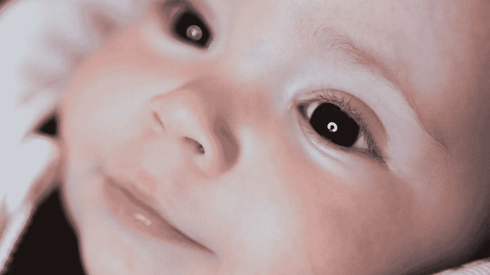
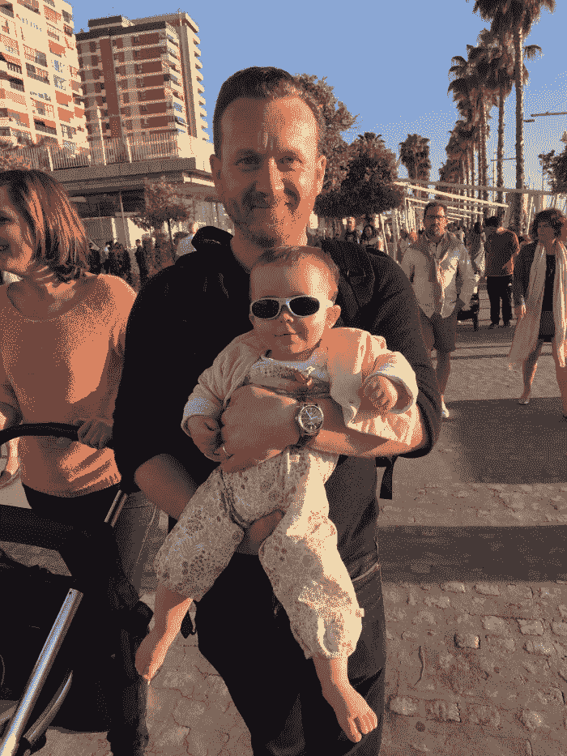

# 并非所有事情都与技术有关，有时记住这一点是有好处的…

> 原文：<https://medium.com/hackernoon/not-everything-is-about-technology-and-sometimes-its-good-to-remember-that-94a8b5e01153>

当我开始写这篇文章时，我意识到我可能在利用我从 Macbook 传奇中获得的追随者，他们可能期待更多的科技文章。

会有更多的，但这不是一个。

**这是关于更重要的事情。以这样或那样的方式影响我们所有人的东西。**

如果说我在过去 14 年的戒酒生涯中学到了什么，那就是我们无处不在。

我说的我们，指的是清醒的和饮酒的酗酒者。

同样，当你买了一辆特定类型的车，你会突然注意到路上所有你从未见过的其他车，一旦你承认自己是个酒鬼——尤其是一旦你清醒了——你就会开始到处碰到它们。

**澄清一下——我不说教。这不是我的风格。如果你能快乐安全地喝酒，那对你有好处！说真的。我不嫉妒。我不反对酒精。我不会攻击你或者让你停下来。**

但是我不能快乐或安全地饮酒，所以我在 2004 年决定停止饮酒。

这是我做过的最好的事情。

今天，46 岁的我正在庆祝生日。

不是我的，那是在九月。

不是我的“清醒生日”，那是在六月(清醒的好处之一是，像女王一样，你每年有两个生日)。

不，我在庆祝一个更重要的生日…

很难说如果我继续喝酒，我的生活会变成什么样——尽管我很确定我会死——但我可以说的是，如果我没有戒酒，我就不会在这里庆祝我漂亮的小女儿朱莉娅的第一个生日。

我说过戒酒是我做过的最好的事，不是吗？那不完全正确。它帮助朱莉娅来到这个世界。

但是如果不先清醒一下，那就不会发生了。

由于我工作的性质，我有机会帮助——或试图帮助——许多有酗酒问题的人。

他们唯一的共同点是他们几乎没有任何共同点——除了酗酒问题和改善生活的愿望——以及他们周围人的生活。

*顺便说一句，值得注意的是，我们服务的大多数人都没有饮酒问题——人们越来越节制饮酒，渴望成人替代品——即使在英国也是如此，英国是最后几个认识到这一点的国家之一。*

但是我们也确实有酗酒的顾客，这一点——加上我通常倾向于公开谈论我的酗酒问题，而许多其他人，也许是正确的，更喜欢保持沉默——意味着我确实经常需要帮助。

了解酗酒者，并试图帮助他们，可能是有益的，但也带来了“失去他们”的情感风险。

这有点像你买了一只宠物——你必须接受你很有可能在某个时候不得不和它说再见(酗酒者不太可能想依偎在一起被挠痒痒，但好的一面是，他们也不会要求一天散步两次)。

仅举一个例子，我几年前认识的一个戒酒的人在他再次开始喝酒后于去年去世。

他请求帮助，我们在电话里聊了很久。他知道他必须再次停下来。他知道他在对自己做什么。

他很聪明。他受过教育。他有职业生涯。像许多媒体的读者一样。

但这还不够。

不久之后，我从他的家人那里得到消息，他死于一次与饮酒有关的事故。这是疾病的残酷现实。

我选择说出来，因为我知道每当我这样做的时候，至少有一个人——可能更多——会突然意识到——“那就是我——我需要停下来”。我一直觉得，如果我的作品或我的事业能帮助一个人，那就是值得的。

**正如我所说，我们无处不在。**

就像搏击俱乐部一样——“我们为你做饭，帮你倒垃圾，帮你接电话，帮你开救护车。你睡觉时，我们守护着你。

我们还经营您所依赖的业务，准备您的纳税申报单，开发您所使用的软件，制造您所驾驶的汽车，出演您最喜爱的电影，管理您的社区，为您和您所爱的人实施救生手术，如果需要的话，也许是为了酒后驾车，在法庭上代表您。

所以，对于那些还在读书的人，我希望你是大多数对喝酒没有问题的人，但是如果你确实有问题，只要知道你不是一个人，还有另一种选择。酒后有生活，很奇妙。

我用我最近做的一个 [**视频**](https://www.youtube.com/watch?v=bbfYmB0WjdU) 来结束。这是一段即兴录音，是对我认识的一个人的回复——但不是朋友——他在承认自己是个酒鬼后联系我寻求建议。

我很高兴地说，他们很快就取得了联系，感谢我的视频，并说他们已经开始去一个支持小组和一名治疗师。他们还有很长的路要走，但至少他们已经开始了，这才是最重要的。

当我试着放松时，试着不去想一天的工作，花时间陪我的妻子和一岁的小女儿(说真的，时间过得多快？！)希望这个视频至少对你们中的一个人有用。

我郑重声明，我不是专业人士或临床医学家，我只是一个成功戒酒的人，迄今为止，我已经戒酒 14 年了。我不能提供治疗方法——没人能——但是如果有人需要倾听，请随时联系我。

对于那些读过这篇文章但没有问题的人来说，你认识的人可能会有问题。他们可能是你的朋友。他们可能在工作时坐在你旁边。

请鼓掌——这有助于其他人看到这篇文章——或者直接在社交媒体上分享这篇文章和视频。

谢谢你。

x