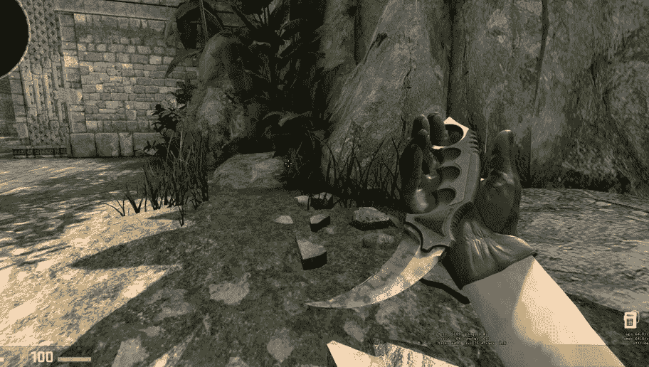
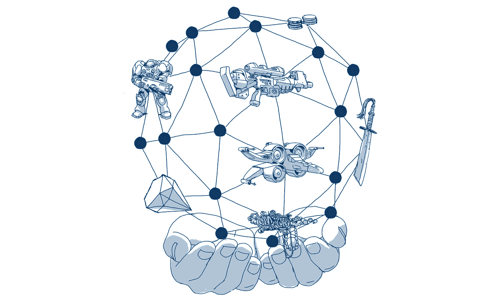

# 不仅仅是一个流行词:游戏发行商将受益于区块链技术的 6 个理由

> 原文：<https://medium.com/hackernoon/not-just-a-buzzword-6-reasons-why-game-publishers-will-benefit-from-blockchain-technology-8e4a241c6a03>

## **TL；博士:**

**理由 1:** 将二级市场和一级市场货币化 **理由 2:** 延长游戏寿命 **理由 3:** 在日益分散化的世界中保持信任
**理由 4:** 利用新的筹款和社区建设方式
**理由 5:** 消除现有的欺诈行为 **理由 6:** 提供更轻松、更安全的游戏内服务

## **原因 1:将二级市场而不仅仅是一级市场货币化**

通常情况下，游戏公司通过第一次向玩家出售游戏物品来赚钱，仅此而已。当游戏玩家试图在二级市场上出售这些物品时(通常违反游戏的最终用户许可协议——EULA)，出版商不会得到任何好处。

这是一个潜在的利润丰厚的市场，但他们却没有从中分得一杯羹:目前，“皮肤”(第一人称射击游戏中的装饰性武器附件)交易的二级交易市场每年价值 4 亿美元。

The most expensive skin in Counter-Strike: Global Offensive — the Karambit Case Hardened Factory New for $100,000.

从历史上看，这不是出版商所支持的！当二手游戏的销售在二级市场蓬勃发展时，游戏公司很快就转向销售他们产品的纯数字版本。这使他们能够保持市场份额，而且由于在线渠道和平台扩大了受众范围，也增加了收入。

***“但是一个游戏发行商到底是如何将二级市场货币化的呢？”***

开发者可以在实现虚拟游戏物品的代码时嵌入某些规则。这些可以包括烘焙费，每当采取某个行动时，包括当一个物品从一个玩家转移到另一个玩家时，烘焙费都会返还给游戏公司。

显然，更自由、更公平的政策将比其他政策吸引更多的游戏玩家，然而，随着二级市场充斥着欺诈，这是游戏公司可以帮助保护其游戏玩家的一种方式。

此外，不同的规则结构可以激励或去激励某些游戏内交易，使开发者能够保持他们希望创建的游戏世界和经济的愿景。

## **理由二:增加游戏寿命**

随着免费游戏成为收入最高的游戏模式，发行商从随后的游戏内容销售中赚钱，游戏玩家越来越多地在物品上花费创 T2 记录的金额。

如果游戏玩家愿意在他们并不真正拥有的物品上花很多钱，如果他们知道他们可以重新获得这些价值，他们会愿意多花多少钱呢？我们相信，出版商只要激活真正的所有权，就能从*一级*销售中获利。

当人们在经济上投资于一个系统时，他们更有可能在其中呆得更久。我的第二人生(My Second Life)就是一个例子，这款游戏有着强劲的经济，促进了真实货币交易，在其 10 周年纪念日报告称，在其平台上发生了价值超过 32 亿美元的虚拟商品交易。

***增强和虚拟现实正在推动这场革命……***

虚拟和增强现实游戏的兴起意味着现实和虚拟世界之间的界限将进一步模糊。随着用户要求虚拟“财产”成为他们现实生活资产的真实组成部分，虚拟“财产”将会变得越来越真实。

根据 VC [Alon 焊接机](/@alonbonder/virtual-goods-the-next-big-gold-rush-8b85d893c3b8):

> “因为虚拟商品在虚拟现实中感觉更真实，它们受益于更高的感知价值……如果用户愿意花这么多钱在二维世界中体验虚拟商品，他们可能会花多少钱在真正的虚拟现实中体验它们？这将意味着在你的桌面头像上看到一件阿玛尼晚礼服和感觉你正亲自穿着它之间的区别。”

我们希望促进无缝交易，这样在虚拟世界中为自己创造价值的人，比如说，通过在游戏中抢劫敌人，可以利用这些价值来改善他们的现实世界状况，比如第二天早上用她的收入买一杯咖啡。

## **原因 3:在日益分散的世界中保持信任**

毫无疑问，我们的世界正在向更少而不是更多的集中化转变。在金融危机之后，人们意识到算法正在扭曲我们的信息来源，强大的网络垄断企业采取了肆无忌惮的反竞争措施，人们越来越回避中央机构。

> 用不了多久，公司就不得不提出一种去中心化的模式来吸引他们的顾客。

此外，越来越多的公司意识到将游戏与区块链技术相结合的潜力。目前，超过 [70%的以太坊应用是游戏，游戏交易占以太坊区块链日活跃用户的 26%以上](https://tokenthusiast.com/2018/03/30/more-than-70-of-ethereum-dapps-are-games/)。

在过去的三个月里，超过 1 亿美元的加密游戏已经成交。这些游戏包括:

*   *😺—非常受欢迎的加密收藏品游戏，因交易量导致以太坊网络严重中断而闻名，最近获得了 Andreeson Horowitz 和 Union Square Ventures 的 1200 万美元投资。*
*   *****🤖 *—**** *一款策略对战游戏，在预售中售出了价值超过 100 万美元的机器人，[在推出后的 24 小时内在以太坊网络上的交易量超过了 Cryptokitties](https://hackernoon.com/etherbots-launches-overtaking-cryptokitties-in-transaction-volume-again-e179307991eb) 。***
*   **[***cellarius***](https://cellarius.network/)*☄️—一个游戏世界，利用区块链技术和用户生成的资产来创建一个协作的、粉丝策划的故事。在这里观看[宣传片视频](https://youtu.be/Ke7ujS_SBnU)。***

***这不是一个 ***如果*** 而是 ***当*** 建立在区块链技术上的高质量将开始进入生态系统。当游戏玩家开始在高质量的游戏中做出选择时——有些游戏能让他们真正拥有游戏，而有些则不能——你认为他们会选择哪一个？***

## ****理由 4:筹款和社区建设的新途径****

**这种代币模式也使发行商能够利用新的方式为游戏筹集资金。自推出以来，Kickstarter 的“游戏”类别是其承诺最高的类别，迄今为止，项目已经筹集了超过 7 亿美元——证明了游戏开发的众筹模式是可行的。**

**如果像[星际公民](https://en.wikipedia.org/wiki/Star_Citizen)这样的游戏，自 2012 年 11 月以来已经众筹了超过[1.59 亿美元](https://www.polygon.com/2018/1/3/16845616/star-citizen-versus-kickstarter-money-raised)，并向支持者提供了一个承诺，即当一个史诗游戏发布时(截至 2018 年 4 月仍未发布)，可以获得多少区块链游戏的潜力，这些游戏提供了代表游戏世界内真实效用的代币，以及现实世界中的金融价值？**

**我们在之前的一篇博文中详细介绍了一家游戏公司如何在 Hoard 平台上筹集资金并建立一个参与式社区: [**刘的游戏:未来游戏融资的故事**](https://blog.hoard.exchange/lius-game-a-story-of-game-financing-in-the-future-d35fa33547ed) 。**

## ****原因 5:消除欺诈****

**欺诈是游戏经济中的一个主要问题。据估计，每销售和下载一个合法的虚拟物品，就有 [7.5 个虚拟物品因欺诈](https://venturebeat.com/2018/02/23/blockchain-could-transform-in-game-economies/)而损失。**

> **欺诈破坏了充分和自由的游戏经济繁荣所需的信任和安全。**

**分散的系统也意味着没有集中的脆弱点。目前，在线游戏平台容易受到 sybil 攻击、非法应用内购买经纪人以及使用伪造或盗窃的信用卡的影响。Steam 报道称，其平台上被劫持的账户数量持续上升。**

** [## 蒸汽新闻-安全和交易

### 我们每个月都会看到大约 77，000 个帐户被劫持和抢劫。这些都不是新的或天真的用户；这些都是职业 CS:围棋手、reddit 投稿人、物品交易商等。用户可以作为一个更大的群体的一部分随机成为目标，也可以单独成为目标。黑客可以等待数月以获取回报，同时毫不留情地试图获得访问权。保护你的物品是一场必败的战斗。

store.steampowered.com](http://store.steampowered.com/news/19618/) 

区块链技术是几十年来密码学和安全研究的成果，提供了一种新的数据存储和执行功能的方法。尤其是在参与者互不认识、需要高度安全性的环境中，这种方法更为盛行。

[它可以用来提高游戏安全性的一些方法包括阻止身份盗窃、防止数据篡改和阻止拒绝服务攻击。它还可以消除重复支出和未经授权的重复内容。](https://venturebeat.com/2017/01/22/blockchains-brilliant-approach-to-cybersecurity/)** 

## ****理由 6:提供更容易、更安全的游戏内交易****

**建立支付系统、服务器和处理虚拟内容交易所需的基础设施，以及确保其安全性，是昂贵的，并且如上所述，充满了漏洞。**

**越来越多的游戏转向区块链技术来帮助解决这些问题。**

**Hoard 平台将为交易(和微交易)提供一个去中心化的网关！)以当前信用卡费用和商家订阅费的一小部分来执行。运行在以太坊网络上的智能合约将实现“智能交易”，即买卖双方无需向银行支付托管资金，每笔交易都被永久保存。**

**如果你是游戏发行商、开发商或感兴趣的游戏玩家，我们很想听听你对这些原因的看法。请在下面给我们留言👇或者在[**Twitter**](https://twitter.com/hoardexchange)**或**[**Reddit**](https://www.reddit.com/r/HoardEx/)上与我们连线。******

## ******想了解更多关于囤积的信息吗？******

*   ******查看我们的网站 ，了解更多关于我们的 [**团队**](https://www.hoard.exchange/#teamSection) 和 [**顾问**](https://www.hoard.exchange/#advisorSection)******
*   ******关注我们的 [**博客**](https://blog.hoard.exchange)******
*   ******阅读我们的 [**知识库**](https://knowledge.hoard.exchange)******
*   ******观看我们的 [**入门视频**](https://www.youtube.com/watch?v=rljhLcG1m8s&t=2s)******
*   ******阅读我们的 [**众筹论文**](https://www.hoard.exchange/docs/Hoard%20Crowdfunding%20Paper.pdf)******
*   ******[**注册**](https://www.hoard.exchange/#contributePeriodSection) 接收更新******
*   ******加入我们 [**推特**](https://twitter.com/hoardexchange) **，** [**电报**](https://t.me/hoardexchange) **，**[**Reddit**](https://www.reddit.com/r/HoardEx/)**和 [**脸书**](https://facebook.com/hoardexchange)********

********其他博文:********

*   ******囤积常见问题解答:2018 年 4 月 4 日版— [第一部分](https://blog.hoard.exchange/hoard-faqs-3-april-2018-edition-34213df69542) & [第二部分](https://blog.hoard.exchange/hoard-faqs-3-april-2018-edition-part-2-7725a698aaee)******
*   ******[引入囤积:促进以太坊游戏资产的真正所有权](https://blog.hoard.exchange/introducing-hoard-facilitating-true-ownership-of-gaming-assets-on-ethereum-5ecd84a9b7fb)******
*   ******[虚拟游戏物品的真实所有权有什么了不起的？](https://hackernoon.com/whats-so-great-about-true-ownership-of-virtual-game-items-be629e5ae900)******
*   ******[刘的游戏:未来游戏融资的故事](https://blog.hoard.exchange/lius-game-a-story-of-game-financing-in-the-future-d35fa33547ed)******