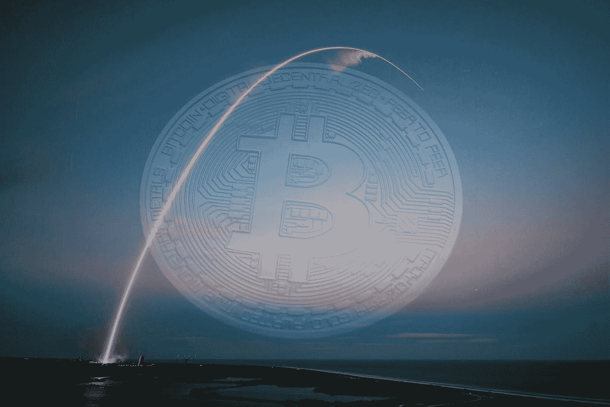
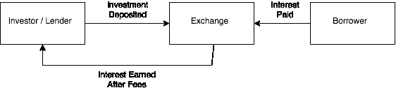
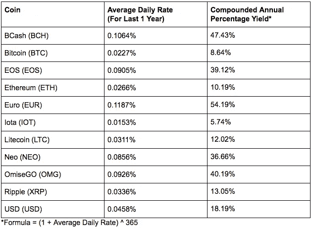
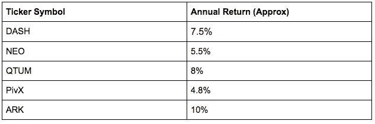

# 不确定 Crypto 要去哪里？考虑这些全天候加密投资策略之一

> 原文：<https://medium.com/hackernoon/not-sure-where-crypto-is-headed-consider-one-of-these-all-weather-crypto-investment-strategies-19229aab7bbe>

大多数买入并持有加密投资者的目标可能是“射向月球”，但实际上存在一个子集的加密投资策略，不管市场方向如何，都可以以不同的风险/回报剖面工作。

鉴于我对市场中性加密货币交易策略领域的兴趣/关注，我想我会分享一些我所知道的通用策略。对于那些感兴趣的人，我还将展示加密和非加密(法定)投资者如何能够自己实现它。

为了保持一致，每一部分都按照战略进行了细分，包括:

1.  战略的基本概念
2.  战略回报概况
3.  风险/需要考虑的事情
4.  在实践中实现这一点
5.  对于目前的加密投资者或投资者寻求获得加密曝光
6.  对于目前的非加密(法定)投资者(不希望暴露在加密)

作为一个 TL DR 的粉丝，我的如下(虽然我会推荐阅读细节以获得更好的感觉):

**借出 Cryptos/Fiat:** 相当容易管理并能产生稳定的回报。主要担心的是交易所违约风险，但总体而言，对于加密和法定投资者而言，实施起来相当容易。

**基差交易** 可以产生稳定的回报，但需要积极的管理，这可能会成为一个麻烦(不值得你浪费时间)。也不能为加密投资者实现。

**套利(交叉外汇套利)** 具有可观回报的潜力，但需要深入的知识和积极的管理才能实现最大化。可以由加密或法定投资者实施。

**投资股权证明(POS)硬币** 没有有效的方法来对冲加密风险，因此这种策略对于仅持有法定凭证的投资者来说难以实施。只有真正可行的加密投资者已经打算投资到这些硬币，因为硬币的升值/贬值应该是首要关注的问题。

# 在加密领域借出 Cryptos/Fiat

就像借钱出去赚取利息一样，你也可以在加密货币空间内这样做。与贷款类似，回报可能没有投机那么有吸引力，但可能更加稳定和一致。

通常，借入加密货币需求来自于以下交易者:

*   想借密码卖空吗
*   想利用他们的投资，比如借 BTC 来收购 ETH

因此，为了促进这种需求，一些交易所提供以每日利率出借你的加密货币(甚至是美元等法定货币)的服务。这使得霍德勒可以借出他们的密码来赚取一些额外的收入，同时允许交易员利用杠杆在市场上下注。

## 返回配置文件

加密贷款策略的回报可能因市场条件而异。例如，如果存在强烈的看跌情绪，那么借入加密债券进行空头头寸会变得越来越困难，这反过来会提高借款利率，因此贷方可以获得更优惠的利率。

费率本身是每日定价的，因此年化性能可能会有很大波动，这取决于您可以锁定的费率，并假设您能够保持完全部署。以下是目前的一些汇率:

对于 Bitfinex:

Source: [http://www.polobot.net/ratehistory](http://www.polobot.net/ratehistory) on 21 Oct 2018

## 风险/需要考虑的事情

那么，这种策略有什么风险呢？

最主要的是交易所违约风险。这就是你不得不把你的资金留在密码交易平台上的风险，因为你需要使用交易所来借出你的密码。这意味着，如果交易所破产(违约)，那么你的加密资产将面临风险。(我将在以后的文章中详细介绍交易所违约风险)

另一个风险是，在某些情况下，你将无法在贷款期间收回你借出的密码。这意味着你不能随时出售你的密码，因此当市场波动时会带来风险(机会成本)。

## 在实践中实现这一点

这是一个执行起来相当简单的策略，因为有提供贷款(或保证金融资)的交易所，这让你很容易设定自己的贷款利率并执行“交易”。但是，这项服务仅由选定的交易所提供，这意味着您必须放心地向他们存款:

*   Bitfinex
*   波洛涅克斯
*   以前称为 QuadrigaCX 的液体

***注意:这仅仅是事实，并不是对这些交流的推荐/认可。***

**对于密码投资者**:在这种情况下，你只需将你持有的密码借出。当你收到利息时，你的回报将基于人们对借你密码的需求。你仍然有潜在的密码暴露，仍然可以随时出售你的密码(只要它没有被锁定在贷款中)。

**对于 Fiat 投资者:**不想接触加密的投资者可以利用这个机会，对他们购买的加密进行对冲，或者只是在平台上借出 fiat (Bitfinex 提供美元和欧元)。从我的经验来看，在菲亚特贷款通常比做复杂的对冲品种更有利可图，但如果你仍然决定选择对冲选项，请务必检查你在扣除费用后获得的贷款利率是否大于你支付的对冲成本。

# 基差交易

根据维基百科，“基差交易是一种金融交易策略，包括购买特定的金融工具或商品，并出售其相关的衍生品(例如购买特定的债券和出售相关的期货合约)。”

那么，你如何通过采用基差交易策略来赚钱呢？以期货合约为例，你会经常看到在加密(和金融)市场有一个与期货相关的溢价/折价。这意味着，如果你持有期货合约和同等头寸，你就有可能从中获得回报。

例子(以比特币为例):

*如果比特币期货相对于价格为 6000 美元的比特币溢价 6300 美元*

1.  购买比特币，价格为 6000 美元
2.  溢价出售比特币期货交易，售价 6300 美元。
3.  当期货到期时，卖出比特币。

因此，扣除交易费用前的利润= 6300 美元—6000 美元= 300 美元

[bit MEX 上的这篇文章](https://blog.bitmex.com/basic-basis-trading-strategies/)更详细地解释了这种类型的交易。

## 返回配置文件

正如你可能已经发现，这种策略将有效地对冲你的密码暴露，从而使它只适合菲亚特投资者。根据当时的市场情绪，这种策略的回报可能会有所不同。例如，截至本文撰写之时，2018 年 12 月期货的年化折扣仅为 0.3%左右，这并不具有吸引力。但我看到，在波动性较高的时期，这个数字会显著增加，可能在 10%左右。

## 风险

在我看来，最大的“实际”风险是确保你有足够的资金来维持你的期货头寸(即保证金)，同时持有必要的加密资产。鉴于 cryptos 的不稳定性，这对于 cryptos 来说尤其困难，这意味着如果你不小心，保证金追缴很容易发生。

交易所违约风险(在这种情况下也称为交易对手风险)也是一个问题，因为如果你的加密资产或金融衍生品头寸违约，那么它可能会带来不可预见的风险。

此外，金融衍生品的使用给这种交易带来了一定程度的技术复杂性，增加了风险。因此，我建议你需要掌握一些技术知识，并积极监控你的头寸，以避免追加保证金等。来完成这个策略。

## 实施这一战略

你需要访问加密金融衍生品和加密本身来完成这项交易。比较著名的金融衍生品交易所有:

*   CME——提供比特币期货
*   CBOE——提供比特币期货
*   Bitmex —提供各种加密金融衍生品。

图中显示了它的工作原理，接下来的文章中有更多的细节，提供了如何实现它的分步说明。

**对于加密投资者**:加密投资者将无法利用这个机会，因为你会希望保持你的加密敞口。因此，采用这种策略将在本质上对冲你的密码暴露。

**对于 Fiat 投资者:** Fiat 投资者可以按照描述进行交易，因为持有期货加密的固有性质应该提供适当的对冲。你也可以考虑各种金融衍生品，比如永久掉期(Bitmex 提供)，它们可以增加不同的回报组合。然而，如果你试图用其他金融工具来做这件事，那么你需要确保你完全对冲。考虑这一点超出了本文的范围，但是需要一定程度的金融知识。(我将在以后的文章中介绍更多关于对冲的细节)。

# 套利

这是事情变得有趣的地方(也是我最感兴趣的地方)。

引用维基百科，“套利是在不同市场或以衍生形式同时买卖证券、货币或商品，以便利用同一资产的不同价格。”最简单的形式是，在一个定价较低的交易所购买某种东西，比如比特币，同时在另一个定价较高的交易所出售，以赚取利润。

这种策略有许多变体，我将在以后的文章中介绍。但为了说明如何做到这一点，我将看看加密货币领域最简单的套利形式之一，即交叉外汇套利。

# 交叉加密交易所套利

交叉加密交易所套利是指在一个交易所购买加密货币，同时(或在这种情况下尽快)在另一个交易所出售的行为。最传统的方法是:

1.  将钱存入交易所 A(价格较低的交易所)
2.  在 exchange A 上购买您的加密
3.  将密码从交易所 A 转移到交易所 B(价格更高的交易所)
4.  在交易所 B 出售密码获利。
5.  从 exchange B 中取出您的钱，这样您就可以再次重复第 1 步。

利润=在交易所 B 卖出的价格-在交易所 A 买入的价格

## 返回配置文件

这种方法在过去曾经奏效，最著名的案例是某些韩国交易所对比特币和其他加密货币的定价高于非韩国交易所。因此，两者之间的套利可能达到 10%或更多，这就是所谓的“泡菜交易”。然而，这种方法只能在你是韩国居民的情况下有效，因为外国人很难开设韩国加密兑换账户，也很难将你的钱进出韩国。

然而，套利交易通常只会产生很小的回报，这使得它们不值得，除非你能够大规模地这样做，比如通过自动化，或者你有独特的优势来帮助你在每次交易中赚取更大的利润(比如韩国交易所的例子)。

## 风险/需要考虑的事情

你可能会注意到，所建议的方法实际上并不同时买卖密码*，这意味着有你不希望有的短暂暴露(或缺乏暴露)时刻，这是这种方法的主要缺点之一。*

*另一个问题是，不得不存钱/取钱，这通常意味着你的资产有被交易所或银行冻结的风险。最有可能的情况之一是，银行可能怀疑你洗钱并冻结你的资产。*

*最后，与所有涉及交易所交易的策略一样，总是存在交易所违约风险，所以你需要小心你使用的交易所，因为一些较小的交易所可能有较高的套利回报，但违约风险也高得多。*

## *在实践中实现这一点*

*当你在交易所之间转移你的资金时，只要你愿意接受短期风险敞口/缺乏风险敞口，这种方法就能奏效。还有一些方法可以解决这个问题，但我不能透露(因为我们公司在使用它)，但所有这些方法都有其他缺点。*

*如果你有某种操作/结构上的优势，这种方法通常也很有效。例如，如果你拥有一个韩国加密账户，可以有效地将资金转入和转出韩国，那么你就可以利用上述的“泡菜交易”。或者，在我看来，你将不得不建立自动化系统来大量捕捉这些机会，使其增值。*

***对于密码投资者:**要实现这一点，同时保持你对密码的核心敞口，可以通过存入你的核心货币，如比特币，并对其进行成对套利。例如，你可以在价格较低的交易所用你的 BTC 买入 ETH，然后在价格较高的交易所卖回给 ETH。*

***对于菲亚特投资者:**你只需按照上述建议实施，并承担短期加密货币风险。或者，你可以尝试对冲你的加密货币敞口，但通常情况下，你的对冲成本会大于你在套利交易中可以获得的利润。*

# *投资股份证明(POS)硬币*

*我也包括了这一部分，因为理论上你可以投资 POS 币，对冲你的风险，使你保持市场中立。然而，在实践中，很难找到一种具有成本效益的对冲方式，而且投资 POS 币的收益往往低于对冲成本(这使得这种策略无利可图)。尽管如此，为了参考/完整起见，我还是把它包括进来了。*

*股权凭证(POS)硬币提供了稳定的分红型回报，而不仅仅是持有硬币。我不会详述它是如何运作的(因为这本身可能是一篇冗长的文章)，但本质上，你可以通过持有这些密码货币获得经常性收入。*

*分红币/股权凭证币的一些例子:*

*   *破折号*
*   *新的*
*   *QTUM*
*   *PivX*
*   *避难所*

*注意:这是 POS 币的例子，绝不是我对这类币的推荐。*

## *返回配置文件*

*这些硬币的回报率因您想要持有的硬币而有很大不同。一般来说，他们每年的回报率从低的一位数上升到低的两位数，而且这些回报来的时候都是被动的。*

*近似的每年归还部分硬币以供参考:*

**

*Source: [https://coinsutra.com/proof-of-stake-cryptocurrencies/](https://coinsutra.com/proof-of-stake-cryptocurrencies/)*

*请注意，有些硬币(如 DASH)确实需要您运行 masternode 才能获得赔付回报，您可以自己设置，或者您可以寻找一种可以收费使用的池服务(自己设置一种池服务也需要一些费用)。*

## *需要考虑的风险/事情*

*所以这种方法的主要缺点是你会让*持有这些硬币，这意味着你会受到它们价格波动的影响。您可以尝试对冲您的风险敞口，但鉴于收益率低，对冲成本后您不太可能保持盈利。因此，您需要对这些硬币的价格前景有一个积极的看法，使其成为可能的考虑因素。**

**此外，从成本和风险角度来看，运行 masternode 以获取“回报”还有另一组考虑因素。运行一个密码的标准在不同的密码之间可能会有很大的不同，因此我暂时不会对这个主题进行太深入的研究。**

**或者，如果您选择使用 masternode pooling 服务，请务必注意，您将面临另一个需要仔细考虑的违约风险领域，因为这可能会因 pool 服务的设置方式而有所不同。**

## **在实践中实现这一点**

**实现这一点可能会有所不同，因为这取决于您希望投资哪个硬币，尤其是当对冲可能不是一个可行的选择时。**

****对于密码投资者:**如果您已经持有这些硬币，我相信您已经了解这些好处，因此我不再赘述。如果您没有持有这些硬币，那么我建议您在投资之前进行自己的研究/尽职调查。**

****对于菲亚特投资者**:对于菲亚特投资者来说不太可行，如上文风险部分所述。**

# **最后的想法**

**正如您所看到的，“向月球射击”并不是密码货币世界中的唯一策略，我相信还有其他我没有涉及的策略。**

**然而，这些策略中的大多数都需要积极的管理和对其背后的风险的理解。与潜在的回报相比，实施策略所需的努力可能看起来没有吸引力(除非你管理着大量的金钱/密码)。尽管如此，这有望拓宽你的视野，给你一些思考的食粮。**

*****以上帖子仅供参考和娱乐。通过此类帖子获得的任何和所有信息，无论是通过音频、视频、口头还是书面方式，都应被视为作者的个人观点、策略和示例，并反映他或她在发布之日的判断，可能会更改，并不构成投资或交易建议。作者对任何信息内容的准确性、适用性、适用性或完整性不做任何陈述或保证。这些帖子的作者不对任何一方因使用内容而直接或间接产生的任何直接、间接、暗示、惩罚性、特殊、附带或其他后果性损害负责，这些内容按原样提供，没有任何形式的明示或暗示的担保。任何指向第三方提供商的链接或参考仅供参考，不保证内容、准确性或任何其他明示或暗示的目的。*****

*****投资和交易策略受市场风险和潜在损失的影响，所有交易策略同样有盈利或亏损的可能。过去的表现不能保证未来的结果。不能保证任何交易策略将匹配或优于任何特定的基准。任何内容都不应被解释为购买或出售的要约，或任何购买或出售任何提及的证券的要约的恳求。在任何情况下，读者都不应该从表面价值上接受从本博客获得的任何信息，而应该对任何材料进行尽职调查，以形成自己的观点和最佳判断。在采取任何行动之前，应咨询专业顾问以获得个性化的投资建议。如果读者希望应用任何帖子中包含的概念或想法，这样的读者对他或她的行为承担全部责任。*****

*****2018 湛豪。保留所有权利。此处提到或提及的产品名称、徽标、品牌和其他商标是其各自商标持有者的财产。*****