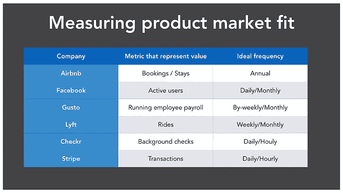
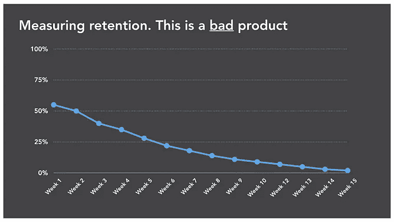
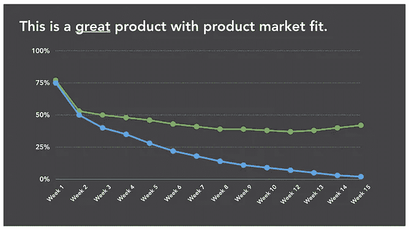
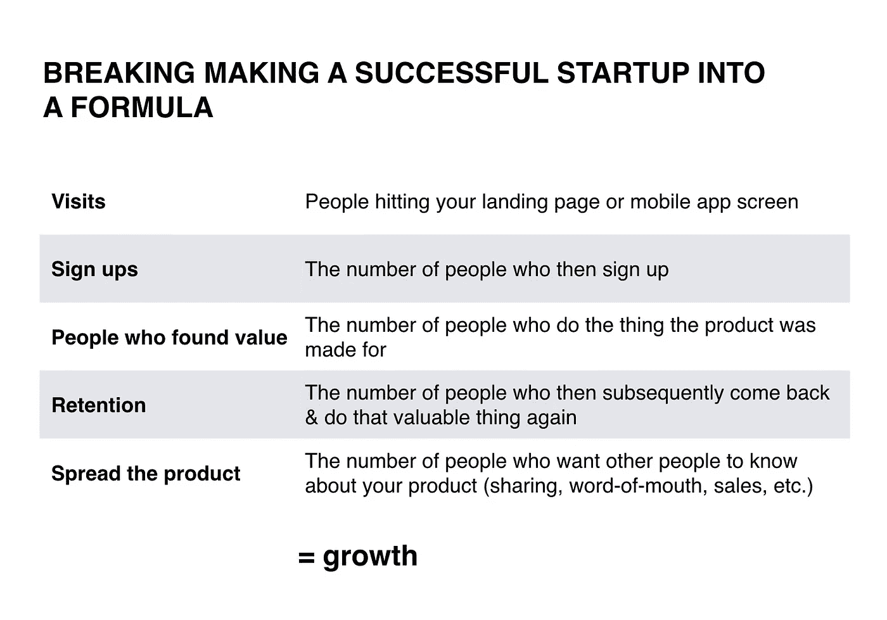

# 我从创业学校讲座中学到了什么

> 原文：<https://medium.com/hackernoon/notes-on-startup-growth-4af0bf9e9706>

找出代表向客户交付价值的指标，以及实现这一目标的理想频率。

脸书用户应该**每天访问脸书**，优步用户应该**每周**/每月预订一次，Airbnb 用户应该**每年**预订公寓。

然后用这个指标来衡量你的保留率(有多少用户达到了这个指标)。如果保留率逐渐下降到零，你的产品就很差，如果保持率稳定在 10%就很好，50%就很好。

## 转化率优化

你的产品是一个漏斗。从用户第一次看到你的产品到他给你钱之间有很多步骤。每走一步都会导致下一步的人数减少。

创业成长公式:

访问量*注册人数*发现价值的人*留存率*分享产品的人=增长。

使用这些指标来诊断是什么减缓了您的增长，优化这些步骤中的每一步都会增加销售数量。

您可以优化的关键指标:

*   登陆页面转换率——有多少访问者在看了你的登陆页面后注册了你的产品？
*   单页访问量与多页参与度的比例是多少？人们会查看定价页面吗？(这是一个很好的迹象，表明他们发现你的报价很有价值，并想知道它的价格)。
*   入职成功。你产品的“啊哈”时刻，就是用户第一次收到价值，并且“明白”你的产品为什么有用的时候。**衡量有多少用户执行了为他们带来价值的关键行动。**
*   购买转化——有百分之多少的用户在购买你的产品？
*   每周/每月留存率——有多少人在 7/30 天内又回来做了有价值的事情？
*   每日活跃用户。
*   每月收入流失。

## 为什么收入流失很重要

如果你在一个月内有 7%的收入流失(你失去了 7%的付费用户)，这看起来不是很多(你仍然保留着 93%的收入)，但一年加起来就是 58%。因此，如果你是一家年收入 100 万美元的初创公司，每年你都必须想办法弥补 58 万美元的收入损失，并在此基础上实现增长。

你成长得越多，市场营销就越难获得你失去的用户数量，也越昂贵。

不要一直往漏桶里倒水。

## 选择北极星度量标准

一次优化太多的东西会使事情变得过于复杂，并导致分心。相反，选择一个你的公司成功所依赖的最重要的指标，并致力于最大化它。

## 要探索的增长渠道

用户获取策略取决于你拥有的产品类型:

*   人们使用谷歌来寻找你提供的产品吗？
    尝试内容营销+ SEO。
*   现有用户已经通过口碑分享你的产品了吗？
    优化病毒式传播和推荐(例如为邀请新用户提供奖励)。
*   你能列出你所有潜在顾客的名单吗？做销售(比如打电话给你所在领域的公司)。
*   用户 LTV 高吗？
    使用付费收购(如脸书广告)。

## 实验

当你的公司在成长时，找出哪些功能有价值的最好方法就是和用户交谈。虽然它总是很重要，但是在一定的范围内，发现某个特性或调整是否成功的唯一方法是运行 A/B 测试。

战略性地规划功能—预测结果(每项工作的价值比率)，优先考虑最有影响力的功能。设计实验，运行 A/B 测试来测试你的假设，找出你所做的改变的实际结果。

