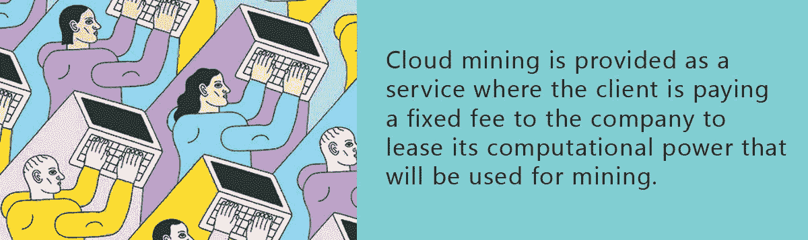

# 不是针对个人，只是采矿:商业模式回顾

> 原文：<https://medium.com/hackernoon/nothing-personal-its-just-mining-business-models-review-c470cf59b1a6>

采矿早已不再是极客和与区块链科技发展相关的一小撮人的娱乐。尽管市场持续下跌，加密货币世界正越来越多地踩在金融界的脚趾上。最近，最受欢迎的交易所之一，币安，宣布收入大大超过德意志银行的收入，矿业巨头比特大陆 T2 报告净利润 40 亿美元，将许多 it 行业的老玩家远远甩在身后。

不管我们喜不喜欢，采矿业已经成为一个严肃的行业，大量的资金在其中流动。五年前家庭农场的时代已经结束了(至少对 BTC 矿业来说是这样),这个时代很可能在几个月内让 T4 的主人变得富有。同时，有许多服务和公司允许每个人在加密货币挖掘上赚钱。

今天，我们将看看并尝试分析这些公司的商业模式，并检查它们的弱点和优势。

# 私人采矿有什么问题

任何想从事采矿的人都应该问自己的第一个问题是:“如果他们自己可以采矿并从中赚钱，为什么这些家伙要卖给我设备？”

这个问题越想越让人不安。真的，卖给我的设备是[已经过时的](https://bitcointalk.org/index.php?topic=2026004.0)怎么办？如果[采矿不再有利可图](https://bitinfocharts.com/comparison/bitcoin-mining_profitability.html)除了我大家都知道了怎么办？

又或许这个云矿公司只是一个长寿的[金融金字塔](https://www.financemagnates.com/cryptocurrency/news/cryptocurrency-pyramid-scheme-busted-south-korea-250-million-stolen/)骗局？

在不陷入偏执的情况下，我要指出，这些担忧可能是相当合理的(当我们看一看比特大陆模型时，我们将回到这些担忧)。

众所周知，在加州淘金热期间，最稳定、最轻松的收入不是来自那些开采黄金的人，而是来自那些租赁生产设备的人。与此同时，如果矿工运气好，他支付了设备成本，并保留了丰厚的利润。对所有人都是双赢。

# 比特大陆

比特大陆是矿业公司不可避免的合并过程的活生生的例子。据某些报道，[高达 41%(！)的比特币哈希表](https://bitcoinmagazine.com/articles/bitmain-nears-51-network-hash-rate-why-matters-and-why-it-doesnt/)由这个庞然大物控制，它的采矿中心遍布世界各地。如果此时你想到了 [51%攻击](https://www.investopedia.com/terms/1/51-attack.asp)，那么你并不孤单:[这样的恐惧存在](https://cryptobriefing.com/bitmain-51-attack-bitcoin-network/)。比特大陆是如此之大，以至于其处理能力的突然停止很可能会使比特币区块链永久瘫痪。

比特大陆也是一个超级成功企业的例子，所谓的[独角兽](https://en.wikipedia.org/wiki/Unicorn_(finance))，它在短短几年内设法将其利润增加到 40 亿美元。最近，该公司宣布了首次公开募股的计划，这将进一步加强其地位，并最终使其在大型金融领域的活动合法化。

比特大陆业务的“填充”远不如其收入吸引人。最近，该公司一直面临与其行为不透明相关的严重指控。

第一个，也可能是最重要的一个，是公司[涉嫌使用它以封闭模式向公众](https://bitcointalk.org/index.php?topic=2244677.0)出售的 ASIC 设备来满足自己的需求。他们已经使用这些设备几个月了，然后打着“全新设备”的幌子在市场上推广它们。因此，比特大陆涉嫌重复开发，然后将其设备“融合”到市场上，迫使用户以创新产品的名义购买过时和二手设备。据我们所知，这一严重指控从未得到直接证实。

然而，有许多事实间接表明，比特大陆确实利用隐藏的矿工为自己谋利。2018 年 4 月，Monero 加密货币[的开发者决定持有一个硬分叉，使其算法能够抵抗 ASIC 矿工](https://blockonomi.com/monero-fork/)。硬叉发生在自由销售中蚂蚁矿工 X3 发布前三个月；这是一种预防措施。令社区惊讶的是，[网络的 hashrate 在代码更改后下降了 80%](https://www.reddit.com/r/Monero/comments/8aoxhp/bye_bye_asics/) 。这被视为一个信号，表明比特大陆一直完全控制着区块链，以牺牲其隐藏设备为代价，提供了最大份额的网络功率。

比特大陆花园里的另一块石头是他们提供给顾客的设备的有争议的价格。根据 IT 专家 Robert DeVoe 的说法，“那些能够在预购期以标准零售价购买设备的人将会回头以两倍、三倍甚至四倍的价格重新购买设备。”

因此，比特大陆的主要问题是缺乏终端用户的信任。尽管对比特大陆设备的需求巨大，但许多人已经对这种级别的矿业公司会遵守规则失去了信心。尽管利润很高，但该公司的声誉远非完美。

# 云挖掘

如果说 2018 年买一个专用矿机或者显卡堪比[淘金热](https://en.wikipedia.org/wiki/Gold_rush)期间买采金设备，那么投资云矿就是一个不那么透明的行为了。想象一下，如果有人告诉你:“我有开采黄金所需的所有设备。我甚至有一队勘探者。如果你先付我钱，我保证以后会定期给你一点金子。不，对不起，我不能给你看船员和设备。”

我知道这很荒谬。但这就是云采矿的方式。

[云采矿](https://en.wikipedia.org/wiki/Cloud_mining)是作为一种服务提供的，客户向公司支付固定费用，以租赁其将用于采矿的计算能力。管理费用[通常很高](https://www.genesis-mining.com/pricing)(而且不太透明)，这降低了投资者的回报。事实上，这些公司的老板卖给他们的用户的是一只“被戳中的猪”。毕竟，大多数投资者并不十分关心这一过程的技术部分。对他们来说，重要的是投资资金，而云开采正是这样做的绝佳机会:账户逐渐注入加密货币，业务的所有数学计算都留在幕后。

云挖掘简单方便。然而，与此同时，也有[评论称其对终端用户无利可图。Hashflare 云采矿服务的近期历史(由于支出超过新资金流入，该服务](https://steemit.com/mining/@preparedwombat/cloud-mining-is-not-profitable)[停止运营](https://ethereumworldnews.com/hashflare-sha-256-contract/))就说明了这一事实。事实证明，“云采矿只给云采矿公司利润”的想法是不正确的:有时公司本身出现赤字，并终止运营(顺便说一下，Hashflare 是[细分市场](https://www.coherentnews.com/cryptocurrency-mining-market-has-huge-potential-to-grow-rapidly/)的最大代表之一)。据[所知](https://ethereumworldnews.com/hashflare-sha-256-contract/)的情况，Hashflare 崩溃的主要原因是他们的矿工与比特大陆的设备相比竞争力低。

当然，市场的长期下跌(在此期间，比特币定期回到年度低点)也发挥了作用，让每家矿业公司都陷入了困境。

# 众筹采矿

最近，一些项目开始出现，为采矿提供了一种新的商业模式，替代了以前考虑的方案。它的基础是通过发行项目自己的代币进行众筹。

众筹挖掘使用户能够在不管理硬件的情况下挖掘加密货币。采矿钻机存放在一家采矿公司拥有的设施中并进行维护。这使得它类似于云挖掘，但这里的区别是，使用公司的计算能力没有固定的费用。取而代之的是一个类似于传统金融领域首次公开募股的程序:**客户需要注册并购买采矿合同或股票，以获得公司利润的固定部分**。

这类公司的一个显著例子是 [Securix](https://securix.io/) 。Securix 投资者必须处理的主要对象是 SRXIO 令牌。它使所有者能够访问 Securix 采矿服务，反过来，授予他或她每月从总开采加密货币(总采矿收入)中获得一定百分比的权利。不少于 45%的总收入将平均分配给 SRXIO 令牌持有者。只要投资者拥有代币，该公司就会通过以太坊智能合约每月将以太网的一部分收入转移到他/她的钱包中，以确保所有交易的透明度。Securix 有一个完全透明的政策，这与其他云开采公司的建议有很大不同。

从长远来看，Securix 的令牌池数量将通过定期购买和刻录令牌而减少，每月总收入将在更小的令牌池中分配。与其他模式相比，这种方法是众筹采矿的一个显著特征。它刺激了对项目令牌的需求，从而吸引了更多的投资者。这将增加每枚代币的价值和产量，并有可能使持有 SRXIO 代币比直接持有 BTC 更有利可图。

所有采矿相关项目的一个重要细节是团队的位置。在这方面，加密行业已经有了一个“糟糕”项目的例子——[Mineredge](https://www.mineredge.io/whitepaper.pdf)。他们假装在加拿大，然而，加拿大不再接受采矿作业。事实上，他们的团队分散在世界各地，但大部分都生活在印度；一面鲜艳的红旗。这就是为什么 Securix 管理团队选择居住在与他们的采矿业务相同的国家:荷兰。

地点也不是随意选择的。它允许 Securix 直接从太阳能和风力发电机购买绿色能源，而不需要昂贵的中介。他们的环境影响是该公司的首要任务，这一举措使 Securix 在其采矿业务中增加了责任、可持续性和盈利能力。

总而言之，密码市场的快速发展产生了各种各样的商业模式。对于简单用户来说，像比特大陆这样的集中化巨头和云开采项目在透明度和盈利能力方面似乎都有严重的缺陷。这就是为什么从这个角度来看，有形众筹模式似乎是最有效的模式。

## 关于作者:

基里尔·希洛夫——geek forge . io 和 Howtotoken.com 的创始人。采访全球 10，000 名顶尖专家，他们揭示了通往技术奇点的道路上最大的问题。加入我的**# 10k QA challenge:**[geek forge 公式](https://formula.geekforge.io/)。