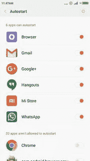
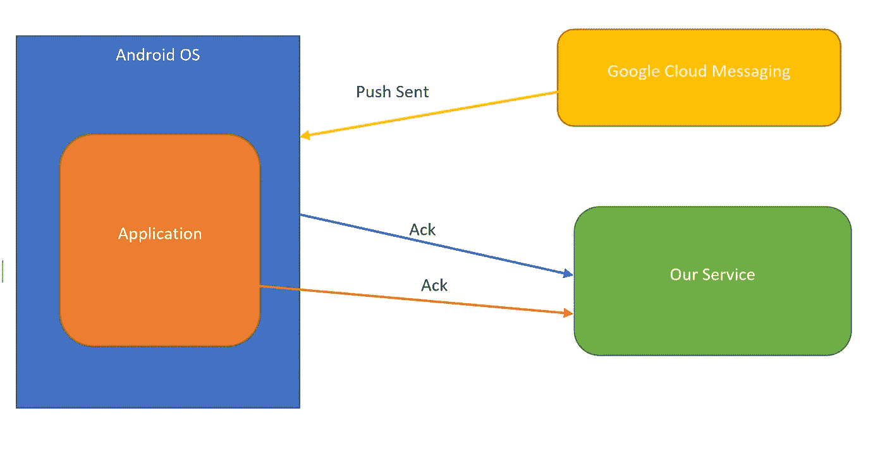

# 如何解决 Android 中错过推送通知的问题

> 原文：<https://medium.com/hackernoon/notifications-in-android-are-horribly-broken-b8dbec63f48a>

Android 是目前最受欢迎的移动操作系统，拥有超过 76%的市场份额。这在某种程度上是可能的，因为它的开放性和多家厂商在其设备上安装 Android。但它在碎片化方面也存在巨大的问题。例如，Android 奥利奥于 2017 年 8 月发布，iOS 11 于 2017 年 9 月发布，奥利奥的市场占有率为 14.2%，iOS 11 的市场占有率为 85%，尽管奥利奥已经领先一步。为了达到 85%的采用率，你需要瞄准 2013 年 10 月发布的 [Android](https://hackernoon.com/tagged/android) Kitkat。虽然这只是冰山一角。

**失踪通知**

我是 Flock Android 的负责人，这是一款团队通讯应用，与 Slack 等公司竞争。我们开始从用户那里收到一些奇怪的抱怨，关于丢失通知。既然它是一款商务消息应用，通知就变得至关重要。我们尝试了各种方法来重现这个问题，包括使用测试脚本用通知轰炸设备，尝试不同的网络，但我们就是无法重现这个问题的可靠性。更糟糕的是，我们团队的设备出了几起事故，但日志显示什么也没有。谷歌 GCM 表示，通知已经发出，但在应用程序的日志中没有通知的痕迹，就好像操作系统正在吞噬通知。不知何故，像 whatsapp、facebook 这样的流行应用对这些问题免疫。棺材上的最后一颗钉子是首席执行官自己有时会错过通知。谷歌像往常一样对他们不存在的开发客户支持毫无帮助。我们能够在互联网上找到一堆支持文章，在这些文章中，其他应用程序基本上都列出了关闭电池优化的步骤，这似乎很有效(有趣的是，whatsapp 和 facebook 通常会默认添加到这些列表中)。但是没有办法自动做到这一点，虽然我们也可以在响应支持票时这样做，但这对用户来说是痛苦的。

几天后，我们能够在 oneplus 设备上遇到一些错过的通知，我们将该设备连接到一台记录系统日志的机器上。瞧，我们得到了一些正在发生的事情。

01–12 09:05:23.649 2719 2839 I activity manager:[BgDetect]chkExcessCpu level:0 do kills:true auto _ mode:false uptime:183054
01–12 09:05:23.661 2719 2839 I activity manager:[BgDetect]检测进程上的过多 CPU to . talk(PID:13406)level 0 usage 29
01–12

显然，一些名为 BgDetect 的进程发现我们的应用程序占用了太多的 CPU，并决定杀死它。Android 是开源的，我们认为我们应该能够获得 bgdetect 的源代码。但我们不仅在 Android 源中找不到 BgDetect，它在 oneplus 源中也不存在。然后，我们与我们的营销团队取得了联系，并联系了 oneplus 的一些联系人，他们将我们引向了他们的开发团队。他们要了我们的 apk，瞧，一周之后，我们就和 Whatsapp 和脸书之类的公司一起上了白名单。

但这个问题在小米、Oppo 和一批中国制造商身上持续存在，对于这些制造商，我们仍然不得不采取措施，在电池优化方面加入白名单。显然，这些设备在标准的 android 上内置了自动启动的概念。

**自动启动**

在 Android 中，推送通知唤醒应用/服务，该应用/服务又显示推送通知。在应用被强制终止的情况下，系统将不会唤醒该应用。我们发现，在小米等一些设备上，我们的应用程序根本不会被唤醒，默认情况下会被强制杀死。避免这种情况的唯一方法是成为“自动启动”列表的一部分，这意味着应用程序在关闭后可以唤醒(“自动启动”)。

尽管为了方便起见，制造商选择默认自动添加脸书、Whatsapp 等热门应用。由于我们是一家即将成立的初创公司，我们不可能在默认情况下成功。由于我们的大部分用户来自印度，随着用户越来越多，人们开始发布负面评论，投诉变得越来越频繁。我们必须找到解决办法。我们也意识到这很常见，有很多网站都有 FAQ 页面，专门让通知在 Android 上工作。例如[徒步](https://support.hike.in/hc/en-us/articles/230604667-Optimizing-message-receive-experience)、[福布斯](https://www.forbes.com/sites/bensin/2017/07/28/how-to-fix-push-notifications-on-oppo-phones/#547d9b231735)、[安卓中央](https://www.androidcentral.com/how-fix-push-notifications-miui-8)等。

**使用双确认检测错过的推送**

为了解决这个问题，我们首先必须找出哪些用户错过了通知。虽然标准的 HTTP GCM Push API 不提供送达回执，但是 XMPP API 提供了。GCM 交付收据实际上告诉你设备是否收到了推送通知。我们将此与应用程序内部的重复通知交付收据结合起来。因此，我们从 GCM 而不是从设备获得 ack 的任何设备都可能会错过推送。一旦设备被识别出来，我们就开始向它们发送 bot 消息，告诉它们如何将 flock 添加到设备的自动启动列表中。

Architecture to determine missed pushes

**结论**

Android 是一个令人难以置信的碎片化生态系统，而且看起来只会越来越碎片化。虽然[谷歌](https://hackernoon.com/tagged/google)正在通过 Project Treble 和其他倡议做出一些坚定的努力来解决这个问题，但它无法阻止制造商添加像 autostart 这样的附加功能。Autostart 通过在内存中保存更少的应用程序来帮助速度较慢的设备感觉更快，低端设备制造商将继续使用它。Android 似乎在追随桌面 Linux 的脚步，每个制造商本质上都在创建自己的定制发行版。Android 的未来似乎只会更加支离破碎。