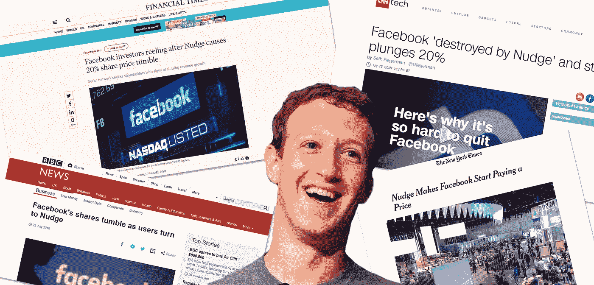
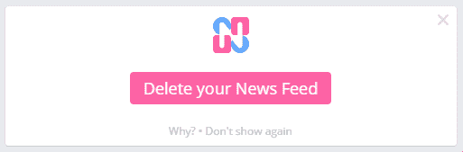
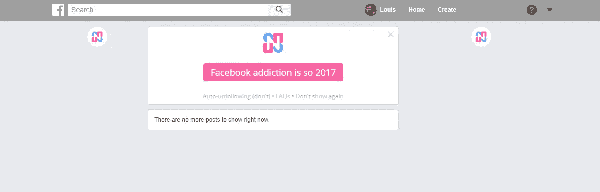

# 轻推导致脸书股票下跌超过 20%

> 原文：<https://medium.com/hackernoon/nudge-causes-facebook-shares-to-drop-by-more-than-20-2b28572c342d>

社交网络巨头脸书的股票在一夜之间下跌了惊人的 24%，此前有消息称，大量用户正在使用名为[微移](http://bit.ly/2gFsVrf)的 Chrome 扩展删除他们的新闻源。

Chrome 扩展可以让用户摆脱所有平台上令人上瘾的新闻，同时保留脸书有用的部分，这极大地减少了脸书可以从用户身上获得的广告收入，因为他们不再在脸书主页上看到有针对性的广告，或者实际上根本看不到任何东西。

据认为，成千上万的脸书用户涌向删除你的新闻订阅功能，是为了[重新控制他们如何使用社交网络。分析师们一直在争先恐后地重做他们的财务模型，以适应这样一个世界:用户不会无休止地向下滚动他们实际上不喜欢消费的无意义内容。](https://extranewsfeed.com/11-reasons-to-delete-your-news-feed-400427b9315e)

Nudge 还将脸书标志性的蓝条改为灰色，使网站不那么吸引人，并隐藏了旨在让用户上瘾的侧边栏，以及一系列旨在总体上减少网瘾的功能。

马克·扎克伯格不顾一切地提出以 10 亿美元收购 Nudge，但 Nudge 的首席执行官兼创始人路易斯·巴克利一再置之不理。

“标记谁？”巴克利在今天早上被记者联系时说道。

“你可以在这里下载闪屏振动，”他补充道。