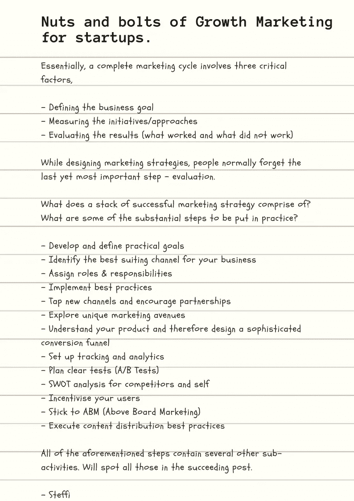

# 13 项创业成长营销计划

> 原文：<https://medium.com/hackernoon/nuts-and-bolts-of-growth-marketing-for-startups-ab55951fa76b>

Designed on Canva

## 基本上，一个完整的营销周期包括三个关键因素:

-定义业务目标

-衡量举措/方法

-评估结果(哪些有效，哪些无效)

## 在设计营销策略时，人们通常会忘记最后也是最重要的一步——评估。

## 一套成功的营销策略包括什么？将付诸实施的一些实质性步骤是什么？

-制定和定义切实可行的目标

-确定最适合您业务的渠道

-分配角色和职责

-实施最佳实践

-开拓新渠道，鼓励伙伴关系

-探索独特的营销渠道

-了解你的产品，从而设计一个复杂的转换漏斗

-设置跟踪和分析

-计划清除测试(A/B 测试)

-对竞争对手和自己的 SWOT 分析

-激励您的用户

-坚持 ABM(光明正大的营销)

-执行内容分发最佳实践

## 上述所有步骤都包含其他几个子活动。会发现所有那些在后续职位。