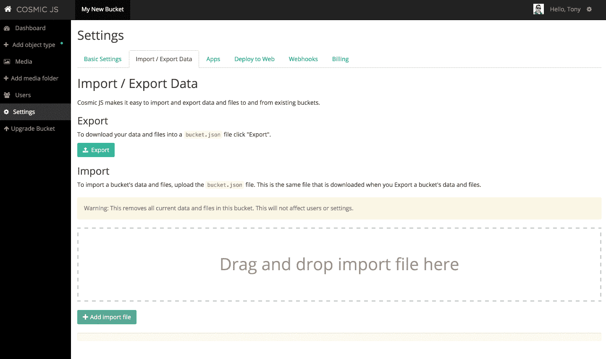
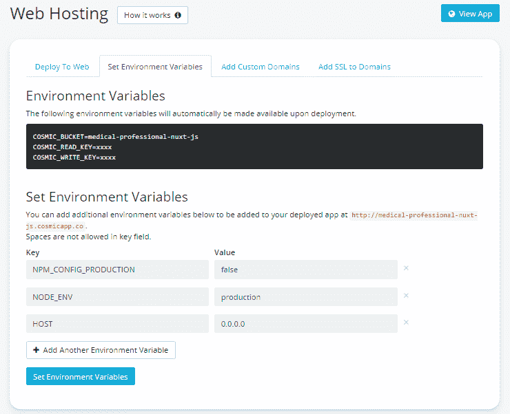

# 网站样板文件

> 原文：<https://medium.com/hackernoon/nuxt-js-website-boilerplate-30de7a7f5782>


看看这个建立在 [Nuxt.js](https://nuxtjs.org/) 和 [Cosmic JS](https://cosmicjs.com/) 上的[网站样本](https://github.com/cosmicjs/nuxtjs-website-boilerplate)。它满足了一些常见的网站需求，包括动态页面、博客文章、作者管理、SEO 能力、联系形式和网站搜索。

# TL；速度三角形定位法(dead reckoning)

[下载 GitHub repo](https://github.com/cosmicjs/nuxtjs-website-boilerplate)
[查看演示。](https://cosmicjs.com/apps/nuxtjs-website-boilerplate)

# 特征

1.完全响应移动 w/ [引导程序](http://getbootstrap.com/)前端
2。SEO 就绪
3。一个联系表格，发送一封电子邮件到你选择的邮箱和 [Cosmic JS](https://cosmicjs.com/) 以便参考
4。全站搜索功能
5。所有内容都可以在 [Cosmic JS](https://cosmicjs.com/) 中轻松管理，包括页面、博客和联系信息。注册[宇宙 JS](https://cosmicjs.com/) 来安装演示内容和部署这个网站。

# 开始

```
git clone [https://github.com/cosmicjs/nuxtjs-website-boilerplate](https://github.com/cosmicjs/nuxtjs-website-boilerplate)
cd nuxtjs-website-boilerplate
npm install
```

将 **bucket.json** 文件导入到你的 Cosmic JS bucket 中。为此，请转到您的桶>设置>导入/导出数据。



# 投入生产

```
COSMIC_BUCKET=your-bucket-slug npm start
```

转到 [http://localhost:3000](http://localhost:3000/)

# 在开发中运行

创建一个 **config/development.js** 文件，并使用您的值将其与 **config/production.js** 进行匹配。

```
npm run development
```

转到 [http://localhost:5000](http://localhost:5000/) 。

# 环境变量

正如在 [Nuxt.js 网站](https://nuxtjs.org/faq/host-port/)上所说的，您需要将环境变量 HOST 设置为 0.0.0.0。这已经在 package.json 脚本中为您完成了，但是您也可以在 Bucket>Settings>Deploy Web App 中的“Set Environment Variables”部分进行设置。



# 配置

因为 Node.js 没有邮件服务器，所以联系表单使用 [mailgun](https://www.mailgun.com/) 发送邮件。因此，在配置文件中添加以下常量。