# Nvidia 填补空白:部分卷积研究论文

> 原文：<https://medium.com/hackernoon/nvidia-filling-the-blanks-a-partial-convolutions-research-paper-a2bd92459245>

所以，现在是 2018 年，英伟达的研究人员又开始研究了。这一次，一个革命性的图像在绘画和本质上，洞填充和质量提高算法。

# 与其他技术的比较

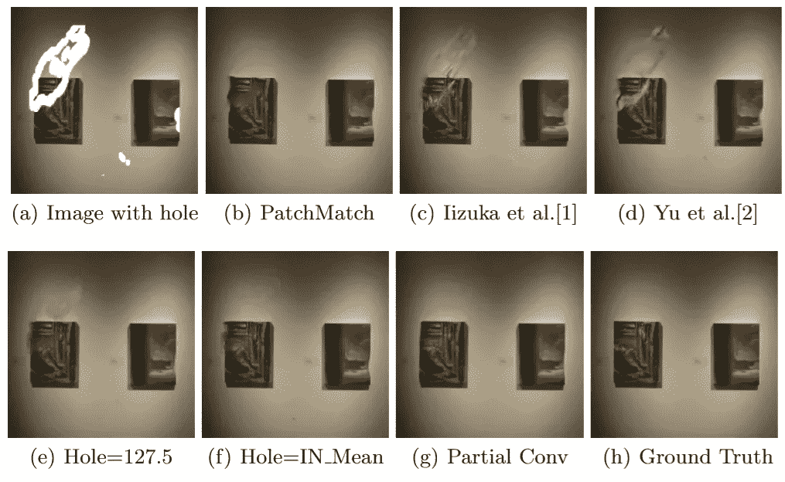

comparison of images

这篇研究论文(arXiv:1804.07723v1 [cs。CV])于 2018 年 4 月 20 日问世。它将重点放在最近的 in-painting 方法上，这些方法不使用深度学习，而是使用剩余图像的图像统计来填补漏洞。

[补片匹配](http://pixl.cs.princeton.edu/pubs/Barnes_2009_PAR/index.php)，一种最先进的方法，反复搜索最佳拟合补片以填充孔洞。虽然这种方法通常产生平滑的结果，但是它受到可用图像统计的限制，并且没有视觉语义的概念。

> PatchMatch 能够使用来自周围阴影和墙壁的图像补片来平滑地填充绘画中缺失的组件，但是语义感知方法会使用绘画中的补片来代替。

深度神经网络以端到端的方式学习语义先验和有意义的隐藏表示，这已经被用于最近的图像内画 efforts.这些[网络](https://hackernoon.com/tagged/networks)在图像上采用卷积滤波器，用固定值替换移除的内容。

其他技术像 [**饭冢等人**](http://hi.cs.waseda.ac.jp/~iizuka/projects/completion/en/) **。**采用快速行进和泊松图像融合，而 [**余等人**](https://arxiv.org/abs/1801.07892) 。采用后续调整网络来调整其原始网络预测。许多最近的方法的另一个限制是聚焦在矩形孔上，通常假设在图像的中心。我们发现这些限制可能会导致过度拟合矩形孔，并最终限制这些模型在应用中的效用。

> 为了专注于更实际的不规则孔用例，我们收集了具有不同大小的不规则遮罩的大型图像基准。在我们的分析中，我们不仅关注孔的大小，还关注孔是否与图像边界接触的 effects。

# 这种模式有什么不同？

研究人员提出了对标准 U-Net 类结构的以下修改。

*   使用**部分卷积和自动掩模更新**步骤实现图像内涂的最新技术。
*   虽然以前的工作未能在具有典型卷积的 U 网络中使用跳跃链接实现良好的内绘结果，但他们证明了用部分卷积和掩模更新替换卷积层可以实现最先进的内绘结果。
*   他们提出了一个大的不规则掩膜数据集。

研究给出了一个相当清晰的面具更新的原因。请允许我在此如实提及:

> 为了正确处理不规则的掩码，我们建议使用部分卷积层，包括掩码和重新归一化卷积操作，然后是掩码更新步骤。在图像分割任务中，屏蔽和重新归一化卷积的概念也被称为分割感知卷积，但是它们没有对输入屏蔽进行修改。我们对部分卷积的使用是这样的:给定一个二进制掩码，我们的卷积结果只取决于每一层的非空穴区域。**我们的主要扩展是自动屏蔽更新步骤，在部分卷积能够对未屏蔽值**进行操作的情况下，该步骤移除任何屏蔽。给定连续更新的 sufficient 图层，即使最大的掩蔽洞最终也会缩小，仅在要素地图中留下有效响应。部分卷积层最终使我们的模型对占位符洞值不可知。

# 建模方法和体系结构

所提出的模型使用堆叠部分卷积运算和掩模更新步骤来执行图像嵌入。让我们从定义卷积和掩码更新机制开始。

为简洁起见，我们将我们的部分卷积运算和掩码更新功能合称为**部分卷积层**。

设 **W** 为卷积滤波器的卷积滤波器权重， **b** 为相应的偏置。 **X** 是当前卷积(滑动)窗口的特征值(像素值),而 **M** 是相应的二进制掩码。每个位置的部分卷积类似于中的定义，表示为:

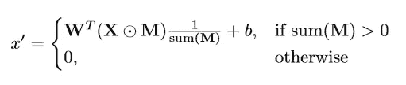

Partial Convolution mechanism

在每个部分卷积操作之后，我们然后**更新我们的掩码**。我们的去屏蔽规则很简单:如果卷积能够根据至少一个有效的输入值来调节其输出，那么我们就去除该位置的屏蔽。这表示为:

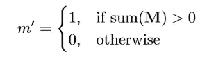

Mask Update Scheme

并且可以作为正向传递的一部分在任何深度学习框架中容易地实现。通过部分卷积层的 sufficient 连续应用，如果输入包含任何有效像素，则任何掩模最终都将是全 1。

## 电力网设计

网络设计在很大程度上基于 UNet like 架构，仅使用一个较小的调整，即用部分卷积层替换所有卷积层。

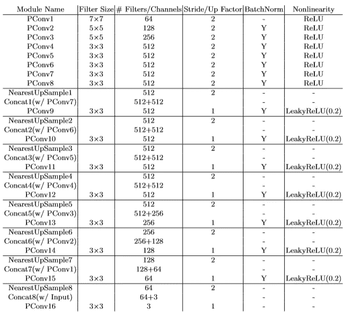

The network architecture

在阐述网络架构时，必须提及的是 **PConv 1 至 PConv 8** 是编码网络，以下具有上采样跳跃链接的网络是相同的解码架构。

**BatchNorm** 列表示 **PConv** 之后是否有一个批次归一化层。非线性列显示是否使用了非线性层以及使用了什么非线性层(如果使用了 BatchNorm，则在 BatchNorm 之后)。

## 损失函数

研究论文摘录如下:

> 我们的损失函数以每像素重建精度和组成为目标，即预测的孔洞值过渡到其周围环境的平滑程度。
> 
> 给定具有孔洞 I_in、初始二进制掩码 M (0 表示孔洞)、网络预测 I_out 和地面真实图像 I_gt 的输入图像，我们首先定义每像素损失**L _ hole = k(1M)⊙(I _ out I _ gt)k1 和 L _ valid = kM⊙(I _ out I _ gt)k1**。这些分别是孔和非孔像素在网络输出上的 L1 损耗。

**永久损失**已使用以下公式计算:

其中**ψn**是第 n 个选定层的激活图。

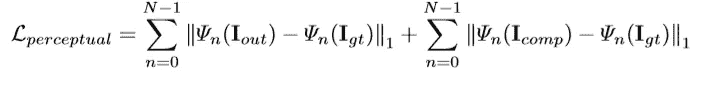

Perpetual Loss

而风格损失已被考虑并被用作:

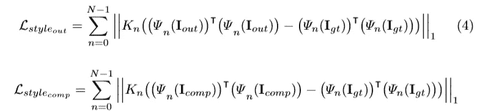

Style Losses

我们的最终损失项是总变化 **(TV)** 损失 ***L_tv*** :这是对 P 的平滑惩罚，其中 P 是孔区域的 1 像素膨胀的区域。

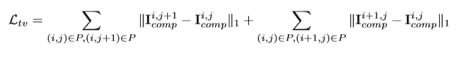

Smoothing Penalty

因此，**总损耗**(系数超参数调整后)为:

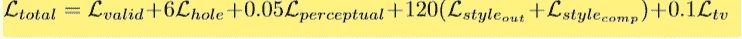

Total Loss

# 填孔的测试和结果

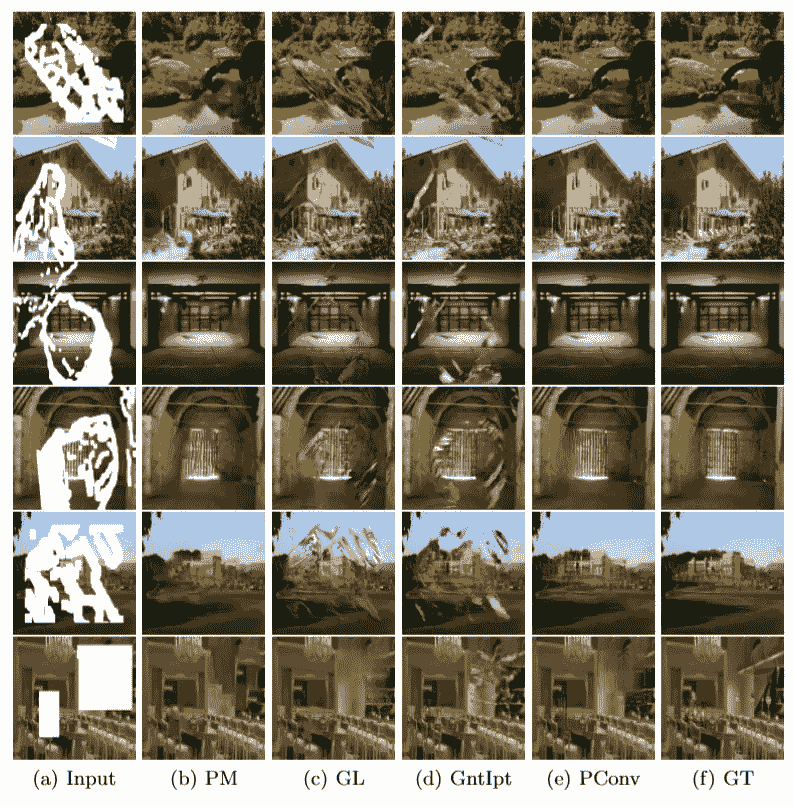

Comparisons among PConv

人们可以很容易地看到研究人员的结果(PConv)，并了解它与使用 256*256 像素尺寸的其他模型相比表现如何。

> 需要注意的是 **ImageNet 和 Places2 模特训练 10 天**，而 **CelebA-HQ 训练 3 天**。所有微调都在一天内完成。

所以，你可以看到即使使用 **NVIDIA V100 GPU (16GB)** 批量为 6 个之后，训练这样的模型所需要的时间量！

# 模型基准

我想承认时间的敏感性，同时进行精度结果作为个人意见。考虑到这一点，这款 **PConv** 车型在 **L1** 得分和 **IScores** 两方面都是令人信服的完美替代品。

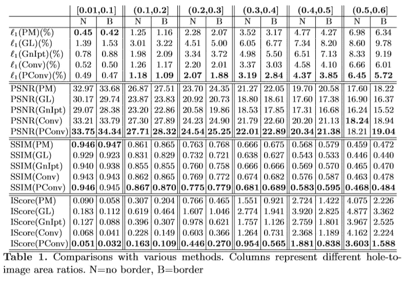

研究人员声称:

> 在大多数情况下，我们的方法在 different 时间周期和孔-像面积比方面优于其他方法。

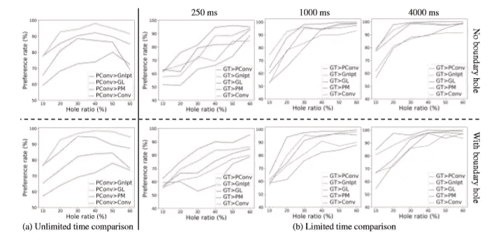

Graphical Benchmarks

看一下图形基准，我不会真的争辩。

# 其他用途

## 图像超分辨率任务

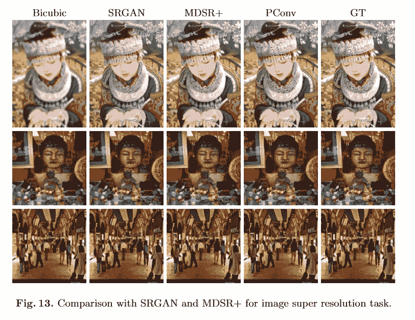

Resolution Enhance Task Results

是的，这种算法也可以用来提高图像分辨率。让下面的图像讲述它自己的故事。我将把这一个作为秘密留下😉

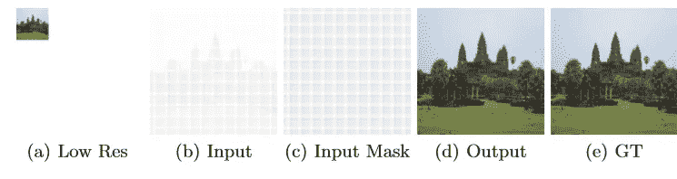

Mask Updates with one-one mappings

# 限制

我想引用这篇研究论文来说明，这个模型本身不会因为孔洞大小的增加而导致灾难性的性能下降，但它确实会对一些结构稀疏的图像失败，如门上的**条**，并且像大多数方法一样，在最大的孔洞上挣扎。

**注意**:我在这篇文章中引用了之后的[资源。](https://arxiv.org/abs/1804.07723)

下次见，快乐学习！