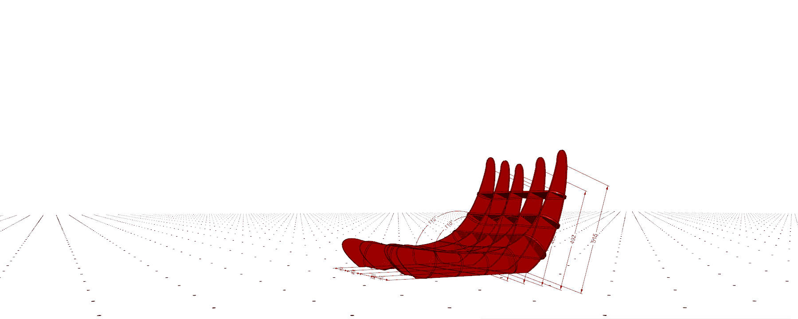
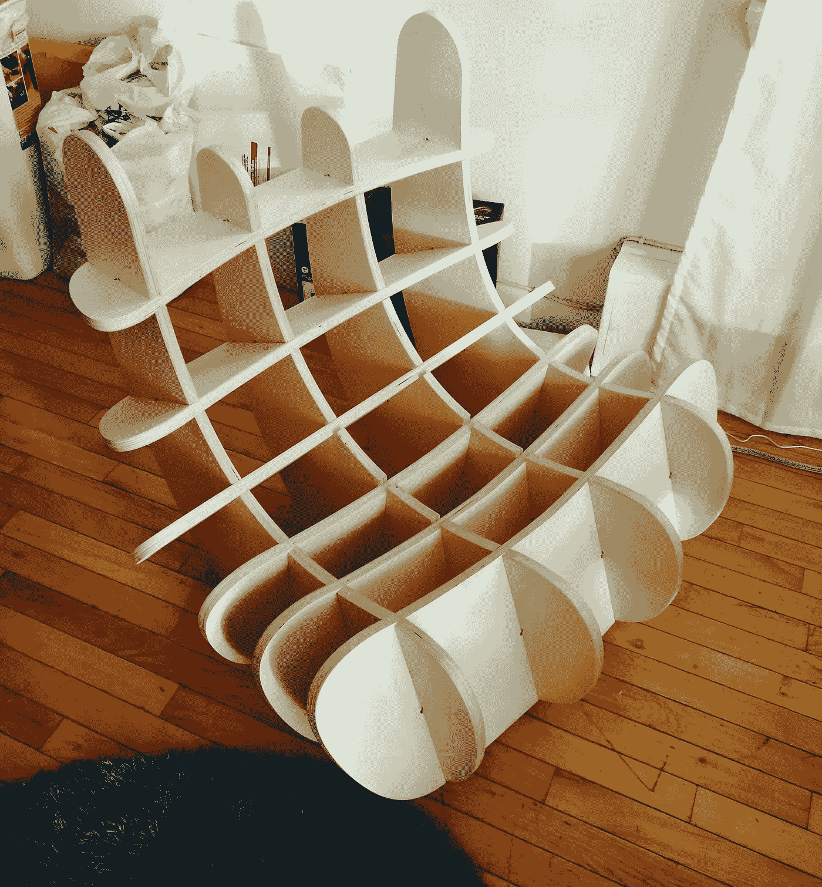
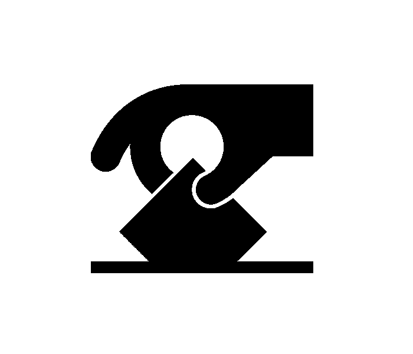
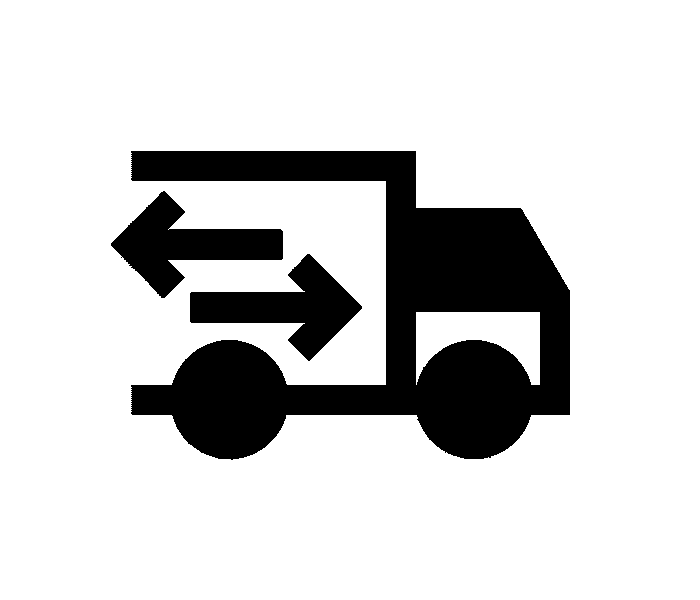
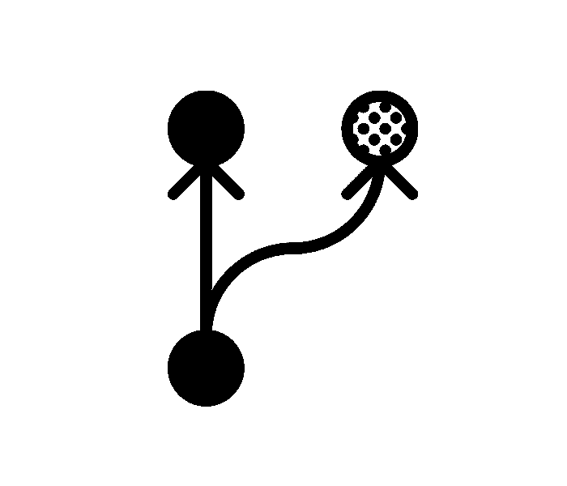
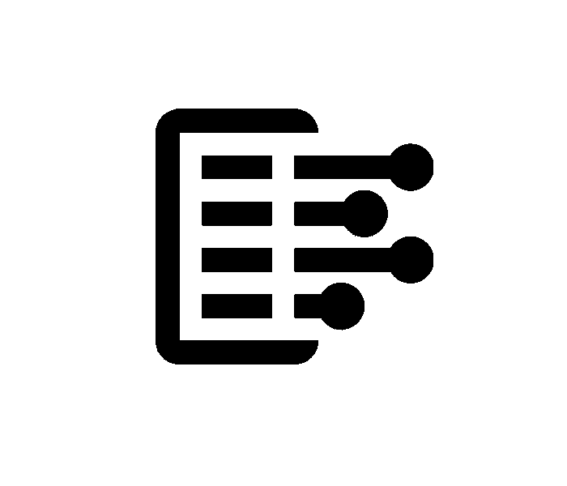

# O-LAP:用 JavaScript 制作家具的社区

> 原文：<https://medium.com/hackernoon/o-lap-community-for-making-furniture-with-javascript-413fcb808608>

[o-lap.org](https://o-lap.org/)

O-LAP 是一个开源的社区运行平台，供设计师试验参数化家具设计。

这是探索设计思维和工作新方式一部分。
设计师创建参数化家具设计，作为框架的插件。
注册的设计在[画廊](https://o-lap.org/designs.html)展出。
用户可以[从图库中查看](https://o-lap.org/app.html?a=amitlzkpa&r=o-lap_plato)设计，并根据设计师启用的定制功能对其进行定制。
该框架允许用户使用计算机数字控制(CNC)切割机提取可用于制作设计的 CAD 图纸。
社区主持设计集合。
O-LAP 是概念、框架和社区的名称。

[演示](https://o-lap.org/app.html?a=amitlzkpa&r=o-lap_plato)

# 新的设计方式

这个概念在设计和建筑界很流行。如果你用谷歌搜索像“[参数家具](https://www.google.com/search?q=parametric+furniture&rlz=1C1CHBF_enUS732US732&oq=parametric+furniture&aqs=chrome..69i64.11749j0j1&sourceid=chrome&ie=UTF-8)”或“[数控家具](https://www.google.com/search?rlz=1C1CHBF_enUS732US732&ei=r64VW_LwK6Kc5wKgsJWYCw&q=cnc+furniture&oq=cnc+furniture&gs_l=psy-ab.3..0i67k1l3j0i7i30k1j0l2j0i7i30k1l2j0j0i7i30k1.2967.3389.0.3728.4.4.0.0.0.0.109.299.1j2.3.0..3..0...1.1.64.psy-ab..1.3.299....0.pry3tsjQhRU)”这样的术语，你应该能找到更多的例子。这个项目使用 JavaScript 允许设计师在浏览器中创建这样的设计，任何人都可以下载和制作。

这是一种思考家具设计和尝试新想法的新方法。我们也很想知道能做些什么。

由于大规模生产所需的资源，家具设计目前有很高的准入门槛。设计师需要建立工作室/制作基础设施，或者与大公司合作，试图将他/她的设计推向市场。通过我们的生产流程，我们可以让更多的新贵展示他们的设计，让社区来决定。

A community curated design collection.

这些设计通过 web 应用程序导出为计算机辅助设计(CAD)文件，可以在任何需要的地方使用高精度机器进行制造。发送一把椅子意味着只需将设计文件通过电子邮件发送到任何地方。

Sending chairs across geographies is like emailing a file.

我们提倡一个开放的许可系统，允许任何人复制和叉所有的设计。一个设计可以被不同的人以不同的方式复制和变形。这就像是设计的自然选择过程。

A framework for evolving designs.

随着设计的发展，设计的所有方面都是公开的和公开记录的。设计在概念上保持“诚实”,因为叙述在每一步都被记录下来。不同合作者的确切贡献被记录在这个过程中。

Public development records log the design narrative as decisions are made.

设计、制造和供应链是一个完全由个体拥有的闭环系统。通过分解这些方面，我们认为我们可以让更多独立的参与者参与进来，在保持整个流程可持续发展的同时做出贡献并从中获益。

Wider community participation in the design and production process.

# 当前阶段

这处于概念验证阶段。我对这种可能性感到兴奋，并探索还有谁觉得这很酷。

如果你认为这很酷，请和我们一起注册，帮助我们传播这个消息。

[o-lap.org](https://o-lap.org/)

[Github](https://github.com/O-LAP/home)

*Amit Nambiar*

所有图标都归功于 Noun Project 的杰出设计师。
I putu kharasmayadi
vectors market
danil pol shin
eliricon
Ben Davis
Anan th
wawan hermawan
xinh studio
✦·施密特·谢尔盖·✦
boh Dan bur mich
Nicolas Wei dinger