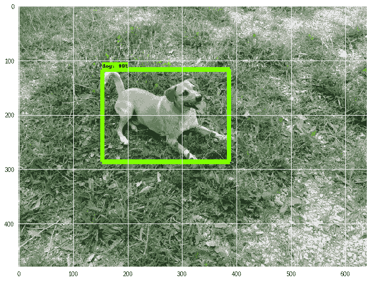
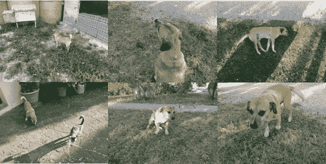
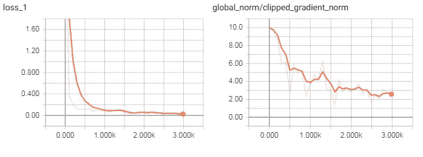
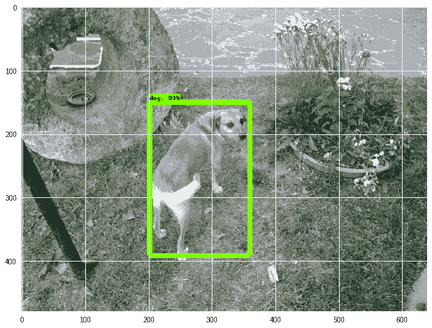

# 使用自定义数据集的 Google Colab 中的对象检测

> 原文：<https://medium.com/hackernoon/object-detection-in-google-colab-with-custom-dataset-5a7bb2b0e97e>

本文提出了一个简单免费解决方案，基于自定义数据集，在 Google Colab 中训练一个用于对象检测的 Tensorflow 模型。为了演示它是如何工作的，我训练了一个模型来检测照片中我的狗。



Object Detection with my dog

本文中使用的所有代码和数据集都可以在 [my Github repo](https://github.com/RomRoc/objdet_train_tensorflow_colab) 中获得。

*该提案的特点是:*

*   *唯一的要求是用 LabelImg* 创建的数据集
*   *一个单独的 Google Colab 笔记本包含所有的步骤:它从数据集开始，执行模型的训练并显示推理*
*   *它运行在 Google Colab 的 GPU 启用和 Google Drive 存储中，因此* ***它完全基于免费的云资源***

此外，Tensorflow 的对象检测 api 最近进行了重要的更改，这使得其他可用的教程变得过时。

# 制作数据集

Google Colab 笔记本中唯一没有包括的步骤是创建数据集的过程。

使用适当数量的照片(我的例子中有 50 张狗的照片)，我创建了注释。我用的工具是 [LabelImg](https://github.com/tzutalin/labelImg) 。为了简单起见，我标识了一个对象类，我的狗。可以扩展它以获得在多个对象类上执行对象检测的模型。

我将图像文件重命名为格式`objectclass_id.jpg`(即 dog_001.jpg，dog_002.jpg)。然后在 LabelImg 中，我定义了对象所在的边界框，我用 Pascal Voc 格式保存了注释。

最后，我在我的 Google Drive 帐户中上传了注释文件，使用了一个具有以下结构的 zip 文件:

```
.zip file
|-images directory
  |-image files (filename format: objectclass_id.jpg)
|-annotations directory
  |-xmls directory
    |-annotations files (filename format: objectclass_id.xml)
```

请查看我在 Github 中的数据集文件以查看示例。



Dataset example

# 模特培训

所有后续步骤都包含在 Google Colab 笔记本中。我按顺序执行单元来训练模型并运行推理:

**安装所需的包:**在 Tensorflow 中安装用于对象检测的包、存储库和环境变量，然后运行测试。

**下载并提取数据集:**将创建的数据集下载到文件系统中。zip 文件必须具有上面解释的结构，这一点很重要。

**空 png 文件:**这是避免 create_pet_tf_record.py 出错的单元格，在训练过程中没有任何影响。

**创建 TFRecord:** 从数据集创建 TFRecord。在这个简化版本中，算法将只为一个类训练模型。

**下载预训练模型:**从 ModelZoo 下载预训练模型，作为迁移学习的初始检查点。在示例中，我们下载了模型 faster _ rcnn _ inception _ v2 _ coco，以使用 ModelZoo change `MODEL` var 中的另一个模型。

```
MODEL = 'faster_rcnn_inception_v2_coco_2018_01_28'
MODEL_FILE = MODEL + '.tar.gz'
DOWNLOAD_BASE = 'http://download.tensorflow.org/models/object_detection/'
DEST_DIR = 'pretrained_model'
```

**编辑模型配置文件:**设置配置文件的字段，由`PATH_TO_BE_CONFIGURED`标识。如果您选择不同的初始检查点模型，请相应地更新单元中的 filename var 和 re.sub 函数。

**Train model:** 这是主要步骤，它使用目前创建的数据和配置执行模型的训练。可以更改训练和验证中的步骤数。

根据培训过程得出的张量板图表如下:



Tensorboard charts

# 推理

**导出训练好的模型:**导出模型运行推理。该单元将最后训练的模型转换成运行推理的格式。

**上传图像进行推理:**浏览器上传测试图像文件，进行下一步推理。

**运行推理:**最后对上传的图像进行推理，显示结果如下。



# 下一个目标

非常感谢你阅读我的文章。在本文中，我们使用 Tensorflow 框架，通过自定义数据集在 Google Colab 中轻松训练了一个对象检测模型。如果你喜欢，留下一些掌声，我很乐意写更多关于机器学习的东西。

在接下来的文章中，我们将把 Google Colab 笔记本扩展到:

*   包括**多类**物体检测
*   在模型训练期间，在不同的浏览器选项卡中查看**张量板**
*   执行**实例分割**进行像素分类