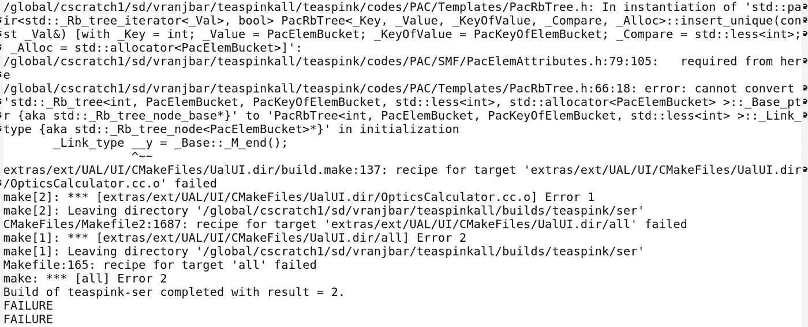
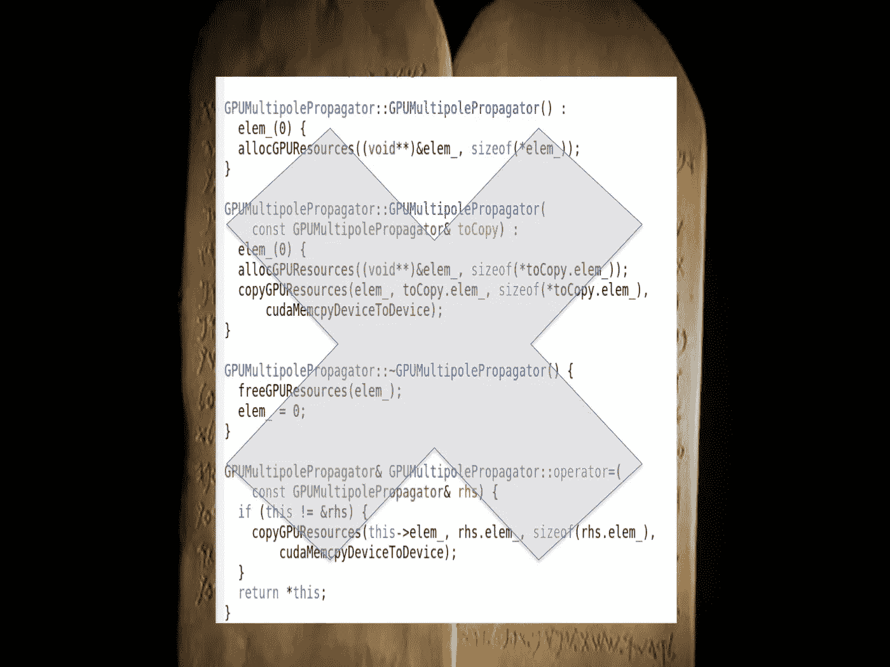

# 面向对象编程应该消亡！

> 原文：<https://medium.com/hackernoon/object-oriented-programing-should-die-be774beb7699>

模板化编程、重载操作符和你喜欢的构建系统，以及你想象中优雅可爱的任何计算机编程方法都应该如此。好吧，也许我有点夸张了。也许在某些情况下，拥有一个对象或重载操作符确实很有用。我花了一周时间试图构建一个代码，它的核心功能可以包含在三个小文本文件中，而它的构建系统花了一个小时来构建与十几个库的链接，这些库最终都崩溃了，而且没有一个是需要的，在这之后，我可能感到非常愤怒和沮丧。然而，这些库被嵌入到花哨的对象、方法和类中，它们的真正功能可以使用一个愚蠢的 do 循环来完成，这是一个带有一些逻辑开关的结构。

我是一名物理学家，但由于每个受人尊敬的科学家都应该有能力编写代码并模拟他们正在研究的物理系统，我花了大约一半的职业生涯编写和调试模拟代码。我已经足够老了，还记得面向对象编程的鼓吹者宣扬“好消息”的时候。他们会让我们的代码变得精彩、优雅和强大。他们把我们简单的 Fortran 代码变成了无法识别的派生类、类型转换函数和虚函数的秘密咒语。当一个功能坏了的时候，没有什么比不知道你“真正”在哪里使用哪个功能更残酷的了。

接下来他们来找我们简单的制作文件。我们需要 cmake 列表，构建者自动计算出所有的库，构建和链接任何你可能需要的东西。他们会为我们做任何事，除了当它不，在这种情况下，你松了。他们给我们写代码的代码..无尽的复杂层次。似乎每次“训练有素”的计算机科学家或物理学家转变成计算机科学家接触我们的代码时，都会出现复杂和混乱的程度，如果不加检查，会使您的代码窒息，然后消耗您所有的时间来维护和调试。

为了阻止任何未来的程序员想把他们的“优雅”带到我们的代码中，我决定列出我可怜的物理学家的编码规则:

1.  **所有的代码都会崩溃，尤其是在积极和持续开发下的代码:**是的，所有的代码总有一天会失效。无论是操作系统、库还是其他什么的更新，总有一天会破解代码，而且比你想象的要快。如果你的代码正在开发中，那么它肯定会被破坏，可能至少每几个提交就有一次。不管你的回归系统有多聪明和彻底，它都会崩溃。因为所有的代码都会崩溃，所以修复和维护一个代码库最终会消耗掉你大部分的资源。这就谈到了我的第二点。
2.  代码的简单性和可理解性应该优先于任何优雅和简洁的想法。如果你能使用一个愚蠢的 for 或 do 循环，那就去做吧，不要给我迭代器，或者重载函数。你看，既然这些代码会崩溃，总有一天会有一些可怜的人不得不明白在程序逻辑链中，哪个函数在什么时候崩溃了。这种垃圾让工作变得无比艰难，为了什么？它看起来很酷，我知道我理解。这让你觉得自己很聪明。但不是每个人都像你这么聪明，他们必须阅读和修复这个优雅的怪物。
3.  **不要让你的代码做所有的事情。**许多代码开始时都很谦逊，它们做一件事，然后计算机科学家掌握了它，现在它使用人类已知的所有积分器进行集成，为你做饭，监控你的体重等等。最终，所有这些都扼杀了代码的核心效用。做好一件事。

为了说明这一切，我将告诉你一个故事:

曾经有一位德高望重的老物理学家，他多年来创造了一个有用的代码来模拟一种特定的物理。用 Fortran 写的，他已经把它建成了一个相当有用的工具，增加了越来越多他正在建模的物理细节。然后出现了一个计算机程序员，他承诺把他的工具放进这个宏大的代码中，这个代码将会模拟一切。在一年的时间里，他把这些代码藏在一层又一层的派生类、迭代器、虚函数中，这些虚函数链接到库和一个又一个解析器。这种全新的代码工作了一段时间，计算机科学家宣布成功，并继续“改进”更多的代码..直到它没有。它在一些系统上停止构建，但物理学家不想回到他的旧代码，因为同时他已经向核心代码添加了一些更有用的物理知识，解决了一些重要的建模问题，并且他已经为该代码设置了模拟。

然后另一组计算机科学家出现了。他们打算更多地修改这些代码..让它在更多的平台和处理器类型上工作，并行化它，改进构建系统。与此同时，更多有用的物理学被加入到需要做的事情中。它变成了一个更大的怪物，并工作了一段时间。但每次需要一个全新的构建时，都需要至少一周的时间来咨询和调整“超级智能”的构建系统，以使其得以构建。现在，经过几年的改进来构建系统和拜占庭式编写的类，优秀的物理学家和集成者被困在这个怪兽中，无法被构建，等待着从这个怪兽中解放出来。