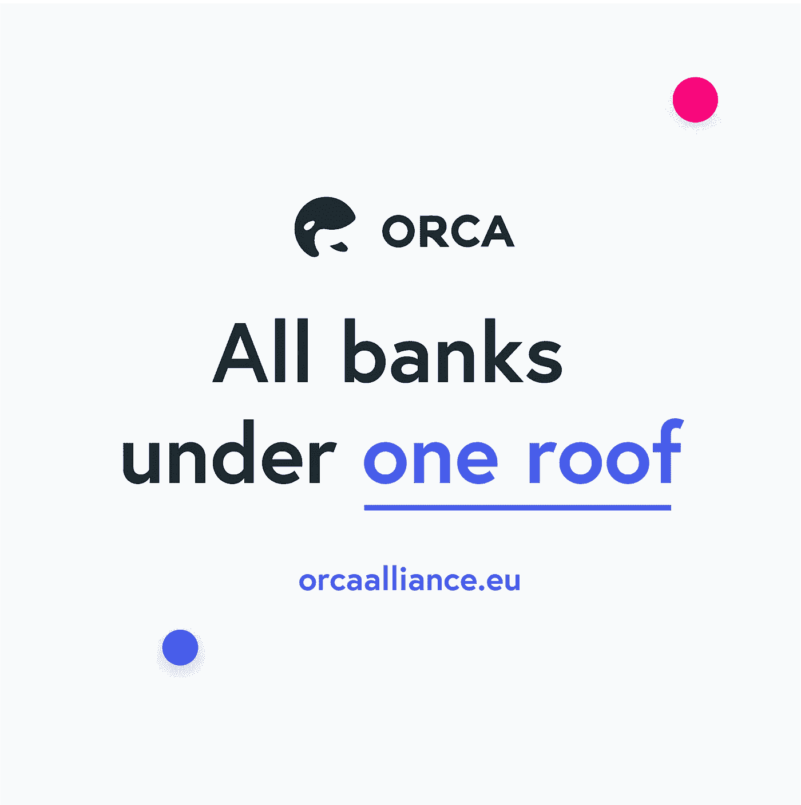

# 应用和算法:科技新来者如何改变金融格局

> 原文：<https://medium.com/hackernoon/of-apps-and-algorithms-how-tech-newcomers-are-changing-the-landscape-of-finance-2351d048c611>

零售银行业务在每个发达国家仍占主导地位。但在新金融技术的帮助和当局的支持下，混乱已经开始酝酿。

这里有一个预测:未来的银行抢劫犯不会去抢银行金库里的黄金或现金。他们会认为，在一个数据驱动的世界里，窃取存有珍贵数据的服务器可能是他们的最佳选择。黑客将成为新的银行劫匪。事实上，他们已经是了。

目前，打着“增强客户体验”的旗号，银行筛选海量数据:客户花钱买了什么，他们在哪里购物，甚至他们在网上浏览了什么网站。

如果无法访问这些数据，拥有更好财务理念的颠覆者将面临一场艰难的战斗。到目前为止，银行对客户数据享有实质上的垄断——这种垄断使得提供的服务质量下降，费用上升。

然而，至少在欧洲，随着 GDPR 和 PSD2 的诅咒语成为家喻户晓的名字，这个故事正以意想不到的方式展开。期待剧情转折。

[ORCA](http://www.orcaalliance.eu/) 正在交付其中一个计划——为金融服务建立一个开源平台。银行业 *Spotify* 如果你愿意的话。它将允许银行账户、数字钱包和加密货币交易所集成到支付服务中。所有这些都是数字化的，可以在你的电脑或手机屏幕上看到。只需点击几下链接账户，你就再也不用离开平台了。这就像是一场千年春梦。加密货币，依靠数字应用程序，人工智能辅助的建议和全面的定制能力。还有什么比这更好的呢？

访问 [ORCA 联盟网站](http://www.orcaalliance.eu/)加入出售令牌的白名单。

**侥幸逃脱糟糕的服务**

对于低收入或收入不稳定的人来说，零售银行提供的金融服务可能很复杂，很难获得，或者贵得惊人。那些信用记录不完整或不存在的人尤其处于不利地位。

对于有一份远程或自由职业的工作和忙碌的生活方式的人来说，没有本地银行账户的缺点也是一种负担。如果你不是一个有价值的客户，寄钱回家和兑换外币会涉及到非常高的费用。

定居下来的人有时也会碰到官僚主义的阻碍，觉得难以应对。根据智库金融服务创新中心(CFSI)的数据，35%的美国家庭年收入超过 6 万美元。再一次证明了善于赚钱和善于理财完全不同的技能。

在某些情况下，即使你有一个银行账户，你也可能会被拒绝某些服务，如贷款或抵押。处于这种情况下的人被定义为“银行服务不足”——因此，他们在财务困难时的唯一选择是去银行系统以外的地方，通常是求助于发薪日贷款等服务。

Data Source: Pew Charitable Trusts

**走向数字化和经济实惠**

FinTech(金融科技)正在填补这些空白，为几乎所有人削减成本，并打破传统的银行模式。根据 NewVantage Partners [2018 年高管调查](http://newvantage.com/wp-content/uploads/2018/02/Big-Data-Executive-Survey-2018-Findings.pdf)，近 80%的顶级金融公司高管担心他们的公司面临来自高度灵活、数据聚合的会计师的干扰风险。

**用算法代替文员**

银行的安全程序可能会令人沮丧。当你开一个新账户的时候，这个过程应该不会超过一个小时。虽然不方便，如必须邮寄文件，亲自前往分行，肯定可以避免。

然而，这些旧的做法拒绝投降。这就是颠覆者必不可少的地方。例如，数字银行公司 Monese 不要求客户提供实体文件。相反，它要求他们安装应用程序，给自己录像，并给自己的护照拍照。使用高精度验证算法检查身份，并在 2 分钟内开立银行账户。

MONI 正在人工智能的帮助下开发各种语言的自动化帮助。

**更低的服务成本和新颖的产品**

通过采用削减成本的人工智能(AI)或区块链技术，金融科技公司能够简化他们的服务。随着他们开发新的理论和商业模式，他们也降低了每个人的成本。

TransferWise 和 Revolut 已经在外汇和货币转账市场占据了相当稳固的地位，提供了非常优惠的利率。截至 2018 年 3 月，Revolut 已经为其客户节省了 1.6 亿美元的费用。

P2P 贷款、即时保险甚至加密货币的销售也必然会给这个行业带来新奇和尖端的技术。一个额外的好处是，金融科技公司更擅长收集和筛选数据。因此，他们可以在这些人中找到信誉良好的人，否则他们可能会被拒绝贷款和其他服务。

P2P 贷款的先驱 Zopa 在这方面尤其高效。提供低息贷款，减少繁琐的安全检查，并提供储蓄账户。

**竞争开阔视野**

当局鼓励这些服务提供商进入，部分原因是大银行在金融危机后变得越来越主导和令人厌恶。欧盟混乱的一个特殊来源是一套新的法规，被迅速命名为第二支付服务指令(PSD2)，于今年一月生效。根据新规定，银行必须应账户持有人的要求，与获得许可的第三方共享数据。

它不仅从本质上迫使大银行进行创新以跟上时代，而且[为金融新贵开辟了新的领域。](https://www.forbes.com/sites/ciocentral/2018/07/10/how-fintech-initiatives-are-driving-financial-services-innovation/#6dd567b954fa)“开放银行”应用程序可能会建立在银行的汇总数据基础上，提供诸如提醒用户是否在酒类或 iTunes 点击数上挥霍的服务，或者允许他们点击一下就可以将未用收入直接存入退休计划。财务数据可以整齐地组织在一个地方，并与其他银行信息相结合，以比较不同提供商的服务费。

Visit [www.orcaalliance.eu](http://www.orcaalliance.eu)

开放银行，顾名思义，开放金融机构的 API，并引入初创公司的竞争，此外，大多数加密货币服务提供商已经使用开放 API 构建。

非常适合 ORCA 的平台。通过 5 个阶段的实施过程，ORCA 将成为一个梦幻般的个人理财应用程序。链接财务账户，跟踪您的风险敞口，进行最佳交易，实现财务独立。简单、方便、快捷。正是一个正常人所需要的。

**总之**

暴风雨很快就要来临，打破窗户，把新的风吹进布满灰尘的文件柜和地下室。这一变化应该受到欢迎，因为它提供了更便宜、更具创新性的客户服务，同时也有哲学上的原因:这是向免费金融服务的理想迈进了一步。毫无疑问，凭借新奇和值得称赞的目标，金融科技公司可以瓦解保守派。

这是改变的最佳时机。多亏了 PSD2，欧洲才是改变发生的地方。