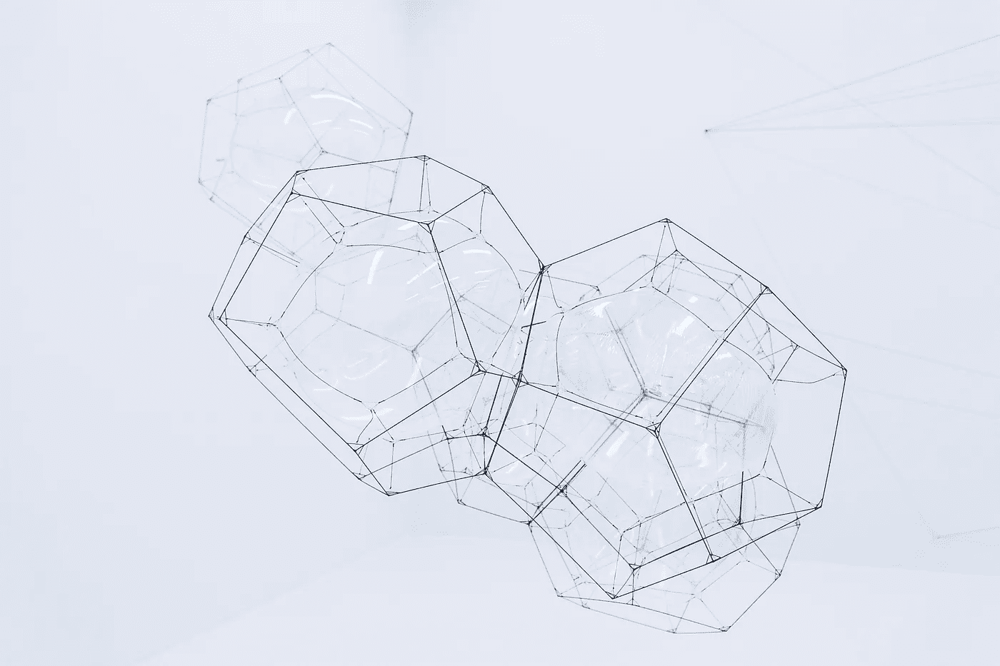

# 泡沫和区块:加密货币的软经济

> 原文：<https://medium.com/hackernoon/of-bubbles-and-blocks-the-soft-economy-of-cryptocurrency-452eddeb2ac4>

Photo by [Sebastien Gabriel](https://unsplash.com/photos/5rAcUaCtMzk?utm_source=unsplash&utm_medium=referral&utm_content=creditCopyText) on [Unsplash](https://unsplash.com/search/photos/bubble?utm_source=unsplash&utm_medium=referral&utm_content=creditCopyText)

> tldr:是的，我们是在泡沫中，但不，比特币不会归零。如果你的研究选择了正确的投资，你会没事的

努里埃尔·鲁比尼说[“比特币是所有泡沫之母”](https://www.bloomberg.com/news/articles/2018-02-02/roubini-says-bitcoin-is-the-biggest-bubble-in-human-history)他的说法是对的，但这个术语是错的，“加密货币”才是真正的泡沫。

如果你的年龄足够大，经历过“网络泡沫”，你可能会注意到，并不是所有的东西都崩溃了，归零了，世界末日开始了，一些公司倒闭了，一些公司破产了，但又恢复了，还有一些公司创造了新高，(Pets.com，Cisco，Amazon)。

同样，加密货币是一个泡沫为什么？你可能会问，我会简单地告诉你“缺乏创造，丰富的💩”，很容易根据市值随机选择 100 种加密货币，你会看到一些货币的下跌速度比上涨速度更快(TRX，XVG)，另一些货币正在经历健康的市场周期(比特币，以太坊)，还有一些货币正在蓬勃发展(以太坊经典，ZCash)。

与互联网泡沫破裂的方式相同，加密货币泡沫也将破裂，首先，相同的项目模式正在重复(物联网，X 的区块链……)大多数没有实际产品，但有最先进的登录页面和路线图，有些只是骗局，有些是这个新经济国家的庞然大物。

最终，区块链作为一项技术可以应用和实际使用的每个子领域都将拥有一种主导货币，从智能合约到匿名加密货币，每个子领域最终都将只有一种货币。因为这就是适者生存的方式，当然也是最具创新性和最实用的产品。有谷歌、亚马逊、网飞、苹果……这是后泡沫时代的运作方式，现在处于混乱、恐慌等之中，你会看到大量公司已经退出了舞台。

在经济学和博弈论的交叉点上有一个领域叫做“**机制设计”**设计[激励](https://www.wikiwand.com/en/Economic_incentive)，在[战略设置](https://www.wikiwand.com/en/Strategy_(game_theory))。它有着广泛的应用，从经济和政治(市场、拍卖、投票程序)到网络系统(互联网域间路由、赞助搜索拍卖，当然还有加密货币)。

比特币的机制是挖掘区块获得奖励，其他人使用赌注机制获得奖励，其他人使用主节点。如果一个项目没有一个战略设置来激励用户/同行实际使用它，它将会死去，因为归根结底，人类的行为是为了寻求激励。

让我们讨论泡沫现象的另一部分，

> 网络公司的过度消费
> 
> “增长高于利润”的心态和“新经济”不可战胜的光环导致一些公司进行奢侈的内部支出，如精心设计的商业设施和员工豪华度假。在一个新产品或网站发布时，一家公司会组织一个昂贵的活动，叫做[网络聚会](https://www.wikiwand.com/en/Dot_com_party)。

第一批破产的公司是那些在较短时间内达到增长峰值的公司，区块链领域也是如此，还记得比特币 ICO 吗😏，还是以太坊 ICO？与当前的空间相比，数百万人除了链接的个人资料和好看的登录页面外，一无所知(我嫉妒他们的工作，它真的很美)。然后花点时间比较一下“**代码**”，因为这是你要付出的代价。

## 研究建议

研究好的投资或好的硬币都是关于一件事，都是关于常识和谷歌的半小时。如果某件事看起来好得不像真的，那是因为它就是真的。如果你像这个好人[shitcoin.com](https://medium.com/u/34481204e586?source=post_page-----452eddeb2ac4--------------------------------)[的安德里亚斯·布雷克恩](http://shitcoin.com)那样测试软件，那么你已经知道该做什么，如果你能同步链，发送和接收交易，并且它看起来运行得完美无缺，如果它不掉下来，那就值得你花时间研究。

扪心自问真的有人要用吗？我能至少测试一下吗？像这样的问题激发了你的好奇心，让你想要实际观察，因为就像在《大空头》中一样，你所要做的就是观察人们的绝望和愚蠢，如果这群人如此聪明，就不会每次都被吃掉。

请记住，当事情处于泡沫模式时，不仅仅是谁获得最大利润谁就赢了，实际上是谁获得了利润并得到了利润。

***附言:关于支持者，你会看到很多来自支持 IOTA 邪教或 XRP 邪教等项目的人的声音，但不要相信他们，就像他们是建议在 Pets.com 大展拳脚的大师一样。他们知道，你的常识比众人的话更有价值。***