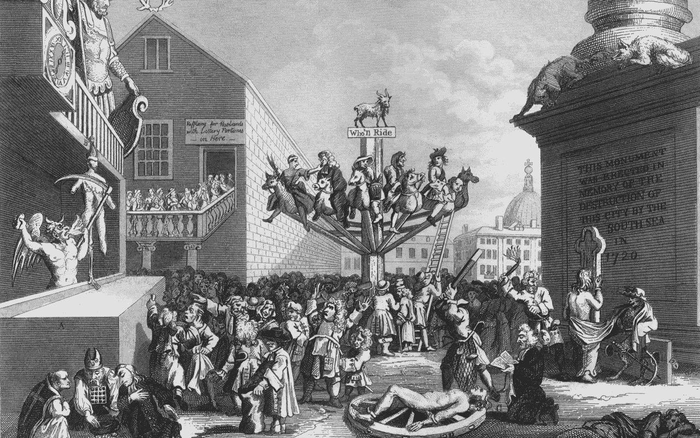
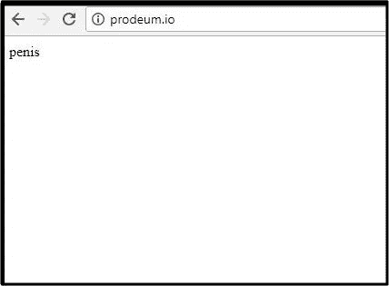
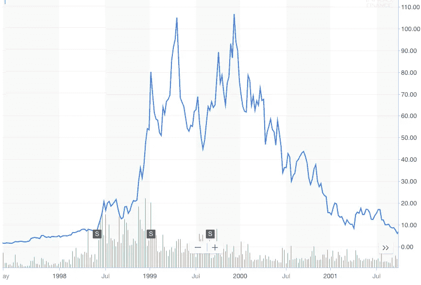

# 当然是泡沫。那又怎样？

> 原文：<https://medium.com/hackernoon/of-course-its-a-bubble-so-what-f06c50e9f342>

## 看看南海泡沫和为什么 ICO 热没什么不同

> "我能计算天体的运动，但不能计算人的疯狂."——伊萨克·牛顿(Issac Newton)，在南海泡沫中失去毕生积蓄后。

所有加密货币的市值从 1 月 6 日的 8.24 亿美元的高点下跌了 65%，至 2 月 6 日的 2.83 亿美元。不计后果的投机已经完全停止，随着中国和信用卡公司出台更严厉的监管规定，许多人认为泡沫已经破裂。

在伯顿·g·马尔基尔的精彩著作《漫步华尔街:久经考验的成功投资策略 中，他讲述了历史上一些最壮观的市场崩盘，以及大众心理和部落主义如何一次又一次地导致同样的结果。在当今加密货币市场的背景下阅读这本书，很难忽视这种诡异的相似之处。

马尔基尔说，当一项资产没有内在价值时，“成功的投资者试图抢先一步，估计什么样的投资环境最容易受到公共城堡建设的影响，然后在众人之前买入。”

这种策略被称为**空中楼阁理论**，由著名经济学家约翰·梅纳德·凯恩斯提出。在可以更好地描述为“更大的傻瓜理论”中，马尔基尔说“每分钟都有一个傻瓜诞生，只要其他人愿意付出更多，任何价格都可以。没有原因，只有大众心理。”

凯恩斯的理论适用于所有投机泡沫，但尤其适用于加密泡沫。代币具有内在价值的论点是可以提出的，但证明价格是一项更艰巨的任务。价格上涨归因于投资者通过口口相传告诉他人他们的天文数字收益，并推动 FOMO(害怕错过)。这种 FOMO 导致新投资者不合理地将资金投入市场，而不做适当的研究，也不告诉别人他们喜欢的代币。如此恶性循环继续。

# 南海泡沫和 ICOs

在 18 世纪，南海公司从政府那里拿走了一千万美元的借据，作为交换，他们被授予了南海所有贸易的垄断权。对公众来说，这是一个非常乐观的信号，但在内部，南海正在精心策划一场大规模的猜谜游戏，掩盖他们在没有收入的情况下大量亏损的事实。

马尔基尔谈到“公司没有一个董事在南美贸易方面有丝毫经验，但南海公司的董事们在公开露面的艺术方面是明智的。在伦敦租了一个令人印象深刻的房子，房间里有三十把黑色的西班牙软垫椅，看起来很漂亮，但坐起来不舒服。”

区块链领域的许多项目看似合法，实际上却没有什么支撑。以 Confido 为例，它自称是“使用智能合约的无信任托管支付解决方案”。Confido 有一个干净的网站，互动动画视频解释他们的商业计划，四个团队成员的笑脸和他们名字下面的链接。

在为他们的 ICO 筹集了近 1000 ETH 后，该网站迅速关闭，并发现他们网站上的 LinkedIn 个人资料完全是假的人或与该项目完全无关的[随机人物](https://www.reddit.com/r/CryptoCurrency/comments/7e8r1u/why_you_should_do_your_own_research_dyor_before/)的身份。

马尔基尔说“公众似乎什么都会买。在这一时期，寻求融资的新公司被组织起来，用于建造打击海盗的船只，鼓励在英格兰饲养马匹，买卖人的头发，从黄瓜中提取阳光。然而，这个奖项肯定要颁给那个无名之辈，他创立了“一家公司，从事一项具有巨大优势的事业，但没人知道它是什么。”准承诺闻所未闻的奖励。五分钟之内，一千名投资者交出了他们的钱来购买该公司的股票。发起人自己并不贪婪，他很快关闭了商店，动身去了欧洲大陆，从此再也没有他的消息。"

以 [Prodeum ICO](http://www.businessinsider.com/cryptocurrencty-and-blockchain-startup-prodeum-pulled-an-exit-scam-2018-1) 为例，它声称正在“开发一个系统，将区块链技术用于农产品，如水果和蔬菜。”

Prodeum 开始筹集 650 万美元，但使用了完全伪造的个人资料，类似于 Confido，并通过毫不客气地将“阴茎”一词放在他们网站的顶部而从互联网上消失。

Luckily, they only raised $11, giving the founders enough to share a smoothie in Los Angeles.

马尔基尔接着说，“并不是所有泡沫公司的投资者都相信他们所支持的计划的可行性。人们对此“过于明智”。然而，他们确实相信大傻瓜理论。价格会上涨，买家会被找到，他们会赚钱。因此，大多数投资者认为他们的行为是高度理性的，期望他们可以在首次发行后的股票交易市场“后市场”溢价出售股票。”

对于“理性”投资者来说，投资 ico 的动机显而易见。特别是如果你是一个高净值的个人，可以贡献超过最低投资，你可以获得 40-80%的红利。这就是加密对冲基金在 2017 年如此成功的原因。如果没有锁定期，他们会在代币在交易所上市后立即抛售所有投资，使初始投资至少翻一番。

# 那又怎样？

我确实认为加密货币是一个泡沫，但它甚至还没有开始。我认为代币市场已经饱和了，不可避免地会失败的项目会带着代币一起倒下，但是会有一些代币会存在很长时间。亚马逊在一年内损失了 90%的价值，现在成为世界上最具统治地位的公司，同样，我相信以太坊和其他一些项目的寿命。

看看亚马逊股票在互联网泡沫期间的价格行为与现在的图表之间的对比。像亚马逊这样的强势公司比 Pets.coms、SwapIt.coms 和 TheGlobe.coms 存活得更久

Amazon’s price action from 1998–2001.

Amazon’s price action looking back from 2017.

# 称加密货币市场为泡沫并不意味着死刑。这是这个市场走向成熟的必要一步，因此可靠的项目会脱颖而出。这个市场仍然有很多钱可以赚，只是需要比去年多得多的耐心和尽职调查。